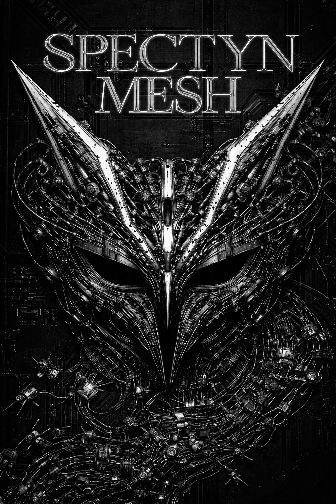

# Phantom Mesh

<p align="center">
  
</p>

<p align="center">
  <strong>你的電腦、手機和雲端主機，現在是你的 AI 下屬。</strong>
</p>

<p align="center">
  <a href="https://phantommesh.io">Website</a> ·
  <a href="#what-is-phantom-mesh">About</a> ·
  <a href="#open-source-coming-may-2026">Open Source</a> ·
  <a href="LICENSE">MIT License</a>
</p>

---

## What is Phantom Mesh?

Phantom Mesh 將你已有的設備 — 電腦、手機、雲端主機 — 串成一個**私人 AI 代理網路**。

每台設備都是一個完整的 AI 節點，能自主執行任務並互相協作。資料留在你自己的設備上，不需要上傳至任何第三方雲端。

### 核心能力

| 能力 | 說明 |
|------|------|
| **P2P 設備網路** | 設備自動發現、組網、任務分配，無需中央伺服器 |
| **AI 代理自主運作** | 理解目標、拆解步驟、跨設備協作、持續執行 |
| **隱私優先** | 預設本地 AI 推理，資料不離開你的設備 |
| **多 LLM 支援** | 11 個 AI 供應商，本地模型與雲端 API 自由切換 |
| **59+ 內建工具** | 瀏覽器自動化、檔案管理、內容生成、資料分析等 |
| **跨平台** | Windows、macOS、Android、iOS、Linux（Rust + Tauri v2） |
| **工作流引擎** | TOML 定義的多階段自動化工作流程 |

### 它能做什麼

- 你睡覺時，雲端主機跑完一整批 SEO 文章
- 你通勤時，手機彙整客戶回覆並草擬回信
- 你開會時，筆電監控競品定價變動
- 你下一個指令，AI 代理們自己分配該誰做、在哪做、什麼時候做

---

## Open Source — Coming May 2026

Phantom Mesh 的 agent 集群核心將於 **2026 年 5 月**正式開源。

### 開源範圍（預計）

- Rust agent runtime（核心引擎）
- P2P cluster layer（設備組網與任務分配）
- Tool registry（內建工具系統）
- Hands workflow engine（TOML 工作流引擎）
- LLM provider router（多模型路由）

### 技術概覽

```
┌─────────────────────────────────────────────┐
│  Phantom Mesh Node                          │
│                                             │
│  ┌───────────────────────────────────────┐  │
│  │  Presentation Layer                   │  │
│  │  WebView UI · Voice · Dashboard       │  │
│  └──────────────────┬────────────────────┘  │
│                     │                       │
│  ┌──────────────────▼────────────────────┐  │
│  │  AI Agent Runtime                     │  │
│  │  Multi-turn · Tool calling · 11 LLMs  │  │
│  └──────────────────┬────────────────────┘  │
│                     │                       │
│  ┌──────────────────▼────────────────────┐  │
│  │  Capability Layer                     │  │
│  │  59+ tools · Browser · Shell · Files  │  │
│  └──────────────────┬────────────────────┘  │
│                     │                       │
│  ┌──────────────────▼────────────────────┐  │
│  │  Cluster Layer (P2P)                  │  │
│  │  Discovery · Election · Task dispatch │  │
│  └───────────────────────────────────────┘  │
└─────────────────────────────────────────────┘
```

**Built with Rust.** 單一二進位檔部署，記憶體效率是 Python 方案的 10 倍。

---

## Stay Updated

開源發佈時會在此 repo 公告。Star this repo 以獲得通知。

---

## License

[MIT](LICENSE)
