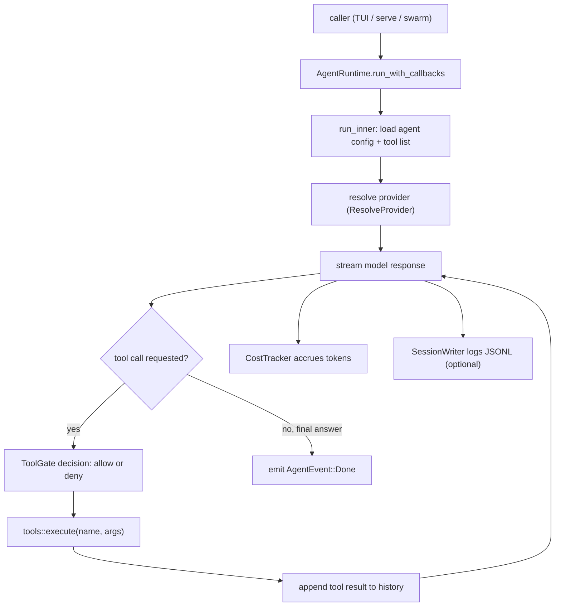

# Agent Runtime（代理執行階段）

## Purpose（目的）

代理執行階段（agent runtime）是核心執行迴圈，負責把使用者的提示（prompt）轉換成一次由
大型語言模型（LLM）驅動、使用工具的對話回合。它存在於 `pm-core` crate 中，是
每個前端共用的引擎：終端機介面（TUI）、HTTP serve
閘道（gateway）、swarm/subagent 扇出（fan-out），以及桌面／行動裝置應用程式。給定一個代理
名稱、一段提示與先前的歷史紀錄，它會：

1. 解析要呼叫哪一個 provider（供應商）／model（模型）（並在已設定的多個
   provider 之間做 fallback（後備切換））。
2. 串流（stream）模型回應，將增量事件發送給呼叫端。
3. 偵測並執行工具呼叫（tool call），把結果回饋回去，並持續迴圈直到
   模型產生最終答案或達到回合數上限。
4. 追蹤 token 成本、強制執行權限閘門（permission gate），並支援協作式
   中斷（cooperative interruption）。

它與 provider 無關、也與前端無關：呼叫端自行接上自己的事件
匯流端（event sink）、成本追蹤器（cost tracker），以及（選擇性的）持久化寫入器（persistence writer）。

## Key files（關鍵檔案）

除另有標註外，所有路徑皆位於 `core/src/` 之下。

| File | Role |
| --- | --- |
| `agent.rs` | `AgentRuntime` 結構 + 執行迴圈（`run`、`run_with_callbacks`、`run_with_callbacks_gated`、內部的 `run_inner`）。發送 `AgentEvent`、套用 `ToolGateDecision`、管理回合／重試上限。 |
| `runtime.rs` | `PhantomMeshRuntime` / `RuntimeConfig` — 頂層啟動程序（bootstrap），載入 `agents.toml` 設定並持有共用的 `AppState`。 |
| `streaming.rs` | `StreamEvent`、`StreamAccumulator`、`ResolveProvider` trait、SSE 序列化（`event_to_sse`），以及每次呼叫的串流分派（dispatch）。 |
| `context.rs` | 對話壓縮（compaction）（`compact_conversation`）、專案／工作區（workspace）情境擷取、相依性 + 框架偵測。 |
| `session.rs` | `ConversationStore` — 記憶體內 + 磁碟上的每段聊天歷史、fork（分支）、搜尋、重新命名、以 LLM 為基礎的壓縮。 |
| `tasks/session.rs` | `SessionWriter` — 僅可附加（append-only）的 JSONL 任務日誌，用來持久化與恢復（resume）執行。 |
| `cost.rs` | `CostTracker` + 各模型定價表；在一個回合內累計 token 成本。 |
| `interrupt.rs` | `InterruptHandle` — 協作式取消，在迴圈的安全點檢查，並與 SSE 讀取器（reader）競態（race）。 |
| `tools/mod.rs` | 工具登錄表（registry）：`all_tool_names`、`schema`，以及將工具呼叫路由到其實作的 `execute` 分派器。 |
| `tools/*.rs` | 個別工具實作（檔案、shell、搜尋、抓取、subagent、記憶體等）。 |
| `providers/` | Provider 轉接器（adapter）+ `DefaultProviderResolver`（`resolver.rs`），把已設定的名稱對應到具體的 LLM 端點（endpoint）。 |

## Data flow（資料流）

逐步說明：

1. 呼叫端調用 `run`、`run_with_callbacks` 或 `run_with_callbacks_gated`，
   傳入代理名稱、提示、歷史、一個成本追蹤器，以及一個事件匯流端。
2. `run_inner` 在 `AgentsConfig` 中查找該代理（找不到時退回到
   `master` 代理），接著組裝系統提示與工具清單，並移除
   使用者已透過 `[permissions]` 全面拒絕的任何工具。
3. 作用中的 `ResolveProvider` 挑選 provider／model。暫時性失敗
   （網路／429／503）會重試最多 `MAX_RETRIES` 次；永久性的用戶端錯誤
   （400/401/403/404/422）則直接跳到下一個已設定的 provider。
4. 回應以串流方式傳回；每個區塊（chunk）成為一個 `AgentEvent`（`Token`、
   `Thinking`、`ToolStart`、`ToolDone`、`Notice`、`Done`），交給匯流端。
5. 當模型請求一個工具時，選擇性的 `ToolGate` 會傳回 `Allow` 或
   `Deny(reason)`。允許的呼叫透過 `tools::execute` 執行；其輸出會
   被附加到歷史中，迴圈繼續進行。
6. 迴圈持續到模型傳回最終答案、達到回合數上限（可透過
   `MAX_ROUNDS_OVERRIDE` task-local 在每次呼叫時設定），或某個
   `InterruptHandle` 取消該回合為止。
7. 在整個過程中，`CostTracker` 會累計 token 成本，而當提供了 `SessionWriter`
   時，每一步驟都會記錄到一個僅可附加的 JSONL 工作階段檔案，
   供日後恢復使用。

## Extension points（擴充點）

- **Add a tool（新增工具）**：在 `tools/` 底下實作它，然後在
  `tools/mod.rs`（`all_tool_names`、`schema`、`execute`）中登錄其名稱、schema 與分派分支。
  受平台限制的工具（例如 iOS 上的 fork/exec）會在建置時從登錄表中
  被過濾掉。
- **Add a provider（新增 provider）**：在 `providers/` 中加入一個轉接器，並教
  `DefaultProviderResolver`（位於 `providers/resolver.rs`）如何把
  已設定的名稱對應到它。執行階段不需要任何更動 — 它只相依於
  `ResolveProvider` trait。
- **Custom provider routing / tests（自訂 provider 路由／測試）**：實作 `ResolveProvider` 並用
  `AgentRuntime::with_resolver(...)` 接上它。對於每次請求切換 provider
  以及在測試中注入 mock（模擬物件）很有用。
- **Per-agent prompt override（每個代理的提示覆寫）**：在
  `<config-dir>/extensions/prompts/<agent>.md` 放一個 markdown 檔；它會在迴圈
  開始時以盡力而為（best-effort）的方式載入，無需更動程式碼。
- **Permission gates（權限閘門）**：傳入一個 `ToolGate`（透過 `run_with_callbacks_gated`）以
  在執行階段對個別工具呼叫進行核准、拒絕或提示。
- **Cooperative interrupt（協作式中斷）**：用
  `with_interrupt(...)` 接上一個 `InterruptHandle`，讓第二個訊號得以展開（unwind）目前的回合。
- **Memory augmentation（記憶體增強）**：在 `experimental-skillbank` 功能旗標（feature flag）後方，一個
  技能庫執行階段可用 `with_hermes(...)` 接上，把回想起的
  長期記憶（long-term memory）前置插入系統提示中。預設建置會將此編譯排除（compile out）。

## Tests（測試）

- 行內（inline）單元測試位於 `core/src/agent.rs`（執行迴圈／解析輔助函式）、
  `streaming.rs`、`context.rs`、`interrupt.rs` 與 `tools/`。
- 整合測試位於 `core/tests/` 之下，包括：
  - `test_agent_loop.rs`、`test_agent.rs`、`agent_test.rs` — 端對端（end-to-end）迴圈。
  - `agent_with_resolver.rs`、`agent_trait_migration.rs` — provider 解析。
  - `test_streaming.rs`、`streaming_trait_migration.rs` — 串流事件。
  - `session_test.rs`、`test_session_cost.rs` — 工作階段儲存 + 成本追蹤。
  - `tools_test.rs`、`test_new_tools.rs` — 工具登錄表 + 執行。

用 `cargo test -p pm-core` 來執行它們。
