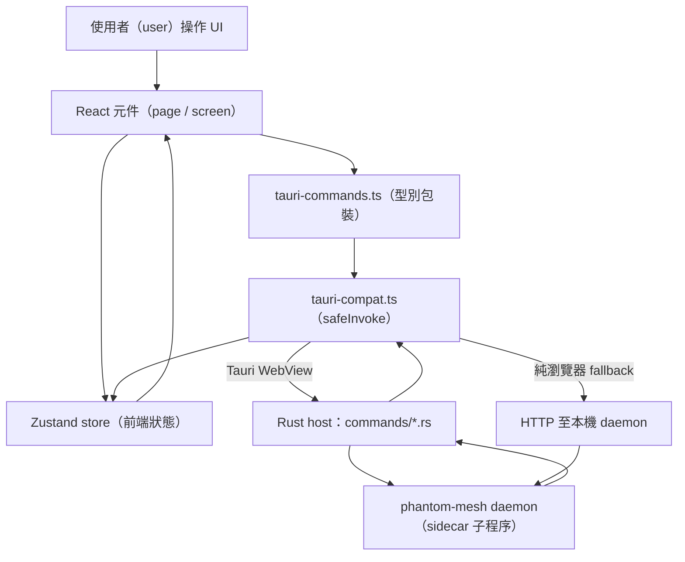

# app-tauri-frontend

## 目的（Purpose）

`app-tauri-frontend` 子系統是 phantom-mesh 的桌面與行動圖形化客戶端（graphical
client）。它是一個 [Tauri 2](https://tauri.app/) 應用程式：以 React +
TypeScript 撰寫的 web UI（網頁使用者介面，在系統 WebView（網頁檢視元件）中渲染），
外面包覆一個小型的 Rust host（宿主）程序。這個 Rust host 透過具型別的 Tauri
*commands*（命令），把原生能力（檔案存取、程序衍生、作業系統通知、內嵌的 HTTP
client（HTTP 客戶端））暴露給 WebView，並監管一個隨附打包的 `phantom-mesh`
daemon（常駐服務）sidecar（隨附子程序）。

它位於整個堆疊（stack）的最頂層：使用者與這個應用程式互動，而此應用程式則與本機的
phantom-mesh daemon（預設為 `http://localhost:<port>`）溝通，以進行 agent（代理）
執行、cluster（叢集）狀態、life-tracking（生活追蹤）功能與設定。當在 Tauri
WebView 之外執行時（例如純瀏覽器開發或測試），同一份 UI 會降級（degrade）為對
daemon 的純 HTTP fallback（後備路徑）。

原始碼位於 `app/`（web UI）與 `app/src-tauri/`（Rust host）之下。

## 主要檔案（Key files）

| Path | 角色（Role） |
| --- | --- |
| `app/package.json` | 前端 manifest（資訊清單）：React 19、Zustand、react-router、`@tauri-apps/*` plugins（外掛）；定義 `dev` / `build` / `tauri:*` / `test` scripts。 |
| `app/vite.config.ts` | Vite 打包工具設定（dev server 開發伺服器 + 餵入 Tauri WebView 的生產建置）。 |
| `app/src/main.tsx` | React 進入點，掛載根元件（root component）。 |
| `app/src/App.tsx` | 根元件：router（路由器）、primary/labs 導覽、行動裝置對桌面的 shell（外殼）切換、onboarding/startup 把關。 |
| `app/src/pages/` | 桌面路由頁面（`Conversation`、`Dashboard`、`Goals`、`Browser`、`PageViewer`、`Settings`、`Terminal`）。 |
| `app/src/screens/macos/` | macOS 風格的功能畫面（focus 專注、habit 習慣、timeline 時間軸、review reader 回顧閱讀器、recall 回想）。 |
| `app/src/components/` | 可重用 UI；`mobile/` 存放替代的行動 shell + 畫面。 |
| `app/src/stores/` | Zustand 狀態 stores（cluster、conversation、cost、dispatch、settings、task、…）。 |
| `app/src/hooks/` | React hooks（`useApi`、`useClusterPeers`、`useIsMobile`、`useSystemHealth`）。 |
| `app/src/lib/tauri-compat.ts` | `isTauri()` 偵測 + `safeInvoke`；把呼叫導向原生 `invoke` 或對 daemon 的 HTTP fallback。 |
| `app/src/lib/tauri-commands.ts` | 在 `safeInvoke` 之上的具型別包裝（wrapper）—— 命令名稱 + wire shapes（傳輸線格式）的單一匯入點。 |
| `app/src/lib/generated/` | 自動產生的 TypeScript bindings（綁定，19 個功能模組），對應 Rust wire types；絕不手動編輯。 |
| `app/src-tauri/Cargo.toml` | Rust host crate（套件箱）manifest。 |
| `app/src-tauri/tauri.conf.json` | Tauri 設定：window/bundle/sidecar/capabilities。 |
| `app/src-tauri/src/main.rs` | Rust 二進位進入點；委派給 `lib.rs`。 |
| `app/src-tauri/src/lib.rs` | 建構 Tauri 應用程式：受管狀態（managed state）、plugins，以及 `generate_handler!` 命令註冊表。 |
| `app/src-tauri/src/commands/` | 依功能分組的命令實作（`agent.rs`、`cluster.rs`、`settings.rs`、`*_wire.rs` 模組等等）；`mod.rs` 將它們重新匯出（re-export）。 |
| `app/src-tauri/src/daemon.rs` | 僅限桌面：衍生、監管（watchdog/restart 看門狗/重啟）並停止隨附打包的 `phantom-mesh` daemon sidecar。 |
| `app/src-tauri/src/updater.rs` | 僅限桌面的自動更新整合。 |
| `app/src-tauri/src/runtime_state.rs` | 由 Tauri 管理的共享執行階段狀態（runtime state）。 |
| `app/src-tauri/build.rs` | 建置腳本（build script）：把 `phantom-mesh` 二進位檔複製到 `binaries/` 以供 sidecar 打包。 |

## 資料流（Data flow）

1. 一個 React page/screen 渲染，並從 Zustand store 與／或 hook 讀取狀態。
2. 在使用者動作時，它呼叫 `tauri-commands.ts` 中具型別的輔助函式（helper）。
3. 該輔助函式呼叫 `tauri-compat.ts` 中的 `safeInvoke`。
4. `isTauri()` 決定路徑：在 WebView 內，它使用原生 Tauri `invoke`；在純瀏覽器／
   測試中，它則退回（fall back）為對本機 daemon 發出的 HTTP 請求。
5. 原生 `invoke` 抵達一個註冊於 `lib.rs`（`generate_handler!`）的 Rust handler
   （處理常式），其實作位於 `commands/` 之下。
6. 該 handler 執行原生工作與／或轉發給 daemon，然後回傳一個可序列化
   （serializable）的結果。
7. 結果經由 `safeInvoke` 流回呼叫端元件，元件更新它的 store；React 重新渲染。

## 擴充點（Extension points）

- **新的原生命令：** 在相關的 `app/src-tauri/src/commands/<feature>.rs`（或一個新的
  `*_wire.rs` 模組）中加入一個 `#[tauri::command]` 函式，在 `commands/mod.rs` 中
  重新匯出它，並在 `lib.rs` 的 `generate_handler!` 清單中註冊它。
- **前端對它的存取：** 在 `tauri-commands.ts` 中加入一個具型別的包裝；若該命令具有
  非平凡（non-trivial）的 wire shape，先在 `phase2-types.ts`（或對應的 generated
  模組）中定義型別。
- **瀏覽器／測試 fallback：** 在 `tauri-compat.ts` 的 `httpFallback` switch 中加入
  對應的 `case`，讓該命令在 Tauri WebView 之外也能運作。
- **新的 screen/page：** 在 `pages/`、`screens/macos/` 或 `components/mobile/` 之下
  加入一個元件，然後在 `App.tsx` 中接上一條路由 + 導覽項目。
- **共享的 UI 狀態：** 在 `stores/` 之下新增或擴充一個 store。
- **Plugins/permissions：** 在 `Cargo.toml` + `package.json` 中宣告新的 Tauri
  plugins，並在 `app/src-tauri/capabilities/` 中授予它們權限。

## 測試（Tests）

- **前端（Vitest）：** `app/tests/` —— 例如 `e2e-flow.test.ts` 以及
  feature/regression 資料夾（`f101`–`f106`、`focus/`、`regression/`）。
  從 `app/` 以 `pnpm test`（`vitest run`）執行。
- **端對端（Playwright）：** `app/e2e/` —— `smoke.spec.ts` 與
  `gui-interaction.spec.ts`。
- **Rust host（cargo）：** `app/src-tauri/tests/` —— `dispatch_commands.rs` 與
  `settings_commands.rs` 演練命令的驗證器／剖析器（透過 `lib.rs` 中的
  `pub mod commands` 公開）。以
  `cargo test --manifest-path app/src-tauri/Cargo.toml` 執行。
