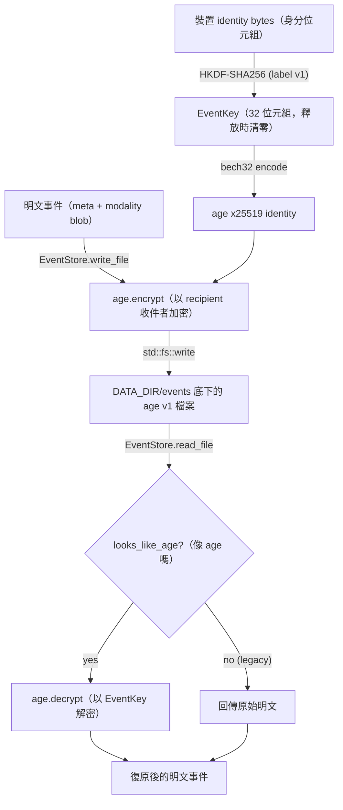

# At-Rest Crypto Storage（靜態加密儲存）

## Purpose（目的）

靜態加密儲存（at-rest crypto storage，資料存放於磁碟時的加密）子系統用來保護本機擷取的「life node（生活節點）」
資料（飲食紀錄、專注時段、習慣打卡、其附帶的影像/音訊，
以及分析結果），讓磁碟上的位元組在缺少
裝置本身的 identity key（身分金鑰）時無法被讀取。它實作了 SPEC-13（encryption envelope，加密封套）與
SPEC-16（event storage layout，事件儲存佈局）。

設計目標如下：

- **每裝置一把金鑰、絕不匯出。** 加密金鑰會以確定性方式
  （deterministically，相同輸入必得相同輸出）透過 HKDF-SHA256（一種單向
  key-derivation function，金鑰衍生函數）從既有的裝置 identity file（身分檔）衍生而來。它絕不離開
  本機，也絕不顯示給前端（frontend）。
- **標準的磁碟格式。** 密文（ciphertext）使用 `age` v1 二進位格式
  （`age-encryption.org/v1`），因此檔案可與上游的 `age`
  CLI 互通，供緊急復原使用。
- **透明遷移（transparent migration）。** 讀取器會探測 age magic line（age 的識別標頭行）。在啟用加密之前
  寫入的舊版明文（plaintext）檔案仍可載入；新的寫入
  則一律加密。
- **祕密（secret）與憑證（credential）分離。** life-node 事件酬載（payload）會用
  衍生金鑰加密。小型的認證憑證則由一個
  可插拔（pluggable）的 `Vault`（保險庫）trait 另行處理（目前以 OS 權限保護，日後改用 OS keystore，作業系統金鑰庫）。

它位於擷取/喚回（capture/recall）流程（產生明文事件）與
裝置資料目錄底下的檔案系統（placeholder，預留代稱：`<DATA_DIR>/events/`）之間。

## Key files（關鍵檔案）

| File（檔案） | Role（職責） |
| --- | --- |
| `core/src/life_node/key_derivation.rs` | 透過 HKDF-SHA256 從裝置 identity bytes（身分位元組）衍生 32 位元組的 `EventKey`；`EventKey` 於釋放（drop）時清零（zeroize），並遮蔽（redact）其 `Debug` 輸出。 |
| `core/src/life_node/crypto.rs` | age v1 加密/解密包裝層；從 `EventKey` 建構出確定性的 age x25519 identity；`looks_like_age()` 識別標頭探測。 |
| `core/src/life_node/storage.rs` | `EventStore` — 磁碟上的事件佈局（`meta.json`、`modality_*` blob 二進位塊、`analysis.json`）；在設有金鑰時透明地加密寫入、解密讀取。 |
| `core/src/encryption_wire.rs` | SPEC-13 傳輸線（wire）型別（`EncryptionEnvelope`、`EncryptionAlgorithm`、`X25519Recipient`）；`encrypt_event`/`decrypt_event`；行程內（per-process）金鑰快取（`install_event_key_from_seed`、`lookup_or_derive_event_key`、`decrypt_raw_age_blob`）。TS 綁定（bindings）透過 ts-rs 匯出。 |
| `core/src/vault/mod.rs` | `Vault` trait — 通用憑證儲存抽象（load/save/delete/contains），供認證酬載使用。 |
| `core/src/vault/file.rs` | `FileVault` — 以檔案為後端的 `Vault` 實作，以 Unix 權限模式 0600 寫入 `<key>.json`／採「先寫暫存檔再改名」的原子寫入（atomic write）；對金鑰名稱做路徑淨化（path sanitization）。 |

## Data flow（資料流）

「擷取後再讀取」循環的順序：

1. 啟動時，serve（伺服）路徑載入裝置 identity file，並呼叫
   `key_derivation::load_event_key(...)` 以衍生 `EventKey`。
2. 針對事件目錄建構出 `EventStore::with_key(events_dir, key)`
   （見 `core/src/serve.rs`）。
3. 擷取時，`write_event` 寫入 `meta.json`，並為每個非文字
   modality（模態）各寫一個檔案。每次 `write_file` 呼叫都會在
   碰觸磁碟之前，將位元組加密為 age v1 格式。
4. 讀取時，`read_file` 讀取原始位元組、執行 `looks_like_age()`，接著
   要嘛以金鑰解密，要嘛原封不動回傳位元組（舊版明文）。
5. 一個僅支援明文的 store（`EventStore::new`）若遇到加密檔案，
   會回傳 `InvalidData` 錯誤，說明金鑰缺失。

## Extension points（擴充點）

- **新的 OS keystore 後端。** 為 macOS Keychain、Windows DPAPI 或 Linux
  Secret Service 實作 `Vault` trait
  （`core/src/vault/mod.rs`）。`FileVault` 是參考實作（reference implementation）；新的實作可直接接入，
  無需更動呼叫端（callers）。
- **新的加密演算法版本。** `encryption_wire.rs` 中的 `EncryptionAlgorithm`
  保留了一個 `AgeV2` 變體（variant）。解密會依據磁碟上的
  magic line 進行派發（dispatch），因此可在相同的封套
  形狀（envelope shape）之下新增一個 codec（編解碼器），而不破壞舊的 blob。
- **新的金鑰用途。** 新增一個獨立的 HKDF label/info 字串（仿照
  `key_derivation.rs` 中既有的事件加密 label），以便從同一個裝置身分
  為新的資料領域（data domain）衍生出另一把金鑰。
- **新的加密產物型別。** 將額外的酬載繞經
  `EventStore::write_file` / `read_file`（或 `encrypt_event` / `decrypt_event`），
  即可免費繼承加密與透明讀取遷移的能力。

擴充時，請保持以下不變量（invariant）：金鑰絕不跨越 Rust 到 TS 的
邊界（只有公開的 `X25519Recipient` 字串可以跨越）、`EventKey` 必須維持
釋放時清零（zeroize-on-drop），且磁碟上的結構描述（schema）必須維持可被既有檔案讀取。

## Tests（測試）

- **單元測試（in-module，模組內）：**
  - `core/src/life_node/key_derivation.rs` — HKDF 確定性、過短輸入
    應被拒絕、`Debug` 遮蔽、從檔案載入。
  - `core/src/life_node/crypto.rs` — 來回往返（round-trip）、age 識別標頭偵測、竄改（tamper）與
    錯誤金鑰應失敗、空輸入。
  - `core/src/life_node/storage.rs` — 磁碟上已加密的斷言、透過
    `read_meta` 的來回往返、舊版明文遷移、加密的 modality blob、
    僅明文 store 拒絕加密檔的錯誤。
  - `core/src/encryption_wire.rs` — 封套來回往返、金鑰快取的安裝/查找、
    透過快取解密原始 age blob。
- **整合測試／E2E（端對端）：**
  - `core/tests/life_node_e004_encryption_e2e.rs` — 啟動 daemon（常駐服務）、擷取
    一個事件，並斷言磁碟上新的 `meta.json` 已用 age 加密（受分析
    API key 把關；無金鑰時會乾淨地 SKIP 跳過）。
  - `core/tests/v6_perf_age_100row.rs` — 效能預算把關：100 列各約 1 KB 的
    加密 + 解密來回往返，須落在 SPEC-13 的牆鐘時間（wall-clock）上限之內。
