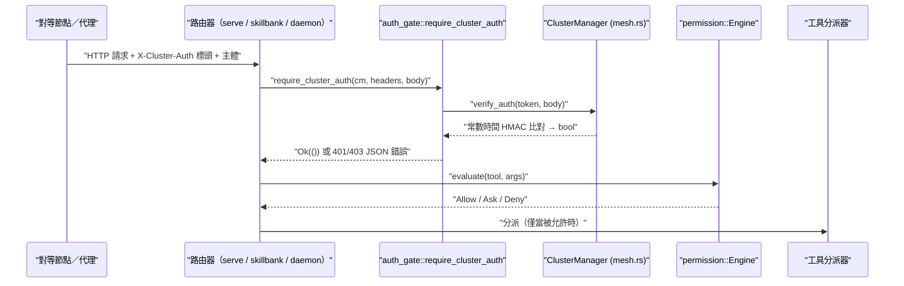

# auth-security-gate

## 用途

auth-security-gate 是一個子系統，負責決定**誰**可以和某個
phantom 節點（node，網路節點）對話，以及已連線的代理（agent，自動代理）**被允許做什麼**。它位於每個 HTTP/RPC 進入點的最前緣，也位於每個工具呼叫（tool invocation）的邊界。它有四項彼此協作的關注點：

1. **叢集驗證（cluster authentication）** — 每個跨節點請求（`/rpc/*`、`/api/*`、
   `/mcp`、`/ws`、`/onboarding/*`）都必須攜帶一個有效的 `X-Cluster-Auth`
   HMAC-SHA256（hash-based message authentication code，基於雜湊的訊息驗證碼），這個值是用共享的 `cluster_secret` 對請求主體（request body）計算而得。此閘門採**失敗即關閉（fails closed）**策略：
   若未設定任何密鑰（secret），請求一律拒絕，除非操作者主動選擇啟用僅維持一個發行版的舊版逃生出口（legacy escape hatch）。
2. **本地身分（local identity）** — `phantom login` / `whoami` / `logout` 會在
   `~/.phantom-mesh/auth.json`（權限模式 `0600`）儲存一個本地身分（email、Google 或 Apple）。OSS（open-source software，開放原始碼軟體）二進位檔運作時不需要任何雲端帳號。
3. **OAuth** — 針對 Google 與 Apple 供應商的裝置流程（device-flow）/ 回送（loopback）OAuth 2.0（open authorization，開放授權），外加 Apple `client_secret` 的 JWT（JSON Web
   Token，網頁權杖）簽署路徑。
4. **權限引擎（permission engine）** — 一套 Claude-Code 風格的 `Tool(specifier)` 規則 DSL
   （domain-specific language，領域特定語言），對每次工具呼叫做出 allow / ask / deny（允許／詢問／拒絕）的把關。

它們合起來構成信任邊界（trust perimeter）：叢集 HMAC 把陌生人擋在連線之外，身分說明本地操作者是誰，OAuth 橋接到外部供應商，而權限引擎則在連線進入後約束代理的行為。

## 關鍵檔案

| File | Role |
| --- | --- |
| `core/src/auth_gate.rs` | 共享的 `require_cluster_auth()` HMAC 閘門，serve 路由器與 daemon（常駐服務）路由器皆使用；失敗即關閉政策 + 遷移提示。 |
| `core/src/auth.rs` | 本地身分儲存（`AuthState`）、密碼雜湊（SHA-256 ×100k + salt 鹽值）、常數時間驗證、`~/.phantom-mesh/auth.json` 的載入／儲存。 |
| `core/src/oauth.rs` | 針對 Google + Apple 的 OAuth 2.0 裝置／回送流程；Apple `client_secret` 的 ES256 JWT 簽署；待處理流程（pending-flow）+ 結果狀態。 |
| `core/src/permission.rs` | `Tool(specifier)` 規則 DSL + `Engine::evaluate`（allow/ask/deny）、bash 重新導向（redirect）強化、deny-wins（拒絕優先）排序。 |
| `core/src/mesh.rs` | `ClusterManager::make_auth_token` / `verify_auth` — 閘門實際呼叫的 HMAC-SHA256 鑄造（mint）+ 常數時間驗證。 |
| `core/src/serve.rs` | UI/serve 路由器；在每個受保護的處理器（handler）上呼叫 `require_cluster_auth`。 |
| `core/src/serve_skillbank.rs` | 技能庫（skill bank）RPC 路由器；透過共享閘門使用相同的 `X-Cluster-Auth` HMAC 機制。 |
| `core/src/main.rs` | Daemon 路由器（`build_router`）；為 `/agent/:name/run*` 重複使用相同的閘門。 |
| `app/src/components/settings/SecurityPanel.tsx` | 前端設定面板，顯示工具權限稽核紀錄（audit log）（allow/block/review，允許／封鎖／審查）。 |
| `app/src/components/onboarding/StepSecurity.tsx` | 上手導引（onboarding）步驟，向使用者呈現安全／權限的設定。 |

## 資料流

編號摘要：

1. 某個對等節點或代理送出一個帶有 `X-Cluster-Auth` 標頭的 HTTP/RPC 請求。
2. 路由器將 `(ClusterManager, headers, body)` 交給
   `require_cluster_auth`。
3. 若 `cluster_secret` 為空：拒絕並回傳 `403`（除非
   `PHANTOM_ALLOW_EMPTY_CLUSTER_SECRET=1`）。否則透過
   `ClusterManager::verify_auth` 驗證 HMAC（常數時間比對）。
4. 不相符時回傳 `401 Unauthorized`；成功時處理器繼續執行。
5. 在執行任何工具之前，權限 `Engine` 會評估
   `Tool(specifier)` 規則（deny 優先，接著 ask，再來 allow；未匹配 → ask）。
6. 只有 `Allow` 決定才會抵達工具分派器；結果會呈現在前端稽核紀錄中。

## 擴充點

- **新增受保護的端點（endpoint）** — 在新處理器的最上方呼叫 `require_cluster_auth(&state.cluster_manager,
  &headers, &body)?`（參見 `serve.rs` / `serve_skillbank.rs` / `main.rs` 中既有的處理器）。當代理轉送到另一個跳躍點（hop）時，用
  `ClusterManager::make_auth_token_bytes` 重新簽署轉送的主體。
- **新增身分供應商（identity provider）** — 擴充
  `auth.rs`（`human_summary`）中的 `provider` 比對分支，並在 `oauth.rs` 中加入該流程。
- **變更驗證機制（auth scheme）** — `mesh.rs` 中的 `make_auth_token` / `verify_auth`
  是 HMAC 演算法的單一事實來源（single source of truth）；驗證要保持
  常數時間。
- **新增權限規則類型或匹配器（matcher）** — 擴充 `permission.rs` 中的 DSL 剖析器（parser）與
  `Engine::evaluate`；保留 deny-wins 排序以及
  bash 重新導向／串連（chain）降級為 Ask 的強化。
- **呈現新的稽核訊號** — 在 `SecurityPanel.tsx` 所消費的稽核事件結構中加入欄位。

## 測試

- 行內單元測試：`core/src/auth_gate.rs`（有效／無效權杖、失敗即關閉、
  環境變數覆寫）、`core/src/auth.rs`（密碼往返、鹽值唯一性）、
  `core/src/permission.rs`（DSL／引擎案例）。
- `core/tests/` 底下的整合測試：
  - `test_security_t7.rs` — 在 `/rpc/message`、`/api/chat` 上的 HMAC 強制執行、
    失敗即關閉的 `/rpc/task/assign`、工作區邊界（workspace-boundary）檢查。
  - `test_security_t7b.rs` — 在 daemon 的 `/agent/:name/run*`、
    `/mcp`、`/ws`、`/onboarding/*` 上的 HMAC 強制執行。
  - `test_security2.rs` — 工具層級的強化（shell/file/git/search）。
  - `oauth_es256_regression.rs` — Apple `client_secret` ES256 JWT 簽署
    防護。
