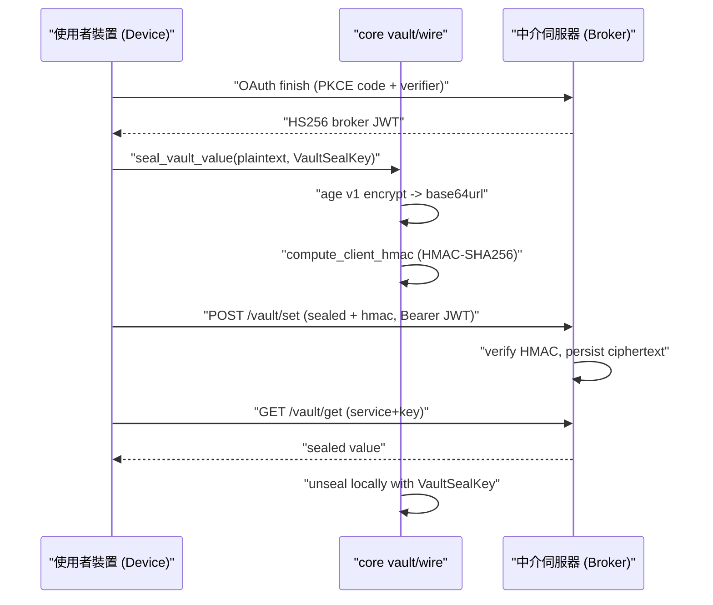

# Broker-Vault 子系統

## 目的（Purpose）

broker-vault（中介-保險庫）子系統讓使用者儲存祕密（API key、叢集
憑證、認證權杖），使其能在使用者的各裝置之間同步，而 broker（中介伺服器，relay
server，中繼伺服器）全程看不到明文。它分為兩層：

1. **本地 vault（保險庫）**（`core/src/vault/`）— 一個泛用、受作業系統保護的憑證
   儲存區，位於本機。目前會把 JSON 內容持久化到
   `~/.spectyn-mesh/<key>.json`，並套用 Unix 權限模式 `0600`（Windows NTFS ACL／macOS
   Keychain／Linux Secret Service 是規劃中的各作業系統實作，皆置於
   同一個 trait 之後）。

2. **Broker 同步線路（sync wire，同步傳輸契約）**（`core/src/broker_vault_wire.rs`）— 遠端 broker
   所公開的 7 個 REST 端點之強型別契約。祕密在上傳前會於客戶端先封印
   （age v1 對稱加密）並加上 MAC（HMAC-SHA256，訊息驗證碼），
   因此 broker 只會儲存不透明的密文（ciphertext）外加一個防竄改檢查
   標籤（tag）。每個帳號專屬的 32-byte `VaultSealKey` 絕不跨越 FFI 邊界，
   而是透過一個由 broker 中繼（但無法讀取）的 age-wrap 信封（envelope）交給新裝置。

啟動 broker 工作階段（session）的 OAuth（開放授權）登入流程，存在於桌面 CLI
以及一個 Tauri/iOS 橋接層中（見「主要檔案」）。

## 主要檔案（Key files）

| 檔案 | 角色 |
| --- | --- |
| `core/src/vault/mod.rs` | 定義泛用的 `Vault` trait（`load` / `save` / `delete` / `contains`）及其安全契約。 |
| `core/src/vault/file.rs` | `FileVault` — 以檔案為後端的 `Vault` 實作；採「先寫入暫存檔再改名」的原子寫入、`0600` 權限、可防路徑穿越（path-traversal）的 key 淨化。 |
| `core/src/broker_vault_wire.rs` | broker REST 契約的單一真實來源：`BrokerEndpoint` enum、request/response 結構、`VaultSealKey`、`WrappedVaultSealKey`、`BrokerJwt`、`WipeStatus`、`BrokerError`，加上 seal／HMAC／JWT-verify 輔助函式。透過 ts-rs 匯出到前端。 |
| `app/src/lib/generated/broker_vault/` | 自動產生的 TypeScript 綁定（每個匯出的 wire 型別各一個 `.ts`）。切勿手動編輯。 |
| `app/src-tauri/src/commands/broker_login.rs` | Tauri 指令 `broker_login_start` / `broker_login_finish` — iOS/桌面的 OAuth 流程，搭配客戶端 state nonce（一次性隨機值）來綁定 `spectyn://oauth/callback` 這段 deep-link（深層連結）跳轉。 |
| `app/src/lib/brokerLogin.ts` | 登入橋接的 JS 端；安裝 deep-link 監聽器並呼叫 Rust 指令。 |
| `app/src/components/mobile/MobileBrokerLogin.tsx` | 用於發起 broker 登入的行動裝置 UI。 |

## 資料流（Data flow）

逐項摘要：

1. **登入（Login）** — 裝置在 `POST /oauth/finish` 以 OAuth 授權碼
   （authorization code）加上 PKCE verifier 進行交換，並取得一個 HS256 簽署的 `BrokerJwt`。該權杖會放進
   後續所有呼叫的 `Authorization: Bearer <token>`。
2. **封印（Seal）** — 上傳前，`seal_vault_value` 會用每個帳號專屬的
   `VaultSealKey` 對祕密進行 age 加密並以 base64url 編碼；
   `compute_client_hmac` 會對
   `service ‖ key ‖ sealed ‖ ts_ms` 產生每個項目專屬的 HMAC-SHA256。
3. **寫入（Set）** — `POST /vault/set` 上傳 `VaultSetRequest`；broker 會在邊緣
   驗證 HMAC，並拒絕任何被竄改的密文。
4. **讀取（Get）** — `GET /vault/get` 回傳封印後的內容；裝置會在
   本地用自己的 `VaultSealKey` 解封（unseal）。
5. **新裝置交接（New-device handoff）** — 既有裝置會為新裝置的公鑰
   對 `VaultSealKey` 進行 age-wrap（`POST /vault/keys/wrap`）；新裝置在
   完成 OAuth 後會拉取並解封它（`GET /vault/keys/wrapped`）。
   broker 只中繼該信封但無法讀取。
6. **抹除（Wipe）** — `DELETE /vault/wipe` 會排程一個抹除工作（24 小時 SLA，服務水準協議）；進度
   透過 `GET /vault/wipe/{wipe_id}`（`WipeStatus`）輪詢。

## 擴充點（Extension points）

- **新的本地後端（New local backend）** — 在 `core/src/vault/` 之下新增一個模組來實作
  `Vault` trait（例如 Keychain 或 DPAPI 後端），並從
  `mod.rs` 重新匯出。trait 契約（持久化、作業系統層級保護、JSON 序列化、
  絕不記錄值）已在 `mod.rs` 內以註解形式說明。
- **新的 broker 端點（New broker endpoint）** — 在 `BrokerEndpoint` 新增一個變體（variant）（連同其
  `path_slug` 比對分支），接著在 `broker_vault_wire.rs` 新增 request/response 結構，
  並加上 `#[ts(export, export_to = "...broker_vault/")]`
  屬性，讓 TypeScript 綁定能重新產生。
- **新的錯誤案例（New error case）** — 在 `BrokerError` 新增一個變體；它是以 wire 標記的
  （`#[serde(tag = "code")]`），會自動呈現到前端。
- **密碼學變更（Crypto changes）** — seal／HMAC／JWT 輔助函式（`seal_vault_value`、
  `compute_client_hmac`、`verify_broker_jwt`，及其 `*_pseudo` 內部實作）
  是唯一會碰到原始 key bytes 的地方；請讓 `VaultSealKey.bytes` 維持
  `pub(crate)`，使呼叫者必須經由這些輔助函式繞道。
- **登入傳輸（Login transport）** — OAuth 橋接拆分於
  `broker_login.rs`（Rust 指令）與 `brokerLogin.ts`（deep-link 監聽器）之間；
  變更 callback scheme（回呼方案）會同時動到這兩者，外加 broker 的重新導向
  允許清單（allow-list）。

## 測試（Tests）

- **本地 vault** — `core/src/vault/file.rs` 中的內嵌
  `#[cfg(test)] mod tests` 涵蓋了往返（round-trip）、不存在的 key、可冪等的 delete、
  存在性探測、路徑穿越淨化、原子寫入（無 `.tmp`
  殘留），以及多個 key 之間的獨立性。
- **Wire 輔助函式** — `core/src/broker_vault_wire.rs` 中的內嵌 `#[cfg(test)] mod tests`
  會演練 seal/unseal、HMAC 與 JWT 驗證。
- **跨語言契約（Cross-language contract）** — `core/tests/wire_round_trip.rs` 與
  `core/tests/wire_schema_validation.rs` 驗證 `broker_vault` wire
  型別能往返，且產生的 TypeScript 綁定保持同步。
