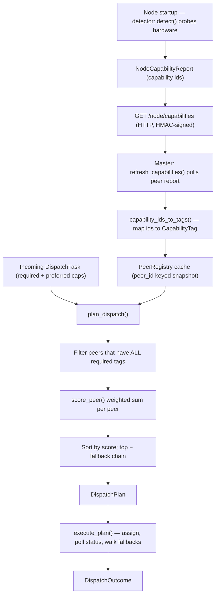

# 能力與路由（Capabilities & Routing）

> **capabilities-routing**（能力與路由）子系統的架構說明：一個 spectyn
> 節點（node）如何探知自己能做什麼、向叢集（cluster）廣播這些能力，以及主節點
> （master）如何為各對等節點（peer）評分，以便把任務路由（dispatch，派工）給最適合的節點。

## 用途（Purpose）

spectyn-mesh 在異質機器（桌機、筆電、行動裝置）上執行同一個二進位檔（binary）。
沒有任兩個節點擁有相同的硬體或存取權限，因此系統避免依平台硬寫死（hardcode）行為。
取而代之的作法是：

1. **能力偵測（Capability detection）** — 每個節點在執行期（runtime）探測自己的環境
   （shell、GPU、檔案系統存取、麥克風、本機 LLM……），並產出一份穩定的
   `NodeCapabilityReport`。
2. **能力廣播（Capability advertisement）** — 該報告透過 HTTP 對外公開，這也是各
   對等節點在叢集中所看到的內容。
3. **能力標籤路由（Capability-tag routing）** — 當有任務需要派工時，主節點拉取
   每個對等節點所廣播的能力，依任務所需／偏好的標籤（再加上延遲、負載與近期失敗
   訊號）為每個對等節點評分，並挑出最佳對等節點以及一條有序的後備鏈
   （fallback chain，備援鏈）。

此子系統是「這個節點擁有什麼硬體」與「哪個節點該執行這個任務」之間的橋樑。

## 關鍵檔案（Key files）

| 路徑 | 角色 |
| --- | --- |
| `core/src/capabilities/mod.rs` | 核心型別：`Capability` enum、`NodeCapabilities`、`QualifiedCapability`、`NodeCapabilityReport`、`PlatformInfo`。穩定的 id 字串 + serde + 平台／服務模型對應。 |
| `core/src/capabilities/detector.rs` | 執行期探測：`detect()` 建立一份 `NodeCapabilities` 快照（shell echo 測試、`cfg!` 平台 GPU／檔案存取、ollama 檢查、麥克風啟發式判斷）。 |
| `core/src/cluster_dispatch_wire.rs` | 路由引擎：`CapabilityTag`、`DispatchTask`、`PeerScore`/`ScoreBreakdown`、`plan_dispatch`（filter→score→sort，篩選→評分→排序）、`score_peer`（加權總和）、`refresh_capabilities` + HMAC 簽章的 RPC 輔助函式，以及行程內（process-local）的 `PeerRegistry` 快取。 |
| `core/src/serve.rs` | HTTP 路由 `GET /node/capabilities`（處理函式 `node_capabilities`）回傳與 CLI 相同的 `NodeCapabilityReport` 酬載（payload）。 |
| `core/src/bin/spectyn.rs` | CLI `spectyn node-capabilities [--json]` — 印出本機的能力報告。 |
| `app/src-tauri/src/commands/cluster_dispatch_wire.rs` | Tauri 指令 `dispatch_plan` / `dispatch_score_peer`，把引擎暴露給 UI。 |
| `app/src/lib/clusterDispatchPlan.ts` | 前端輔助層：建立一個 `DispatchTask`、把對等節點摘要投影成 `PeerCapabilities`、呼叫 `dispatch_plan`，並把錯誤對應成 UI 字串。 |
| `app/src/lib/generated/cluster_dispatch/*.ts` | 由 ts-rs 自動生成的 wire 型別 TypeScript 綁定（binding）— 絕不可手動編輯。 |
| `app/src/screens/macos/DispatchPlanner.tsx`, `app/src/components/mobile/MobileDispatch.tsx` | 消費派工計畫的 UI 介面。 |

## 資料流（Data flow）

編號摘要：

1. **偵測（Detect）** — 啟動時 `detector::detect()` 回傳一份 `NodeCapabilities`，
   並包裝進一份 `NodeCapabilityReport`（`schema_version`、`PlatformInfo`、
   排序過的 `capability_ids`）。
2. **廣播（Advertise）** — `GET /node/capabilities` 提供該報告；CLI
   `spectyn node-capabilities` 印出完全相同的酬載。
3. **收集（Collect）** — 主節點呼叫 `refresh_capabilities(peer_id)`，它會發出一個
   HMAC 簽章的 `GET`，把每個 `capability_id`（例如 `gpu_compute:metal`）對應成一個
   `CapabilityTag { slug, value }`，蓋上一個本機的 `last_reported_at`，再把它寫入
   `PeerRegistry` 快取。
4. **規劃（Plan）** — `plan_dispatch(task, peers)` 篩選出有廣播每個
   `required_cap` 的對等節點，為每個存活者評分，遞減排序，強制套用一個最低
   分數門檻（score floor），並回傳一份 `DispatchPlan`（選定的對等節點 + 受限長度的
   後備鏈 + 人類可讀的理由）。若無合格的對等節點，則產生 `NoMatchingPeer`。
5. **評分（Score）** — `score_peer` 是一個加權總和：能力匹配（Jaccard 式，
   權重 0.5）+ 延遲代理值（latency proxy，0.3）+ 負載（0.15）+ 近期失敗懲罰
   （0.05，為負值）。
6. **執行（Execute）** — `execute_plan(plan)` 把指派 POST 給選定的對等節點，
   輪詢（poll）`/rpc/task/status/:id` 直到進入終止狀態或逾時（deadline），並在
   失敗時走訪後備鏈，產生一份 `DispatchOutcome`。

## 擴充點（Extension points）

- **新增一個能力**：在 `capabilities/mod.rs` 擴充 `Capability` enum，加入它的
  `id()` / `from_id()` 對應（保持來回轉換測試為綠燈），然後在 `detector.rs`
  加入一個探測。複合能力使用 `slug:value` 慣例（例如 `gpu_compute:metal`）。
- **變更偵測啟發式（heuristics）**：編輯 `detector.rs` 中的 `detect_*` 輔助函式。
  每個都是盡力而為（best-effort）且彼此隔離；行動裝置與桌機分支使用
  `cfg!(target_os = ...)`。
- **調校路由**：在 `cluster_dispatch_wire.rs` 中調整 `score_peer` /
  `tag_intersect` / `latency_from_last_ping` / `peer_active_load` /
  `failure_history` 的權重或公式。分數門檻與後備鏈長度位於 `plan_dispatch`。
- **新的派工錯誤／狀態**：在 `DispatchError` 或 `DispatchStatus`（snake_case
  wire 形狀）新增一個變體（variant），並重新生成 ts-rs 綁定。
- **wire 型別變更**：在 `#[ts(export)]` struct 上任何欄位改名都會連帶影響
  `app/src/lib/generated/cluster_dispatch/` 底下生成的 TypeScript。請重新生成，
  而非手動編輯。
- **UI 消費端**：`clusterDispatchPlan.ts` 是唯一的輔助層；新畫面應呼叫
  `planDispatch` / `buildTask`，而非直接呼叫 Tauri 指令。

## 測試（Tests）

- **能力型別**：`core/src/capabilities/mod.rs` 中的內嵌 `#[cfg(test)]` 模組 —
  id 來回轉換、serde 來回轉換、去重（dedup）、平台／服務模型對應。
- **偵測**：`core/src/capabilities/detector.rs` 中的內嵌測試 — 永遠開啟的
  能力、各平台 shell／檔案系統／GPU 是否存在、無重複。
- **路由引擎**：`core/src/cluster_dispatch_wire.rs` 底部的內嵌 `#[cfg(test)]`
  模組 — 能力 id→tag 對應、`tag_intersect` 已知答案向量、延遲代理值邊界情況、
  `plan_dispatch` 無匹配對等節點的情形、wire 形狀（camelCase / snake_case）防護。
- **Serve 路由**：`core/src/serve.rs` 中的 `node_capabilities_tests` 模組
  斷言 HTTP 酬載等於 CLI `--json` 酬載。
- **Tauri 指令**：`app/src-tauri/src/commands/cluster_dispatch_wire.rs` 中的測試
  涵蓋無對等節點／有合格對等節點的計畫路徑，以及 camelCase 反序列化。

> 注意：上述範例中的路徑、對等節點 id 與端點皆使用佔位符
> （例如 `peer-mac-01`、`127.0.0.1:7878`）。請替換成你自己叢集的實際值。
