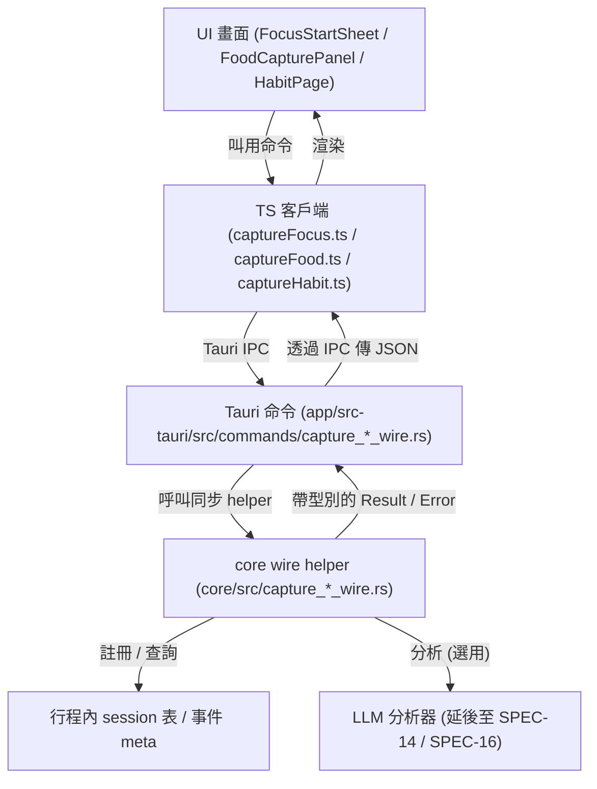

# Capture Wires

> `capture-*` 子系統（focus（專注）/ food（飲食）/ habit（習慣）生活事件擷取）的架構筆記。

## Purpose（目的）

capture-wires 子系統定義了三個 Life-Track（生活軌道）擷取能力的 **wire types（線格式型別，即跨 UI 與 RPC 可見的精簡資料契約）** 以及 **synchronous capture helpers（同步擷取輔助函式）**：

- **capture-focus** — 專注計時器（Pomodoro（番茄鐘）/ DeepWork（深度工作）/ Sprint（衝刺）/ Custom（自訂））、中斷觀測，以及由 LLM（大型語言模型）驅動的事後總結。
- **capture-food** — 從文字、影像、手錶語音或分享擴充（share extension）記錄飲食，並產生巨量營養素（macro-nutrient）估算。
- **capture-habit** — 習慣定義、打卡（check-in）與連續天數（streak）計算。

「wire type」是透過 [`ts-rs`](https://docs.rs/ts-rs) 暴露於 Rust ↔ TypeScript 邊界的精簡 struct（結構體）。這些 wire 模組位於 `core` crate（套件箱）中，作為單一事實來源（single source of truth）；對應的 TypeScript 介面會自動產生到 `app/src/lib/generated/<slug>/`，且絕不可手動編輯。`app/src-tauri/` 中的 Tauri 命令層把這些 helper 改寫成桌面／行動裝置的 IPC（行程間通訊）命令，而 `app/src/lib/` 中的精簡 TypeScript 客戶端則包裝這些命令供 UI 使用。

本子系統實作了 SPEC-20（food）與 SPEC-21（focus/habit）deep spec（深度規格）所描述的資料模型與能力介面。

## Key files（關鍵檔案）

| File（檔案） | Role（角色） |
| --- | --- |
| `core/src/capture_focus_wire.rs` | 專注 session（工作階段）wire types ＋ helpers（`start_session`、`record_interruption`、`complete_session`、`analyze_focus_session`）；行程內的 active-session（進行中工作階段）資料表。 |
| `core/src/capture_food_wire.rs` | 飲食擷取 wire types ＋ helpers（`analyze_food`、`validate_image_size`、`build_food_event_meta`）；巨量營養素估算 ＋ 來源／錯誤 enum（列舉）。 |
| `core/src/capture_habit_wire.rs` | 習慣 wire types ＋ helpers（`create_habit`、`record_checkin`、`list_habits`、`compute_streak`）；頻率／打卡來源 enum。 |
| `core/src/lib.rs` | 宣告三個 `pub mod capture_*_wire;` 模組。 |
| `app/src-tauri/src/commands/capture_focus_wire.rs` | 包裝專注 helper 的 Tauri IPC 命令（以 panic-catch（攔截崩潰）包覆）。 |
| `app/src-tauri/src/commands/capture_food_wire.rs` | 飲食擷取的 Tauri IPC 命令。 |
| `app/src-tauri/src/commands/capture_habit_wire.rs` | 習慣擷取的 Tauri IPC 命令。 |
| `app/src/lib/captureFocus.ts` | 專注 Tauri 命令的 TypeScript 客戶端 ＋ localStorage（本機儲存）近期事件鏡像。 |
| `app/src/lib/captureFood.ts` | 飲食 Tauri 命令的 TypeScript 客戶端。 |
| `app/src/lib/captureHabit.ts` | 習慣 Tauri 命令的 TypeScript 客戶端。 |
| `app/src/lib/generated/capture_focus/` | 自動產生的 TS 型別（`FocusMode`、`FocusSessionRequest`、`FocusSessionResult`、`FocusInterruption`、`InterruptionKind`、`FocusCaptureError`）。 |
| `app/src/lib/generated/capture_food/` | 自動產生的 TS 型別（`FoodCaptureRequest`、`FoodAnalysisResult`、`FoodEvent`、`MacroEstimate`、`FoodCaptureSource`、`FoodCaptureError`）。 |
| `app/src/lib/generated/capture_habit/` | 自動產生的 TS 型別（`HabitDefinition`、`HabitCheckin`、`HabitStreak`、`HabitSummary`、`HabitFrequency`、`HabitCheckinSource`、`HabitCaptureError`）。 |
| `app/src/components/food/FoodCapturePanel.tsx` | 飲食擷取 UI 面板。 |
| `app/src/screens/macos/FocusStartSheet.tsx` | macOS 專注啟動畫面。 |
| `app/src/screens/macos/HabitPage.tsx` | macOS 習慣畫面。 |

## Data flow（資料流）

專注擷取路徑最為完整；飲食與習慣遵循相同形狀
（UI 客戶端 → Tauri 命令 → core wire helper → 帶型別的結果回傳給 UI）。



編號的專注範例：

1. UI 透過 `captureFocus.ts` 呼叫 `focus_start_session(req)`。
2. Tauri 命令呼叫 `capture_focus_wire::start_session`，它會在行程層級的
   `Mutex<HashMap<String, ActiveFocusSession>>` 中註冊一個進行中的 session，並
   回傳一個 session id。
3. UI 呼叫 `focus_record_interruption(id, kind)`；helper 會把一筆中斷附加
   到進行中的 session。
4. UI 呼叫 `focus_complete_session(id)`；helper 會清空（drain）所有中斷、計算
   實際時長／完成百分比，並回傳一個 `FocusSessionResult`。
5. TS 客戶端會把已完成的 session 鏡像到 `localStorage`，讓儀表板（dashboard）
   在重新載入後仍有資料（目前尚無後端列表端點）。
6. 選擇性地，`focus_analyze_session(result)` 會回傳一個 `AnalysisResult`（即從
   `event_storage_wire` 重新匯出的共用 LLM side-car（旁掛）形狀）；此路徑已延後。

## Extension points（擴充點）

- **新增一種擷取型別** — 依循既有模式建立 `core/src/capture_<thing>_wire.rs`
  （在 wire struct 上加 `#[derive(... Serialize, Deserialize, TS)]` 並搭配
  `#[ts(export, export_to = "../../app/src/lib/generated/capture_<thing>/")]`），於
  `core/src/lib.rs` 宣告 `pub mod capture_<thing>_wire;`，新增對應的 Tauri 命令檔
  與一個精簡 TS 客戶端，再執行 build 以重新產生 TS 綁定。
- **新增一個欄位／變體（variant）** — 編輯 `core` wire 模組中的 Rust struct 或 enum
  （事實來源）並重新產生；絕不可手動編輯 `app/src/lib/generated/`。
- **新增一種 focus mode** — 擴充 `FocusMode` enum，並在時長查詢 helper 中處理
  新的變體。
- **新增一個錯誤碼** — 擴充對應的 `*CaptureError` enum；面向 UI 的程式碼會把
  內部變體對應到精簡的公開錯誤集合。
- **接上延後的分析器** — `analyze_focus_session` 與 `analyze_food` 是 LLM 分析層
  （SPEC-14 / SPEC-16）的整合接縫；它們目前回傳一個穩定但尚未接線的介面。

## Tests（測試）

- `core/tests/wire_round_trip.rs` — 對每個擷取 wire 進行序列化／反序列化往返
  （round-trip）＋ 產生的 TS 檔案存在性檢查（case 9–11 涵蓋 food / focus / habit）。
- `core/tests/life_node_capture_e2e.rs` — 端對端擷取冒煙測試（smoke）（`phantom event
  capture` → `phantom serve` → 真實 LLM → 分析）；無 API key 時會優雅略過。

執行方式：

```bash
cargo test --test wire_round_trip
cargo test --test life_node_capture_e2e   # skips if no API key / release bin
```
