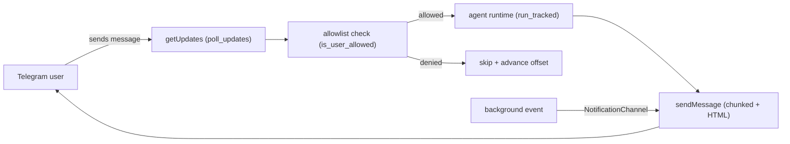

# channels-telegram

## 用途

`channels-telegram` 子系統是一個**極簡的 Telegram bot（機器人）傳輸層**，直接
建構在 `reqwest` HTTP 客戶端之上 —— 不使用任何第三方 Telegram SDK（軟體開發
套件）。它讓正在執行的 `spectyn serve` daemon（常駐服務）能夠接收來自 Telegram
使用者的聊天訊息、把每則訊息路由到 agent runtime（代理執行環境），並把回覆送
回原始的聊天對話。

它在更大的系統中扮演**進站／出站聊天 channel（管道）**之一的角色。當操作者的
`agents.toml` 內出現 `[telegram]` 區塊時，daemon（`core/src/main.rs`）會建構一
個 bot、spawn（衍生）一個輪詢迴圈，並（選擇性地）把同一個 bot 註冊為單向的
**notification channel（通知管道）**，讓背景事件也能被推送到某個聊天對話。

本模組所負責的職責：

- 與 Telegram Bot API 對話（`getUpdates`、`sendMessage`）。
- 兩種遞送模式：long-polling（長輪詢，預設）與 webhook（網路掛勾）。
- 一個 allowlist（允許清單）過濾器（哪些 Telegram 使用者 ID 可以互動）。
- 由 SQLite 支撐的持久化，讓 chat→persona（聊天對話對人格）的綁定以及遞送模式
  能在 daemon 重啟後存活。
- 安全的訊息切塊（Telegram 把單則訊息上限設為 4096 字元，且訊息必須在 UTF-8
  字元邊界上切分）。

注意：這與 `core/src/remote_control/telegram.rs`（一條獨立的、以 `teloxide` 為基礎的
實驗性路徑）以及 `coach_delivery_wire.rs`（coach 遞送的線路格式）有所區別。本文
件只涵蓋 `core/src/channels/`。

## 重要檔案

| 檔案 | 角色 |
| --- | --- |
| `core/src/channels/mod.rs` | 模組根；重新匯出 `telegram` 子模組。 |
| `core/src/channels/telegram.rs` | 整個子系統：`TelegramBot`、`DeliveryMode`、`ChatSession`、`ChatSessionStore`、`DeliveryModeStore`、輪詢／傳送輔助函式，以及單元測試。 |
| `core/src/notifications/channels/telegram.rs` | `TelegramChannel` adapter（轉接器）—— 把一個共享的 `TelegramBot` 包裝成單向的 `NotificationChannel`（HTML 轉義的標題＋內文、批次摘要）。 |
| `core/src/main.rs` | Daemon 接線：讀取 `telegram_config`、建構 bot、掛上 notification channel，並 spawn `poll_updates` → agent-runtime → `send_message` 的迴圈。 |

`telegram.rs` 中的公開型別：

- `TelegramBot` —— `token`、`allowed_users`、一個內部的 `reqwest::Client`，以及一個 `DeliveryMode`。
- `DeliveryMode` —— `Polling`（預設）或 `Webhook { url }`。
- `ChatSession` —— `chat_id`、`persona`、`last_seen_unix`。
- `ChatSessionStore` / `DeliveryModeStore` —— SQLite 單一資料表的持久化。

## 資料流

進站訊息的往返流程（如同在 `main.rs` 中所 spawn 的）：

1. Daemon 啟動時讀取 `[telegram]` 設定；若 bot-token 環境變數有設定且非空，便建構
   `TelegramBot::new(token, allowed_users)`。
2. 一個背景任務呼叫 `bot.poll_updates(offset)`，該函式發出 `GET getUpdates`，並回傳
   一份 `(chat_id, user_id, text, update_id)` 清單。
3. 每筆更新都會透過 `is_user_allowed(user_id)` 對照 allowlist 檢查；未列入清單的
   使用者會被略過（offset 仍會推進，因此該筆更新不會被重複擷取）。
4. 文字加上先前的對話歷史會被傳入 agent runtime（`run_tracked`），產生一個回覆
   字串。
5. `bot.send_message(chat_id, reply)` 會把回覆做 HTML 轉義並切塊（每塊 ≤4000
   位元組，在換行符／字元邊界上切分），並把每一塊 POST 到 `sendMessage`。若遇到
   HTML 解析錯誤，便以純文字重試。
6. 迴圈把 `offset` 推進到 `update_id + 1` 並重複。

持久化：`ChatSessionStore` 把 `chat_id → persona` 的綁定與一個
`last_seen_unix` 時間戳記保存在一張 SQLite 資料表（`telegram_chat_sessions`）中；
`DeliveryModeStore` 把目前作用中的 polling/webhook 選擇保存在一張單列的資料表
（`telegram_delivery_mode`）中。兩者都使用 `CREATE TABLE IF NOT EXISTS` 且可重新
開啟，因此狀態能在 daemon 重啟之間往返保存。正式環境的呼叫者會使用 spectyn 資料
目錄底下的某個路徑（例如 `<data-dir>/telegram_sessions.db`）；測試則使用一個用完
即丟的暫存目錄。

## 擴充點

- **新增遞送模式** —— 擴充 `DeliveryMode` enum（列舉），並更新
  `DeliveryModeStore::save` / `load` 以序列化／反序列化新的變體。
  `run_bot_loop` 目前是一個 placeholder（佔位）接縫，保留給更豐富的 dispatch
  （分派）邏輯，也是 webhook 處理的天然落腳處。
- **Allowlist 政策** —— `is_user_allowed`（字串型別的輔助函式）與
  `TelegramBot::is_allowed`（i64）集中了准入規則。空清單目前代表「允許所有人」；
  若要翻轉這個預設值，必須與 `empty_allowlist_allows_everyone` 在同一個 commit
  中完成，好讓該測試維持真實。
- **新增出站介面** —— 實作 `NotificationChannel` trait（特徵）（參考
  `notifications/channels/telegram.rs` 作為範例轉接器），以重用 bot 的切塊／轉義
  來支援一種新類型的推送訊息。
- **訊息格式化／切塊大小** —— `split_message` 與 `split_at_char_boundary` 是純
  輔助函式；可在那裡調整 4000 位元組的門檻或換行優先邏輯。
- **更豐富的工作階段** —— 為 `ChatSessionStore` schema（綱要）新增欄位，並擴充
  `ChatSession` 以及 `upsert` / `load` / `load_all` 查詢。

## 測試

單元測試以 inline（行內）方式置於 `core/src/channels/telegram.rs` 底部的
`#[cfg(test)] mod tests` 之下，涵蓋：

- `sqlite_persists_chat_session` —— 單列儲存／重新開啟的往返。
- `persona_binding_survives_restart` —— 多聊天對話的 `load_all` 還原＋隔離更新。
- `webhook_vs_polling_switch` —— `DeliveryMode` 契約＋`DeliveryModeStore` 往返。
- `allowlist_rejects_non_listed_user`、`empty_allowlist_allows_everyone`、
  `allowlist_handles_numeric_strings_from_toml` —— 准入過濾器語意。

通知轉接器在 `core/src/notifications/channels/telegram.rs` 中有自己的測試
（`escape_handles_specials`）。

執行方式：`cargo test -p spectyn-mesh channels::telegram`（轉接器則用
`notifications::channels::telegram`）。測試使用 `tempfile::TempDir`，因此絕不會
觸碰到真正的 spectyn 資料目錄。
