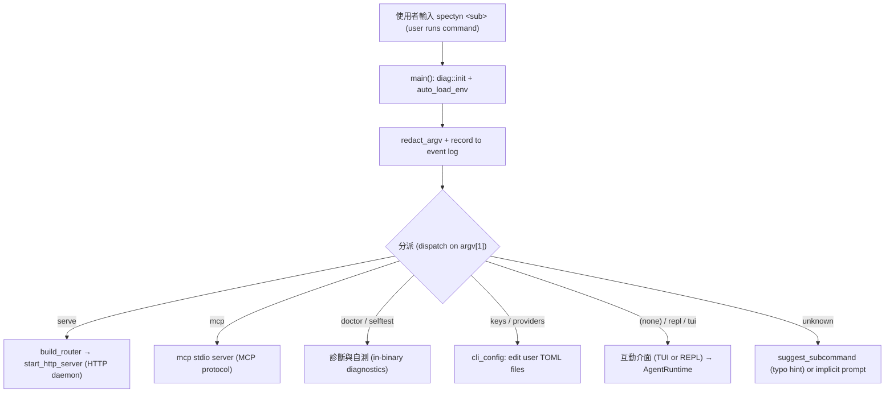

# cli-spectyn

> `spectyn` 命令列介面（CLI，command-line interface）子系統的架構說明文件。

## Purpose（用途）

`cli-spectyn` 是 spectyn-mesh 面向使用者的進入點，也就是 `spectyn`
執行檔：單一的可執行檔，負責解析命令列、分派到正確的
子命令（subcommand），並把操作者橋接到引擎的其餘部分（agent runtime（代理執行環境）、
providers（供應商）、cluster（叢集）、vault（保險庫）等）。

它從單一執行檔提供三種不同的使用面：

1. **Interactive（互動式）** — 執行不帶子命令的 `spectyn` 進入 ratatui 終端機
   UI（TUI，文字使用者介面），或執行 `spectyn repl` 進入以行為單位的讀取-求值-列印迴圈（REPL，read-eval-print loop）。
2. **One-shot subcommands（單次子命令）** — `serve`、`doctor`、`mcp`、`evolve`、`selftest`、
   `cluster`、`keys`、`providers`，以及約 40 個其他子命令（見 `KNOWN_SUBCOMMANDS`）。
3. **Long-running daemons（長時間執行的常駐服務）** — `spectyn serve` 啟動由
   桌面／行動應用程式所使用的 HTTP API；`spectyn mcp` 透過標準輸入輸出對外提供一個
   Model Context Protocol（MCP，模型上下文協議，AI 客戶端使用的工具呼叫協議）伺服器。

CLI 位於整個堆疊的最上層：它掌管引數解析與行程
生命週期，然後把所有實際工作委派給 `spectyn_mesh` library crate（函式庫套件）。

## Key files（關鍵檔案）

| File（檔案） | Role（角色） |
| --- | --- |
| `core/src/bin/spectyn.rs` | `spectyn` 執行檔。手寫的引數解析器、頂層子命令分派，以及 `doctor`、`selftest`、`evolve`、TUI／REPL 啟動器與許多小型子命令的實作。 |
| `core/src/main.rs` | `spectyn-mesh` 執行檔——HTTP 伺服器目標。建構 Axum router（路由器）並提供 dashboard／agent 端點。由 `spectyn serve` 重複使用。 |
| `core/src/serve.rs` | HTTP serve 管線：伺服器使用面所共用的請求處理器與路由接線。 |
| `core/src/lib.rs` | `spectyn_mesh` library crate 的根。對外公開 `AppState`、`start_http_server`，以及 CLI 呼叫進去的模組樹。 |
| `core/src/cli_config.rs` | 實作 `spectyn keys` 與 `spectyn providers`；以 `toml_edit` 編輯使用者設定檔（`~/.spectyn-mesh/env`、`agents.toml`）以保留註解。啟動時也會執行 `auto_load_env`。 |
| `core/src/mcp.rs` | `spectyn mcp` 背後的 MCP stdio 伺服器。 |
| `core/src/i18n.rs` | 提供雙語（English／繁體中文）說明與提示的 `tr()` 輔助函式。 |

## Data flow（資料流）

典型呼叫的編號流程：

1. `main()` 呼叫 `spectyn_mesh::diag::init()`，在任何其他環節可能失敗之前
   先裝上 panic／crash（當機）攔截掛鉤。
2. `cli_config::auto_load_env()` 載入 `~/.spectyn-mesh/env`，讓 API 金鑰的
   環境變數查找無需手動在 shell 中 export 即可解析成功。明確設定的 shell
   變數一律優先。
3. Argv（引數向量）被收集後，先經過 `redact_argv()` 處理，才寫入
   滾動式事件記錄檔——憑證會被洗去，因此 token（權杖）永遠不會被保留下來。
4. `--version`／`help` 會短路提前返回。長時間執行的子命令（`serve`、`mcp`、
   `coordinator`、`evolve`）會攔截尾端的 `--help`，因而印出用法說明，而不是
   啟動常駐服務。
5. 子命令會與 `KNOWN_SUBCOMMANDS` 比對，並分派到對應的
   處理器。大多數處理器會從 library crate 建構或借用 `AppState`。
6. 若沒有任何子命令符合，且輸入也不是可辨識的拼字錯誤（由
   `suggest_subcommand` 處理），則該引數會被視為隱含的聊天提示（prompt）。

## Extension points（擴充點）

- **Add a subcommand（新增子命令）** — 在 `core/src/bin/spectyn.rs` 的
  `KNOWN_SUBCOMMANDS` 中加入它的 slug，在 `main()` 中加入一個分派分支，並實作該
  處理器（小型處理器放在執行檔內；具份量的邏輯應放在
  `core/src/` 下的 library 模組）。加入一行用法說明條目，讓 `spectyn help`
  與拼字建議器能夠抓到它。
- **Add an HTTP route（新增 HTTP 路由）** — 擴充 `core/src/main.rs` 中的 `build_router()` 並加入
  處理器；它會接收 `State<AppState>`。桌面／行動應用程式會使用這些路由。
- **Add an MCP tool（新增 MCP 工具）** — 擴充 `core/src/mcp.rs` 中的伺服器。
- **Manage config surfaces（管理設定使用面）** — `spectyn keys`／`spectyn providers` 的邏輯位於
  `core/src/cli_config.rs`；所有編輯僅對使用者擁有的檔案進行讀寫即可（不連網路、
  不重啟服務），並透過 `toml_edit` 保留格式。
- **Localize output（本地化輸出）** — 用 `i18n::tr("EN", "中文")` 包住使用者可見的字串。
- **Register a smoke test（註冊冒煙測試）** — 把腳本放進 `scripts/selftest.d/`（見下文）。

## Tests（測試）

- **Unit tests（單元測試）** — `core/src/bin/spectyn.rs` 中內嵌的 `#[test]`／`#[tokio::test]`
  模組（例如 `levenshtein_within`、`suggest_subcommand`）。
- **Integration tests（整合測試）** — `core/tests/cli_macos.rs`、`core/tests/cli_linux.rs`、
  `core/tests/cli_win.rs` 會逐平台演練 CLI 的行為。
- **End-to-end smoke tests（端對端冒煙測試）** — `scripts/selftest.d/` 是 `spectyn selftest`
  的註冊表。與 CLI 相關的腳本包括 `00-binary.sh`、`10-doctor.sh`、
  `15-doctor-json.sh`、`20-serve.sh`、`25-run.sh`、`30-mcp.sh`，以及 TUI 檢查
  （`35-tui.sh`、`36-tui-fuzz.sh`、`70-tui-double-tap.sh`）。以
  `spectyn selftest` 執行它們。
