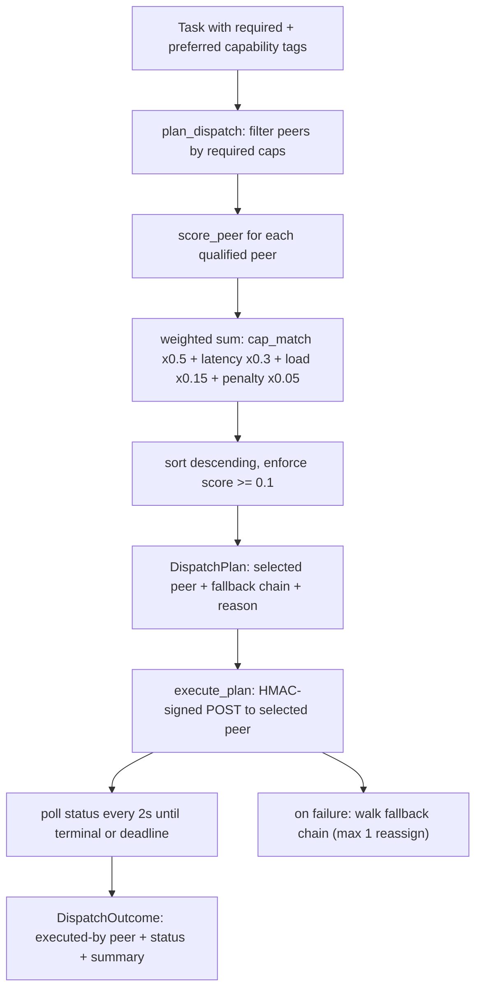

# 叢集派工（Cluster Dispatch）

> 以能力為基礎（capability-based，依能力標籤）的路由機制，把任務派給 spectyn-mesh 叢集（cluster，多機節點群）中最合適的對等節點（peer，對等夥伴）。
> Spec 參考：SPEC-26（cluster dispatch）§6.2 評分、§7 資料模型、§8 狀態機、§9 API 合約、§11 錯誤目錄。

## 目的

叢集派工負責決定**網狀網路（mesh）中應由哪個對等節點執行某個任務**。一個「master」（主控節點）持有每個可達對等節點所宣告之能力（capability，能力）的快照（snapshot，狀態截圖）——例如 `role-coder`、`cargo`、`gpu` 這類能力標籤——並針對任務需求為每個候選節點評分，接著把任務派給分數最高者，同時附上一條有序的後備鏈（fallback chain，備援順序）以供重試。

它位於兩個鄰居之間：

- **在它之上**：代理執行環境（agent runtime，代理人執行階段）／任務拆解層（SPEC-27 smart
  decompose，智慧拆解）產生任務。叢集派工透過一個不透明的 JSON
  `payload` 欄位來消化這些任務，因此它永遠不必依賴拆解端的 schema（綱要結構）。
- **在它之下**：RPC（遠端程序呼叫）層（`rpc_wire`，SPEC-10/12）在對等節點之間傳遞經 HMAC（雜湊訊息驗證碼）簽章的
  請求；SPEC-13 age-encryption（age 加密）會在更上一層把跨節點的 payload 包覆起來。

此子系統具備兩個互補的介面：

1. **能力評分 + 規劃**（`cluster_dispatch_wire.rs`）——純粹、
   具決定性（deterministic，結果可預期一致）的對等節點挑選。
2. **唯讀的叢集感知**（`tools/cluster.rs`）——讓代理人在決定是否委派之前，先詢問
   「現在有哪些對等節點可達？」。

另有一條獨立的 **broker-streaming dispatch**（中介伺服器串流派工）路徑（E002/F102，`commands/dispatch.rs`），
處理圖形介面（GUI）的「把這段提示送給遠端工作者並把產生的 token（權杖／詞元）串流回傳」
流程；它與能力評分相關但屬不同機制。

## 主要檔案

| 檔案 | 角色 |
| --- | --- |
| `core/src/cluster_dispatch_wire.rs` | 派工合約的單一真實來源（single source of truth）：wire types（傳輸型別）+ 純評分（`score_peer`、`tag_intersect`）、規劃（`plan_dispatch`）、執行（`execute_plan`）、能力刷新（`refresh_capabilities`），以及行程內（process-local）的 `PeerRegistry` 快取。 |
| `core/src/tools/cluster.rs` | 唯讀的代理人工具：`cluster_status`（ping 對等節點 + RTT〔來回時間〕）、`cluster_sessions`（運作中的 TUI〔文字使用者介面〕）、`cluster_peers`（來自 `peers.json` 的靜態註冊表）。 |
| `app/src-tauri/src/commands/cluster_dispatch_wire.rs` | Tauri 指令繫結（`dispatch_plan`、`dispatch_score_peer`），把純規劃器暴露給 GUI。 |
| `app/src/lib/clusterDispatchPlan.ts` | 前端輔助程式：由能力 slug（識別代稱）建立 `DispatchTask`、將對等節點摘要投影成 `PeerCapabilities`、呼叫 `dispatch_plan`、把錯誤對映成 UI 字串。 |
| `app/src/lib/generated/cluster_dispatch/*.ts` | 為 9 個 wire types 自動產生的 TypeScript 繫結（`ts-rs`）——切勿手動編輯。 |
| `app/src/stores/clusterPeersStore.ts` | 已知對等節點的前端 store（狀態儲存，`PeerSummary`）。 |
| `app/src/hooks/useClusterPeers.ts` | 將對等節點資料餵入派工 UI 的 React hook。 |
| `app/src/screens/macos/DispatchPlanner.tsx` | 用於挑選所需能力並預覽計畫的 macOS 畫面。 |
| `app/src/components/mobile/MobileDispatch.tsx` | 行動裝置派工 UI。 |

## 資料流

編號逐步說明：

1. 一個 `DispatchTask` 抵達，攜帶 `required_caps`、`preferred_caps`、一個不透明的
   `payload`，以及一個可選的 `deadline_ms`（預設 90 秒）。
2. `plan_dispatch` 濾掉任何未宣告**全部**必要能力的對等節點。
3. 每個存活下來的對等節點都由 `score_peer` 在四個維度上評分：
   能力匹配度（Jaccard-style，傑卡德式相似度）、延遲（以最近一次 ping 的新鮮度為代理指標）、
   負載（in-flight〔處理中〕任務數），以及近期失敗懲罰。
4. 這四個維度透過 §6.2 的加權總和結合；候選節點由高到低排序。若最高分低於
   `0.1`，規劃會回傳
   `NoMatchingPeer`。
5. 結果是一個 `DispatchPlan`，內含選定的對等節點、一條後備鏈
   （上限 2 筆），以及一段人類可讀的評分理由。
6. `execute_plan` 透過經 HMAC 簽章的 RPC 信封（envelope）對選定的對等節點發出 POST，
   接著輪詢 `/rpc/task/status/:id` 直到出現終態（terminal status，最終狀態）或抵達截止時限。
7. 遇到非致命失敗時，它會走訪後備鏈（每依 §8 重新指派一次）；若遇到
   HMAC 拒絕，則立即回傳 `DispatchAuthFailed`（沒有重試的意義——
   所有對等節點共用同一把叢集祕鑰）。
8. 最終的 `DispatchOutcome` 會記錄實際執行的是哪個對等節點，以及
   終態的 `DispatchStatus`。

`refresh_capabilities` 透過向某個對等節點拉取
`GET /node/capabilities`，並以**本機**時鐘為其蓋上時間戳記，藉此避免跨節點時鐘偏移（clock skew），
讓 master 的 `PeerRegistry` 快取保持最新。

## 擴充點

- **新增一個評分維度** — 擴充 `ScoreBreakdown`、在
  `score_peer` 中計算新項目，並調整加權總和。讓彙總值維持在
  `[0.0, 1.0]` 的範圍內。在既有的 `tag_intersect`
  KAT（known-answer test，已知答案測試）向量旁邊新增一個 KAT。
- **新增／變更能力標籤** — 標籤是不透明字串，所以引入新 slug
  不需要任何程式碼變更。透過 `clusterDispatchPlan.ts` 中的
  `CAP_OPTIONS` 把常用 slug 呈現到 UI。帶參數的標籤（例如 `ram=16gb`）
  會攜帶一個 `value`；請注意相等性比較會把 value 一併納入。
- **變更後備／重試策略** — 編輯
  `execute_plan` 中建立候選清單的迴圈（目前為：選定節點 + 第一個後備節點，每依 §8 重新指派一次）。
- **新增一個派工錯誤** — 在 `DispatchError` enum（列舉）
  （`#[serde(tag = "code")]`）中新增一個 variant（變體），並在 `rpc_post` /
  `rpc_get` 中對映相應的 HTTP 狀態碼；同時更新前端輔助程式裡的 `describeDispatchError`。
- **Wire types 即合約** — `cluster_dispatch_wire.rs` 中任何欄位改名
  都會重新產生 `ts-rs` 繫結，並可能弄壞 GUI 以及 SPEC-27 的 payload
  消費端。編輯後請執行 round-trip（往返序列化）測試。
- **新的 UI 介面** — 透過 `clusterDispatchPlan.ts` 中的 `planDispatch`
  來消費 `dispatch_plan`；不要直接呼叫 wire types。

## 測試

- **單元／KAT（內嵌）** — `core/src/cluster_dispatch_wire.rs` 的 `#[cfg(test)]`
  模組：能力 id 對映、`DispatchPlan` JSON 往返、snake_case
  狀態序列化、`tag_intersect` 已知答案向量、延遲代理指標的邊界情況、
  `plan_dispatch` 無匹配的案例，以及錯誤的 wire 形狀。
- **Wire 合約** — `core/tests/wire_round_trip.rs` 與
  `core/tests/wire_schema_validation.rs` 涵蓋 cluster_dispatch 的 wire types，
  與其他 mesh wire 一併測試。
- **Broker-streaming dispatch（相關路徑）** — `app/src-tauri/tests/dispatch_commands.rs`
  （以 Rust 對一個模擬 broker 做整合測試）與 `app/tests/f103/dispatchStore.test.ts`
  （前端 reducer〔狀態歸納器〕）。

> 註：本文件與測試固定資料（fixtures）中出現的佔位符，例如 `peer-mac-01`、`peer-linux-02` 與
> `http://<peer_id>:7878`，僅為示意用途——原始碼中
> 並無真實的主機名稱、IP 或祕鑰。
