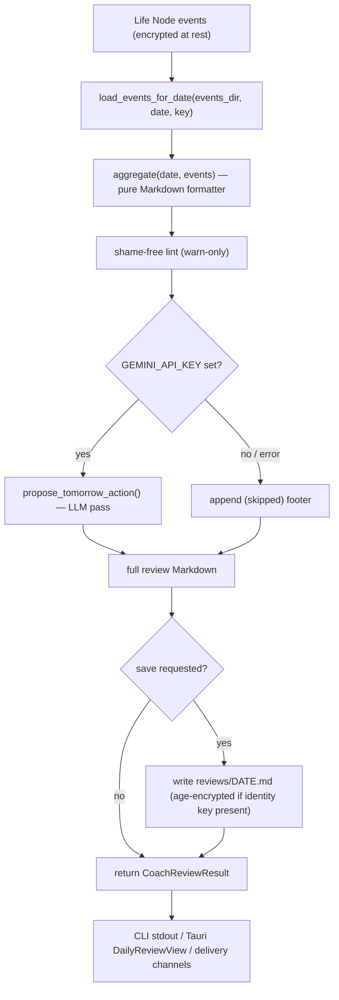

# Coach Daily Review

## 目的

**coach daily review（教練每日回顧）** 子系統會把一天內擷取到的 Life Node（生活節點）事件
（食物 / 專注 / 習慣 / 文字筆記）轉成一份無羞辱、依目標分組的 Markdown
簡報，並可在頂端附上一行由 LLM（大型語言模型）生成的「Tomorrow's one action（明日的一個行動）」
教練建議。它是 Life Track（生活軌道，支柱 P2，
multimodal understanding（多模態理解））的 AI 教練介面。

它以三種方式對外提供，且全部共用同一個後端，因此各介面永遠不會彼此漂移：

- **CLI** — `phantom coach review --date YYYY-MM-DD [--save]`（含
  LLM 行動環節的完整回顧）。
- **CLI** — `phantom review` / `phantom daily`（僅做確定性的離線彙整，
  不用 LLM、不連網路）。
- **App** — 一個 Tauri 桌面 / macOS 閱讀器畫面（「Coach Review Reader」），
  載入離線彙整結果，並可依需求生成完整回顧。

這份回顧刻意設計成 **預設離線且能優雅降級（graceful degradation）**：在
沒有 `GEMINI_API_KEY` 的情況下，LLM 環節會被略過（footer（頁尾）變成一行 `(skipped: …)`
註記），而彙整結果一律都會產出。已儲存的回顧會在有 identity key（身分金鑰）存在時
以 age 加密寫入靜態儲存（encrypted-at-rest，靜態加密）。

## 主要檔案

| File | Role |
| --- | --- |
| `core/src/life_node/daily_review.rs` | 後端引擎：`load_events_for_date`、`aggregate`（純 Markdown 格式化器）、`clean_summary`、非同步的 `propose_tomorrow_action`，以及 CLI 與 app 都會呼叫的共用進入點 `run_coach_review`。 |
| `core/src/life_node/coach_prompts/lint.rs` | 對回顧輸出做的無羞辱 / 醫療安全 lint（靜態檢查）——**只警告，絕不阻擋**。 |
| `core/src/life_node/coach_prompts/templates.rs` | LLM「tomorrow's action（明日行動）」環節用的 prompt（提示詞）範本。 |
| `core/src/daily_review_wire.rs` | App 視圖模型 wire（線傳）型別 `DailyReviewView` + `load_daily_review`；離線且唯讀，重用引擎的 `aggregate` / `load_events_for_date`。匯出 TS bindings（TypeScript 綁定）。 |
| `core/src/coach_wire.rs` | SPEC-23 教練引擎的 wire 型別：`DailyReviewRequest`、`DailyReviewOutcome`、`CoachReviewReadyPayload`、`ReviewStatus`、`MemoryInject`，外加排程的 `run_daily_review` / 分層記憶（tiered-memory）契約。 |
| `core/src/coach_delivery_wire.rs` | 遞送層：`deliver`、`send_telegram`、`send_email`、`write_markdown_file`、`dedup_check`——把一份完成的回顧送往設定好的頻道。 |
| `core/src/skillbank/skill_extractor/from_daily_review.rs` | `extract_from_review_markdown`——從已儲存的回顧中，每個 goal-tag（目標標籤）區段挖掘出一個 `SkillCandidate`（E005 技能管線）。 |
| `core/src/bin/phantom.rs` | `phantom coach review`、`phantom review`、`phantom daily` 的 CLI 指令接線。 |
| `app/src-tauri/src/commands/daily_review_wire.rs` | Tauri 指令 `daily_review_load` 與 `daily_review_generate`，註冊於 `app/src-tauri/src/lib.rs`。 |
| `app/src/lib/dailyReview.ts` | 前端輔助函式：`loadDailyReview`、`generateReview`、`parseReview`、`extractTomorrowAction`。 |
| `app/src/screens/macos/CoachReviewReader.tsx` | macOS 閱讀器畫面（SPEC-41 畫面 #3），負責渲染解析後的回顧。 |
| `app/src/lib/generated/{daily_review,coach}/*.ts` | 自動生成的 TS bindings（ts-rs）——絕不手動編輯。 |

## 資料流

編號摘要：

1. 呼叫者選定一個本地行事曆的 `date`（預設為今天 / 昨天）。
2. `load_events_for_date` 讀取（若 identity key 存在則解密）使用者資料目錄
   底下當天的事件。
3. `aggregate` 產出確定性的 Markdown：一個 `# Daily review — DATE`
   標題、一個 `**Events captured:** N` 計數，以及每個 goal-tag 一個 `## tag (n)`
   區段，內含 `- **kind** (time): summary` 條列項。
4. 無羞辱 lint 檢視輸出，只有在被標記時才發出警告。
5. 若 `GEMINI_API_KEY` 存在，`propose_tomorrow_action` 會附加一行
   教練建議；否則附加一行 `(skipped: …)` 頁尾。
6. 帶上 `--save` 時，回顧會寫入該使用者專屬的 `reviews/DATE.md`，
   並在 identity key 存在時以 age 加密。
7. 結果（`CoachReviewResult` / `DailyReviewView`）流向 CLI、
   app 閱讀器或遞送層。

## 擴充點

- **新增一個遞送頻道** — 擴充 `core/src/coach_delivery_wire.rs`
  （`DeliveryConfig` + 一個 `send_*` 函式），與既有的 Telegram /
  email / 檔案寫入器並列；重用 `dedup_check` 以避免重複寄送。
- **改變簡報版面** — 編輯 `daily_review.rs` 中純粹的 `aggregate` 格式化器；
  並讓它與 `app/src/lib/dailyReview.ts` 中前端的 `parseReview` 正規表示式
  保持同步（兩者解析相同的 Markdown 形狀）。
- **調校 LLM 教練環節** — 調整 `coach_prompts/templates.rs` 以及
  `propose_tomorrow_action` 的呼叫點；它在失敗時會降級成一行頁尾註記，
  所以請維持該契約。
- **調整安全 lint** — `coach_prompts/lint.rs` 依設計只警告；新的
  樣式放這裡。未經明確審查，不要把它升級成硬性阻擋。
- **下游消費回顧** — `skill_extractor/from_daily_review.rs` 展示了
  挖掘已儲存回顧的樣式；新的消費者應讀取已儲存的
  Markdown，而非重新執行引擎。
- **Wire 型別** — 變更任何 `*_wire.rs` struct 都會透過 ts-rs 把 TS bindings
  重新生成到 `app/src/lib/generated/`；絕不手動編輯這些生成檔。

## 測試

- 單元測試以行內方式存在於各模組中（`#[cfg(test)] mod tests`），例如
  `core/src/life_node/daily_review.rs` 中的
  `clean_summary` 與 `aggregate` 案例、`core/src/coach_wire.rs` 中的
  lint 拒絕與往返（round-trip）案例，以及
  `core/src/skillbank/skill_extractor/from_daily_review.rs` 中的萃取器案例。
- Tauri 指令測試以行內方式存在於
  `app/src-tauri/src/commands/daily_review_wire.rs`。
- 整合測試：
  - `core/tests/life_node_coach_review.rs`
  - `core/tests/life_node_capture_e2e.rs`
  - `core/tests/life_node_e004_encryption_e2e.rs`
  - `core/tests/life_node_gemini_round_trip.rs`
  - `core/tests/v6_perf_coach_aggregator.rs`（彙整器效能）
