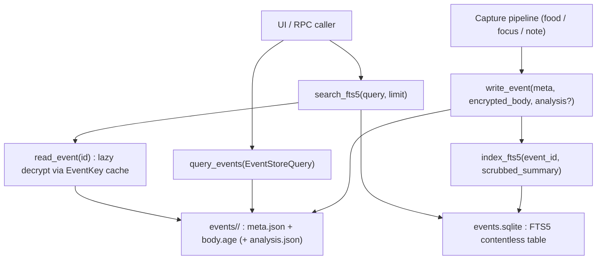

# 事件儲存子系統（Event Storage Subsystem）

> 為生活軌跡擷取（食物 / 專注 / 習慣 / 文字 / 圖片 / 音訊）提供的裝置端儲存層。
> 實作 SPEC-16 §7（資料模型）與 §10（延遲載入規則）。

> **🟥 DRIFT 標記（P0-1 · 2026-06-12 以 `core/src` 實機碼裁決）：** 本文件下方的「資料流」與 mermaid 圖描述的是
> `core/src/event_storage_wire.rs` 的 **wire-layer 設計**（`meta.json` 明文 + `body.age` 加密 + `analysis.json`）。
> **這不是 `phantom food` 等生產擷取路徑的實際磁碟佈局。** 實機真相（as-built）如下，以此為準：
>
> - **生產擷取路徑** = `phantom food`（CLI → daemon `POST /api/events` → `serve.rs:4360` `EventStore::with_key`）、
>   `phantom note`（`note_capture.rs:60`）、`phantom focus`（`focus_session.rs:200`）一律走
>   `core/src/life_node/storage.rs` 的 `EventStore`。
> - **磁碟佈局** = `events/<uuid>/` 內含 `meta.json` + `modality_<idx>.<ext>`（每個非文字 modality 一檔，
>   如 `modality_0.jpeg` / `modality_1.wav`；文字 modality 內嵌進 `meta.json`，無 `body.age`）+ `analysis.json`。
> - **加密邊界** = 當 `identity.key` 存在時，`EventStore::write_file`（`storage.rs:126–134`）對
>   **上述每一個檔**（`meta.json`、每個 `modality_*`、`analysis.json`）做 age v1 加密；magic = `age-encryption.org/v1\n`
>   （`crypto.rs:125–128`）。**沒有「明文 metadata」落地，沒有 `body.age`，沒有 sqlite `events` 主表。**
>   證據：`storage.rs:229`（meta.json 走 write_file）、`:192/:203`（modality 走 write_file）、`:268`（analysis 走 write_file）；
>   in-module 測試 `encrypted_store_writes_age_format_on_disk`（`storage.rs:381–402`）斷言 `meta.json` 為 age 密文。
> - `events.sqlite` 僅含 FTS5 contentless 虛擬表 `fts5_events`（搜尋索引），由 wire 層的
>   `index_fts5`（食物/習慣 wire 路徑）填入；**不存在** SPEC-16 §7.1.1 的 `events` 主表 / `metadata_json BLOB` / `blobs/<sha256>.age`（皆為 planned，未實作）。
> - `event_storage_wire::write_event_with_origin`（`meta.json` 明文 + `body.age`）目前**只有測試呼叫**，未接進 CLI/serve 生產路徑。

## 用途（Purpose）

event-storage 子系統是每一個使用者所擷取「事件（event）」的持久、裝置端存放處。
每個事件是一個小型集合，包含：

- **metadata（中繼資料）**（id、timestamp、kind、tags）— ⚠️ as-built：生產路徑（`storage.rs`）的 `meta.json`
  在有 `identity.key` 時是 **age 加密的**，並非明文；只有 wire-layer 設計才把 metadata 留明文（見上方 DRIFT 標記），
- 一個 **age 加密的 body（內文）**（敏感內容）— ⚠️ as-built：生產路徑無獨立 `body.age`；文字內文內嵌進加密的
  `meta.json`，image/audio 為加密的 `modality_<idx>.<ext>` 檔，
- 一個選用的 **analysis side-car（分析附帶檔）** `analysis.json`（LLM 針對某個目標對事件的評分）— as-built：有 key 時亦 age 加密。

事件以 **file-per-event（每事件一檔）** 的配置存放在使用者的資料目錄底下
（`events/<uuid>/`），並搭配一個 **SQLite FTS5**（Full-Text Search v5，全文搜尋第 5 版）
反向索引（inverted index）做關鍵字搜尋。本層在公開 API（應用程式介面）層級是
append-only（僅可追加）的；刪除僅存在於 kill-switch（緊急停止開關）與更正路徑。

它位於擷取管線（食物 / 專注 / 習慣 / 筆記擷取）與下列使用者之間：
coach review pipeline（教練審閱管線）、Tauri 桌面 UI，以及 RPC handlers（遠端程序呼叫處理器）。
body 是延遲（lazily）解密的，且只在呼叫端開啟某個特定事件時才解密，
因此列出與查詢永遠不會碰到加密金鑰。

## 關鍵檔案（Key files）

| 檔案 | 角色 |
| --- | --- |
| `core/src/event_storage_wire.rs` | 單一真相來源（single source of truth）。Wire 型別（`EventMeta`、`EventRecord`、`AnalysisResult`、`EventStoreQuery`、`EventStoreError`、`FTS5Index`）＋ `write_event` / `read_event` / `query_events` / `delete_event` / `index_fts5` / `search_fts5` 的真實實作。ts-rs 將這些型別匯出成 camelCase 的 TypeScript。 |
| `core/src/life_node/storage.rs` | 舊版 `EventStore`（E002/E004 路徑）。擁有穩定的磁碟上 `meta.json` schema（`OnDiskEventMeta`）並將其投影（project）成 wire 的 `EventMeta`；在檔案 I/O 周圍包上 encrypt/decrypt。 |
| `core/src/encryption_wire.rs` | 儲存層所橋接的 per-process（每行程）`EventKey` 快取：`event_key_loaded()`、`install_event_key_from_seed()`、`decrypt_raw_age_blob()`。缺少金鑰時會以 `DecryptionUnavailable` 浮現。 |
| `app/src-tauri/src/commands/event_storage_wire.rs` | 向桌面 UI 公開 `query_events` 與 `search_fts5` 的 Tauri 命令。 |
| `app/src-tauri/src/commands/event_detail.rs` | 透過 `EventStore` 開啟單一事件（key-aware decrypt，知曉金鑰的解密）的 Tauri 命令。 |
| `app/src/lib/eventStore.ts` | 前端用戶端：`buildQuery`、`queryEvents`、`searchEvents`、`captureNote`、`deleteEvent`。 |
| `app/src/lib/generated/event_storage/` | 自動產生的 TypeScript 綁定（`EventRecord.ts`、`EventMeta.ts`、`EventStoreQuery.ts` 等）。切勿手動編輯。 |
| `app/src/screens/macos/EventTimeline.tsx` | 消費已查詢事件紀錄的 UI 畫面。 |

## 資料流（Data flow）

1. **擷取（Capture）** — 一個擷取流程建構出一個 `EventMeta`（UUIDv7 id、ISO timestamp、
   `EventKind`、tags）以及加密後的 body 位元組。
2. **寫入（Write）** — `write_event` 執行 `mkdir -p events/<uuid>/`，寫入 `meta.json`、`body.age`、並選擇性
   寫入 `analysis.json`。⚠️ as-built（`storage.rs` 生產路徑）：寫的是 `meta.json` + `modality_<idx>.<ext>`
   + `analysis.json`（**無 `body.age`**），且當 `identity.key` 存在時三類檔**全部** age 加密、沒有任何明文落地
   （見上方 DRIFT 標記）。本步描述的「`meta.json` 明文 + `body.age`」屬 wire-layer 設計，非生產磁碟佈局。
3. **索引（Index）** — `index_fts5` 將一份已清除 PII（個人識別資訊）的摘要 upsert 進
   `events.sqlite` 中的 FTS5 contentless 虛擬表（冪等的 `INSERT OR REPLACE`）。
4. **查詢（Query）** — `query_events` 只讀取明文 `meta.json` 附帶檔，
   依 `date_iso` / `kind` / `tag` 過濾，依 timestamp 排序，套用
   `offset` 後再套用 `limit`（預設 100，上限 1000）。不需要金鑰。
5. **搜尋（Search）** — `search_fts5` 對索引執行一個 BM25 排序的 `MATCH`，並
   回傳已排序的 `event_id`。
6. **開啟（Open）** — `read_event(id)` 載入 metadata、讀取 `body.age`，並透過
   `encryption_wire` 的 `EventKey` 快取解密。若金鑰未載入（例如
   行動裝置冷啟動且尚未解鎖 keychain），它會回傳
   `EventStoreError::DecryptionUnavailable` 而非 panic（崩潰）。
7. **刪除（Delete）** — `delete_event` 以 3-pass（三次覆寫）粉碎 `body.age`，接著
   `remove_dir_all` 整個事件目錄（僅限 kill-switch / 更正路徑）。

## 延伸點（Extension points）

- **新增一種事件種類** — 擴充 `EventKind`（從 `rpc_wire` 再匯出）與
  `storage.rs::project_to_wire` 中的投影。注意已知的分歧：
  wire enum 帶有 RPC variant 集合，而 SPEC-16 §8 列出更廣的集合；
  統一兩者被當作設計債（design debt）追蹤於檔案標頭中。
- **新增一個查詢過濾條件** — 在 `EventStoreQuery` 加上一個選用欄位（保持其為
  `Option<_>`，讓空查詢仍然有效），並在 `query_events` 加上對應的判斷分支。
  透過 ts-rs 重新產生 TypeScript 綁定。
- **新增一個儲存錯誤** — 在 `EventStoreError` 加上一個 variant，附上一個對應到
  SPEC-04 錯誤目錄的 `STORE-XXX` doc-comment 以及一個 `thiserror`
  訊息；面向使用者的字串放在 i18n（國際化）層。
- **向 UI 公開一個新操作** — 在
  `app/src-tauri/src/commands/event_storage_wire.rs` 加上一個 Tauri 命令，接著在
  `app/src/lib/eventStore.ts` 加上一個具型別的包裝（typed wrapper）。
- **變更磁碟上的配置** — 保持 `OnDiskEventMeta` 位元組層級穩定以維持
  向後相容；舊的 `meta.json` 檔案必須持續可載入。透過一個
  新的私有 struct ＋投影來遷移，而不是改動既有的那個。
- **替換搜尋後端** — SQLite handle 被包在不透明的
  `SqliteHandle` 中，因此模組其餘部分與 `rusqlite` 保持解耦。

## 測試（Tests）

- **單元＋整合測試** 內嵌於
  `core/src/event_storage_wire.rs` 的 `#[cfg(test)] mod tests` 之下：wire 型別
  round-trip（往返）、錯誤標籤序列化、token 計數，以及由 `#[ignore]` 把關的
  整合測試（`write_event_round_trip_creates_expected_files`、
  `read_event_stage4_bridge_round_trip`、`index_fts5_round_trip_against_real_sqlite`），
  這些測試把 `$HOME` 指向一個暫存目錄，並對真實的 `std::fs` ＋
  SQLite 執行。用 `cargo test -- --ignored` 跑那些被忽略的測試。
- **舊版 store 測試** 內嵌於 `core/src/life_node/storage.rs`，
  涵蓋加密／明文的 write-read round-trip 與遷移。
- **跨切面測試套件（Cross-cutting suites）** 位於 `core/tests/`，端對端地演練本層：
  `wire_round_trip.rs`、`wire_schema_validation.rs`、
  `life_node_e004_encryption_e2e.rs`、`v5_happy_path.rs`、`v12_e006_smoke.rs`，
  以及 `v6_/v7_` 效能預算（perf-budget）測試。
