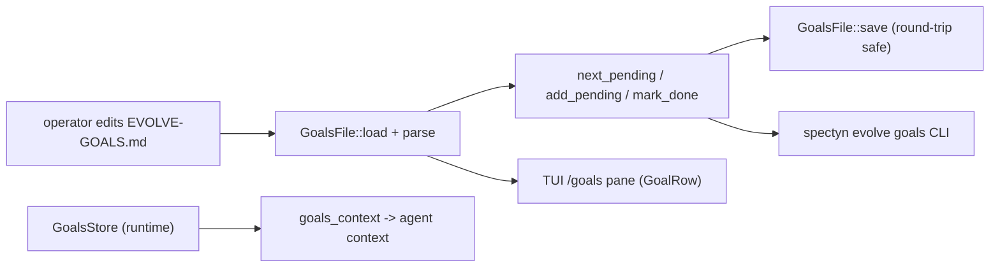

# evolve-goals

## 目的

**evolve-goals** 子系統把一份由人工維護的 Markdown 檢查清單轉換成驅動
`spectyn` 自我演進迴圈（self-evolution loop）的工作佇列（work queue）。autoevolve
流程不必每次都「修下一個失敗的測試」，而是可以從里程碑（milestone）檔案
（預設為 `./EVOLVE-GOALS.md`）中取出下一個項目，讓維護者（maintainer）能掌控
*接下來要處理什麼*。

這個格式刻意採用純 Markdown —— 人類可以在任何編輯器中編輯，不需要 CLI ——
而解析器（parser）具備**來回安全（round-trip safe）**特性：任何不是
`- [ ]` / `- [x]` 核取方塊（checkbox）的行（前言、註記、自訂段落）都能在
load → mutate → save 的循環中原封不動地保留下來。

它位於操作者（operator，負責撰寫目標）與三個消費端之間：

1. `spectyn evolve goals ...` CLI 子命令，
2. 互動式 TUI（終端機使用者介面）的 `/goals` 面板，以及
3. 執行期的 `GoalsStore`，它會把使用中的目標注入到代理（agent）的上下文（context）中。

## 主要檔案

| 檔案 | 角色 |
| --- | --- |
| `core/src/evolve_goals.rs` | 核心函式庫：`GoalsFile` 解析器／推進器、`GoalLine` / `GoalSection` / `Checkbox` 型別，以及 `parse_checkbox` 行解析器。負責 load、`next_pending`、`add_pending`、`mark_done`、`to_text`、`save`。 |
| `core/src/bin/spectyn.rs` | CLI 進入點。`run_evolve_goals()` 實作 `next` / `list [--json]` / `add "<text>"` / `mark-done <line>`，並解析 `--file` 路徑（預設為 `EVOLVE-GOALS.md`）。 |
| `core/src/lib.rs` | 宣告 `pub mod evolve_goals` 與 `pub mod goals_push`；定義執行期的 `GoalsStore`（一個存放使用中目標的 `Arc<Mutex<Vec<String>>>`），並接入應用程式狀態（app state）。 |
| `core/src/goals_push.rs` | `goals_context()` 把記憶體中的 `GoalsStore` 渲染成一段 "Active goals:" 文字區塊，供注入到代理／LLM（大型語言模型）上下文中。 |
| `core/src/tui.rs` | 終端機 UI 的 `/goals` 面板：`GoalRow` 檢視模型（view-model）、`render_goals_pane()`，以及讀取目標檔案以供顯示的 `goal_rows_from_file()`。 |

## 資料流

一個典型的「推進一個目標」循環：

1. 操作者附加一個目標 —— `spectyn evolve goals add "Add --json to list"` ——
   它會呼叫 `GoalsFile::load()`、`add_pending()`，然後 `save()`（若檔案不存在，
   會在第一次 save 時建立）。
2. evolve 迴圈執行 `spectyn evolve goals next`；`next_pending()` 回傳 `## Pending`
   底下第一個未勾選的項目。**純目標文字**會印到 stdout（標準輸出，裝飾性訊息則送到
   stderr，標準錯誤輸出），如此便能與 shell 管線（pipeline）組合使用。
3. 工作進行；完成後執行 `spectyn evolve goals mark-done <line> --sha <sha>`，
   把該行從 `## Pending` 移出，並插入到 `## Done` 的最上方，加上
   `(YYYY-MM-DD sha=…)` 前綴，接著 `save()` 重寫檔案。
4. 同時，執行期維護著一個 `GoalsStore`；`goals_push::goals_context()`
   會把它格式化成一段交給代理的上下文字串。

## 擴充點

- **新增 CLI 子命令** —— 在 `run_evolve_goals()`（`core/src/bin/spectyn.rs`）的
  `match action` 中新增一個分支，並在 `GoalsFile` 上加一個對應的方法。同時更新
  usage 字串與最上層的 help banner（說明橫幅）。
- **新增目標中繼資料（metadata）** —— `Checkbox` 的文字欄位目前以純文字承載
  `(date sha=…)` 前綴。若要擷取結構化欄位（擁有者、優先順序），請擴充 `Checkbox`
  並調整 `parse_checkbox` 以及 `mark_done` 格式化器，同時維持來回安全性。
- **新增段落語意** —— `GoalSection` 只辨識完全相符的 `## Pending` 與 `## Done`
  這兩個 H2（二級標題）；其餘一律視為 `Other` 並原樣傳遞。若要支援更多段落，
  請在 `GoalsFile::parse` 中新增一個變體（variant）與一個分支。
- **TUI 互動性** —— `goal_rows_from_file()` 與 `render_goals_pane()` 目前是
  唯讀渲染。即時的 `space` 鍵標記完成綁定可以包裝同一組 `GoalsFile` 變更方法
  （在 `tui.rs` 中已註記為規劃中的後續工作）。
- **上下文注入** —— 透過編輯 `goals_push::goals_context()`，以及在 `lib.rs` 中
  改變 `GoalsStore` 的填充方式，來改變使用中目標如何抵達代理。

## 測試

- **單元測試（unit tests）**位於 `core/src/evolve_goals.rs` 底部的
  `#[cfg(test)] mod tests` 區塊：解析、`next_pending`、`mark_done` 搬移、
  來回保留、缺檔視為空、`add_pending`，以及 JSON 形狀。
- **TUI 渲染測試**位於 `core/src/tui.rs` 中的 `mod tui_render_tests`
  （例如以 `GoalRow` 固定資料測試 `render_goals`）。
- **CLI 整合測試（integration tests）**位於 `core/tests/test_evolve_goals.rs`，
  透過 `CARGO_BIN_EXE_spectyn` 呼叫建置好的二進位檔：
  `test_evolve_goals_next_stdout_only`、`test_evolve_goals_list_json`，以及
  `test_evolve_goals_add_round_trip`。
