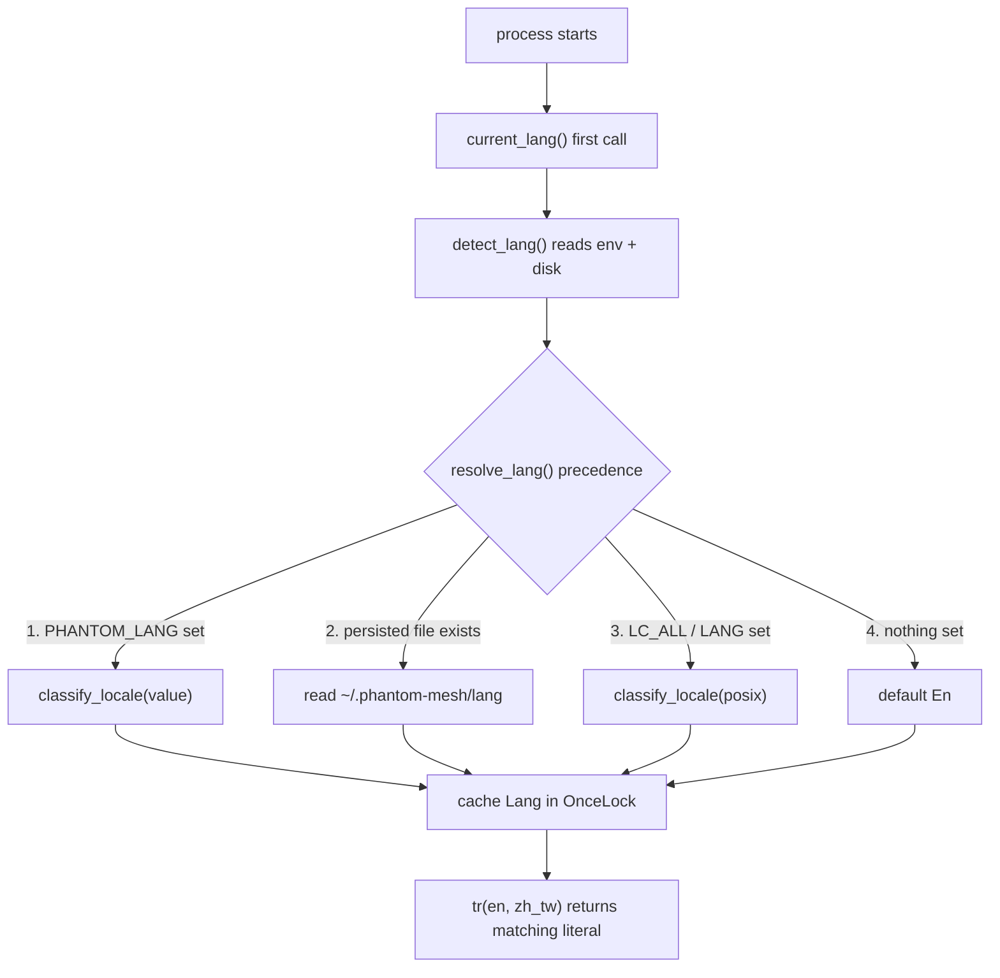

# i18n / 在地化（Localization）

## 目的（Purpose）

i18n（internationalization / localization，國際化 / 在地化）子系統讓 phantom
CLI 與 TUI（終端機使用者介面）能將其面向使用者的字串 — 說明文字、錯誤訊息、
狀態輸出、TUI 標籤 — 以英文（`en`）或繁體中文（`zh-TW`）呈現，
並於每次執行時在執行期（runtime）選定語言。

此設計刻意做到零相依（dependency-free）且採內嵌（inline）方式：沒有外部
翻譯框架，也沒有獨立的鍵值註冊表（key registry）。呼叫端會同時把
英文與繁體中文字面字串傳給單一的 `tr()` 函式，
再由解析出的行程（process）語言決定回傳哪一個。把兩個
字串放在一起，意味著審查者能在上下文旁邊看到對應翻譯，
而且兩者永遠不會像分離的鍵值目錄那樣彼此漂移失同步。

它落在核心 crate（`phantom_mesh::i18n`）的呈現邊界（presentation edge）：
商業邏輯維持與語系無關（locale-agnostic），只有負責印出到
終端機的那一層才會呼叫 `tr()` / `tr_owned()`。

## 關鍵檔案（Key files）

| 檔案 | 角色 |
| --- | --- |
| `core/src/i18n.rs` | 整個子系統：`Lang` enum、語系解析、持久化（persistence），以及 `tr` / `tr_owned` 翻譯輔助函式。 |
| `core/src/lib.rs` | 宣告 `pub mod i18n;`，將其公開為 `phantom_mesh::i18n`。 |
| `core/src/bin/phantom.rs` | CLI 執行檔；承載 `phantom lang {show,set,reset}` 子命令，是 `tr()` 最重度的使用者。 |
| `core/src/tui.rs` | 終端機 UI；將其標籤包進 `i18n::tr(...)`。 |
| `core/src/cli_config.rs` | 與設定相關的 CLI 輸出，透過 `tr()` 在地化。 |
| `core/src/mesh.rs` | Mesh / peer（對等節點）狀態輸出，透過 `tr()` 在地化。 |

## 資料流（Data flow）

語言每個行程只解析一次（快取在 `OnceLock` 中），之後
每次 `tr()` 呼叫都讀取那個快取值。

解析優先順序（precedence，第一個符合者勝出）：

1. `PHANTOM_LANG` — 每次執行明確覆寫（override）（例如 `PHANTOM_LANG=zh-TW`）。
2. 持久化偏好（persisted preference） — 由 `phantom lang set` 寫入的檔案，位於
   `~/.phantom-mesh/lang`（測試中為 `$PHANTOM_LANG_FILE`）。
3. `LC_ALL`，接著 `LANG` — 標準的 POSIX 語系環境變數。
4. 預設值 — `En`。

持久化偏好刻意放在 POSIX 語系**之上**：一個已儲存的
`zh-TW` 必須能在 `LANG=en_US.UTF-8` 的機器上存活（這是常見情況），
否則已儲存的選擇就永遠不會生效。

`classify_locale()` 會在一個值同時包含 `zh` 與繁體標記（`tw`、`hant`
或 `hk`）時，將其視為繁體中文。簡體
中文（`zh-CN` / `zh-Hans`）刻意退回（fall back）英文，因為
目前尚無簡體字串表，而對簡體讀者悄悄顯示繁體會
比顯示英文更糟。

## 擴充點（Extension points）

- **新增字串** — 在任何你印出面向使用者文字的地方，將裸字面字串
  換成 `i18n::tr("English", "繁體中文")`，或在文字以 `format!` 組成時
  使用 `i18n::tr_owned(en, zh_tw)`。不需要任何註冊步驟。
- **新增語言** — 擴充 `Lang` enum，教 `classify_locale()`
  辨識新的語系標籤（locale tag），給 `Lang::tag()` 一個標準字串，並
  在 `tr()` / `tr_owned()` 加上第三個分支（arm）。（此處矩陣不斷膨脹就是
  該遷移到基於目錄（catalog）作法的訊號 — 見下文。）
- **變更解析順序** — 編輯純函式 `resolve_lang()`，它
  明確接收三個輸入，且不需碰觸環境或磁碟即可進行單元測試。
- **未來的前端目錄** — Tauri app 計劃出貨一個
  基於目錄的目錄，位於 `app/src/i18n/strings/{zh-TW,en}.ts`（依 SPEC-05）。
  該路徑目前尚不存在；下方的對等檢查門（parity gates）目前是針對
  fixtures（測試固定資料）執行，待正式目錄落地後會重新指向它。

## 測試（Tests）

- **單元測試（Unit tests）** 內嵌存放於 `core/src/i18n.rs`（`#[cfg(test)] mod tests`）：
  涵蓋 `classify_locale` 各變體、`resolve_lang` 優先順序、標籤
  round-trip（來回轉換）、持久化檔案 round-trip，以及無 `$HOME`
  情況下的路徑解析（一個 Windows 回歸防護）。會變動環境的案例會在
  `crate::env_lock::acquire()` 上序列化（serialize），以避免與其他測試競爭（races）。
- **整合 / 對等檢查門（Integration / parity gates）** 存放於 `core/tests/`：
  - `v9_i18n_string_parity.rs` — 斷言 `zh-TW` 與 `en` 目錄共用
    相同的鍵集合（key set），且每個鍵在兩者中都有非空值。
  - `v9_i18n_icu_placeholder.rs` — 斷言每個鍵在兩個語系中都使用相同的
    ICU MessageFormat 佔位符（placeholders）集合（例如 `{name}`）。
- **Fixtures（測試固定資料）** 供那些檢查門使用，存放於 `core/tests/fixtures/i18n/`
  （`en.json`、`zh-TW.json`，外加刻意做壞的變體，例如
  `*_missing_key.json` 與 `*_placeholder_mismatch.json`，用以證明 lint
  能抓到漂移）。
