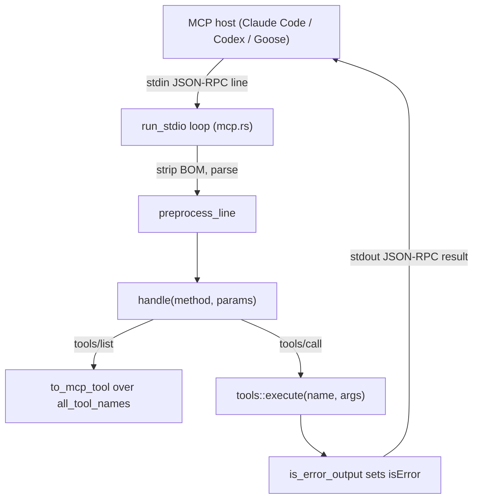

# MCP 伺服器子系統

> phantom-mesh 的模型上下文協議（Model Context Protocol，MCP）整合 — 同時涵蓋**伺服器（server）**端與**用戶端（client）**端。

## 用途（Purpose）

這個子系統讓 phantom-mesh 在 MCP 生態系（協議修訂版 `2024-11-05`）中扮演兩個互補的角色：

1. **伺服器（`phantom mcp`）** — phantom 透過 JSON-RPC 2.0 stdio（標準輸入輸出）傳輸，把自己約 40 個內建工具公開給任何 MCP host（主機，如 Claude Code、Codex、Goose……）。同一個 dispatcher（派工器）也能經由 `phantom serve` 的 `POST /mcp` endpoint（端點）透過 HTTP 取用。這讓外部 agent（代理）能像呼叫原生工具一樣呼叫 phantom 工具（`file_read`、`shell`、`web_search`、叢集工具 `phantom_swarm`……）。

2. **用戶端** — phantom 本身也能扮演 MCP *host（主機）*：它把 `agents.toml` 裡宣告的外部 MCP 伺服器以子行程（child process）的形式啟動，執行交握（handshake），並把它們的工具重新公開給 phantom 自己的 agent runtime（代理執行時），讓 LLM（大型語言模型）能像呼叫任何內建工具一樣呼叫它們。

它座落在 **agent runtime（代理執行時，負責建立 LLM 工具清單）**與 **tools registry（工具登錄表，實際的工具實作）**之間，把兩者橋接到外部的 MCP 世界。

## 關鍵檔案（Key files）

| 檔案 | 角色 |
| --- | --- |
| `core/src/mcp.rs` | 伺服器端。JSON-RPC stdio 迴圈（`run_stdio`）、方法 dispatcher（`handle`）、HTTP 入口（`handle_http`）、工具 schema（綱要）轉換（`to_mcp_tool`）、錯誤偵測（`is_error_output`）、Windows BOM（位元組順序記號）剝除（`preprocess_line`）。 |
| `core/src/mcp_client.rs` | 用戶端。`McpServerConfig`、各伺服器的 `McpClient`（spawn（啟動）＋ JSON-RPC 管線）、`McpRegistry`（多伺服器登錄表，加上前綴的 `tool_defs`/`dispatch`），以及行程層級的 `init_global`/`global` 存取器。 |
| `core/src/bin/phantom.rs` | CLI 接線。把 `mcp` 子指令路由到 `mcp::run_stdio`；在 serve/REPL 啟動時呼叫 `mcp_client::init_global`；實作 `/mcp [test NAME]` REPL 指令。 |
| `core/src/serve.rs` | 掛載 `POST /mcp`（受 HMAC 把關）並轉發到 `mcp::handle_http`。 |
| `core/src/agent.rs` | 把 `McpRegistry::tool_defs()` 接合進 LLM 的 `tools=[...]` 酬載，並把符合的呼叫經由登錄表路由回去。 |
| `core/src/tools/` | 工具登錄表（`all_tool_names`、`schema`、`execute`），由伺服器公開、並由用戶端增補。 |

## 資料流（Data flow）

### 伺服器模式（外部 host 呼叫某個 phantom 工具）

1. Host 把以換行分隔的 JSON-RPC 2.0 訊息寫入 phantom 的 **stdin（標準輸入）**；stderr（標準錯誤）保留給診斷訊息使用。
2. `preprocess_line` 修剪空白並剝除開頭的 UTF-8 BOM（Windows PowerShell 管線會發出一個）。
3. `handle` 依方法派工：`initialize`（能力交握）、`tools/list`、`tools/call`、`ping`。
4. `tools/list` 把每個內建工具加上兩個合成的叢集工具（`phantom_swarm`、`phantom_evolve_distributed`）映射成 MCP 描述子（descriptor）。
5. `tools/call` 執行 `tools::execute`；`is_error_output` 檢視結果字串，並在失敗時設定 `isError: true`。
6. 結果被當作 JSON-RPC 回應寫回 **stdout（標準輸出）**。

HTTP 變體（`serve.rs` 裡的 `POST /mcp`）跳過 stdio，直接呼叫 `handle_http`；當有設定叢集密鑰（secret）時，會置於 HMAC 認證把關之後。

### 用戶端模式（phantom 的 LLM 呼叫某個外部工具）

1. 啟動時 `init_global` 從 `agents.toml` 讀取每個 `[[mcp_servers]]` 區塊，`McpRegistry::build` 為每個項目啟動一個子行程，並執行 `initialize` 交握。
2. 每個伺服器的 `tools/list` 會被快取；工具名稱加上命名空間 `<server>_<tool>` 以避免衝突。
3. agent runtime 把 `registry.tool_defs()` 附加到 LLM 工具清單。
4. 當 LLM 選定一個工具時，`McpRegistry::dispatch` 比對最長的伺服器名稱前綴，並透過 `McpClient::call_tool` 把 `tools/call` 轉發給該子行程；不符合的名稱則回落到內建工具。
5. 錯誤會被包裝成 `[mcp:<server> error] …`，好讓模型看見失敗。

## 擴充點（Extension points）

- **為伺服器表面新增一個內建工具** — 在 `core/src/tools/` 註冊它（讓 `all_tool_names`/`schema`/`execute` 認得它）。`to_mcp_tool` 會自動把 OpenAI function-calling（函式呼叫）封套轉換成 MCP 的 `inputSchema`；不需要改動 `mcp.rs`。
- **新增一個合成／叢集工具** — 在 `handle` 的 `tools/list` 分支附加一個描述子，並在 `tools/call` 分支加一個對應的分支（參見 `phantom_swarm` / `phantom_evolve_distributed`）。
- **支援一個新的 JSON-RPC 方法** — 在 `handle` 加一個 `match` 分支；未知方法回傳 `-32601`。
- **取用一個新的外部 MCP 伺服器** — 在 `agents.toml` 加一個 `[[mcp_servers]]` 區塊（`name`、`command`、`args`、`env`）；不需改任何程式碼。
- **調整錯誤分類** — 擴充 `is_error_output` 裡的前綴清單（`Error:`、`[error]`、`[mcp:`……）。
- **傳輸層怪癖** — 針對新用戶端邊界情況的輸入正規化應放在 `preprocess_line`。

## 測試（Tests）

- `core/src/mcp.rs` 的 `#[cfg(test)] mod tests` — BOM 容忍度（`server_tolerates_utf8_bom_on_stdin`），以及「每個工具都有 MCP schema」的契約（`all_tools_have_mcp_schema`）。
- `core/src/mcp_client.rs` 的 `#[cfg(test)] mod tests` — 用戶端交握、`call_tool` 來回往返，以及針對 mock（模擬）伺服器的並行派工排序。
- `core/tests/test_security_t7b.rs` — `POST /mcp` HTTP 端點上的 HMAC 強制檢查（T13-N2）。
- `scripts/selftest.d/30-mcp.sh` — `phantom selftest` 對 stdio 交握、`tools/list` 與最低工具數量的端對端檢查（純 bash、跨平台）。
