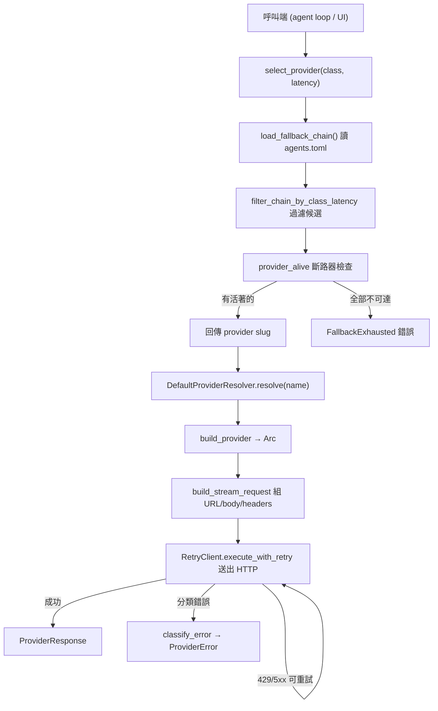

# Provider Routing（提供者路由）

## Purpose（用途）

provider-routing（提供者路由）子系統決定**哪一個 LLM（大型語言模型）後端為某個請求服務**，為該後端建構正確的 wire format（線路格式），並在某個提供者失敗時 fallback（後援轉移）到下一個候選者。它位於 agent loop（代理迴圈）與網路之間：呼叫端交給它一個邏輯請求（一個模型名稱加上一個 routing class（路由類別）），它便回傳一個可派發的具體提供者，或一個結構化錯誤。

它負責三項程式碼庫其餘部分刻意不重複實作的職責：

1. **Selection（選擇）** — 從一條有序的 fallback chain（後援鏈）中挑出一個 provider slug（提供者代號），依 routing class（路由類別，例如 `local` / `commodity` / `frontier`）與 latency budget（延遲預算）過濾，再跳過任何被 circuit breaker（斷路器）標記為失效的提供者。
2. **Adaptation（適配）** — 把統一請求轉成提供者各自的 wire shape（線路格式）。多數後端共用同一個 OpenAI-compatible（OpenAI 相容）的 `chat/completions` 主體；Anthropic（原生 `/v1/messages`，含 prompt caching（提示快取）與 adaptive thinking（自適應思考））與 Gemini 則是例外。
3. **Resilience（韌性）** — 以 exponential backoff（指數退避）加 jitter（抖動）重試暫時性失敗、遵守 `Retry-After`，並把 HTTP 回應分類成一份小而可行動的錯誤目錄。
   provider-routing 的熔斷器（circuit breaker）為 P0-5 的確定性狀態機（deterministic
   state machine）：Closed →（連續 N 次暫時性失敗）→ Open →（冷卻 cooldown 過後）→
   HalfOpen →（探測 probe 成功）→ Closed。時間經由 `crate::clock::Clock` 注入，故所有
   轉換皆可用 `MockClock` 在無真實網路、無 wall-clock sleep 下單元測試。錯誤分類
   （`classify_failure`）決定 retry / failover / abort：僅暫時性錯誤（network /
   rate-limit）計入開斷器，永久性錯誤（auth / model-not-found / context-too-long）
   直接 failover 不開斷器。實作於 `core/src/providers/circuit_breaker.rs`。

## Key files（關鍵檔案）

| File | Role |
| --- | --- |
| `core/src/providers/mod.rs` | 模組根：模型別名解析、易讀的 `display_name`，以及非同步的 `health_check` 派發器。 |
| `core/src/providers/traits.rs` | 核心 `ChatMessage` 型別、`ProviderError` 列舉，以及把 HTTP 回應對應到錯誤變體的 `classify_error(status, body)`。 |
| `core/src/providers/llm_provider.rs` | 物件安全（object-safe）的 `LlmProvider` trait，外加 `BuildRequestOpts` / `BuildRequestParts` 請求塑形型別。 |
| `core/src/providers/resolver.rs` | `DefaultProviderResolver`（設定快照 → `Arc<dyn LlmProvider>`），以及四個內建實作：Anthropic、OpenAI-compat、Gemini、Claude CLI。 |
| `core/src/providers/retry.rs` | `RetryClient` / `RetryConfig`、`compute_backoff`、`parse_retry_after`，以及 `is_retryable_status` — backoff（退避）加 jitter（抖動）的中介層（middleware）。 |
| `core/src/providers/credential_scanner.rs` | 偵測環境中存在的 API key，供探索 / onboarding（導入）使用。 |
| `core/src/providers/{ai21,cohere,fireworks,mistral,nvidia,perplexity,together,xai}.rs` | 各提供者的適配器（feature `experimental-extra-providers`）。每個各自擁有其 `PROVIDER_ID`、預設 base URL / model、auth header，以及 `health_check_with_retry`。 |
| `core/src/providers_wire.rs` | 面向 UI 的 wire contract（線路契約）：`ProviderType`、`ProviderClass`、`LatencyClass`、`FallbackChain`、wire 版 `ProviderError`，以及 `select_provider` / `complete` 路由函式。匯出 TypeScript bindings（綁定）。 |
| `app/src-tauri/src/commands/providers_wire.rs` | Tauri 命令層，把 wire 函式暴露給桌面 UI。 |
| `app/src/lib/providers.ts` | 前端客戶端：`selectProvider`、`complete`、`streamComplete`、`validateConfig`，以及錯誤描述輔助函式。 |

## Data flow（資料流程）

1. 呼叫端透過 `select_provider(class, latency)` 索取一個符合某 routing class（路由類別）與 latency budget（延遲預算）的提供者。
2. 從 `agents.toml` 載入有序的 `FallbackChain`，並過濾成符合所請求 class + latency 的 slug。
3. 每個存活下來的候選者都會對照 circuit-breaker（斷路器）做探測（`provider_alive`）；第一個活著的勝出。若沒有任何一個活著，這次呼叫便回傳 `FallbackExhausted`。
4. `DefaultProviderResolver::resolve(name)` 透過 `build_provider` 把所選條目的 `provider_type` 對應到具體的 `Arc<dyn LlmProvider>`。
5. 提供者實作把請求（`build_stream_request`）塑形成 URL、JSON 主體與 headers — Anthropic 與 Gemini 在此處分歧；其餘一切則重用 OpenAI-compatible（OpenAI 相容）路徑。
6. `RetryClient` 送出請求，以 exponential backoff（指數退避）加 jitter（抖動）重試暫時性失敗（遵守 `Retry-After`）；不可重試的回應則透過 `classify_error` 對應成 `ProviderError`。

## Extension points（擴充點）

- **新增一個提供者適配器。** 建立 `core/src/providers/<slug>.rs`，暴露 `PROVIDER_ID`、預設 base URL / model、一個 `auth_header`，以及一個 `health_check_with_retry`；在 `mod.rs` 中以 `experimental-extra-providers` 的 feature gate（功能旗標）註冊它。若它使用 OpenAI-compatible（OpenAI 相容）線路，則無需更動 resolver — `build_provider` 的 catch-all（萬用分支）已將未知型別經由 `OpenAICompatProvider` 路由。
- **新增一個品牌顯示標籤。** 擴充 `mod.rs` 中的 `display_name` match（以及 URL 子字串後援），讓 UI 顯示提供者名稱。`all_12_providers_register_at_startup` 測試固定（pin）住第一方（first-party）的集合。
- **客製化的 wire format（線路格式）。** 若某提供者需要非 OpenAI 的主體（如 Anthropic 或 Gemini），直接在 `resolver.rs` 中實作 `LlmProvider`，並在 `build_provider` 加上一個分支。
- **調校韌性。** 調整 `retry.rs` 中 `RetryConfig` 的預設值（最大重試次數、base delay（基礎延遲）、`jitter_ratio`）或 `is_retryable_status`。
- **路由策略。** 選擇邏輯位於 `providers_wire.rs` 中的 `select_provider` / `filter_chain_by_class_latency` / `provider_alive`；每次呼叫的 cost / latency / modality（成本 / 延遲 / 模態）評分在該處有文件記載，供 weighted-scoring（加權評分）擴充使用。
- **新增一個錯誤類別。** 在 `ProviderError` 加上一個變體（內部列舉在 `traits.rs`，wire 目錄則在 `providers_wire.rs`），並在 `classify_error` 中對應它。

## Tests（測試）

- **單元測試（內嵌 `#[cfg(test)]`）：** `mod.rs`（別名 / 顯示 / 錯誤分類，外加一個 wiremock 重試派發測試）、`resolver.rs`（依型別 resolve + 未知型別後援）、`retry.rs`（backoff 數學、jitter、retry-after 解析），以及 `providers_wire.rs`（fallback-chain 載入、class 過濾、存活性預設值）。
- **整合測試（`core/tests/`）：** `agent_with_resolver.rs` 與 `agent_trait_migration.rs` 從 agent loop（代理迴圈）演練 resolver；`streaming_trait_migration.rs` 涵蓋串流派發路徑；`wire_round_trip.rs` 驗證 wire 型別能乾淨地序列化 / 反序列化。
- **macOS 煙霧測試（smoke tests）：** `core/tests/providers_macos.rs` 打向每個提供者的線上端點（keys 從環境讀取；缺少時跳過），以捕捉已輪替的 keys、已搬移的端點，以及主機層級的連線問題。
- **P0-5 失效切換（failover）測試：** `core/src/providers/circuit_breaker.rs`
  內嵌單元測試（狀態轉換 + 錯誤分類，全部 `MockClock` 驅動）；
  `core/tests/provider_failover_p0_5.rs`（fixture provider 失敗 K 次後成功、
  open-after-N、half-open-after-cooldown、chain-exhaustion → FallbackExhausted）；
  `core/tests/provider_failover_live_smoke.rs`（opt-in，`SPECTYN_LIVE_SMOKE=1`，
  CI 不跑）。

> 本文件中的設定路徑使用佔位符（placeholder），例如 `agents.toml` 與 `~/.spectyn-mesh/`；請替換成你自己的安裝位置。
