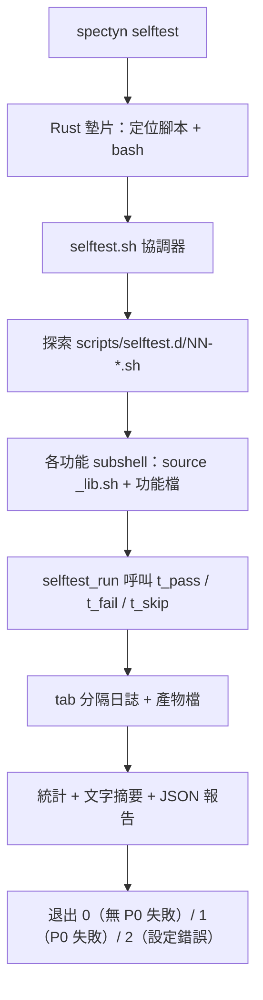

# 自我測試框架（Self-Test Harness）

## 目的（Purpose）

自我測試框架（self-test harness）是 spectyn-mesh 的端對端煙霧測試（smoke-test，基本可用性驗證）層。它會像真實使用者（或 LLM agent，大型語言模型代理）那樣操作一個*已建置*的 `spectyn` 二進位檔——執行 CLI（命令列介面）子命令、透過 HTTP 打本機 daemon（常駐服務）、驅動 TUI（終端機使用者介面）、檢查 MCP（模型上下文協議）與 cluster（叢集）RPC（遠端程序呼叫）介面——並同時輸出人類可讀的表格與機器可讀的 JSON 報告。

它刻意與 `cargo test` 分開：單元／整合測試驗證 Rust 內部實作，而自我測試框架驗證實際交付的產物及其執行時行為。每個 feature（功能）恰好擁有一個可直接放入的測試檔，因此新增一個功能等於新增一支腳本，而非編輯一份巨型檔案。

唯一的進入點是 `spectyn selftest`，這讓此框架可從人類的 shell、從 CI（持續整合），以及從 spectyn 自身（透過它的 `shell` 工具）觸達。

## 關鍵檔案（Key files）

| Path | 角色 |
| --- | --- |
| `scripts/selftest.sh` | 協調器（Orchestrator）。探索各功能檔、在隔離的 subshell（子殼層）中逐一執行、統計結果、建置 JSON 報告、依 P0 失敗設定退出碼。 |
| `scripts/selftest.d/_lib.sh` | 由協調器與每個功能檔 source（載入）的輔助函式庫。定義結果 API（`t_pass`/`t_fail`/`t_skip`/`t_run`/`t_check`）與工具函式（`t_have`、`t_http`、`t_http_json`）。 |
| `scripts/selftest.d/_template.sh` | 新增功能測試時的「複製我」起點；說明命名／排序慣例。 |
| `scripts/selftest.d/00-binary.sh` | P0 啟動引導（bootstrap）功能：二進位檔存在、`--version`/`--help` 有回應、能列出子命令。 |
| `scripts/selftest.d/10-doctor.sh`, `15-doctor-json.sh` | `spectyn doctor` 的文字 + JSON 檢查。 |
| `scripts/selftest.d/20-serve.sh`, `25-run.sh`, `30-mcp.sh` | Daemon serve、run 與 MCP 介面檢查。 |
| `scripts/selftest.d/35-tui.sh`, `36-tui-fuzz.sh`, `70-tui-double-tap.sh` | 終端機 UI 煙霧測試 + 模糊測試（fuzz） + 輸入處理檢查。 |
| `scripts/selftest.d/40-autoevolve.sh`, `45-autoevolve-queue.sh` | 自動演化（auto-evolve）流水線 + 佇列檢查。 |
| `scripts/selftest.d/50-snapshot-mac.sh`, `51-service-windows.sh` | 平台特定的整合檢查。 |
| `scripts/selftest.d/55-cluster-rpc.sh` | 多 peer（節點）叢集 RPC 行為。 |
| `scripts/selftest.d/60-cargo-test.sh` | P2 包裝器，執行工作區（workspace）的 `cargo test` 測試套件。 |
| `scripts/selftest.d/65-permission-dsl.sh`, `85-digest.sh`, `90-ecosystem.sh`, `95-projects-dashboard.sh` | 權限 DSL（領域特定語言）、摘要（digest）、生態系（ecosystem）與儀表板（dashboard）功能檢查。 |
| `core/src/bin/spectyn.rs` | `spectyn selftest` 的 Rust 墊片（shim）（`run_selftest`、`locate_selftest_script`、`find_bash`）。定位 `scripts/selftest.sh`、找到可用的 bash，並 exec（執行）它。 |

## 資料流（Data flow）

1. 呼叫者執行 `spectyn selftest [flags]`。Rust 墊片（`core/src/bin/spectyn.rs` 中的
   `run_selftest`）會定位 `scripts/selftest.sh`——依序檢查
   `$SPECTYN_SELFTEST_SCRIPT`、目前目錄、上層目錄、可執行檔所在目錄，以及
   `~/.spectyn-mesh/scripts/`——找到一個 bash 直譯器，並 exec 協調器、轉送所有旗標。
2. `selftest.sh` 解析出 `spectyn` 二進位檔（`$SPECTYN_BIN` 或 PATH），在
   `test-results/selftest-<timestamp>/` 底下建立暫存目錄與保留產物目錄
   （修剪至最近 10 次執行），並 source `_lib.sh`。
3. 它透過對 `scripts/selftest.d/[0-9]*.sh` 做 glob（萬用字元比對）並依其數字前綴排序來探索功能檔，再套用任何 `--feature` / `--p0-only` 過濾條件。
4. 每個功能在自己的 subshell 中執行，該 subshell 會 source `_lib.sh` 與該功能檔。
   協調器讀取 `selftest_feature_meta`，必要時呼叫
   `selftest_requires` 以在前置條件未滿足時跳過，然後呼叫 `selftest_run`。
5. 在 `selftest_run` 內，功能透過 `t_*` 輔助函式記錄每一項檢查，
   這些函式會把一列以 tab 分隔的資料（`feature  status  name  detail  repro  artifact`）
   附加到共享日誌，並把完整的 stdout/stderr 擷取到每項檢查各自的產物檔。
6. 所有功能結束後，協調器統計 pass/fail/skip、印出
   摘要（或以 `--json` 抑制摘要），並建置 JSON 報告——在
   `python3` 可用時使用它，否則改用純 bash 的建置器以支援沒有 Python 的環境。
7. 退出碼：無 P0 功能失敗時為 `0`，有 P0 檢查失敗時為 `1`，
   協調器／設定錯誤時為 `2`。



## 擴充點（Extension points）

- **新增功能測試。** 把 `scripts/selftest.d/_template.sh` 複製成
  `scripts/selftest.d/<NN>-<feature-name>.sh`。數字前綴決定執行順序
  （00–09 啟動引導、10–29 核心 CLI、30–49 網路介面、50–69 整合、
  70+ 選用／昂貴）。不需編輯任何登錄表——探索是靠 glob。
- **必備函式。** 每個檔都必須定義 `selftest_feature_meta`（至少印出
  `name`、`priority`（值為 `P0`/`P1`/`P2`）、`requires` 與 `description`；
  選用的 `hints` 列出當功能壞掉時 agent 應 grep（搜尋）的原始碼路徑）以及
  `selftest_run`（實際的檢查）。
- **僅透過輔助函式記錄結果。** 在 `selftest_run` 內，使用 `t_pass`、
  `t_fail`、`t_skip`、`t_run`（對 argv 命令自動判定 pass/fail）或 `t_check`
  （對 shell 字串命令自動判定 pass/fail）。切勿直接 `echo PASS`——
  協調器會剖析結構化日誌。要替手動的
  `t_pass`/`t_fail` 附加重現步驟（repro）／產物，請在呼叫前緊接著設定 `T_REPRO` / `T_ARTIFACT`。
- **為功能加上閘門（gate）。** 定義一個選用的 `selftest_requires`，以非零退出碼搭配
  一行 stderr 原因來跳過整個功能（例如 daemon 未執行、無
  模型檔、無可觸達的 peer）。
- **審慎選擇優先級。** 只有 P0 失敗會翻轉退出碼，所以
  應阻擋交付的功能設為 P0；預期內但不阻擋交付的設為 P1；
  錦上添花或昂貴的（如 `60-cargo-test.sh`）設為 P2。

## 測試（Tests）

自我測試的功能檔*就是*此框架的測試——它們位於
`scripts/selftest.d/`。協調器本身沒有獨立的測試套件；
每次框架執行時它都會被驗證一次。

執行此框架的方式：

```bash
spectyn selftest                 # 所有功能，文字表格
spectyn selftest --json          # 在 stdout 輸出機器可讀的 JSON
spectyn selftest --p0-only       # 只跑阻擋交付的檢查
spectyn selftest --feature serve # 單一功能
spectyn selftest --list          # 列出已登錄的功能
```

每次執行的產物（每項檢查的 stdout/stderr 與重現命令）會保留在
`test-results/selftest-<timestamp>/` 底下，供事後（post-mortem）檢視。
`60-cargo-test.sh` 功能會橋接到 `core/tests/` 底下的 Rust 工作區測試。
面向使用者的指南請見 `docs/SELFTEST.md`。
