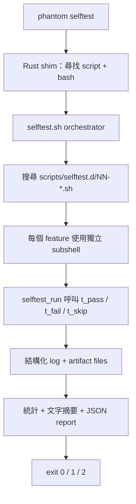

# Self-Test Harness

[English version](selftest-harness.md)

## 用途

Self-test harness 是 phantom-mesh 的端對端 smoke-test 層。它會以真實使用者
或 LLM agent 的方式操作已 build 的 `phantom` binary：執行 CLI subcommands、
透過 HTTP 呼叫 local daemon、操作 TUI、檢查 MCP 與 cluster RPC，最後輸出
人類可讀表格與 machine-readable JSON report。

它刻意與 `cargo test` 分開。Unit 與 integration tests 驗證 Rust 內部邏輯；
self-test harness 驗證實際出貨 artifact 與 runtime 行為。每個 feature 都有
獨立 script，新增功能時只要新增一個檔案，不需要修改單一大型腳本。

唯一入口是：

```bash
phantom selftest
```

## 重要檔案

| 路徑 | 用途 |
|---|---|
| `scripts/selftest.sh` | Orchestrator：搜尋 feature files、隔離執行、統計結果、產生 JSON、依 P0 failures 決定 exit code |
| `scripts/selftest.d/_lib.sh` | Helpers：`t_pass`、`t_fail`、`t_skip`、`t_run`、`t_check`、`t_have`、`t_http`、`t_http_json` |
| `scripts/selftest.d/_template.sh` | 新增 feature test 的範本 |
| `scripts/selftest.d/00-binary.sh` | P0 bootstrap：binary、`--version`、`--help`、subcommands |
| `scripts/selftest.d/10-doctor.sh`, `15-doctor-json.sh` | `phantom doctor` text 與 JSON |
| `scripts/selftest.d/20-serve.sh`, `25-run.sh`, `30-mcp.sh` | Daemon、run、MCP |
| `scripts/selftest.d/35-tui.sh`, `36-tui-fuzz.sh`, `70-tui-double-tap.sh` | TUI smoke、fuzz、input handling |
| `scripts/selftest.d/40-autoevolve.sh`, `45-autoevolve-queue.sh` | Auto-evolve pipeline 與 queue |
| `scripts/selftest.d/50-snapshot-mac.sh`, `51-service-windows.sh` | 平台專用 integration |
| `scripts/selftest.d/55-cluster-rpc.sh` | Multi-peer cluster RPC |
| `scripts/selftest.d/60-cargo-test.sh` | 執行 workspace `cargo test` 的 P2 wrapper |
| `core/src/bin/phantom.rs` | `phantom selftest` Rust shim |

## 資料流程

1. 使用者執行 `phantom selftest [flags]`。
2. Rust shim 尋找 `scripts/selftest.sh` 與可用 bash，轉送全部 flags。
3. `selftest.sh` 找到 binary、建立 temp dir 與
   `test-results/selftest-<timestamp>/` artifacts 目錄，只保留最近 10 次。
4. Script 依數字 prefix 搜尋 `scripts/selftest.d/[0-9]*.sh`，套用
   `--feature` 或 `--p0-only` filter。
5. 每個 feature 在獨立 subshell 內執行，透過 `t_*` helpers 寫入結構化 log。
6. Orchestrator 統計 pass、fail、skip，輸出 summary 與 JSON report。
7. 沒有 P0 failure 時 exit `0`；P0 failure 時 exit `1`；setup error 時 exit `2`。



## 擴充方式

- 複製 `_template.sh` 為 `scripts/selftest.d/<NN>-<feature-name>.sh`。
- 每個檔案必須定義 `selftest_feature_meta` 與 `selftest_run`。
- 結果只能透過 `t_pass`、`t_fail`、`t_skip`、`t_run`、`t_check` 記錄。
- 可選擇定義 `selftest_requires`，在缺少 daemon、model 或 peer 時 skip。
- P0 failure 會阻擋 shipping；P1 不阻擋；P2 適合昂貴或 nice-to-have 測試。

## 執行

```bash
phantom selftest
phantom selftest --json
phantom selftest --p0-only
phantom selftest --feature serve
phantom selftest --list
```

每次執行的 stdout、stderr、repro commands 會保留在
`test-results/selftest-<timestamp>/`。

