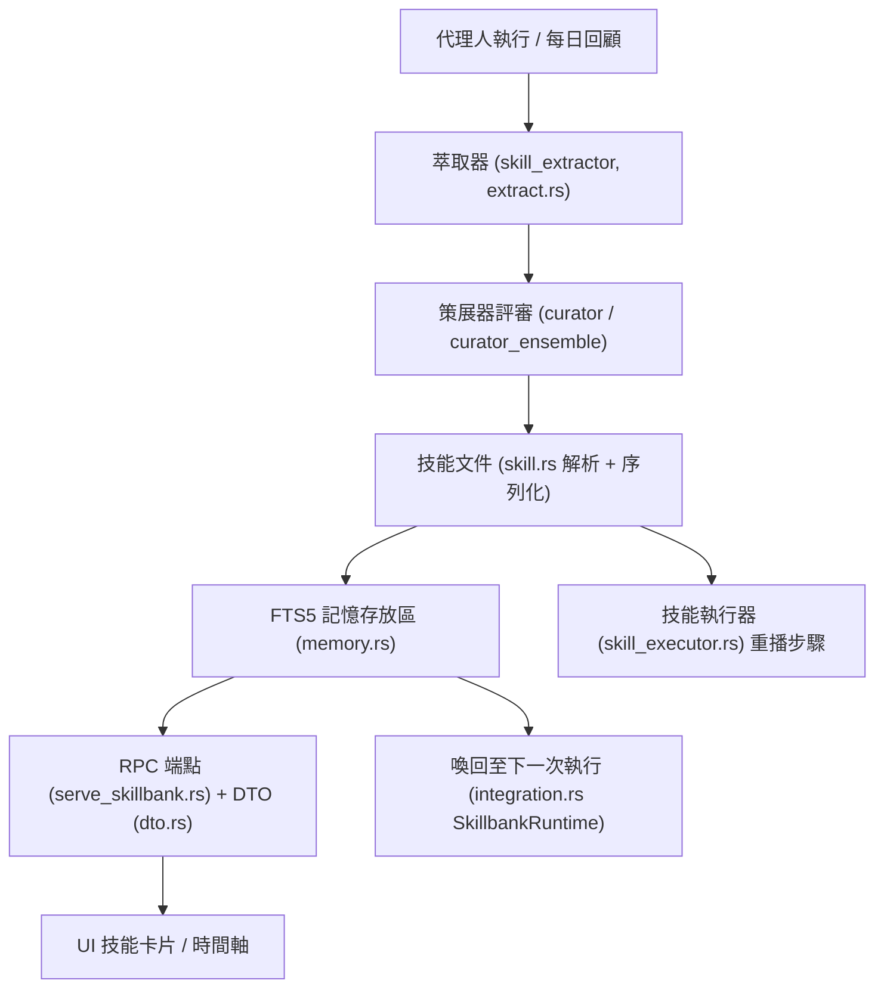

# Skill Bank

## 目的（Purpose）

技能庫（skill bank）子系統是 spectyn-mesh 的 **技能自我演化迴圈（skill self-evolution loop）**：它
把代理人（agent）自己的工作轉化為可重複使用、可被喚回的知識。在一個工作階段（session）中，
代理人會產生 evolve 檢查點（checkpoint）與每日回顧（daily review）；策展器（curator）評斷這些
結果、將其萃取（distil）為結構化的 **技能文件（Skill Documents）**、存入一個
可全文檢索（full-text-searchable）的記憶庫（memory bank），並將它們再度浮現給未來的執行使用。

它實作了一條六步驟流水線（pipeline）—— **judge → extract → store → recall → apply →
measure**。大部分的程式碼位於 `core/src/skillbank/` 之下，並以
`experimental-curator` / `-memory` / `-tools` cargo features（功能開關）封閉，因此預設的 `cargo build` 不會包含
任何額外程式碼（模組路徑（module path）一律可解析；只有子模組（submodule）被封閉）。

有兩個部分是生產環境預設（無 feature gate）：每日回顧技能
萃取器（extractor），以及桌面/行動裝置 UI 所綁定的 SPEC-25 線路型別（wire types）。

## 關鍵檔案（Key files）

| 檔案 | 角色 |
|------|------|
| `core/src/skillbank/mod.rs` | 模組根（Module root）；對子模組做 feature-gate 並 re-export。 |
| `core/src/skillbank/skill.rs` | 技能文件（Skill Document）的解析器/序列化器（YAML frontmatter + Markdown 內文，無損來回轉換）。 |
| `core/src/skillbank/skill_executor.rs` | 將技能文件內文作為一連串扁平的 `Bash` / `Note` / `Prompt` 步驟執行。 |
| `core/src/skillbank/curator.rs` | V1 策展器（Curator）：單一 LLM-as-judge（以大型語言模型為評審），依固定評分準則（rubric）評斷 evolve 檢查點。 |
| `core/src/skillbank/curator_ensemble.rs` | V2 策展器：N 個並行評審，採中位數（median）+ 標準差（stddev）彙整，對歧異標記為需人工審查。 |
| `core/src/skillbank/extract.rs` | 將評審裁決（verdict）轉成候選技能文件（成功側與失敗側的萃取器）。 |
| `core/src/skillbank/memory.rs` | 以 SQLite FTS5 為後盾的長期記憶存放區（`SkillMemory`、`MemoryRow`）。 |
| `core/src/skillbank/dto.rs` | 給 UI 使用的扁平 JSON DTO，供技能 list/detail/timeline 端點（endpoint）使用。 |
| `core/src/skillbank/integration.rs` | `SkillbankRuntime` 門面（façade），將 curator + skill + memory + tools 接線成單一執行環境（runtime）。 |
| `core/src/skillbank/skill_extractor/mod.rs` | 生產環境預設的萃取器框架（`SkillCandidate`、`Provenance`）。 |
| `core/src/skillbank/skill_extractor/from_daily_review.rs` | 第一個萃取器輸入：把每日回顧的 Markdown 簡報（brief）解析成候選項。 |
| `core/src/skillbank/tools/mod.rs` | 工具目錄（catalog）（`SkillTool` trait + `catalog()`，回傳約 32 個慣用的 Rust 工具）。 |
| `core/src/skillbank/tools/*.rs` | 個別工具（calculator、datetime、regex_extract、json_query、jq、hash、diff……）。 |
| `core/src/serve_skillbank.rs` | HTTP RPC：三條 `GET /api/skills*` 路由，位於 cluster-auth 閘門（gate）之後。 |
| `core/src/skill_wire.rs` | SPEC-25 線路型別（wire types）—— 六步驟迴圈的單一真實來源（single source of truth）；TS bindings 匯出至應用程式。 |
| `core/migrations/0007_hermes_fts5.sql` | 記憶存放區的標準（canonical）FTS5 結構描述（schema）。（遷移檔名為帳本不可變，故保留原名。） |
| `docs/skills/` | 範例技能文件（例如 `sample-skill.md`）與結構描述參考。 |

## 資料流（Data flow）

1. **Extract（萃取）** — 一個 evolve 檢查點或一份每日回顧簡報被解析成
   `SkillCandidate` / 候選 `SkillDocument`。成功的執行成為「可重複使用的
   配方（recipes）」；失敗則成為「經驗教訓（lessons learned）」。
2. **Judge（評斷）** — 策展器依固定評分準則為來源評分。V2
   ensemble（集成）會跑多個評審並以中位數彙整，將高
   變異（variance）標記為需人工審查。
3. **Store（儲存）** — 被接受的技能寫入 FTS5 記憶存放區，以
   session/source 為鍵（key）並附帶標籤（tag）。
4. **Recall（喚回）** — 後續的執行會向存放區查詢（BM25 關鍵字搜尋）與當前
   意圖相關的技能；`SkillbankRuntime` 會預先植入（pre-seed）工具目錄。
5. **Apply（套用）** — 被喚回的技能注入該次執行；`SkillExecutor` 可
   直接重播技能文件的步驟。
6. **Serve/measure（提供/量測）** — RPC 路由與扁平 DTO 將技能庫公開給
   桌面/行動裝置 UI，以便長期檢視。

## 擴充點（Extension points）

- **新增萃取器輸入** — 在
  `core/src/skillbank/skill_extractor/` 之下放入一個子模組，讓它輸出共用的 `SkillCandidate`
  形狀（原始對話與事件叢集（event clusters）是預期的下一批輸入）。
- **新增工具** — 建立 `core/src/skillbank/tools/<name>.rs`，實作
  `SkillTool` trait，然後在 `tools/mod.rs` 的 `catalog()` 中註冊它。每個
  工具至少附帶一個單元測試。
- **新增評審後端** — 在 `curator_ensemble.rs` 中實作 `JudgeProvider`
  trait（既有實作：`AnthropicJudge`、`OpenAICompatJudge`）。
- **演化評分準則** — 每當提示詞（prompt）或評分尺度的變更會使舊裁決失效時，
  就把 `curator.rs` 中的 `RUBRIC_VERSION` 往上加。
- **變更技能結構描述** — 更新 `skill.rs` 中的 frontmatter 結構（struct）與
  `docs/` 之下的結構描述參考；來回轉換測試（round-trip test）會守護無損性（losslessness）。
- **擴充 RPC/UI 介面** — 在 `dto.rs` 新增 DTO 形狀、在
  `serve_skillbank.rs` 新增路由（重用既有的 cluster-auth middleware（中介層））。

所有實驗性部分皆由 `experimental-curator`、
`experimental-memory` 與 `experimental-tools` 封閉（umbrella feature（總開關功能）`experimental-skillbank` 會一次啟用全部
三者）。整合門面（integration façade）需要三者同時啟用。

## 測試（Tests）

- **內嵌單元測試（Inline unit tests）** 幾乎存在於每個模組：`skill.rs`（解析 +
  來回轉換 + JSON-schema 驗證）、`extract.rs`、`skill_executor.rs`、
  `curator.rs`、`curator_ensemble.rs`、`memory.rs`、`dto.rs`、
  `integration.rs`、`from_daily_review.rs`，以及 `tools/` 之下的每個工具。
- **整合測試（Integration tests）** 位於 `core/tests/`：
  - `core/tests/curator_v2_integration.rs` — ensemble 評審的端對端（end-to-end）測試。
  - `core/tests/skill_rpc_skills.rs` — `/api/skills*` 路由，
    包含一個跨 1000 筆種子資料列、500ms 的效能閘門（perf gate）。
- `core/src/skill_wire.rs` 為 SPEC-25 線路型別攜帶自己的內嵌測試套件。

Feature-gated（功能封閉）的測試必須以對應的 feature 執行，例如
`cargo test -p spectyn-core --features experimental-skillbank`。
