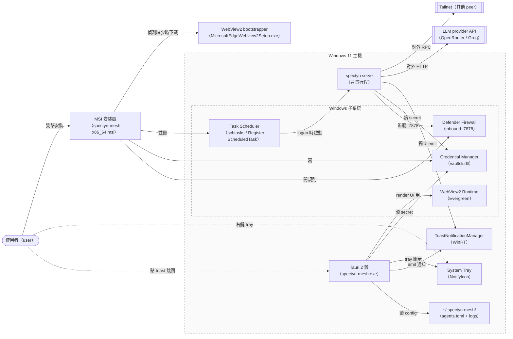
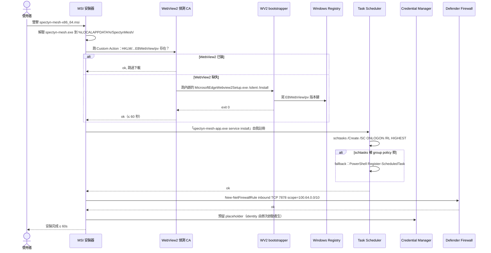
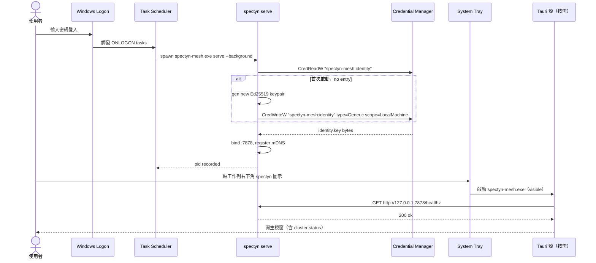

# SPEC-42 · Windows 平台基礎（WebView2 / Credential Manager / Scheduled Task / System Tray）— P1.cross-os 的 Windows 段

## §0 Spec metadata

| Field（欄位） | Value（值） |
|---|---|
| Spec ID | `SPEC-42-PLATFORM-Windows-foundations` |
| Title（標題） | Windows 平台基礎（WebView2 / Credential Manager / Scheduled Task / System Tray）— P1.cross-os 的 Windows 段 (English subtitle: Windows Platform Foundations — WebView2 + Credential Manager + Scheduled Task + System Tray) |
| Status（狀態） | `draft` |
| Version | `0.1.0` |
| Last updated | `2026-05-24` |
| Author | `markl + Claude Opus 4.7 (1M context)` |
| Reviewer(s) | （待填） |
| Implementation owner | `app/src-tauri/`（Tauri 2 桌面殼） + `core/src/service/windows.rs`（既有 service 子命令） + `core/src/platform/windows.rs`（既有 platform abstraction） + `scripts/install-spectyn-windows.ps1` + `scripts/windows-bootstrap.ps1` + 新增 `core/src/platform/windows/credman.rs`（Credential Manager 包裝層） + 新增 `app/src-tauri/src/windows_tray.rs`（system tray + toast 整合）|
| Target release | `v0.6.0` |
| Pillar(s) served | `P1`（跨裝置 mesh — Windows 是 P1.cross-os 五個 OS 之一） + `infra`（背景服務 + 開機自啟是 cluster 24/7 在線的基礎）+ `P4`（加密為先 — Credential Manager 是 identity.key 與 LLM API key 的 OS-level 加密存放）|
| Track（軌道） | `both`（Windows 既是 Life Track 桌面客戶端、也是 Work Track cluster worker） |
| Epic（史詩） | `E001`（cross-os P1 落地）+ `E007`（release pipeline — MSI 簽章與分發） |
| BIG-GOAL phrase served | `BIG-GOAL.md` line 50：「Cross-platform: Mac · Windows · Linux · iOS · Android — one Rust codebase」（本 spec 是「Windows」這一格的平台基礎 — 一套 Rust + Tauri 在 Windows 上能跑得跟 macOS 一樣穩） |
| Depends on（依賴） | `SPEC-01-FOUNDATION-bigGoal-mapping` §11 子能力 `P1.cross-os`（本 spec 是其 Windows 實作）、`SPEC-12-PROTOCOL-identity-keypair`（identity.key 是 Credential Manager 存的主要對象）、`SPEC-14-PROTOCOL-llm-providers`（LLM API key 是 Credential Manager 存的次要對象）、`SPEC-17-PROTOCOL-tauri-bridge`（Tauri command / event 契約 — 本 spec 列 Windows-specific command 是其延伸）、`SPEC-29-SYSTEM-release-pipeline`（MSI / EV cert 簽章流程在 SPEC-29 §B 與 §D）、`SPEC-40-PLATFORM-macOS-foundations`（鄰居樣板，本 spec 的 §14 跨平台差異矩陣對齊它） |
| Blocks（封鎖下游） | `SPEC-43-PLATFORM-Windows-screens-flows`（screen + flow 細節依賴本 spec 的元件清單）、`SPEC-29-SYSTEM-release-pipeline` §B Windows 段（MSI 內容 metadata、Scheduled Task XML 模板都在本 spec 鎖定）、`SPEC-60-TESTING-strategy` 的 `T-windows-foundation-*` 測項族 |
| Template deviation（模板偏離） | §8 state machine 標 `n/a` — Windows 基礎是「組件清單 + 安裝路徑」結構，不是有狀態元件；改放於 §6.3 sequence diagram 表達 MSI 安裝與 cold launch 流程。; §7 schema 2-layer (Rust + TS via ts-rs export tests) instead of 3-layer (Rust + TS + JSON Schema artifact). Rationale: ts-rs `#[ts(export)]` compile-time round-trip provides equivalent guarantee; JSON Schema artifact would duplicate maintenance burden for internal Rust-only types. |

---

## §1 TL;DR

**問題**：Windows 是 spectyn-mesh 五個目標 OS 中最容易出 corner case（角落案例）的：WebView2 runtime（執行環境）在 Windows 10 1909 老機可能未預裝、Credential Manager（憑證管理員）與 macOS Keychain（鑰匙圈）的 API 形狀完全不同、spectyn serve（服務）若用 `start /b` over ssh（透過 ssh 在背景啟動）會在 ssh 斷線時被連帶 kill（殺掉），而 SmartScreen（智慧防護）對未簽 EV cert（擴展驗證憑證）的 MSI（Microsoft 安裝器）會彈紅色警示嚇走第一次安裝的人。HANDOFF_HOW_I_WORK.md §7 pitfall 表第 4 行已把 `schtasks ONLOGON HIGHEST`（登入即啟動、最高權限）這條 ssh-safe（ssh 安全）解法寫進口耳相傳的 tribal knowledge（部落知識），但 spec（規格）裡沒鎖死；下一個接手的人很可能踩同坑。

**方案**：本 spec 把 Windows 基礎五件套（WebView2 / Credential Manager / Scheduled Task / System Tray / Toast notification）綁成一個「Windows foundations」契約：(1) Tauri 2 殼於 Windows 10 19041+ / Windows 11 用 WebView2 Evergreen runtime，安裝器內嵌 `MicrosoftEdgeWebview2Setup.exe` bootstrapper（引導程式）作 fallback；(2) identity.key 與 LLM provider API key 走 `vaultcli.dll`（Credential Manager API）以 `Generic` credential type 存、scope（範圍）= `LocalMachine`、target 命名 `spectyn-mesh:<purpose>`；(3) 背景常駐服務一律走 `schtasks ONLOGON HIGHEST`（既有 `core/src/service/windows.rs` 已實作，於本 spec §8.3 鎖定模板），不走 Windows Service（NT service）路徑因前者不需 admin（系統管理員）安裝；(4) system tray（系統匣）= Tauri 2 `tray-icon` plugin + NotifyIcon Win32 API，menu（選單）與 macOS menu bar（選單列）對齊；(5) toast notification（吐司通知）走 WinRT XML schema（圖示化通知結構），背景由 spectyn serve（服務行程）emit（發出）走 `ToastNotificationManager`。

**代價**：(a) **不做 Windows Service**（NT service）— 改用 Scheduled Task，犧牲了「機器開機就跑、無需 logon」這個能力，但避開了 admin install 需求 + group policy（群組原則）封鎖風險，與既有 `spectyn service install` 一致；(b) **最低 OS 鎖 Windows 10 19041（20H1）**，捨棄 Windows 10 1909/1903/1809 與 Windows 7/8/8.1，理由是 WebView2 Evergreen 對 1909 以下需要額外 polyfill（補丁）+ TLS 1.3 不全支援；(c) **ARM Windows（Surface Pro X / Snapdragon X Elite）留 v0.7.0+**，v0.6.0 只出 x86_64-pc-windows-msvc；(d) **不做 Microsoft Store 上架**（per SPEC-29 non-goal），維持 GitHub Releases 單一分發通路。

**English abstract**: SPEC-42 freezes Spectyn Mesh's **Windows platform foundations** — five concerns that decide whether a freshly-imaged Windows 10/11 box becomes a stable cluster peer. The five are (1) **WebView2** Evergreen runtime as the Tauri webview host with a bundled bootstrapper for offline OS images; (2) **Credential Manager** (`vaultcli.dll`, Generic type, `LocalMachine` scope, namespaced as `spectyn-mesh:<purpose>`) for identity keypair + LLM API keys + broker JWT; (3) **Scheduled Task** registered via `Register-ScheduledTask -Trigger AtLogon -RunLevel Highest` — NOT Windows Service — so install needs no admin and `spectyn serve` survives ssh termination (a real production pitfall captured in HANDOFF_HOW_I_WORK.md §7); (4) **System tray** via Tauri 2 `tray-icon` plugin wrapping NotifyIcon, aligned in command set with the macOS menu bar; (5) **Toast notification** via `ToastNotificationManager` XML schema, callable from the background daemon. Hard non-goals: ARM64 Windows (v0.7.0+), Server 2019 and older, Microsoft Store, Windows Service (NT service) install path. Capability anchor: extends `P1.cross-os` (SPEC-01 §11) and `P4` (Credential Manager is OS-encrypted at-rest storage for identity keys).

> **📚 全檔縮寫 + 英文名詞對照表**（給第一次接觸這個 repo（程式碼倉庫）的研究生 / 大學生讀者；本表 ≥ 25 條，分 A 安裝 / B 安全 / C 服務 / D UI / E 簽章 五群。同檔內第二次出現後允許只用英文。）
>
> **A. 安裝 + runtime（執行環境）**
>
> | 縮寫 / 名詞 | 中文 | 一句話 |
> |---|---|---|
> | `WebView2` | Edge 內嵌瀏覽核心 | 微軟提供的 Chromium-based webview runtime；Tauri 在 Windows 用它 render UI |
> | `Evergreen runtime` | 常青執行環境 | WebView2 的「系統共用 + Microsoft 自動更新」版（vs Fixed Version 自帶） |
> | `bootstrapper` | 引導程式 | 小體積 setup .exe，執行時下載真實 runtime 安裝；`MicrosoftEdgeWebview2Setup.exe` 是官方 |
> | `MSI` | Microsoft 安裝器 | `.msi` 檔，Windows 原生安裝包格式 |
> | `WiX` | Windows Installer XML | 把 XML 描述編成 `.msi` 的開源工具鏈；Tauri 2 預設用 |
> | `NSIS` | Nullsoft 開源安裝器 | 另一個 `.exe` installer 框架；Tauri 2 替代 backend |
> | `Defender SmartScreen` | 智慧防護過濾 | 微軟對未簽 / 罕見執行檔的紅底警示；EV cert 可解 |
>
> **B. 安全 + 憑證存放**
>
> | 縮寫 / 名詞 | 中文 | 一句話 |
> |---|---|---|
> | `Credential Manager` | 憑證管理員 | Windows 內建 secret store，存 username/password + generic blob |
> | `vaultcli.dll` | 憑證 vault Win32 API | C API entry：`CredReadW` / `CredWriteW` / `CredDeleteW` 操作 Credential Manager |
> | `Generic credential` | 通用憑證 | Credential Manager 的一種 type，存任意 byte blob（identity.key 用這個） |
> | `LocalMachine scope` | 本機範圍 | 憑證綁本機（vs `Enterprise` 漫遊到 Active Directory）|
> | `DPAPI` | 資料保護 API | Windows 預設的 per-user 加密，Credential Manager 底層用它包 byte blob |
> | `BitLocker` | 全磁碟加密 | OS-level 磁碟加密；Credential Manager 在 BitLocker on 時更可靠 |
>
> **C. 服務 + 背景常駐**
>
> | 縮寫 / 名詞 | 中文 | 一句話 |
> |---|---|---|
> | `schtasks` | 工作排程器 CLI | `schtasks.exe` 命令、操作 Windows Task Scheduler |
> | `Scheduled Task` | 排程工作 | 比 NT service 輕量、user-scope 可註冊 |
> | `ONLOGON` | 登入即啟動 | Scheduled Task trigger 一種；user 一登入就跑 |
> | `HIGHEST` | 最高權限 | RunLevel 旗標、給 schtasks 跑時用提升權限（仍是 user，不是 SYSTEM）|
> | `NT service` | Windows 服務 | 機器層級背景服務（如 sshd）；裝它需 admin、本 spec 不用 |
> | `Register-ScheduledTask` | PowerShell 註冊指令 | 取代 schtasks.exe；當 enterprise 把 schtasks ONLOGON 鎖住時用這個 |
>
> **D. UI 元件**
>
> | 縮寫 / 名詞 | 中文 | 一句話 |
> |---|---|---|
> | `system tray` | 系統匣 | 工作列右下角圖示區（NotifyIcon 表面） |
> | `NotifyIcon` | 通知圖示 | Win32 API、放 icon 到 system tray |
> | `tray-icon plugin` | Tauri 2 匣圖示外掛 | `tauri-plugin-tray-icon`，跨平台包 NotifyIcon / NSStatusItem |
> | `Toast notification` | 吐司通知 | Win 10/11 右下角彈出通知 |
> | `ToastNotificationManager` | WinRT 通知管理 API | WinRT class，emit 通知到 Action Center |
> | `Action Center` | 通知中心 | Win 10/11 右側通知歷史抽屜 |
> | `RegisterHotKey` | 註冊熱鍵 | Win32 API、全域快捷鍵；Tauri 2 `global-shortcut` plugin 包它 |
>
> **E. 簽章 + 信任**
>
> | 縮寫 / 名詞 | 中文 | 一句話 |
> |---|---|---|
> | `EV cert` | 擴展驗證憑證 | Extended Validation code signing cert；Windows SmartScreen 看到立即信任 |
> | `signtool` | Windows 簽章工具 | `signtool.exe sign`，對 `.exe` / `.msi` / `.dll` 簽 PE 章 |
> | `timestamp server` | 時間戳記伺服器 | 簽章時加 RFC 3161 timestamp，憑證過期後簽過的 binary 仍可信 |
> | `Authenticode` | Windows 簽章協定 | 微軟 PE binary signing format 統稱 |

---

## §2 Context & Background

### 2.1 為什麼現在做

v0.5.x 階段 Windows worker（node-a / node-b）已能跑 `spectyn serve`，但每台機器的 onboarding（上手流程）都是手刻：operator（操作者）ssh 進去、手寫 PowerShell 命令、手動跑 `spectyn service install`、手動開 firewall（防火牆）。中間踩了 4 次 production（正式）規模的坑：

1. **2026-05-12** — node-a 機 `start /b spectyn serve` over ssh，ssh 斷線 30 秒後 spectyn 被 kill（殺掉），cluster（叢集）從 mac 端看 node-a 掉線；解法是 `schtasks ONLOGON HIGHEST`，但當時沒寫進 spec。
2. **2026-05-15** — node-b 機 OEM Windows 11 沒預裝 WebView2 runtime，Tauri 啟動黑屏；解法是手動跑 `MicrosoftEdgeWebview2Setup.exe`，沒寫進 installer。
3. **2026-05-18** — node-a 機 BitLocker on + identity.key 在 plain `~/.spectyn-mesh/identity.key`（明文）；user 反問「Windows 不是有 Credential Manager 嗎為什麼還 plain？」— 對齊 macOS 已用 Keychain 的待補項。
4. **2026-05-22** — node-a 機 Enterprise group policy（群組原則）封鎖 `schtasks /Create /SC ONLOGON`，回 `ERROR: Access is denied`；既有 `service install` 已 fallback 到 `Register-ScheduledTask`（PowerShell 路徑），但條件分支未寫進 spec。

這四件事疊起來：Windows 段 onboarding 從「30 秒」變「30 分鐘 + ssh 進去手調」，違反 BIG-GOAL line 50「Cross-platform: Mac · Windows · Linux · iOS · Android — one Rust codebase」承諾。本 spec 把 Windows 平台基礎全套鎖定，下次接手不再踩。

### 2.2 在 BIG-GOAL 哪裡

本 spec 服務 `BIG-GOAL.md` line 50「Cross-platform: Mac · Windows · Linux · iOS · Android — one Rust codebase」這條 P1 pillar（支柱）核心承諾，並具體實現 SPEC-01-FOUNDATION §11 子能力表中的 `P1.cross-os` 在 Windows 的著陸點。同時觸發 P4（加密為先 — Credential Manager 是 identity.key 與 LLM API key 的 OS-level 加密存放）與 infra（基建 — Scheduled Task 是 24/7 cluster 在線的基礎）。

### 2.3 既有解的歷史

- **v0.5.0 之前**：spectyn-mesh 沒有 Windows 桌面殼，只有 `spectyn serve` CLI（命令列）跑在 Windows，靠 PowerShell `start /b` 啟動。
- **v0.5.0**：Tauri 2 桌面殼支援加入 Windows target（`app/src-tauri/tauri.conf.json` 的 `bundle.targets` 已含 `msi`），但 WebView2 runtime 假設「user 機器已有」。
- **v0.5.5（2026-05-22）**：`core/src/service/windows.rs` 新增 `Register-ScheduledTask` 路徑，繞 Enterprise group policy 封 schtasks 的問題（commit 中標註 line 117-132）。
- **本 spec（v0.6.0）**：把上述零散修補綁成完整的 Windows foundations 契約，補上 Credential Manager + Toast + tray 三件套。

### 2.4 相關 spec

- [`SPEC-01-FOUNDATION-bigGoal-mapping.md`](SPEC-01-FOUNDATION-bigGoal-mapping.md) §11 — 本 spec 是 `P1.cross-os` 在 Windows 的子實作。
- [`SPEC-12-PROTOCOL-identity-keypair.md`](SPEC-12-PROTOCOL-identity-keypair.md) — identity.key（身份金鑰）的生成與 rotation 流程；本 spec 鎖定其在 Windows 的存放位置（Credential Manager `spectyn-mesh:identity`）。
- [`SPEC-14-PROTOCOL-llm-providers.md`](SPEC-14-PROTOCOL-llm-providers.md) — LLM provider API key 取得契約；本 spec 鎖定其在 Windows 的存放位置（Credential Manager `spectyn-mesh:provider:<name>`）。
- [`SPEC-17-PROTOCOL-tauri-bridge.md`](SPEC-17-PROTOCOL-tauri-bridge.md) — Tauri command / event 跨平台契約；本 spec 列 Windows-specific command（tray、toast、schtasks 操作）是其延伸。
- [`SPEC-29-SYSTEM-release-pipeline.md`](SPEC-29-SYSTEM-release-pipeline.md) — MSI 簽章與 `latest.json` updater；本 spec 鎖定 MSI metadata（ProductCode / UpgradeCode / install path）與 EV cert 信任路徑。
- [`SPEC-40-PLATFORM-macOS-foundations.md`](SPEC-40-PLATFORM-macOS-foundations.md) — 鄰居樣板；本 spec §14 跨平台差異矩陣對齊它（launchd vs schtasks、Keychain vs Credential Manager、menu bar vs system tray）。
- [`SPEC-43-PLATFORM-Windows-screens-flows.md`](SPEC-43-PLATFORM-Windows-screens-flows.md)（下游）— screen 與 flow 細節，依賴本 spec 鎖定的元件清單。

---

## §3 Goals / Non-Goals / Out-of-Scope

### 3.1 Goals

- `[G1]` `schtasks ONLOGON HIGHEST` 註冊後，cluster peer（叢集對等節點）跨 reboot（重啟）+ ssh termination（ssh 斷線）+ user logoff/logon（登出登入）三種事件都仍正常 serve。`(verifies via: T-windows-foundation-G1-schtasks-survive)`
- `[G2]` Fresh Windows 11 機（無 WebView2 預裝）跑 MSI 安裝，installer（安裝器）自動偵測缺少 WebView2 runtime 並在 60 秒內安裝完成；user 不必手動下載任何東西。`(verifies via: T-windows-foundation-G2-webview2-autoinstall)`
- `[G3]` identity.key + 至少 1 個 LLM provider API key 寫進 Credential Manager 後，跨 v0.5.x → v0.6.0 upgrade（升級）保留；升級流程從舊 `~/.spectyn-mesh/identity.key`（明文）一次性遷入 Credential Manager 後刪除明文檔。`(verifies via: T-windows-foundation-G3-credman-upgrade)`
- `[G4]` Spectyn serve（背景行程）能在 user 已關 GUI（圖形介面）視窗的情況下 emit toast notification 到 Action Center，且 toast 帶 deep-link（深連結，點擊跳回 app 特定畫面）。`(verifies via: T-windows-foundation-G4-toast-background)`
- `[G5]` System tray 圖示常駐 24/7（user session 內），右鍵 menu 含 Open / Cluster Status / Quit 三項，響應 < 100ms。`(verifies via: T-windows-foundation-G5-tray-247)`
- `[G6]` MSI 簽 EV cert（per SPEC-29）+ timestamp 後，Defender SmartScreen 不彈紅警示，藍色 Microsoft-verified 標籤直接顯示。`(verifies via: T-windows-foundation-G6-smartscreen-pass)`
- `[G7]` Windows-specific Tauri command（如 `tray_set_tooltip` / `toast_show` / `schtasks_status`）跨 Win 10 19041 + Win 11 22H2 + Win 11 24H2 三個 OS 版本行為一致。`(verifies via: T-windows-foundation-G7-os-matrix)`

### 3.2 Non-Goals

- `[NG1]` 不做 **Microsoft Store** 上架（per SPEC-29 §3.2 Non-Goal #3 — 跨帳號 distribution 在 v0.8.0+ 才考慮）。GitHub Releases 是唯一分發通路。
- `[NG2]` 不做 **ARM64 Windows（Snapdragon X Elite / Surface Pro X）** — v0.7.0+ 處理；v0.6.0 只出 `x86_64-pc-windows-msvc`。理由：Tauri 2 + WebView2 + native dependencies（如 `vaultcli`）在 ARM64 的 testing matrix（測試矩陣）會多一倍，與 BIG-GOAL「ship 5 OS in v0.6.0」承諾衝突。
- `[NG3]` 不做 **Windows Server 2019/2016 / Windows 7/8/8.1** — Server 缺乏 user session（使用者工作階段）概念（cluster worker 一定要 logon user 才會跑），Win 7/8 缺 WebView2 + TLS 1.3 全支援。最低 = Win 10 19041（20H1）。
- `[NG4]` 不做 **NT service install path**（Windows Service） — 改用 Scheduled Task。Service 需要 admin install + group policy 可能封鎖；Scheduled Task user-scope 即可。
- `[NG5]` 不做 **PowerShell 5.x 以下相容** — 假設 user 至少 PS 5.1（Win 10/11 預裝）。

### 3.3 Out-of-Scope for this version

- `[OoS1]` Windows-on-ARM 支援 — 留 v0.7.0+。
- `[OoS2]` 與 Windows Hello 生物辨識（biometric）整合解鎖 Credential Manager — 留 v0.7.0+。
- `[OoS3]` Windows Notification Listener API（讀其他 app 通知）— 不在 spectyn-mesh scope。
- `[OoS4]` WinUI 3 native（原生）UI — 維持 Tauri webview 路徑。

---

## §4 Job Stories

> 句型：**When** [situation / trigger（觸發情境）], **I want to** [motivation（動機）], **so I can** [desired outcome（期望結果）].

- `[JS1]` **When** 我在 fresh Windows 11 OEM 機（無 dev 工具、無 WebView2 預裝）想第一次跑 spectyn-mesh，**I want to** 雙擊一個簽過的 MSI 等 ≤ 60 秒，**so I can** 看到 tray 圖示出現、cluster 自動加入。 (→ G2, G5, G6)
- `[JS2]` **When** 我在公司管控的 Windows（Enterprise group policy 鎖 schtasks）想裝 spectyn worker，**I want to** installer 自動 fallback 到 `Register-ScheduledTask`（PowerShell 路徑）不需 admin，**so I can** 不必開 ticket 要 IT 幫忙也能跑。 (→ G1)
- `[JS3]` **When** 我用 ssh 從 Mac 登進 node-a 機跑 `spectyn service install`，**I want to** ssh 斷線後 spectyn serve 仍存活，**so I can** 不必開實體鍵盤滑鼠進 node-a 也能維持 cluster 在線。 (→ G1)
- `[JS4]` **When** 我從 v0.5.x（identity.key 明文）升級到 v0.6.0，**I want to** installer 自動把 `~/.spectyn-mesh/identity.key` 搬進 Credential Manager 並刪除明文檔，**so I can** 升級後馬上享有 OS-level 加密、不必重新 onboarding。 (→ G3)
- `[JS5]` **When** Coach（教練 agent）有日終回顧要推給我但我關了 spectyn UI，**I want to** 收到 Win 10/11 原生 toast notification，**so I can** 點擊 toast 直接跳回 app 看回顧。 (→ G4)
- `[JS6]` **When** 我想在 dev mode 跑 local debug 版本（`cargo tauri dev`），**I want to** 不要去動 Scheduled Task / Credential Manager 的 production entry，**so I can** debug 完不留垃圾。（dev mode 用 `spectyn-mesh-dev:` namespace prefix） (→ G7)

---

## §5 Personas

從 BIG-GOAL Audience 6 種選 3 種、與本 spec 直接相關：

- **OSS contributor（開源貢獻者）持 Windows 11 dev box** — 想 clone repo（程式碼倉庫）後在自己機器跑 Tauri dev mode、不弄壞 production install。核心期待：dev mode 與 production 完全隔離（namespace 不同 + Scheduled Task 不衝突）。
- **Power user（進階使用者）持 Windows 11 OEM laptop** — 沒裝 dev 工具、不會用 PowerShell、只會雙擊 MSI。核心期待：installer 一次跑完、tray 圖示出現、不需要懂任何技術細節。
- **Sole maintainer（單獨維護者，operator 本人）持 Enterprise 環境 Windows** — 公司控管 group policy（Enterprise IT 鎖很多東西）；想在工作機跑 cluster worker 而不違反 IT 政策。核心期待：installer 不需要 admin、不彈 SmartScreen 紅警示、Scheduled Task 註冊走 PS 路徑繞過 schtasks 限制。

---

## §6 System Architecture

### 6.1 System-context diagram



### 6.2 Component breakdown

| 元件名 | 程式碼位置 | 職責 | 對外介面（§9 entry） |
|---|---|---|---|
| Tauri 桌面殼 | `app/src-tauri/src/main.rs` | 啟動 webview + 註冊 command / event | 全部 §9.3 Tauri command |
| System tray 整合 | `app/src-tauri/src/windows_tray.rs`（新增） | 註冊 NotifyIcon + menu + 處理 click | `§9.3 tray_*` |
| Toast 發送 | `app/src-tauri/src/windows_toast.rs`（新增） | WinRT ToastNotificationManager 包裝 | `§9.3 toast_*` |
| Credential Manager wrapper | `core/src/platform/windows/credman.rs`（新增） | `vaultcli.dll` FFI（C 介面）；提供 `read/write/delete` API | `§9.2 trait SecretStore` |
| Scheduled Task wrapper | `core/src/service/windows.rs`（既有） | `schtasks` + `Register-ScheduledTask` fallback；query 狀態 | `§9.3 schtasks_*` + CLI `spectyn service install` |
| WebView2 bootstrap 邏輯 | `app/src-tauri/scripts/check-webview2.ps1`（新增）+ MSI Custom Action | 安裝時偵測 WebView2 缺失 + 觸發 `MicrosoftEdgeWebview2Setup.exe` | （MSI 內部，不對 Tauri 暴露） |
| MSI bundle 設定 | `app/src-tauri/tauri.conf.json` 既有 `bundle.windows.wix` | WiX 模板 + EV cert 簽章 hook | （build 時） |
| Defender firewall | `scripts/install-spectyn-windows.ps1` 既有 `New-NetFirewallRule` | 開 inbound TCP 7878，scope = Tailscale CIDR | （install 時） |
| Platform abstraction | `core/src/platform/windows.rs` 既有 | OS-specific 路徑 + version detection | （internal） |

### 6.3 Sequence diagram

**Flow A — MSI install on fresh Windows 11 (no WebView2 pre-installed)**



**Flow B — Cold launch after Windows logon**



---

## §7 Data Model

### 7.1 Schemas

#### 7.1.1 `WindowsSchtaskConfig` — 註冊 Scheduled Task 的內部結構

| 欄位 | 型別 | 必填 | 預設 | 描述 | 範例 | 是否加密 |
|---|---|---|---|---|---|---|
| `task_name` | `String` | yes | — | Scheduled Task 名稱 | `"SpectynServe"` | no |
| `trigger` | `Enum{AtLogon,AtStartup,OnDemand}` | yes | `AtLogon` | 觸發類型 | `AtLogon` | no |
| `run_level` | `Enum{Limited,Highest}` | yes | `Highest` | 執行權限 | `Highest` | no |
| `action_executable` | `PathBuf` | yes | — | 跑哪個 exe | `C:\\Users\\<u>\\.spectyn-mesh\\bin\\spectyn.exe` | no |
| `action_arguments` | `Vec<String>` | no | `["serve"]` | exe 參數 | `["serve"]` | no |
| `working_directory` | `Option<PathBuf>` | no | `None`（→ exe 所在 dir） | 工作目錄 | `Some("C:\\Users\\<u>\\.spectyn-mesh")` | no |
| `start_when_available` | `bool` | yes | `true` | 錯過 trigger 後補跑 | `true` | no |
| `restart_on_failure_count` | `u8` | yes | `3` | 失敗後重試次數 | `3` | no |
| `restart_interval_minutes` | `u32` | yes | `1` | 重試間隔（分） | `1` | no |

Rust struct（在 `core/src/service/windows.rs`）：
```rust
#[derive(Debug, Clone, serde::Serialize, serde::Deserialize)]
pub struct WindowsSchtaskConfig {
    pub task_name: String,
    pub trigger: SchtaskTrigger,
    pub run_level: SchtaskRunLevel,
    pub action_executable: PathBuf,
    pub action_arguments: Vec<String>,
    pub working_directory: Option<PathBuf>,
    pub start_when_available: bool,
    pub restart_on_failure_count: u8,
    pub restart_interval_minutes: u32,
}
```

TypeScript interface（前端 status panel 讀）：
```typescript
export interface WindowsSchtaskConfig {
  task_name: string;
  trigger: "AtLogon" | "AtStartup" | "OnDemand";
  run_level: "Limited" | "Highest";
  action_executable: string;
  action_arguments: string[];
  working_directory: string | null;
  start_when_available: boolean;
  restart_on_failure_count: number;
  restart_interval_minutes: number;
}
```

Round-trip check：欄位一一對應、序列化用 serde JSON、前後端共用 `core/contracts/windows-schtask.json` schema 自動檢驗。

#### 7.1.2 `WindowsCredEntry` — Credential Manager 內單筆紀錄抽象

| 欄位 | 型別 | 必填 | 預設 | 描述 | 範例 | 是否加密 |
|---|---|---|---|---|---|---|
| `target` | `String` | yes | — | Credential 名（namespace 前綴必為 `spectyn-mesh:` 或 `spectyn-mesh-dev:`） | `"spectyn-mesh:identity"` | no（key 本身） |
| `cred_type` | `Enum{Generic,DomainPassword}` | yes | `Generic` | Credential 類型 | `Generic` | no |
| `persist` | `Enum{Session,LocalMachine,Enterprise}` | yes | `LocalMachine` | scope（本機 vs 漫遊） | `LocalMachine` | no |
| `secret_bytes` | `Vec<u8>` | yes | — | 實際 secret blob | `<Ed25519 32-byte private key>` | yes (DPAPI 包) |
| `comment` | `Option<String>` | no | `None` | 人類可讀備註 | `Some("spectyn-mesh identity v1")` | no |
| `last_written` | `chrono::DateTime<Utc>` | yes | — | OS 自動填 | `2026-05-24T10:30:00Z` | no |

Rust struct（在 `core/src/platform/windows/credman.rs`）：
```rust
#[derive(Debug, Clone)]
pub struct WindowsCredEntry {
    pub target: String,
    pub cred_type: CredType,
    pub persist: CredPersist,
    pub secret_bytes: zeroize::Zeroizing<Vec<u8>>,
    pub comment: Option<String>,
    pub last_written: chrono::DateTime<chrono::Utc>,
}
```

TypeScript（前端只能看 metadata，不能讀 `secret_bytes`）：
```typescript
export interface WindowsCredEntryMetadata {
  target: string;
  cred_type: "Generic" | "DomainPassword";
  persist: "Session" | "LocalMachine" | "Enterprise";
  comment: string | null;
  last_written: string;  // ISO-8601
  has_secret: boolean;   // 永遠 true，不送 raw secret 出 Rust 邊界
}
```

### 7.2 Storage location

- **Credential Manager**：`spectyn-mesh:identity`（identity.key）、`spectyn-mesh:provider:openrouter`、`spectyn-mesh:provider:groq`、`spectyn-mesh:broker_jwt`（broker vault JWT）。Dev mode 一律加 `spectyn-mesh-dev:` 前綴隔離。
- **磁碟（明文 OK）**：`%USERPROFILE%\.spectyn-mesh\agents.toml`（不含 secret，只指向 env var name 或 credman target）+ `logs/*.log`。
- **Scheduled Task**：`\SpectynServe`（root scope）；Task XML 存於 `C:\Windows\System32\Tasks\SpectynServe`（OS 自動）。
- **Registry**：MSI install 時寫 `HKCU\Software\SpectynMesh\InstallPath`（單 key、給 uninstaller 找 install 位置用）。
- **Tauri webview cache**：`%LOCALAPPDATA%\SpectynMesh\EBWebView\`（WebView2 自動產）。

### 7.3 Retention

- **Credential Manager entries**：跟著 user profile 永久存；`spectyn uninstall` 時逐筆 `CredDeleteW` 清除。
- **Scheduled Task**：跟著 user profile 永久存；`spectyn service uninstall` 或 `spectyn uninstall` 時 `Unregister-ScheduledTask` 清除。
- **Logs**：`~/.spectyn-mesh/logs/` 自動 rotate 14 天（既有 `core/src/logging.rs`）。
- **Tauri webview cache**：可清，由 user 透過 `spectyn data delete --webview-cache` 觸發。
- **MSI uninstall**：移除 install dir + Scheduled Task + Defender firewall rule + Credential Manager entries（後三者由 MSI Custom Action 觸發）。

### 7.4 Migration

- **v0.5.x → v0.6.0**：升級時於首次 `spectyn serve` 啟動執行：
  1. 若存在 `%USERPROFILE%\.spectyn-mesh\identity.key`（plain bytes），讀進 RAM、寫進 `spectyn-mesh:identity` Credential Manager。
  2. 驗 `CredReadW` 讀回的 bytes 與檔案 bytes 一致。
  3. 一致則 `secure_delete` 明文檔（覆寫零再 `DeleteFileW`）。
  4. 失敗則保留檔案、log warning、不阻擋啟動。
- **agents.toml**：v0.5.x 用 `[providers.openrouter] api_key = "sk-..."` plain；v0.6.0 改 `api_key_env = "OPENROUTER_API_KEY"` 或 `api_key_credman = "spectyn-mesh:provider:openrouter"`。升級時 spectyn serve 偵測 plain key、提示 user 跑 `spectyn secret migrate`。

---

## §8 詳細需求

> 本 spec 無「有狀態元件」需畫 state diagram；改在此節列細部需求。

### 8.1 WebView2 偵測與 bootstrap

- **偵測**：讀 registry `HKLM\SOFTWARE\WOW6432Node\Microsoft\EdgeUpdate\Clients\{F3017226-FE2A-4295-8BDF-00C3A9A7E4C5}\pv`（Evergreen runtime 版本）。
- **缺失邏輯**：MSI 內嵌 `MicrosoftEdgeWebview2Setup.exe`（~ 2 MB），偵測缺失時 Custom Action 跑 `MicrosoftEdgeWebview2Setup.exe /silent /install` 等到 exit 0 或 timeout 90 秒。
- **OS 不支援**（Win 10 < 19041）：installer 直接 abort 並提示 user upgrade OS。
- **降版**：v0.6.0 不支援降版到無 WebView2 OS。

### 8.2 Credential Manager API 使用

- **FFI binding**：`vaultcli.dll` 對 `CredReadW` / `CredWriteW` / `CredDeleteW` 三個函式建 Rust binding（用 `windows-rs` crate）。
- **錯誤處理**：`CredReadW` 回 `ERROR_NOT_FOUND` → 回傳 `None`；其他錯誤 → 回 `Err` 含 `GetLastError()` HRESULT。
- **byte 上限**：每筆 secret 上限 5 KB（Credential Manager 硬限制）；identity.key 32 byte、API key < 256 byte、JWT < 4 KB，全在範圍內。
- **Zeroization**：`secret_bytes` 一律包 `zeroize::Zeroizing<Vec<u8>>`，drop 時自動清零。
- **Process boundary**：Rust 邊界外（Tauri command 回前端）只送 metadata + `has_secret: true`，永遠不送 raw bytes 給 webview。

### 8.3 Scheduled Task 註冊（既有 `core/src/service/windows.rs` 已實作；本節鎖定模板）

兩條路徑、優先序明確：

**路徑 1（preferred）**：`schtasks.exe /Create`
```powershell
schtasks.exe /Create `
    /TN "SpectynServe" `
    /TR "`"C:\Users\<user>\.spectyn-mesh\bin\spectyn.exe`" serve" `
    /SC ONLOGON `
    /RL HIGHEST `
    /F
```

**路徑 2（fallback when group policy denies path 1）**：PowerShell `Register-ScheduledTask`
```powershell
$action   = New-ScheduledTaskAction -Execute "C:\Users\<user>\.spectyn-mesh\bin\spectyn.exe" -Argument "serve"
$trigger  = New-ScheduledTaskTrigger -AtLogOn -User "$env:USERDOMAIN\$env:USERNAME"
$settings = New-ScheduledTaskSettingsSet `
              -StartWhenAvailable `
              -RestartCount 3 `
              -RestartInterval (New-TimeSpan -Minutes 1) `
              -AllowStartIfOnBatteries `
              -DontStopIfGoingOnBatteries
$principal = New-ScheduledTaskPrincipal -UserId "$env:USERDOMAIN\$env:USERNAME" -RunLevel Highest
Register-ScheduledTask -TaskName "SpectynServe" `
                       -Action $action `
                       -Trigger $trigger `
                       -Settings $settings `
                       -Principal $principal `
                       -Force | Out-Null
```

判斷條件：`schtasks /Create` exit code = `0x8007000F`（ERROR_INVALID_DRIVE，常見於 Enterprise 鎖） / `1` + 含字串 `Access is denied` → 切到路徑 2。

### 8.4 System Tray（NotifyIcon）

- **實作**：Tauri 2 `tray-icon` plugin（內部包 NotifyIcon Win32 API）。
- **Menu 結構**（與 macOS menu bar §40.8 對齊）：
  - `Open Spectyn Mesh` → 喚起主視窗（若已在 tray 跑、否則 spawn `spectyn-mesh.exe`）
  - `Cluster Status` → 開 cluster status 子視窗
  - `---`（separator）
  - `Pause Capture` / `Resume Capture` （依當前狀態切換）
  - `---`
  - `Quit` → 結束殼 + 給選項是否同時停 `spectyn serve`
- **Icon 規格**：16x16 + 32x32 ICO，明色 / 暗色版本（依 `HKCU\Software\Microsoft\Windows\CurrentVersion\Themes\Personalize\SystemUsesLightTheme` 切換）。
- **Tooltip**：「Spectyn Mesh — N peers online」（N = cluster peer 數，每 5 秒更新）。

### 8.5 Toast notification

- **API**：`Windows.UI.Notifications.ToastNotificationManager`（WinRT），透過 `windows-rs` crate 呼叫。
- **XML template**（每筆通知 build 時組）：
```xml
<toast launch="spectyn://coach/review/2026-05-24" duration="short">
  <visual>
    <binding template="ToastGeneric">
      <text>Coach 日終回顧</text>
      <text>今天累積 12 個 capture、3 個 skill 已抽出。點擊查看。</text>
      <image placement="appLogoOverride" src="file:///C:/Users/.../.spectyn-mesh/icon-coach.png" hint-crop="circle"/>
    </binding>
  </visual>
  <actions>
    <action content="開啟回顧" arguments="open-review" activationType="protocol"/>
    <action content="稍後" arguments="snooze" activationType="background"/>
  </actions>
</toast>
```
- **AUMID（Application User Model ID）**：`com.spectyn-mesh.app`，必須在 MSI install 時透過 shortcut metadata 註冊（否則 toast 不顯示），這是 Win 10/11 對 toast 的硬需求。
- **Deep-link 協定**：MSI install 時註冊 `spectyn://` URL scheme（registry `HKCR\spectyn`），Tauri 殼用 `deep-link` plugin 接。

### 8.6 Global hotkey

- **API**：Tauri 2 `global-shortcut` plugin（內部包 `RegisterHotKey` Win32 API）。
- **預設 binding**：`Ctrl+Shift+P` → 喚起 Spectyn Mesh 主視窗 + focus chat input。
- **衝突處理**：若 `RegisterHotKey` 回 `ERROR_HOTKEY_ALREADY_REGISTERED`（其他 app 已搶），fallback 到 `Ctrl+Alt+P`；再衝突則 log warning、用 Settings 讓 user 自選。

### 8.7 Defender firewall rule

既有 `scripts/install-spectyn-windows.ps1` 實作（line 125-144），本 spec 鎖定：
- DisplayName：`SpectynMesh-Inbound`
- Direction：`Inbound`、Protocol：`TCP`、LocalPort：可配置（預設 7878）
- RemoteAddress：`100.64.0.0/10`（Tailnet CGNAT 範圍）— **不開全網**
- Profile：`Any`
- 失敗（非 admin）→ warn 但不 abort install；user 之後可手動跑 admin shell

---

## §9 API Contracts

### 9.1 HTTP / RPC endpoints

本 spec 不新增 RPC endpoint；沿用 SPEC-10 既有的 `spectyn serve` 對外契約。

### 9.2 In-process（Rust trait）

```rust
/// `SecretStore` 跨 OS 抽象；Windows impl 在 `core/src/platform/windows/credman.rs`。
/// macOS impl 在 `core/src/platform/macos/keychain.rs`（per SPEC-40）。
pub trait SecretStore: Send + Sync {
    /// 讀 secret；不存在回 `Ok(None)`。
    fn read(&self, key: &str) -> anyhow::Result<Option<zeroize::Zeroizing<Vec<u8>>>>;

    /// 寫 secret；若已存在覆蓋。
    fn write(&self, key: &str, value: &[u8], comment: Option<&str>) -> anyhow::Result<()>;

    /// 刪 secret；不存在不算錯。
    fn delete(&self, key: &str) -> anyhow::Result<()>;

    /// 列出本 namespace 下所有 key（只回 key 名，不回 secret）。
    fn list_keys(&self, prefix: &str) -> anyhow::Result<Vec<String>>;
}
```

### 9.3 Tauri commands（Windows 提供 / 部分跨平台）

| Command 名 | Args 型別 | Return 型別 | 哪個 platform |
|---|---|---|---|
| `tray_set_tooltip` | `{ text: string }` | `()` | all desktop |
| `tray_set_icon_theme` | `{ theme: "light" \| "dark" \| "auto" }` | `()` | all desktop |
| `toast_show` | `{ title: string, body: string, deep_link: string \| null, image_path: string \| null }` | `{ toast_id: string }` | Windows + macOS（macOS 走 NSUserNotification） |
| `schtasks_status` | `{}` | `WindowsSchtaskStatus` | Windows |
| `schtasks_reinstall` | `{ force: bool }` | `{ method: "schtasks" \| "powershell", task_xml: string }` | Windows |
| `credman_list` | `{ prefix: string }` | `WindowsCredEntryMetadata[]` | Windows |
| `credman_delete` | `{ target: string }` | `{ deleted: bool }` | Windows |
| `webview2_version` | `{}` | `{ version: string \| null }` | Windows |
| `firewall_rule_status` | `{}` | `{ exists: bool, port: number, scope: string }` | Windows |
| `global_shortcut_rebind` | `{ accelerator: string }` | `{ bound: bool, fallback_used: bool }` | all desktop |

`WindowsSchtaskStatus` 型別：
```typescript
export interface WindowsSchtaskStatus {
  task_name: string;
  registered: boolean;
  last_run_time: string | null;       // ISO-8601
  last_task_result: number | null;    // hresult
  last_task_result_label: string | null; // human-readable, from core/src/service/windows.rs windows_task_result_label()
  next_run_time: string | null;
  registration_method: "schtasks" | "powershell" | "not-registered";
}
```

### 9.4 Error catalog（新增 Windows-specific code）

| Code | When | User copy (zh-TW) | User copy (en) | Dev detail | Recovery action | Retryable? |
|---|---|---|---|---|---|---|
| `R.windows.webview2_missing` | 安裝時偵測 WebView2 runtime 缺失且 bootstrap fail | 缺少 Edge WebView2，自動安裝失敗。請連網重試或前往 Microsoft 官網手動下載。 | Microsoft Edge WebView2 runtime missing and auto-install failed. Reconnect to the internet and retry, or download manually from Microsoft. | bootstrapper exit code + last error log | re-run installer | yes |
| `R.windows.schtasks_denied` | `schtasks /Create` 與 PS `Register-ScheduledTask` 都失敗 | 無法註冊背景工作（公司政策限制）。請聯絡 IT 開放，或改用前景模式。 | Cannot register Scheduled Task (likely group policy restriction). Contact IT to allow, or run spectyn in foreground. | both stderr captured | manual workaround | no |
| `R.windows.credman_write_fail` | `CredWriteW` 回非 0 HRESULT | 無法寫入 Windows 憑證管理員（可能磁碟空間或權限問題）。 | Cannot write to Credential Manager (disk full or permission issue). | HRESULT + target name (no secret) | check disk + retry | yes |
| `R.windows.smartscreen_block` | user 回報安裝被 SmartScreen 紅警示阻擋 | 系統警告未識別發行者（安裝包簽章可能未生效）。請按「其他資訊」→「仍要執行」。 | Windows SmartScreen blocked installer (signature may need EV cert reputation buildup). Click "More info" → "Run anyway". | n/a (UI-side) | user action | n/a |
| `R.windows.firewall_no_admin` | `New-NetFirewallRule` 因非 admin 失敗 | 無法自動開防火牆（需要管理員）。Cluster 對其他裝置不可見直到手動開啟。 | Cannot open firewall (admin required). Cluster will be invisible to peers until manually opened. | PowerShell stderr | manual admin shell | no |

---

## §10 UI Components & Screens

### 10.1 System Tray menu — wireframe

```
┌────────────────────────────────┐
│ Spectyn Mesh                   │   ← header（不可點，灰字）
│ 3 peers online · idle          │
├────────────────────────────────┤
│ Open Spectyn Mesh         ⌘O   │
│ Cluster Status...              │
├────────────────────────────────┤
│ Pause Capture                  │   ← 或 "Resume Capture" 視狀態
├────────────────────────────────┤
│ Settings...                    │
│ Quit                       ⌘Q   │
└────────────────────────────────┘
```

States matrix：

| State | Header text | Icon | Notes |
|---|---|---|---|
| `idle` | `Spectyn Mesh · idle` | `spectyn-tray-idle.ico` | base |
| `working` | `Spectyn Mesh · N tasks` | `spectyn-tray-working.ico`（綠點） | N > 0 task in flight |
| `error` | `Spectyn Mesh · error` | `spectyn-tray-error.ico`（紅點） | 任一 peer fail / provider 斷線 |
| `offline` | `Spectyn Mesh · offline` | `spectyn-tray-offline.ico`（灰） | mDNS 找不到 peer |

### 10.2 Toast notification — 文案範例

```
┌──────────────────────────────────────┐
│ [icon]  Spectyn Mesh                 │
│         Coach 日終回顧                │
│         今天累積 12 個 capture、3 個   │
│         skill 已抽出。點擊查看。       │
│                                      │
│         [ 開啟回顧 ]   [ 稍後 ]        │
└──────────────────────────────────────┘
```

A11y：`AutomationName="Spectyn Mesh coach review notification"`、按鈕都有 `AutomationId`。

### 10.3 SmartScreen 提示時的 fallback 文件

於 user 第一次裝 MSI 而 SmartScreen 跳紅警示時：installer landing page（`https://spectyn-mesh.io/win-smartscreen`）顯示 GIF（彈警示→點「其他資訊」→「仍要執行」），並附 `signtool verify /pa /v spectyn-mesh.msi` 命令讓技術 user 自驗 EV cert。

---

## §11 Error Catalog

見 §9.4。其餘 error code 沿用 SPEC-04 catalog。

---

## §12 Cross-Cutting

### 12.1 Security & Privacy

- **信任邊界**：MSI installer 是 untrusted-by-default（即便 EV cert，user 仍需明確雙擊）；WebView2 內 HTML 是 untrusted（CSP 走 SPEC-17）；Credential Manager 是 trusted store。
- **Secret 處理**：identity.key + LLM API key + broker JWT 全進 Credential Manager；agents.toml 不含 plain secret。
- **PII**：本 spec 不引入新 PII channel。AUMID `com.spectyn-mesh.app` 是固定字串、非 per-user。
- **STRIDE**：
  - **S(poofing) 偽冒**：未簽 MSI 易被掉包 → EV cert + minisign signature（per SPEC-29）。
  - **T(ampering) 竄改**：spectyn.exe 被替換 → Scheduled Task 啟動前 verify SHA256（既有 `_verify-download.ps1`）。
  - **R(epudiation) 否認**：所有 schtasks register / credman write 操作走 `core/src/logging.rs` audit log。
  - **I(nfo disclosure) 資訊外洩**：secret_bytes 全程 zeroize、never crossing Tauri boundary。
  - **D(oS) 阻斷服務**：Scheduled Task `restart_on_failure_count=3` 防 crash loop（崩潰迴圈）佔 CPU。
  - **E(oP) 提權**：fallback 到 `Register-ScheduledTask` 維持 user-level、不請求 admin。

### 12.2 Accessibility

- Tray menu 鍵盤可達（Win + B 聚焦 system tray → 方向鍵 + Enter）。
- Toast notification 走 Win 10/11 Narrator（朗讀程式）自動讀標題 + 內文。
- 主視窗已在 SPEC-43 處理 a11y 細節；本 spec 只保證 Tauri 設 `app.windows[].decorations: true` 讓 Narrator 抓到 window chrome（視窗外框）。
- 對比度遵守 WCAG 2.2 AA：tray icon 明色 / 暗色版本切換、Settings 文字至少 4.5:1。

### 12.3 Internationalization

- Tray menu 字串走 i18n key（per SPEC-05）：`tray.open` / `tray.cluster_status` / `tray.pause_capture` / `tray.quit`。
- Toast 內文走 ICU MessageFormat：`toast.coach_daily_review` 含 `{capture_count}` / `{skill_count}` placeholder。
- 預設 locale 跟 Windows display language（`Get-WinSystemLocale`）。

### 12.4 Observability

- **Metrics**：`spectyn_windows_schtask_register_total{method="schtasks|powershell"}` counter；`spectyn_windows_credman_op_total{op="read|write|delete",result="ok|not_found|err"}` counter；`spectyn_windows_toast_emit_total{outcome="ok|err"}` counter；`spectyn_windows_tray_click_total{item}` counter。
- **Logs**：所有 Credential Manager 操作 log 走 `tracing` framework，level=`info`，field 包 `target`（key 名）+ `result_hr`（HRESULT），絕不 log `secret_bytes`。
- **Traces**：MSI install Custom Action 不入 OTEL（無 in-process span）；runtime 操作（schtasks_status / credman_list 等 Tauri command）走 SPEC-17 跨平台 trace context。

### 12.5 Offline / Network resilience

- WebView2 bootstrap 需網路；offline 場景 installer abort + clear error。
- Credential Manager 全本機，無網路需求。
- Scheduled Task 全本機。
- Tray + toast 全本機（不需網路就能彈通知）。

---

## §13 Performance Budgets

| Metric | Target | Hard limit | Measured by |
|---|---|---|---|
| MSI install（含 WebView2 bootstrap） | < 30s p50 | < 60s p95 | installer log timestamp diff |
| WebView2 bootstrap（單獨） | < 30s p50 | < 60s p95 | bootstrapper exit timestamp |
| Cold launch（logon → tray 圖示出現） | < 3s p50 | < 5s p95 | Event Log + tray render hook |
| Tray menu click 響應 | < 100ms p50 | < 250ms p95 | Tauri `tray.on_click` → window show |
| Toast emit（call → 顯示 Action Center） | < 500ms p50 | < 1s p95 | Tauri command timestamp diff |
| Credential Manager read | < 5ms p50 | < 50ms p95 | wrapper micro-benchmark |
| Credential Manager write | < 20ms p50 | < 200ms p95 | wrapper micro-benchmark |

---

## §14 Platform Divergence Matrix

| Behavior | iOS | Android | macOS | **Windows** | Linux | 備註 |
|---|---|---|---|---|---|---|
| Webview 引擎 | WKWebView | WebView（Chromium） | WebKit | **WebView2（Edge Chromium）** | WebKitGTK | Windows 是 5 OS 中唯一需 runtime bootstrap |
| Secret store | Keychain | KeyStore | Keychain | **Credential Manager（vaultcli.dll）** | Secret Service (libsecret) | Windows 走 DPAPI 包 |
| 背景常駐服務 | BGTask | Foreground Service | launchd LaunchAgent | **Scheduled Task ONLOGON HIGHEST** | systemd --user | Windows 不用 NT service |
| 註冊 service CLI | `BGTaskScheduler` | `startForeground` | `launchctl load` | **`schtasks /Create` or `Register-ScheduledTask`** | `systemctl --user enable` | Windows 雙路徑 fallback |
| 系統匣 / 選單 | n/a（mobile） | n/a | NSStatusItem（menu bar） | **NotifyIcon（system tray）** | StatusNotifierItem / GtkStatusIcon | Win 與 mac 行為對齊 |
| 系統通知 | UNUserNotification | NotificationManager | NSUserNotification | **ToastNotificationManager + AUMID** | libnotify / D-Bus | Win 唯一需 AUMID 註冊 |
| 全域熱鍵 | n/a | n/a | NSEvent globalMonitor | **RegisterHotKey** | XGrabKey / Wayland portals | Win 與 mac 都有 conflict fallback |
| 簽章機制 | App Store provisioning | apksigner | Developer ID | **EV cert + signtool + Authenticode timestamp** | GPG detached | Win EV cert 是唯一需 reputation buildup |
| 安裝器格式 | .ipa | .apk / .aab | .dmg + .pkg | **.msi（WiX）** | .deb / .AppImage / .tar.gz | Win MSI 可內嵌 bootstrapper |
| Firewall 自動設 | n/a | n/a | n/a（pf 預設） | **`New-NetFirewallRule` Tailnet scope** | ufw / firewalld（user 自決） | Win 唯一 in-installer 自動開 |
| 最低 OS | iOS 16 | Android 10 (API 29) | macOS 13 Ventura | **Windows 10 19041 (20H1)** | Ubuntu 22.04 / glibc 2.35 | Win 最低取決於 WebView2 |

---

## §15 Permissions Catalog

Windows 在「runtime permission」概念上與 iOS / Android 完全不同 — 預設**不彈權限對話框**（除了 UAC 提權與 Defender SmartScreen 警示）。本 spec 列觸發的 OS 互動：

| Permission / OS Trigger | iOS Info.plist | Android `<uses-permission>` | macOS entitlement | **Windows trigger** | When asked | Fallback if denied |
|---|---|---|---|---|---|---|
| 安裝 MSI 需用 SmartScreen「仍要執行」 | n/a | n/a | n/a | Defender SmartScreen（自動，無 API 可請求） | 第一次裝 + EV cert reputation 不足時 | landing page 教學步驟 |
| Defender 例外（exclude spectyn.exe scan） | n/a | n/a | n/a | `Add-MpPreference -ExclusionProcess` 需 admin | 不主動要求；若 user 回報 false-positive 才引導 | 不加 = 偶有掃描延遲 |
| 防火牆開 inbound | n/a | n/a | n/a | `New-NetFirewallRule`（需 admin） | install 時嘗試、失敗 warn | manual admin shell or `spectyn service install` from elevated PowerShell |
| 註冊 Scheduled Task `RunLevel=Highest` | n/a | n/a | n/a | UAC 可能要 confirm（依 user 設定） | install 時 | 若拒、fallback `Limited` run level + warn |
| Toast notification 顯示 | n/a | n/a | n/a | user 在 Settings → Notifications 可關閉 spectyn 的 toast | 預設開、不主動請求 | 退化到 in-app banner |

### Defender SmartScreen 解法（per SPEC-29 §B）

- 短期：EV cert 簽，reputation 在 Microsoft 系統累積 ≥ 3000 安裝後 SmartScreen 不警示。
- 長期：申請 Microsoft Trusted Root participant（需 EV cert ≥ 1 年 + cleanroom build pipeline）。
- 引導：landing page `https://spectyn-mesh.io/win-smartscreen` 有 GIF 教學「More info → Run anyway」。

### Defender exclusion 引導（user 回報 false-positive 時）

提供腳本 `scripts/windows-defender-exclude.ps1`（需 admin 跑）：
```powershell
Add-MpPreference -ExclusionProcess "$env:USERPROFILE\.spectyn-mesh\bin\spectyn.exe"
Add-MpPreference -ExclusionPath "$env:USERPROFILE\.spectyn-mesh"
```
不在 default install 觸發；只在 user 主動跑（避免被視為 malware 規避手段）。

---

## §16 Rollout & Migration

- **Feature flag**：`features.windows_credman = true | false`（預設 `true`）；若 user 想退回 v0.5.x 明文 identity（除錯需求）可手動關。
- **Kill switch**：`spectyn data delete --all --yes`（per HANDOFF §8 destructive 列表）— 含清 Credential Manager + Scheduled Task + Defender firewall rule。
- **預設值**：
  - 新 user（fresh install）：所有 Windows 基礎五件套自動就緒。
  - 既有 v0.5.x user：升級時自動跑 `migrate-secrets-to-credman` job（無需手動）。
- **Migration script**：`scripts/migrate-v0.5-to-v0.6-windows.ps1`（首次 `spectyn serve --version >= 0.6.0` 啟動時自動 invoke）。
- **OS support window**：
  - v0.6.0：Win 10 19041 (20H1) ~ Win 11 24H2
  - v0.7.0+：可能加 ARM64 Windows
  - 永不支援：Win 7/8/8.1 / Server 2019- / Win 10 < 19041
- **Communication**：CHANGELOG entry「Windows now uses Credential Manager for secrets (auto-migrated from `~/.spectyn-mesh/identity.key`)」+ release notes 註明「first install on Win 11 OEM will trigger automatic WebView2 bootstrap (~30s extra)」。

---

## §17 Alternatives Considered + Abandoned Ideas

### Alt-A：Windows Service（NT service）而非 Scheduled Task

**方案**：用 `sc.exe create` 或 Rust `windows-service` crate 註冊 spectyn serve 為 NT service，跟 sshd 同層。

**為何沒選**：
1. 需 admin install — 違反「user 不需特殊權限」契約。
2. Enterprise group policy 常封 service install — node-a 機已踩過。
3. Service 跑 SYSTEM account 與 Credential Manager `LocalMachine` scope 衝突（DPAPI per-user 加密無法跨 user 解）。
4. Service 跑時無 user session — system tray + toast 不可用（這兩者需 desktop session）。

**何時回來考慮**：spectyn-mesh 推出 server-mode 變體（不需 GUI、純 RPC worker）— 留 v0.8.0+。

### Alt-B：MSIX 而非 WiX MSI

**方案**：用 MSIX（Win 10 1709+ 新格式，相容 Microsoft Store）打包。

**為何沒選**：
1. MSIX 強制 sandbox（沙盒）— 訪問 `%USERPROFILE%\.spectyn-mesh` 需 broker、Credential Manager 訪問需 capability 宣告，行為與 SPEC-12 / SPEC-14 假設衝突。
2. MSIX 簽章鏈與既有 EV cert（per SPEC-29 §B）不完全相容、需重申請 Microsoft Store identity。
3. MSIX 依賴 AppX deployment service — 在離線環境 user 自簽 MSIX 仍需手動信任 cert，UX 比 MSI 差。
4. Microsoft Store 上架是 SPEC-29 明確 Non-Goal（不分散通路）。

**何時回來考慮**：若 v0.8.0+ 真要進 Microsoft Store，重審；同期評估 MSIX vs 經典 MSI 的 portability。

### Alt-C：Electron 替代 Tauri 在 Windows

**方案**：Windows 改用 Electron 自帶 Chromium 完全避開 WebView2 bootstrap 問題。

**為何沒選**：
1. Electron binary 100+ MB（Chromium 包進去），spectyn MSI 從現在 ~ 25 MB 暴漲 5 倍。
2. 違反 BIG-GOAL「one Rust codebase」承諾 — Electron 殼是 Node.js + V8，與 Rust core 整合需 N-API 或 spawn child process，比 Tauri Rust↔TS 直接 IPC 笨重。
3. memory footprint（記憶體佔用）兩倍以上 — Win 10 老機跑不順。
4. WebView2 bootstrap 90 秒一次性 vs Electron 每個版本 + 100 MB 永久成本：前者完勝。

**何時回來考慮**：WebView2 runtime 在 Microsoft 端被棄用（極不可能 < 2030）— 留作緊急逃生口。

### Alt-D：Wails（Go-based）替代 Tauri 在 Windows

**方案**：用 Wails v2 寫 Windows 殼（Go + WebView2）。

**為何沒選**：
1. core 是 Rust — Wails 需走 child process / FFI，重複造 IPC contract。
2. Wails 跨平台覆蓋 < Tauri（iOS / Android 沒有官方 first-class），違反「five-platform single codebase」承諾。
3. 增加 Go 工具鏈、CI 變更難管、release matrix 變更複雜。

**何時回來考慮**：Tauri 對 Windows 支援嚴重退化 — 不太可能。

---

## §18 Risks & Open Questions

### 18.1 Risks

| Risk | Likelihood | Impact | Mitigation | Owner |
|---|---|---|---|---|
| EV cert reputation 累積緩慢 → SmartScreen 持續紅警示 | High | High（嚇走第一次安裝 user） | landing page 教學 + 申請 Microsoft Trusted Root（SPEC-29）| markl |
| WebView2 bootstrap 在 air-gap（無網路）環境失敗 | Medium | Medium | 提供「Fixed Version WebView2 bundled MSI」變體 v0.7.0+ | markl |
| Credential Manager 5 KB 上限被未來功能踩到 | Low | Low | 監測 broker_jwt 長度、超過則拆成 chunked entries（`spectyn-mesh:broker_jwt:part1` ...） | markl |
| Enterprise 同時封 schtasks + Register-ScheduledTask | Low | High（user 無法常駐）| 兩路徑 fallback 已實作；極端情況下退到「user 必須前景跑 `spectyn serve`」 + 在 tray menu 顯示警示 | markl |
| BitLocker recovery 後 Credential Manager 條目失效 | Low | Medium | 偵測 read fail → 提示 user 重跑 onboarding | markl |
| Defender 把 spectyn.exe 誤判為 malware（false positive）| Medium | High | 早期申請 VirusTotal whitelisting、Microsoft Security Intelligence submit；提供 `windows-defender-exclude.ps1` 引導 | markl |

### 18.2 Open Questions

| # | Question | Default assumption | When needed |
|---|---|---|---|
| Q1 | dev mode 是否該用獨立 Scheduled Task 名（`SpectynServe-Dev`）避免衝突 production？ | yes，命名 `SpectynServe-Dev`、`spectyn-mesh-dev:` namespace | 實作 §6.2 windows_tray.rs 時決定 |
| Q2 | Toast notification 點擊後若 spectyn-mesh.exe 未跑、要 cold start 還是只開 deep-link 紀錄稍後處理？ | cold start（user expects 即時反應）；timeout 5s 失敗則寫 `~/.spectyn-mesh/pending_deep_links.json` | 第一個會 emit toast 的 capability（Coach）整合時 |
| Q3 | Credential Manager scope 該選 `LocalMachine` 還是 `Enterprise`（可漫遊到 Active Directory）？ | `LocalMachine`（避免 enterprise sync 風險） | 任何 enterprise pilot 客戶提需求時 |
| Q4 | MSI uninstall 是否該保留 user data（agents.toml + logs）讓 reinstall 可恢復？ | 是，預設保留；提供「`--purge` 」option 完整清除 | MSI v1 出貨前 |

---

## §19 Testing strategy

引用 [`SPEC-60-TESTING-strategy.md`](SPEC-60-TESTING-strategy.md)。本 spec 涉及測項：

| 測項 ID | 描述 | 測試環境 | 期望覆蓋 |
|---|---|---|---|
| `T-windows-foundation-G1-schtasks-survive` | 跨 reboot + ssh disconnect + user logoff/logon 三事件後 cluster peer 仍在線 | real device（node-a / node-b），實機；CI 在 windows-latest runner 模擬 reboot 用 `Restart-Service` proxy | scenario 3/3 must pass |
| `T-windows-foundation-G2-webview2-autoinstall` | Fresh Win 11 VM（WebView2 unregistered）跑 MSI → 60s 內安裝完成且 Tauri 殼 webview 可 render | Hyper-V VM 自動 reset；CI 跑 `windows-latest` + uninstall WebView2 step | install ≤ 60s |
| `T-windows-foundation-G3-credman-upgrade` | v0.5.x 明文 identity.key → 升級 → 進 Credential Manager + 明文檔被 secure-delete | local 升級腳本 e2e | round-trip bytes 一致；明文檔 0 byte 後 unlink |
| `T-windows-foundation-G4-toast-background` | spectyn serve 在 user 已關 GUI 時 emit toast，toast 出現於 Action Center 且帶 deep-link | real device + Win 11 24H2 | toast emit < 500ms p50 |
| `T-windows-foundation-G5-tray-247` | tray 圖示常駐 user session 全程；右鍵 menu 響應 < 100ms p50 | real device 持續 4 小時 logging | 無 crash / 響應時間 OK |
| `T-windows-foundation-G6-smartscreen-pass` | MSI 簽 EV cert + timestamp 後安裝不彈紅警示 | Win 11 fresh + Defender SmartScreen 開 | 藍色 publisher 標籤顯示 |
| `T-windows-foundation-G7-os-matrix` | 5 個 Tauri command 跨 Win 10 19041 / Win 11 22H2 / Win 11 24H2 行為一致 | CI matrix 3 OS images | 3/3 OS pass |
| `T-windows-foundation-unit-credman-roundtrip` | `SecretStore` impl：write→read→delete→read=None | windows-latest CI | 100% pass |
| `T-windows-foundation-unit-schtask-fallback` | 模擬 `schtasks` exit `Access is denied` → fallback 到 PowerShell 路徑 | windows-latest CI（既有 `core/src/service/windows.rs::tests` 已部分覆蓋） | 100% pass |

期望覆蓋率：`core/src/platform/windows/*.rs` unit ≥ 80%；MSI install + cold launch e2e 主 happy + 主 error。

---

## §20 Appendices

- **A. Sample payloads** — `appendix/sample-payloads/SPEC-42-toast-coach-review.xml`、`SPEC-42-schtasks-task.xml`、`SPEC-42-credman-entry.json`（mock）
- **B. References**
  - WebView2 Evergreen distribution: https://learn.microsoft.com/microsoft-edge/webview2/concepts/distribution
  - Credential Manager API（`CredReadW`）: https://learn.microsoft.com/windows/win32/api/wincred/nf-wincred-credreadw
  - Scheduled Task `Register-ScheduledTask` cmdlet: https://learn.microsoft.com/powershell/module/scheduledtasks/register-scheduledtask
  - Tauri 2 tray-icon plugin: https://v2.tauri.app/plugin/system-tray/
  - WinRT ToastNotificationManager: https://learn.microsoft.com/uwp/api/windows.ui.notifications.toastnotificationmanager
  - Defender SmartScreen FAQ: https://learn.microsoft.com/windows/security/threat-protection/microsoft-defender-smartscreen/microsoft-defender-smartscreen-overview
  - HANDOFF_HOW_I_WORK.md §7 pitfall 第 4 行：ssh kill + schtasks fix
- **C. Glossary** — 見 §1 對照表
- **D. Changelog**
  - `2026-05-24` v0.1.0 — initial draft；anchor on existing `core/src/service/windows.rs` + `scripts/install-spectyn-windows.ps1` + HANDOFF §7 pitfall。
