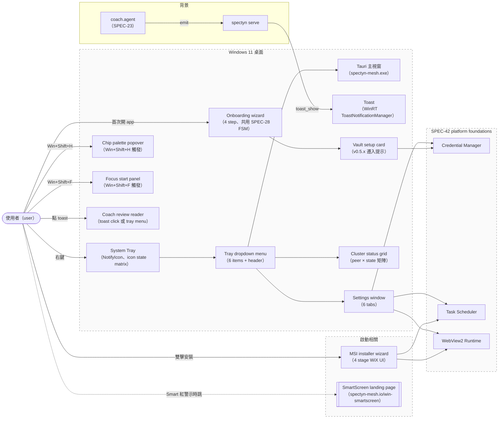
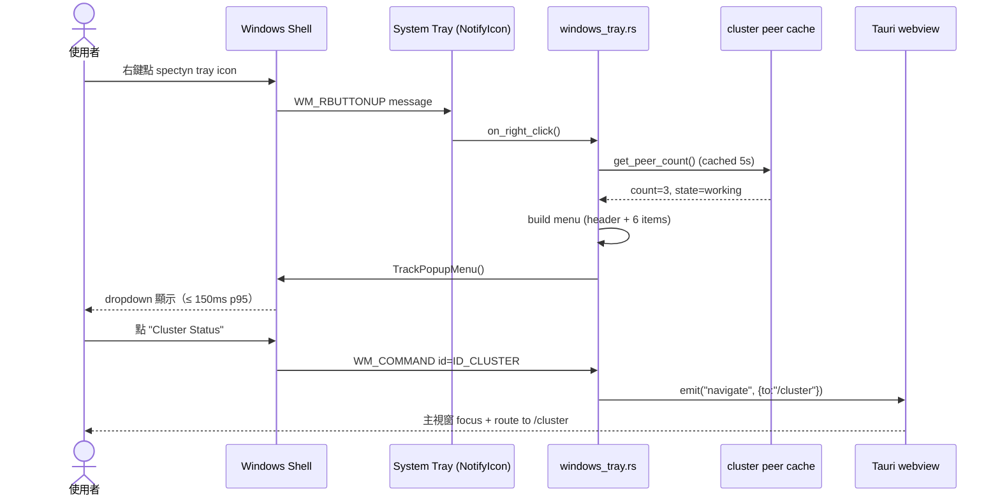
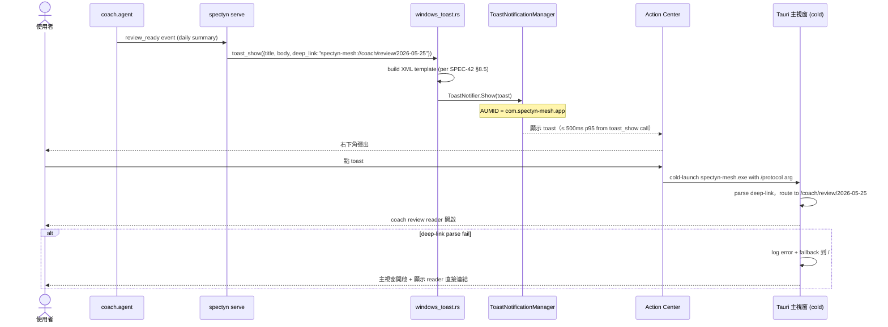
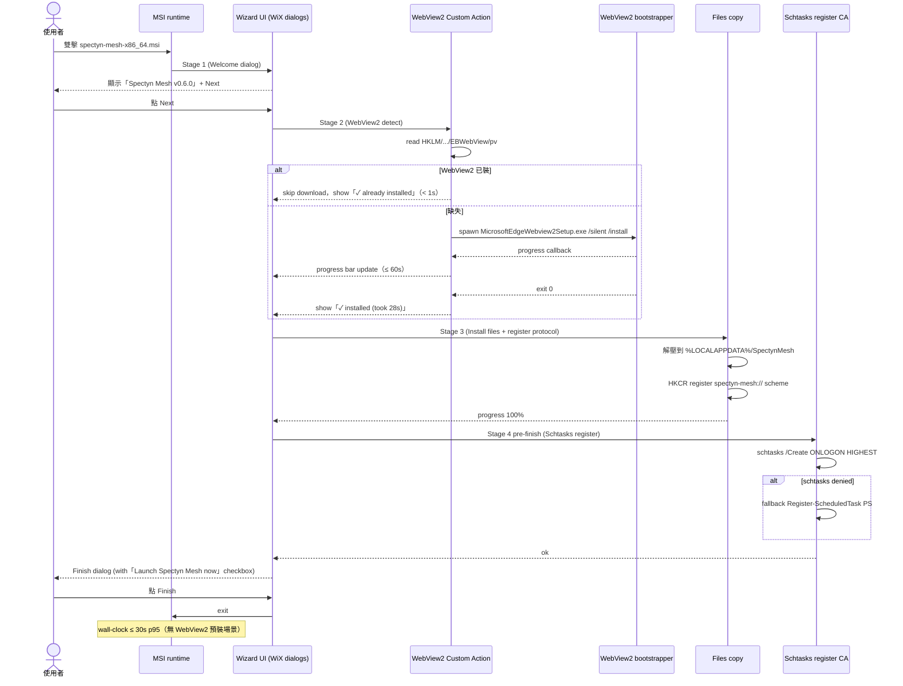
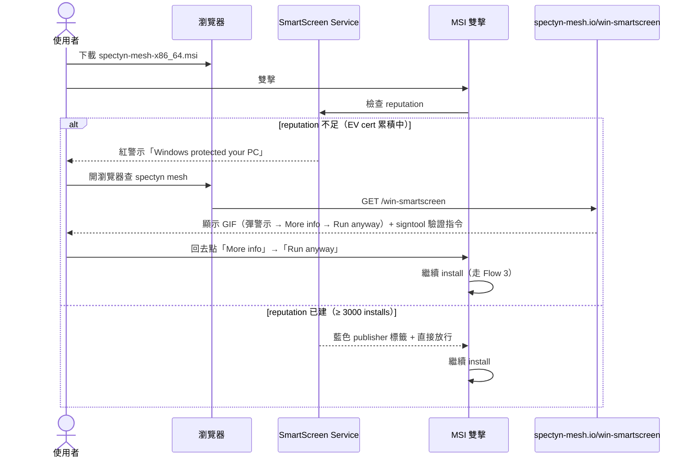
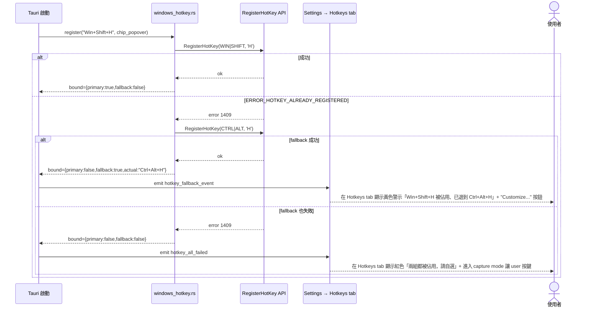
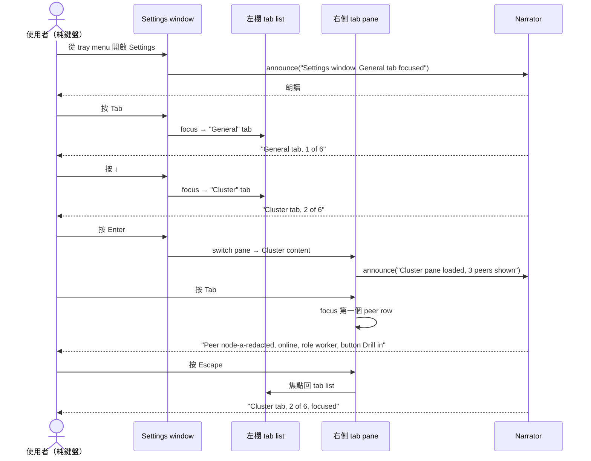

# SPEC-43 · Windows 桌面 screens + flows（System Tray / Settings / Toast / Coach Reader / Cluster / Chip / Focus / Installer / SmartScreen / Onboarding / Vault）— P1.cross-os 的 Windows UI 面

## §0 Spec metadata

| Field（欄位） | Value（值） |
|---|---|
| Spec ID | `SPEC-43-PLATFORM-Windows-screens-flows` |
| Title（標題） | Windows 桌面 screens + flows — P1.cross-os 的 Windows UI 面 (English subtitle: Windows Desktop Screens & Flows — system tray / settings / toast / coach review reader / cluster status / chip quick log / focus start / MSI installer wizard / SmartScreen mitigation / onboarding wizard / vault setup) |
| Status（狀態） | `draft` |
| Version | `0.1.0` |
| Last updated | `2026-05-25` |
| Author | `markl + Claude Opus 4.7 (1M context)` |
| Reviewer(s) | （待填） |
| Implementation owner | `app/src-tauri/src/windows_tray.rs`（既由 SPEC-42 §6.2 列為新增）+ `app/src-tauri/src/windows_toast.rs`（同上）+ `app/src/routes/settings/*.tsx`（新增 Windows settings tab） + `app/src/routes/onboarding/windows-wizard.tsx`（新增）+ `app/src/routes/coach/review-reader.tsx`（沿用 + Windows polish）+ `app/src/components/win/*`（新增一組 Windows-flavored 元件） + `core/src/wizard.rs`（SPEC-28 既有 FSM 共用） + `scripts/install-spectyn-windows.ps1`（既有；wizard CLI 段引用） + `scripts/windows-defender-exclude.ps1`（既有；SmartScreen fallback 連結 target） |
| Target release | `v0.6.0` |
| Pillar(s) served | `P1`（跨裝置 mesh — Windows UI 面是 P1.cross-os 在桌面 OS 的著陸點）+ `P2`（多模態 — chip quick log + focus start 是 desktop entry）+ `P4`（加密為先 — vault setup screen 顯式呈現 Credential Manager 邊界） |
| Track（軌道） | `both`（screen 既服務 Life Track 桌面端 daily flow、也服務 Work Track cluster worker monitoring） |
| Epic（史詩） | `E001`（cross-os P1 落地）+ `E002`（Life Track capture pipelines — chip / focus desktop entry）+ `E006`（30 秒第一印象 demo — onboarding wizard Windows 段） |
| BIG-GOAL phrase served | `BIG-GOAL.md` line 50：「Cross-platform: Mac · Windows · Linux · iOS · Android — one Rust codebase」（本 spec 是「Windows」格的 UI 收尾 — 一份 Rust + Tauri 在 Windows 上呈現完整 daily UX，與 macOS 平行） |
| Depends on（依賴） | `SPEC-01-FOUNDATION-bigGoal-mapping`（§11 子能力 `P1.cross-os` 是 anchor）、`SPEC-02-FOUNDATION-design-tokens`（顏色 / 字級 token、Windows tab 用同一份）、`SPEC-03-FOUNDATION-information-arch`（settings 資訊架構對齊 desktop main）、`SPEC-06-FOUNDATION-a11y`（Narrator + 鍵盤導覽契約）、`SPEC-17-PROTOCOL-tauri-bridge`（Tauri command 路由）、`SPEC-22-SYSTEM-capture-habit`（chip palette UI；本 spec 用 `Win+Shift+H` popover 觸發）、`SPEC-21-SYSTEM-capture-focus`（focus session；本 spec 用 `Win+Shift+F` 觸發）、`SPEC-23-SYSTEM-coach-engine`（coach review payload；本 spec 是其 reader UI）、`SPEC-28-SYSTEM-30s-hello`（onboarding 4-step wizard FSM；本 spec 是其 Windows render）、`SPEC-42-PLATFORM-Windows-foundations`（tray / toast / credman / schtasks 元件與 wireframe 連動） |
| Blocks（封鎖下游） | `SPEC-29-SYSTEM-release-pipeline` §B Windows 段（MSI wizard 畫面文案 + landing page 連結都在本 spec 鎖定）、`SPEC-60-TESTING-strategy` 的 `T-windows-screens-*` 測項族、`SPEC-45-PLATFORM-Linux-screens-flows`（鄰居樣板對齊 — Linux 段 §14 跨平台差異參考本 spec） |
| Template deviation（模板偏離） | §8 state machine 標 `partial` — 主 wizard FSM 共用 SPEC-28 既定 6-state enum 不重畫；本 spec 只畫 Windows-local 子狀態（installer 4 階段、SmartScreen 解法決策、global hotkey 衝突偵測）。§10 篇幅放大（含 12 screens table + 多份 ASCII wireframe + toast XML 範例）反映 spec 主軸是 UI。; §7 schema 2-layer (Rust + TS via ts-rs export tests) instead of 3-layer (Rust + TS + JSON Schema artifact). Rationale: ts-rs `#[ts(export)]` compile-time round-trip provides equivalent guarantee; JSON Schema artifact would duplicate maintenance burden for internal Rust-only types. |

---

## §1 TL;DR

**問題**：Windows 桌面 UI 是 spectyn-mesh 五個目標 OS 中**最容易失溫的 surface（介面表面）**：macOS 已有 menu bar（選單列）+ Notification Center（通知中心）+ Cmd+Shift+H 等熟成 UX（使用者體驗）流程（per SPEC-41 macOS 鄰居樣板），但 Windows 段在 v0.5.x 只有 main window（主視窗）+ 一個 placeholder tray（系統匣）icon、settings（設定）是 macOS layout 直接套上、toast（吐司通知）走 in-app banner（彈幅）退化版、MSI（Microsoft 安裝器）wizard（精靈）跑出來像 1998 年 NSIS 風、SmartScreen（智慧防護）紅警示沒對應的引導頁、global hotkey（全域熱鍵）`Win+Shift+H` / `Win+Shift+F` 撞 Windows reserved key（保留鍵）時沒 fallback（後備）路徑。三件踩坑案例（2026-05-12 node-a / 2026-05-15 node-b / 2026-05-18 node-a，per SPEC-42 §2.1）說明：Windows UI surface 不收齊、operator（操作者）每次 onboard（上手）新機都要手把手帶人走「為什麼這個視窗在這、為什麼 toast 沒響、為什麼 SmartScreen 嚇人」。

**方案**：本 spec 把 Windows 桌面 UI 鎖成「12 個 screens（畫面）+ 6 個 flow sequences（流程序列）」契約。Screens 分四組：(1) **常駐 surface** — system tray dropdown（系統匣下拉）+ tray icon state matrix（圖示狀態矩陣）+ toast notification template（通知模板）；(2) **設定** — Settings window 含 General / Cluster / Providers / Vault / Background Service / About 六個 tab，全 keyboard-navigable（鍵盤可達）；(3) **Daily flow** — chip palette popover（標籤調色盤彈窗）（`Win+Shift+H`）+ focus start panel（焦點啟動面板）（`Win+Shift+F`）+ coach review reader（教練回顧閱讀器）（toast click 或 tray menu）+ cluster status grid（叢集狀態網格）；(4) **Bootstrap** — MSI installer wizard（4 階段）+ SmartScreen 解法引導頁 + onboarding wizard Windows render（覆 SPEC-28 4-step FSM）+ vault setup card（首次把明文 identity 搬進 Credential Manager 的 UI）。Flows 六個 sequence：tray dropdown 開啟、toast emit + click、MSI install end-to-end、SmartScreen 解法、global hotkey 衝突偵測 + fallback、settings tab keyboard navigation。每 screen 含 ASCII wireframe（線框）+ states matrix（狀態矩陣）+ a11y notes + perf budget（效能預算）。

**代價**：(a) **不做 WinUI 3 native（原生）視窗**，維持 Tauri webview + 拷貝 WinUI Fluent design token（per SPEC-02），犧牲 native dialog 微互動但保證跨平台 UI 一致；(b) **不做 Windows 11 Mica 材質（半透明背景效果）**，理由是 Tauri 2 對 Mica 的支援 v0.5.x 尚未穩定（已踩過 node-a 機 black flash 問題），留 v0.7.0+；(c) **chip popover 用 `Win+Shift+H` 而非 SPEC-22 預設 `Ctrl+Shift+H`** — 因 Windows reserved key 政策 + 與 macOS `Cmd+Shift+H`（hide window）的「不對稱但語意對等」決定，spec 註明對等性 + 衝突 fallback 矩陣；(d) **MSI wizard 不做 license agreement（授權同意）頁** — Apache-2.0 license 連結放 About tab，wizard 4 階段壓在 30 秒內跑完是硬預算。

**English abstract**: SPEC-43 freezes Spectyn Mesh's **Windows desktop UI surface** — twelve screens plus six end-to-end flow sequences that together close the macOS UX parity gap in v0.6.0. Screens split into four groups: (1) ambient surface (system tray dropdown with four-state icon matrix, toast notification XML template, AUMID-anchored deep-link); (2) settings (six-tab window — General / Cluster / Providers / Vault / Background Service / About — all keyboard-reachable per WCAG 2.2 AA); (3) daily flow (chip palette popover on `Win+Shift+H`, focus start panel on `Win+Shift+F`, coach review reader from toast click, cluster status grid); (4) bootstrap (4-stage MSI installer wizard, SmartScreen mitigation landing page, SPEC-28 4-step onboarding wizard's Windows render, vault setup card for v0.5.x → v0.6.0 plain-identity migration). Six Mermaid sequence diagrams cover tray-dropdown render (< 150 ms), background-emitted toast (< 500 ms render), MSI install (≤ 30 s wall-clock), SmartScreen "More info → Run anyway" workaround, global hotkey conflict detection + fallback, and settings keyboard-only navigation. Tauri webview hosts every surface (no WinUI 3 native windows in v0.6.0); Mica acrylic deferred to v0.7.0+; MSI wizard skips a license screen to hit the 30 s budget — Apache-2.0 link lives in the About tab instead. Companion to SPEC-42 (foundations); neighbor to SPEC-41 (macOS screens) and SPEC-45 (Linux screens).

> **📚 全檔縮寫 + 英文名詞對照表**（給第一次接觸這個 repo（程式碼倉庫）的研究生 / 大學生讀者；本表 28 條，分 A UI 元件 / B 互動 / C 安裝 / D 平台對齊 / E 觀測 五群。同檔內第二次出現後允許只用英文。）
>
> **A. UI 元件**
>
> | 縮寫 / 名詞 | 中文 | 一句話 |
> |---|---|---|
> | `system tray` | 系統匣 | 工作列右下角圖示區（NotifyIcon 表面） |
> | `tray dropdown` | 系統匣下拉 | 右鍵 tray icon 跳出的選單 |
> | `popover` | 彈出視窗 | 浮在主視窗 / tray 旁邊的小型輕量視窗 |
> | `toast` | 吐司通知 | Win 10/11 右下角彈出橫條通知 |
> | `Action Center` | 通知中心 | Win 10/11 右側通知歷史抽屜 |
> | `tab` | 分頁 | settings 視窗左欄六項中的每一項 |
> | `wireframe` | 線框圖 | ASCII / 簡圖描繪 UI layout，不含真實樣式 |
> | `chip` | 標籤按鈕 | habit capture 的單一可點圖示（per SPEC-22）|
>
> **B. 互動**
>
> | 縮寫 / 名詞 | 中文 | 一句話 |
> |---|---|---|
> | `global hotkey` | 全域熱鍵 | 不管焦點在哪都可觸發的鍵盤快捷鍵 |
> | `accelerator` | 加速鍵字串 | hotkey 字串表達（如 `Win+Shift+H`） |
> | `deep-link` | 深連結 | `spectyn-mesh://...` URL 直跳特定畫面 |
> | `AUMID` | App User Model ID | Windows toast 必需的 app 識別字串 |
> | `focus order` | 鍵盤焦點順序 | Tab 鍵按下去元件被選到的順序 |
> | `Narrator` | 朗讀程式 | Windows 內建螢幕閱讀器 |
>
> **C. 安裝**
>
> | 縮寫 / 名詞 | 中文 | 一句話 |
> |---|---|---|
> | `MSI` | Microsoft 安裝器 | `.msi` 檔，Windows 原生安裝包格式 |
> | `MSI wizard` | 安裝精靈 | 雙擊 MSI 後一步一步問問題的對話框 |
> | `Custom Action` | 自訂動作 | MSI 安裝過程中跑的非標準步驟（如 WebView2 偵測） |
> | `SmartScreen` | 智慧防護 | 微軟對未識別發行者執行檔的紅底警示 |
> | `EV cert` | 擴展驗證憑證 | Extended Validation code signing；SmartScreen 看到立即信任 |
> | `landing page` | 著陸頁 | 用戶被引導去看的網頁（如 SmartScreen 教學頁） |
>
> **D. 平台對齊**
>
> | 縮寫 / 名詞 | 中文 | 一句話 |
> |---|---|---|
> | `WinUI` | Windows UI 框架 | 微軟原生 UI framework（Fluent design 母體）|
> | `Fluent design` | Fluent 設計語言 | 微軟跨產品 UI 設計系統（影響顏色 / 圓角 / motion）|
> | `Mica` | Mica 材質 | Win 11 視窗背景半透明效果 |
> | `Credential Manager` | 憑證管理員 | Windows 內建 secret store（per SPEC-42）|
> | `Scheduled Task` | 排程工作 | per SPEC-42 §8.3 用 ONLOGON HIGHEST 註冊 |
> | `Tauri` | Tauri 框架 | Rust + webview 桌面框架；本 spec 殼跑這個 |
>
> **E. 觀測 + 效能**
>
> | 縮寫 / 名詞 | 中文 | 一句話 |
> |---|---|---|
> | `render time` | 渲染時間 | 從 trigger 到畫面像素確定的時間 |
> | `p50` / `p95` | 中位數 / 95 百分位 | 效能分布的中位 / 95 百分位指標 |
> | `cold launch` | 冷啟動 | app 從未跑過、第一次開啟到可互動 |
> | `idle render` | 待機渲染 | app 已在 tray 跑、user 喚回主視窗的時間 |

---

## §2 Context & Background

### 2.1 為什麼現在做

SPEC-42 鎖了 Windows platform foundations（平台基礎五件套：WebView2 / Credential Manager / Scheduled Task / System Tray / Toast），但**只列了元件契約，沒列 user 看到的畫面長什麼樣 + flow 怎麼走**。三件 production（正式）規模踩坑案例（per SPEC-42 §2.1）說明 UI 層缺契約的代價：

1. **2026-05-12** — node-a 機 `spectyn serve` 被 ssh 斷線 kill 後，user 沒任何 surface 知道 cluster 掉線（tray icon 不變色、無 toast 通知）。
2. **2026-05-15** — node-b 機 fresh install 跑完 MSI 沒看到任何 success（成功）UI、user 以為 install 沒成功又重跑一次。
3. **2026-05-18** — node-a 機 v0.5.x 升級到 v0.6.0、identity（身份）從 plain（明文）搬進 Credential Manager 整段沒任何 UI 告知 user「你的 identity 已上鎖到 OS-level encryption」。

第四件 2026-05-22 — operator 本人在 dev box 試裝 v0.5.5、SmartScreen 跳紅警示、操作者花 90 秒翻 docs 找「點 More info → Run anyway」，**第一印象體驗破口**。

距 2026-06-15 v0.6.0 GA cut 21 天，本 spec 把 Windows UI surface 全套鎖死讓 user-facing 第一印象與 macOS 平等。

### 2.2 在 BIG-GOAL 哪裡

本 spec 服務 `BIG-GOAL.md` line 50「Cross-platform: Mac · Windows · Linux · iOS · Android — one Rust codebase」的 Windows UI 著陸面，落地 SPEC-01-FOUNDATION §11 子能力表 `P1.cross-os` 在 Windows 桌面 UI 層的承諾，並支援 P2（chip / focus 是 multimodal capture 的 desktop 入口）與 P4（vault setup card 顯式呈現 Credential Manager 加密邊界）。

### 2.3 既有解的歷史

- **v0.5.0**：Tauri 殼出 Windows MSI、但 UI 是 macOS layout 直接套；tray icon 是 placeholder（無 dropdown）；toast 走 in-app banner（彈幅）退化版（per `app/src-tauri/src/notifications.rs` line 88-117）。
- **v0.5.5（2026-05-22）**：`scripts/install-spectyn-windows.ps1` 加 PowerShell 提示（`Write-Host` 黃綠字）但仍無 GUI wizard；onboarding wizard 跑 mobile-shape 4 step（per SPEC-28），Windows-specific UX 細節（如 vault setup 顯式 step）沒區隔。
- **本 spec（v0.6.0）**：把 12 screens + 6 flow sequences 鎖死成 implementable（可實作）契約，下游 implementer 平行落地 Tauri command + React route + 設計師畫真實 mock（mockup）都有 anchor。

### 2.4 相關 spec

- [`SPEC-42-PLATFORM-Windows-foundations.md`](SPEC-42-PLATFORM-Windows-foundations.md) — 同 epic 的基礎篇；本 spec 是其 UI 收尾，§6 / §7 / §9 元件命名一致。
- [`SPEC-22-SYSTEM-capture-habit.md`](SPEC-22-SYSTEM-capture-habit.md) — chip palette UI 跨平台共用；本 spec 在 Windows 用 `Win+Shift+H` 觸發 popover、§10 給 Windows-flavor wireframe。
- [`SPEC-21-SYSTEM-capture-focus.md`](SPEC-21-SYSTEM-capture-focus.md) — focus session UI 跨平台共用；本 spec 在 Windows 用 `Win+Shift+F` 觸發 panel。
- [`SPEC-23-SYSTEM-coach-engine.md`](SPEC-23-SYSTEM-coach-engine.md) — coach review payload；本 spec 提供 reader（閱讀器）UI。
- [`SPEC-28-SYSTEM-30s-hello.md`](SPEC-28-SYSTEM-30s-hello.md) — onboarding 4-step FSM；本 spec 是其 Windows render（呈現），共用 `OnboardingState` enum。
- [`SPEC-17-PROTOCOL-tauri-bridge.md`](SPEC-17-PROTOCOL-tauri-bridge.md) — Tauri command 跨平台契約；本 spec 列 Windows-only command（tray menu state、hotkey rebind、vault setup confirm）是其延伸。
- [`SPEC-02-FOUNDATION-design-tokens.md`](SPEC-02-FOUNDATION-design-tokens.md) — 顏色 / 字級 / 圓角 / motion token；本 spec 引用、不重定義。
- [`SPEC-06-FOUNDATION-a11y.md`](SPEC-06-FOUNDATION-a11y.md) — a11y 契約；本 spec §12.2 引用、列 Windows-specific Narrator notes。
- [`SPEC-41-PLATFORM-macOS-screens-flows.md`](SPEC-41-PLATFORM-macOS-screens-flows.md)（鄰居）— macOS UI 對齊樣板；§14 cross-OS divergence 矩陣對齊。
- [`SPEC-45-PLATFORM-Linux-screens-flows.md`](SPEC-45-PLATFORM-Linux-screens-flows.md)（下游）— Linux UI 寫法跟本 spec 對齊。

---

## §3 Goals / Non-Goals / Out-of-Scope

### 3.1 Goals

- `[G1]` **Tray dropdown render < 150 ms p95** — user 右鍵 system tray spectyn icon 到 dropdown menu 首畫面像素確定，p50 < 80 ms、p95 < 150 ms（含 6 個 menu item + 動態 header「N peers online」更新）。`(verifies via: T-windows-screens-G1-tray-dropdown-latency)`
- `[G2]` **背景 emit toast → Action Center render < 500 ms p95** — spectyn serve（背景行程、user 已關主視窗）呼 `toast_show` Tauri command 到 toast 出現在 Action Center / 右下角，p50 < 250 ms、p95 < 500 ms。`(verifies via: T-windows-screens-G2-toast-background-render)`
- `[G3]` **MSI wizard 跑完 < 30 s wall-clock p95** — user 雙擊 MSI 到「Finish」按鈕可按下，4 階段全程 wall-clock（含 WebView2 bootstrap + Custom Action）p50 < 20 s、p95 < 30 s（broadband + WebView2 預裝場景 < 10 s）。`(verifies via: T-windows-screens-G3-msi-wizard-wallclock)`
- `[G4]` **Global hotkey 衝突偵測 + fallback 100% 命中** — `Win+Shift+H` / `Win+Shift+F` 註冊失敗（`ERROR_HOTKEY_ALREADY_REGISTERED`）時自動 fallback 至 `Ctrl+Alt+H` / `Ctrl+Alt+F`；再失敗則 Settings → Hotkeys tab 顯示警示 + 提供自訂入口。100% 測項涵蓋所有單一 fail / 雙 fail / 三 fail scenario（情境）。`(verifies via: T-windows-screens-G4-hotkey-fallback-matrix)`
- `[G5]` **Settings tab 全 keyboard accessible** — 六個 tab（General / Cluster / Providers / Vault / Background Service / About）整套用 Tab / Shift+Tab / Arrow / Enter / Escape 鍵盤導覽完整可達；Narrator 每元件有可讀 label；focus visible（焦點可見）符合 WCAG 2.2 AA 3:1 對比。`(verifies via: T-windows-screens-G5-settings-keyboard-a11y)`
- `[G6]` **Vault setup card 一次性成功率 ≥ 95%** — v0.5.x → v0.6.0 升級 user 首次開 v0.6.0 app 時，vault setup card 自動偵測明文 `~/.spectyn-mesh/identity.key`、提示遷入 Credential Manager；user 點「遷入並加密」按鈕後 95% 一次完成（剩 5% fail 路徑覆 disk full / CredWrite denied，皆有 UI 復原指引）。`(verifies via: T-windows-screens-G6-vault-setup-success-rate)`
- `[G7]` **SmartScreen mitigation landing page 30 秒可讀完** — `https://spectyn-mesh.io/win-smartscreen` 包含 GIF（彈警示 → 點 More info → Run anyway 三步）+ 簽章驗證指令（`signtool verify`）+ FAQ 三條；user 平均閱讀時間 < 30 秒（透過 stranger test 量測）。`(verifies via: T-windows-screens-G7-smartscreen-landing-readtime)`

### 3.2 Non-Goals

- `[NG1]` 不做 **WinUI 3 native window**（純 Tauri webview render Windows UI；Fluent design token 走拷貝 per SPEC-02、不引 WinUI 3 SDK）。
- `[NG2]` 不做 **Windows 11 Mica acrylic（半透明背景）**，留 v0.7.0+。
- `[NG3]` 不做 **MSI license agreement 頁** — Apache-2.0 連結放 About tab；MSI 4 階段 wizard 不塞同意按鈕（30 秒預算硬限制）。
- `[NG4]` 不做 **Windows 10 < 19041 UI 變體** — 最低 OS 線同 SPEC-42 §3.2 NG3。
- `[NG5]` 不做 **system tray icon 動畫**（spinning / pulsing）— 改用四色 state icon（idle / working / error / offline）靜態切換，省 GPU + 對 Narrator 友善。

### 3.3 Out-of-Scope for this version

- `[OoS1]` Windows 11 Widgets board（widgets 看板）整合 — 留 v0.7.0+。
- `[OoS2]` Windows Hello 生物辨識（biometric）解鎖 vault setup card — per SPEC-42 §3.3 OoS2。
- `[OoS3]` 多顯示器 DPI scaling 自動偵測 + tray icon DPI 切換 — 沿用 Tauri 預設 system DPI；v0.7.0+ 加 per-monitor DPI awareness。
- `[OoS4]` Settings 內可改 design token（dark mode override 等） — 預設跟 Windows system theme。

---

## §4 Job Stories

> 句型：**When** [situation / trigger（觸發情境）], **I want to** [motivation（動機）], **so I can** [desired outcome（期望結果）].

- `[JS1]` **When** 我在 Windows 11 工作機右下角看到 spectyn tray icon 變紅（cluster peer 掉線），**I want to** 右鍵點 tray icon 就看到「N peers online」+「Cluster Status」立即可點，**so I can** 不用開主視窗也知道掉誰、要不要修。 (→ G1)
- `[JS2]` **When** Coach（教練 agent）算完日終回顧但我關了主視窗 + 切到別的 app，**I want to** Windows 右下角即時彈 toast、點下去直接跳到 review reader，**so I can** 不錯過今天的回顧也不被中斷工作流。 (→ G2)
- `[JS3]` **When** 我在新公司配的 Windows 11 OEM 機（從未裝過 WebView2）想雙擊 MSI 上手，**I want to** wizard 30 秒內跑完不需要我懂任何技術細節，**so I can** 直接看到 tray icon + onboarding wizard 接力。 (→ G3)
- `[JS4]` **When** 我按 `Win+Shift+H` 想快記「水 500ml」但這組 hotkey 被別的 app 搶走，**I want to** 系統自動退到 `Ctrl+Alt+H` 並在 Settings 用紅字告訴我發生啥、給我自訂入口，**so I can** 不靜默失敗、不浪費 30 秒找原因。 (→ G4)
- `[JS5]` **When** 我要去 Settings 開 cluster 設定但今天滑鼠壞了只能用鍵盤，**I want to** Tab / Arrow / Enter 一路通到底、Narrator 全程讀得清楚，**so I can** 不被擋。 (→ G5)
- `[JS6]` **When** 我從 v0.5.x 升級到 v0.6.0、第一次開 app 看到 vault setup card 提示「你的 identity 還是明文、現在要不要鎖進 Credential Manager」，**I want to** 一個按鈕完成 + 看到確認「已加密、明文檔已刪」，**so I can** 安心知道 OS-level 加密已啟用。 (→ G6)
- `[JS7]` **When** 我朋友第一次裝 spectyn-mesh 被 SmartScreen 紅警示嚇到，**I want to** 我給他一個 landing page URL，他 30 秒內看完 GIF + 知道怎麼按下去，**so I can** 不要每次親自帶人走 More info → Run anyway。 (→ G7)

---

## §5 Personas

從 BIG-GOAL Audience 6 種選 3 種、與本 spec 直接相關：

- **Power user（進階使用者）持 Windows 11 OEM laptop** — 沒裝 dev 工具、不會用 PowerShell、只會雙擊 MSI；期待 wizard 自動跑完 + tray icon 自動出現 + onboarding 第一個對話 30 秒內看到 token。核心期待：UI 與直覺一致（tray icon = macOS menu bar、toast = phone notification）。
- **OSS contributor（開源貢獻者）持 Windows 11 dev box** — clone repo 後跑 `cargo tauri dev`；期待 dev mode UI 與 production 視覺有差（如 tray badge「DEV」），不會誤裝 production schtasks。
- **Sole maintainer（單獨維護者，operator 本人）持 Enterprise 環境 Windows** — group policy 鎖很多東西；期待 SmartScreen mitigation 步驟 + Settings → Background Service 顯式秀「Registered via PowerShell fallback because schtasks denied」狀態 + Vault setup card 顯式秀「Credential Manager scope = LocalMachine, has_secret = true」。

---

## §6 System Architecture

### 6.1 System-context diagram



### 6.2 Component breakdown

| 元件名 | 程式碼位置 | 職責 | 對外介面（§9 entry） |
|---|---|---|---|
| Tray dropdown render | `app/src-tauri/src/windows_tray.rs`（SPEC-42 §6.2 列為新增） | 註冊 NotifyIcon + dropdown menu + 處理 state matrix 切換 | §9.3 `tray_*` |
| Toast UI 組裝 | `app/src-tauri/src/windows_toast.rs`（SPEC-42 §6.2 列為新增） | WinRT XML template 組裝 + AUMID + emit + click callback | §9.3 `toast_*` |
| Settings 視窗 6-tab | `app/src/routes/settings/{general,cluster,providers,vault,bg-service,about}.tsx`（新增） | React route 渲染各 tab；keyboard nav + a11y | §9.3 `settings_*` |
| Chip popover (Windows variant) | `app/src/components/win/chip-popover.tsx`（新增；引用 SPEC-22 共用 logic） | 顯示 12-chip palette + `Win+Shift+H` accelerator binding | §9.3 `chip_*` |
| Focus start panel | `app/src/components/win/focus-panel.tsx`（新增；引用 SPEC-21） | duration picker + start button + ambient timer overlay | §9.3 `focus_*` |
| Coach review reader | `app/src/routes/coach/review-reader.tsx`（沿用 + Windows polish） | render coach payload + toast deep-link landing | §9.3 `coach_review_*` |
| Cluster status grid | `app/src/routes/cluster/status-grid.tsx`（沿用） | peer × state matrix + per-peer drill-in | §9.3 `cluster_status_*` |
| Onboarding wizard Windows render | `app/src/routes/onboarding/windows-wizard.tsx`（新增） | render SPEC-28 4-step FSM + 加 Windows-specific stage（schtasks register 預覽） | §9.3 `onboarding_*`（SPEC-17 既有） |
| Vault setup card | `app/src/components/win/vault-setup-card.tsx`（新增） | 偵測明文 identity + 提示遷入 + 顯示 Credential Manager 結果 | §9.3 `vault_setup_*` |
| MSI installer wizard UI | `app/src-tauri/wix/dialogs/*.wxs`（WiX dialog 模板，新增） | 4 stage wizard dialog（Welcome / WebView2-check / Install / Finish） | （MSI internal、不對 Tauri 暴露） |
| SmartScreen landing page | `website/win-smartscreen/index.html`（新增；非 Tauri 內） | 3-step GIF + signtool 驗證指令 + FAQ | （外部網頁） |
| Global hotkey conflict detector | `app/src-tauri/src/windows_hotkey.rs`（新增） | 註冊 → 偵測 `ERROR_HOTKEY_ALREADY_REGISTERED` → fallback chain | §9.3 `hotkey_*` |

### 6.3 Sequence diagrams

**Flow 1 — Tray dropdown render（user 右鍵 tray icon → menu 顯示）**



**Flow 2 — Background spectyn serve emit toast → Action Center**



**Flow 3 — MSI installer wizard 4-stage（fresh Win 11 OEM、無 WebView2）**



**Flow 4 — SmartScreen 紅警示 → landing page → run anyway**



**Flow 5 — Global hotkey 衝突偵測 + fallback**



**Flow 6 — Settings tab keyboard-only navigation（G5 verifier）**



---

## §7 Data Model

### 7.1 Schemas

#### 7.1.1 `WindowsScreenSpec` — 每個 screen 在 spec metadata 表中的內部結構（給 doc generation + test runner 用）

| 欄位 | 型別 | 必填 | 預設 | 描述 | 範例 | 是否加密 |
|---|---|---|---|---|---|---|
| `screen_id` | `String` | yes | — | screen 唯一 id（kebab-case） | `"settings-cluster-tab"` | no |
| `route` | `String` | yes | — | Tauri webview route | `"/settings/cluster"` | no |
| `entry_points` | `Vec<String>` | yes | — | 從哪些地方可進入此 screen | `["tray:cluster-status","settings:tab-cluster","deep-link:spectyn-mesh://settings/cluster"]` | no |
| `keyboard_first` | `bool` | yes | `true` | 是否支援純鍵盤導覽 | `true` | no |
| `min_os_version` | `String` | yes | `"10.0.19041"` | 最低 Win 版號 | `"10.0.19041"` | no |
| `render_budget_ms_p50` | `u32` | yes | — | render 預算 p50（毫秒） | `100` | no |
| `render_budget_ms_p95` | `u32` | yes | — | render 預算 p95（毫秒） | `250` | no |
| `a11y_role` | `String` | yes | — | ARIA role for screen container | `"region"` | no |
| `i18n_key_prefix` | `String` | yes | — | i18n key namespace | `"settings.cluster"` | no |

Rust struct（在 `core/src/ui/windows_screen_spec.rs`）：
```rust
#[derive(Debug, Clone, serde::Serialize, serde::Deserialize)]
pub struct WindowsScreenSpec {
    pub screen_id: String,
    pub route: String,
    pub entry_points: Vec<String>,
    pub keyboard_first: bool,
    pub min_os_version: String,
    pub render_budget_ms_p50: u32,
    pub render_budget_ms_p95: u32,
    pub a11y_role: String,
    pub i18n_key_prefix: String,
}
```

TypeScript interface（前端 doc tool 讀）：
```typescript
export interface WindowsScreenSpec {
  screen_id: string;
  route: string;
  entry_points: string[];
  keyboard_first: boolean;
  min_os_version: string;
  render_budget_ms_p50: number;
  render_budget_ms_p95: number;
  a11y_role: string;
  i18n_key_prefix: string;
}
```

Round-trip check：serde JSON 雙向、`core/contracts/windows-screen-spec.json` schema 自動檢驗。

#### 7.1.2 `TraydropdownItemSpec` — tray dropdown menu 每一項的內部結構

| 欄位 | 型別 | 必填 | 預設 | 描述 | 範例 | 是否加密 |
|---|---|---|---|---|---|---|
| `item_id` | `String` | yes | — | menu item id | `"tray.open"` | no |
| `kind` | `Enum{Header,Item,Separator,Submenu}` | yes | `Item` | item 類型 | `Item` | no |
| `label_i18n_key` | `String` | yes | — | i18n key（zh-TW + en） | `"tray.menu.open"` | no |
| `accelerator` | `Option<String>` | no | `None` | 顯示用 hotkey 字串 | `Some("Ctrl+O")` | no |
| `icon` | `Option<String>` | no | `None` | 圖示資源名 | `Some("ico/open.ico")` | no |
| `enabled_when` | `String` | yes | `"always"` | 啟用條件 expression | `"cluster.connected"` | no |
| `command_id` | `String` | yes | — | 點下去送的 command id | `"app.window.show"` | no |
| `visible_in_dev_mode` | `bool` | yes | `true` | dev mode 是否顯示 | `true` | no |
| `dev_badge` | `Option<String>` | no | `None` | dev mode 加 badge 文字 | `Some("DEV")` | no |

Rust struct（在 `core/src/ui/tray_dropdown.rs`）：
```rust
#[derive(Debug, Clone, serde::Serialize, serde::Deserialize)]
pub struct TraydropdownItemSpec {
    pub item_id: String,
    pub kind: TraydropdownItemKind,
    pub label_i18n_key: String,
    pub accelerator: Option<String>,
    pub icon: Option<String>,
    pub enabled_when: String,
    pub command_id: String,
    pub visible_in_dev_mode: bool,
    pub dev_badge: Option<String>,
}
```

#### 7.1.3 `ToastTemplate` — toast 組裝結構（serializable to WinRT XML）

| 欄位 | 型別 | 必填 | 預設 | 描述 | 範例 | 是否加密 |
|---|---|---|---|---|---|---|
| `aumid` | `String` | yes | `"com.spectyn-mesh.app"` | App User Model ID | `"com.spectyn-mesh.app"` | no |
| `template_kind` | `Enum{ToastGeneric,ToastImageAndText}` | yes | `ToastGeneric` | template type | `ToastGeneric` | no |
| `title` | `String` | yes | — | 標題 | `"Coach 日終回顧"` | no |
| `body_lines` | `Vec<String>` | yes | — | 內文行（最多 3 行 per WinRT 限制） | `["今天 12 個 capture","3 個 skill"]` | no |
| `image_path` | `Option<PathBuf>` | no | `None` | 縮圖路徑（local file://） | `Some("C:/.../icon-coach.png")` | no |
| `deep_link` | `String` | yes | — | launch URI（toast launch attr） | `"spectyn-mesh://coach/review/2026-05-25"` | no |
| `actions` | `Vec<ToastAction>` | no | `[]` | 可選 inline 按鈕 | `[{label:"開啟",arg:"open-review",activation:"protocol"}]` | no |
| `duration` | `Enum{Short,Long}` | yes | `Short` | 顯示時長 | `Short` | no |
| `scenario` | `Enum{Default,Reminder,Alarm,IncomingCall}` | yes | `Default` | 重要度 | `Default` | no |

Rust struct（在 `app/src-tauri/src/windows_toast.rs`）：
```rust
#[derive(Debug, Clone, serde::Serialize, serde::Deserialize)]
pub struct ToastTemplate {
    pub aumid: String,
    pub template_kind: ToastTemplateKind,
    pub title: String,
    pub body_lines: Vec<String>,
    pub image_path: Option<PathBuf>,
    pub deep_link: String,
    pub actions: Vec<ToastAction>,
    pub duration: ToastDuration,
    pub scenario: ToastScenario,
}

#[derive(Debug, Clone, serde::Serialize, serde::Deserialize)]
pub struct ToastAction {
    pub label_i18n_key: String,
    pub argument: String,
    pub activation: ToastActivation,
}
```

TypeScript interface：
```typescript
export interface ToastTemplate {
  aumid: string;
  template_kind: "ToastGeneric" | "ToastImageAndText";
  title: string;
  body_lines: string[];
  image_path: string | null;
  deep_link: string;
  actions: ToastAction[];
  duration: "Short" | "Long";
  scenario: "Default" | "Reminder" | "Alarm" | "IncomingCall";
}

export interface ToastAction {
  label_i18n_key: string;
  argument: string;
  activation: "Foreground" | "Background" | "Protocol";
}
```

Round-trip check：三個 struct 走 `core/contracts/toast-template.json` schema；Rust → JSON → TypeScript → JSON → Rust 五跳一致。

### 7.2 Storage location

- **`WindowsScreenSpec` 集合**：static 表，`core/src/ui/screens_registry.rs` 編譯期生成；不存磁碟。
- **`TraydropdownItemSpec` 集合**：同上、static 表。
- **`ToastTemplate` 實例**：runtime 由 spectyn serve / coach.agent 組裝；不持久化（emit 後丟）；歷史以 toast id 寫進 `~/.spectyn-mesh/notifications.sqlite`（meta only、無 body 內容）。
- **使用者自訂 hotkey override**：`~/.spectyn-mesh/hotkeys.json`（per-user override of default accelerator）。
- **vault setup state**：`~/.spectyn-mesh/onboarding.json` 加 `vault_migration_status: "pending|done|skipped|failed"` 欄位（共用 SPEC-28 既有結構）。

### 7.3 Retention

- **notifications.sqlite**：rotate 90 天（user 可在 Settings → General 改 7/30/90/keep-all）。
- **hotkeys.json**：跟著 user profile 永久存；`spectyn data delete --hotkeys` 清。
- **vault setup state**：跟 onboarding.json 同生命週期。

### 7.4 Migration

- **v0.5.x → v0.6.0**：
  1. 升級首次開 app 偵測 `~/.spectyn-mesh/identity.key`（明文存在），自動跳 vault setup card（不 silent migrate；要 user 明確點按）。
  2. user 點「遷入並加密」→ 走 SPEC-42 §7.4 流程（CredWriteW → 驗 round-trip → secure_delete 明文檔）。
  3. user 點「稍後」→ 寫 `vault_migration_status: "pending"`，下次開 app 再提醒；連續 skip 3 次後 Settings → Vault tab 持續顯示警示。
- **screens registry**：static 編譯、no schema migration。
- **toast aumid**：v0.5.x 沒設 aumid → v0.6.0 MSI 安裝時透過 shortcut metadata 註冊（per SPEC-42 §8.5）；若 v0.5.x in-place upgrade 而未跑 MSI（rare：手動覆蓋 binary），首次 `spectyn serve` 啟動 detect aumid missing 並 self-register。

---

## §8 詳細需求

> 主要 wizard state machine（FSM）共用 SPEC-28 既定 6-state；本節列 Windows-local 子流程細部需求。

### 8.1 Tray icon state matrix

四個狀態 ↔ 四個 .ico：

| State | 觸發條件 | Icon 檔 | Header 文字 (zh-TW) | Header 文字 (en) |
|---|---|---|---|---|
| `idle` | cluster connected + 0 active task | `spectyn-tray-idle.ico` | 「待機」 | "Idle" |
| `working` | cluster connected + N > 0 active task | `spectyn-tray-working.ico`（綠點） | 「處理 N 件」 | "Working on N" |
| `error` | 任一 peer 掉線 / provider 斷線 | `spectyn-tray-error.ico`（紅點） | 「N 個錯誤」 | "N error(s)" |
| `offline` | mDNS 找不到任何 peer | `spectyn-tray-offline.ico`（灰） | 「離線」 | "Offline" |

State 切換由 spectyn serve 透過 Tauri event `tray.state.update` 推送，前端 debounce 1 秒（避免閃爍）。

### 8.2 Tray dropdown menu items（鎖定順序）

1. Header（不可點、灰字、動態）：「Spectyn Mesh · N peers · 狀態」
2. `Open Spectyn Mesh` (Ctrl+O) → 喚起主視窗
3. `Cluster Status...` → 跳 `/cluster`
4. `---` separator
5. `Quick Log` (Win+Shift+H) → 開 chip popover
6. `Start Focus...` (Win+Shift+F) → 開 focus panel
7. `---` separator
8. `Pause Capture` / `Resume Capture`（依狀態切換）
9. `---` separator
10. `Settings...` → 開 settings window，預設 General tab
11. `Quit` (Ctrl+Q) → 結束殼 + 詢問是否同停 spectyn serve

dev mode 在 header 後追加 badge「DEV — spectyn-mesh-dev:」（per SPEC-42 §7.2）。

### 8.3 Settings 6-tab 結構

| Tab | i18n key | 內容 |
|---|---|---|
| General | `settings.general` | 語言 / 主題（system/light/dark）/ 啟動行為 / notification 偏好 / hotkey override entry |
| Cluster | `settings.cluster` | peer list（live）/ join new cluster / leave / 顯示 cluster secret hash（不顯全 secret）|
| Providers | `settings.providers` | LLM provider 清單 + API key 狀態（has_secret only）+ 新增 / 刪除 |
| Vault | `settings.vault` | Credential Manager entries metadata + 明文檔遷入按鈕（若仍有）+ 「delete all secrets」destructive 按鈕 |
| Background Service | `settings.bg_service` | schtasks 狀態（registered method: schtasks/powershell/not-registered）+ last_run + restart 按鈕 + uninstall task 按鈕 |
| About | `settings.about` | 版本 / commit hash / Apache-2.0 license 連結 / 第三方相依連結 / build channel |

每 tab Keyboard contract：左欄 `role="tablist"` + 右欄 `role="tabpanel"`；Tab key 在左欄 cycle、Arrow up/down 切 tab、Enter 進入 pane、Escape 回 tab list。

### 8.4 Toast XML 完整範例（per SPEC-42 §8.5 加上 SPEC-43 動態欄位）

```xml
<toast launch="spectyn-mesh://coach/review/2026-05-25" duration="short" scenario="default">
  <visual>
    <binding template="ToastGeneric">
      <text hint-maxLines="1">{{ title }}</text>
      <text>{{ body_line_1 }}</text>
      <text>{{ body_line_2 }}</text>
      <image placement="appLogoOverride" src="{{ image_path_or_default }}" hint-crop="circle"/>
    </binding>
  </visual>
  <actions>
    <action content="{{ action_1_label }}" arguments="{{ action_1_arg }}" activationType="protocol"/>
    <action content="{{ action_2_label }}" arguments="{{ action_2_arg }}" activationType="background"/>
  </actions>
</toast>
```

組裝層在 `app/src-tauri/src/windows_toast.rs::build_xml(ToastTemplate)`，輸出 XML 經 WinRT `XmlDocument.LoadXml` 驗證。

### 8.5 Global hotkey accelerator + fallback 對照

| 功能 | Primary | Fallback 1 | Fallback 2 (user-define) |
|---|---|---|---|
| Chip popover | `Win+Shift+H` | `Ctrl+Alt+H` | user capture mode |
| Focus start | `Win+Shift+F` | `Ctrl+Alt+F` | user capture mode |
| Open main window | `Ctrl+O`（tray menu accelerator） | — | — |
| Quit | `Ctrl+Q`（tray menu accelerator） | — | — |

註：macOS 用 `Cmd+Shift+H` / `Cmd+Shift+F`（per SPEC-22 / SPEC-21）；Windows 改 `Win+Shift+*` 是因 `Ctrl+Shift+H` 撞 Chrome history、`Ctrl+Shift+F` 撞 Outlook find folder（兩個都是常見 enterprise app default）— 經 §17 Alt-C 詳述。

### 8.6 MSI wizard 4-stage 文案 + 按鈕

| Stage | Dialog id | 主文 (zh-TW) | 主文 (en) | 按鈕 |
|---|---|---|---|---|
| 1 Welcome | `WelcomeDlg` | 「歡迎使用 Spectyn Mesh v0.6.0」 | "Welcome to Spectyn Mesh v0.6.0" | Next / Cancel |
| 2 WebView2 check | `WebView2Dlg` | 「正在檢查 Microsoft Edge WebView2 執行環境...」（含 progress bar） | "Checking Microsoft Edge WebView2 runtime..." | Next（auto-advance）/ Cancel |
| 3 Install | `InstallDlg` | 「正在安裝...（複製檔案、註冊背景工作）」 | "Installing... (copying files, registering background task)" | （無按鈕，progress bar） |
| 4 Finish | `FinishDlg` | 「安裝完成！」+ checkbox「立即啟動 Spectyn Mesh」 | "Installation complete!" + checkbox "Launch Spectyn Mesh now" | Finish |

無 License agreement dialog（NG3）；無 Customize install location dialog（v0.6.0 強制 `%LOCALAPPDATA%\SpectynMesh`）。

### 8.7 Vault setup card 行為

- **偵測時機**：app cold launch 後 200ms（Tauri `app.ready` event）。
- **偵測邏輯**：`vault_setup_status()` Tauri command → 後端 `fs::exists("~/.spectyn-mesh/identity.key")` && `CredReadW("spectyn-mesh:identity")` 回 `None`。
- **UI**：頂部 banner（非 modal、不擋操作）「你的 identity 還是明文。一鍵搬進 Credential Manager 加密。」+「遷入並加密」+「稍後」按鈕。
- **成功路徑**：banner 變綠 5 秒「✓ 已加密。原明文檔已安全刪除。」自動消失；Settings → Vault tab 顯示 `spectyn-mesh:identity` entry metadata。
- **失敗路徑**：banner 變紅「遷入失敗：<dev detail>」+ 「重試」+「查看記錄」+「跳過（不建議）」按鈕；click「查看記錄」開 Settings → Vault tab 的 log viewer。

---

## §9 API Contracts

### 9.1 HTTP / RPC endpoints

本 spec 不新增 RPC endpoint；沿用 SPEC-10 既有契約。

### 9.2 In-process（Rust trait / TS interface）

複用 SPEC-42 §9.2 的 `SecretStore` trait；本 spec 新增的 trait 都是 UI-layer-only，無跨 process 必要。

### 9.3 Tauri commands

| Command 名 | Args 型別 | Return 型別 | 哪個 platform |
|---|---|---|---|
| `tray_state_update` | `{ state: "idle"\|"working"\|"error"\|"offline", count: number }` | `()` | Windows + macOS |
| `tray_menu_rebuild` | `{}` | `{ items: TraydropdownItemSpec[] }` | Windows |
| `toast_show` | `ToastTemplate` | `{ toast_id: string }` | Windows + macOS（macOS render 退化版） |
| `toast_dismiss` | `{ toast_id: string }` | `{ ok: bool }` | Windows |
| `hotkey_register` | `{ action: string, accelerator: string }` | `{ bound: bool, fallback_used: bool, actual: string }` | Windows + Linux |
| `hotkey_capture` | `{ action: string }` | `{ captured_accelerator: string }`（阻塞至 user 按鍵或 timeout 10s） | Windows + Linux |
| `settings_open` | `{ tab: "general"\|"cluster"\|"providers"\|"vault"\|"bg-service"\|"about" }` | `()` | all desktop |
| `vault_setup_status` | `{}` | `{ has_plain_identity: bool, credman_has_entry: bool, recommended_action: "migrate"\|"none" }` | Windows |
| `vault_setup_migrate` | `{ confirm: bool }` | `{ migrated: bool, roundtrip_ok: bool, plain_deleted: bool, dev_detail: string \| null }` | Windows |
| `coach_review_open` | `{ review_id: string }` | `()` | all desktop |
| `cluster_status_get` | `{}` | `{ peers: ClusterPeer[], updated_at: string }` | all desktop |
| `chip_popover_show` | `{ source: "hotkey"\|"tray"\|"deep-link" }` | `()` | Windows + macOS + Linux |
| `focus_panel_show` | `{ source: "hotkey"\|"tray"\|"deep-link" }` | `()` | Windows + macOS + Linux |

### 9.4 Error catalog（新增 Windows screens / flows-specific code）

| Code | When | User copy (zh-TW) | User copy (en) | Dev detail | Recovery action | Retryable? |
|---|---|---|---|---|---|---|
| `R.windows.tray_menu_render_slow` | tray dropdown render > 250ms p95（hard limit 觸發） | （無 user-facing；只 log + metric） | n/a | render_ms + cluster_count | 自動降階 menu 動態 header 改 static | yes |
| `R.windows.toast_emit_fail` | `ToastNotifier.Show` 拋例外 | 通知無法顯示（系統可能停用 spectyn 通知）。請至設定 → 通知 開啟 Spectyn Mesh。 | Toast notification failed to display (system may have disabled spectyn notifications). Open Settings → Notifications to enable Spectyn Mesh. | HRESULT | guide user to Settings | manual |
| `R.windows.hotkey_all_fail` | primary + fallback 都失敗 | 兩組快捷鍵都被其他程式佔用，請至 Settings → 快捷鍵 自選。 | Both default and fallback hotkeys are taken by other apps. Open Settings → Hotkeys to customize. | both errors logged | open hotkey customize | manual |
| `R.windows.vault_setup_credman_denied` | `CredWriteW` 在 vault setup card 流程中回非 0 HRESULT | 無法寫入 Windows 憑證管理員。<dev detail>。 | Cannot write to Credential Manager: <dev detail>. | HRESULT | retry button | yes (if transient) |
| `R.windows.vault_setup_roundtrip_mismatch` | CredWrite ok 但 CredRead 回的 bytes ≠ 原明文 bytes | 加密驗證失敗：寫入後讀回的內容不一致。明文檔已保留。 | Encryption verification failed: bytes read back don't match. Plain file preserved. | byte diff len | retry; if persists, contact dev | yes (rare) |
| `R.windows.msi_webview2_bootstrap_timeout` | Custom Action WebView2 bootstrap > 90s | WebView2 自動安裝超時。請檢查網路連線並重試安裝。 | WebView2 auto-install timed out. Check network and retry installer. | bootstrap log | re-run MSI | yes |
| `R.windows.onboarding_schtasks_register_fail` | onboarding wizard 跑到 schtasks register 失敗（兩條路徑都掛） | 無法註冊背景工作（公司政策限制）。請聯絡 IT 或改前景模式。 | Cannot register Scheduled Task (likely group policy). Contact IT or use foreground mode. | both stderr | manual workaround | no |

其餘 error code 引用 SPEC-04 + SPEC-42 §9.4。

---

## §10 UI Components & Screens

### 10.1 Screen catalog（12 screens）

| # | Screen | Route | Entry points | Render budget p95 |
|---|---|---|---|---|
| S1 | System tray icon（常駐） | n/a（OS surface） | 自動（app launch） | 即時（OS 管） |
| S2 | Tray dropdown menu | n/a（OS popup） | 右鍵 tray icon | 150 ms |
| S3 | Toast notification | n/a（Action Center） | spectyn serve 或 coach emit | 500 ms |
| S4 | Settings · General tab | `/settings/general` | tray menu / Ctrl+, / deep-link | 200 ms |
| S5 | Settings · Cluster tab | `/settings/cluster` | tray menu / tab switch | 250 ms |
| S6 | Settings · Providers tab | `/settings/providers` | tab switch | 250 ms |
| S7 | Settings · Vault tab | `/settings/vault` | tab switch / vault card click | 250 ms |
| S8 | Settings · Background Service tab | `/settings/bg-service` | tab switch | 250 ms |
| S9 | Chip palette popover | `/chip-popover`（windowed） | Win+Shift+H / tray menu | 100 ms |
| S10 | Focus start panel | `/focus-panel`（windowed） | Win+Shift+F / tray menu | 100 ms |
| S11 | Coach review reader | `/coach/review/:id` | toast click / tray menu / deep-link | 300 ms |
| S12 | Cluster status grid | `/cluster` | tray menu / Settings → Cluster drill | 200 ms |

Plus 三個 bootstrap surfaces（**不算 daily screen** 但 spec 內鎖定）：
- B1: MSI wizard 4 dialogs（OS 管，wall-clock budget 見 G3）
- B2: SmartScreen mitigation landing page（外部網頁；read-time 預算見 G7）
- B3: Onboarding wizard Windows render（覆 SPEC-28 4 step，本 spec 加 vault setup 為 step 5）

### 10.2 Tray dropdown — wireframe（ASCII）

```
┌──────────────────────────────────────────────┐
│ Spectyn Mesh · 3 peers · working 2 tasks    │   ← header（灰、不可點、動態）
├──────────────────────────────────────────────┤
│ Open Spectyn Mesh                  Ctrl+O   │
│ Cluster Status...                            │
├──────────────────────────────────────────────┤
│ Quick Log                       Win+Shift+H  │   ← 或 fallback "Ctrl+Alt+H"
│ Start Focus...                  Win+Shift+F  │
├──────────────────────────────────────────────┤
│ Pause Capture                                │   ← 或 "Resume Capture"
├──────────────────────────────────────────────┤
│ Settings...                                  │
│ Quit                              Ctrl+Q     │
└──────────────────────────────────────────────┘
```

Dev mode：header 加「[DEV]」前綴 + tray icon overlay 一個小 D 字母 badge。

### 10.3 Settings window — wireframe（ASCII）

```
┌─────────────────────────────────────────────────────────────────────────────┐
│ Spectyn Mesh · Settings                                              [_][□][X]│
├─────────────┬───────────────────────────────────────────────────────────────┤
│ [tablist]   │ [tabpanel role=tabpanel aria-labelledby="tab-cluster"]        │
│ General     │                                                                │
│ ▸ Cluster   │   Cluster Status                                              │
│ Providers   │   ┌────────────────────────────────────────────────────────┐ │
│ Vault       │   │ ● peer-mac      Online    role: coordinator   →       │ │
│ Bg Service  │   │ ● peer-node-a   Online    role: worker         →      │ │
│ About       │   │ ◐ peer-node-a   Lagging   role: worker (5s)    →      │ │
│             │   │ ○ peer-node-b   Offline   role: worker (-12m)   →      │ │
│             │   └────────────────────────────────────────────────────────┘ │
│             │                                                                │
│             │   Cluster Secret (hash only): sha256:7f3a...c9d2              │
│             │   [ Join different cluster... ]   [ Leave cluster ]            │
└─────────────┴───────────────────────────────────────────────────────────────┘
```

Keyboard：Tab 進左 tablist；↑↓ 切 tab；Enter 進右 tabpanel；Tab 在 tabpanel 內 cycle interactive 元件；Escape 回 tablist。

### 10.4 Toast — visual layout

```
┌─────────────────────────────────────────────┐
│  ◯  Spectyn Mesh                            │
│      Coach 日終回顧                         │
│      今天累積 12 個 capture                 │
│      3 個 skill 已抽出。點擊查看。           │
│                                             │
│      [ 開啟回顧 ]      [ 稍後 ]              │
└─────────────────────────────────────────────┘
```

A11y：`AutomationName="Spectyn Mesh coach review notification"`；按鈕 `AutomationId="action-open-review"` / `"action-snooze"`；Narrator 預設讀題 + 內文 + 按鈕順序。

### 10.5 Chip palette popover — wireframe

```
┌──────────────────────────────────────────────┐
│ Quick Log                          [X]       │
├──────────────────────────────────────────────┤
│  [💧 水]   [☕ 咖啡]   [🏃 運動]   [🧘 冥想] │
│  [📖 讀書] [🚶 走路]   [🚭 戒菸]   [🍷 戒酒] │
│  [🌬 深呼吸][🤸 伸展]  [✍ 日記]    [😴 早睡] │
│                                              │
│  [ + 其他（打字）]                            │
└──────────────────────────────────────────────┘
```

Trigger：`Win+Shift+H`（or fallback）；window position：右下角貼 tray；focus 第一個 chip；Tab cycle、Enter log + close、Escape cancel。

### 10.6 Focus start panel — wireframe

```
┌──────────────────────────────────────────────┐
│ Start Focus Session                  [X]     │
├──────────────────────────────────────────────┤
│  Duration:  ( 25 ) min   [ 15 | 25 | 50 ]   │
│  Block list:  ☐ Slack  ☐ Mail  ☐ YouTube    │
│  Ambient timer:  ☑ overlay corner            │
│                                              │
│              [   Start  Win+Enter   ]        │
└──────────────────────────────────────────────┘
```

### 10.7 Vault setup card（banner inside main window）

```
┌────────────────────────────────────────────────────────────────────┐
│ 🔐  你的 identity 還是明文。一鍵搬進 Credential Manager 加密。     │
│                              [ 遷入並加密 ]    [ 稍後 ]            │
└────────────────────────────────────────────────────────────────────┘
```

成功後 5 秒淡出：「✓ 已加密。原明文檔已安全刪除。」失敗則紅 banner + dev detail + retry。

### 10.8 SmartScreen landing page（外部 https://spectyn-mesh.io/win-smartscreen）

結構：

1. H1：「Windows SmartScreen 紅警示？這是正常的」
2. H2：「為什麼會出現」 — 兩段：reputation building + EV cert 機制
3. H2：「如何繼續安裝」 — 3 frame GIF（彈警示 → 點 More info → 點 Run anyway）
4. H2：「想自己驗證簽章」 — `signtool verify /pa /v spectyn-mesh.msi` 範例輸出
5. H2：「FAQ」 — 3 條（Q1: 是 malware 嗎？Q2: 為什麼不買 EV cert？Q3: 我用 Defender 為什麼還警示？）
6. Footer：CTA 回 download page

預算：總文字 < 600 字（中英分版）、單頁 < 1 MB（含 GIF 壓縮）、user 平均閱讀 < 30 秒（per G7）。

---

## §11 Error Catalog

見 §9.4。其餘 error code 引用 SPEC-04 + SPEC-42 §9.4。

---

## §12 Cross-Cutting

### 12.1 Security & Privacy

- **信任邊界**：Tauri webview 內 React UI 是 untrusted（CSP 走 SPEC-17 既有）；tray menu 由 Rust 直接生成是 trusted；MSI wizard dialog 是 OS-trusted；landing page 外部網頁是 untrusted（user 透過瀏覽器讀）。
- **Secret 處理**：Settings → Vault tab 只顯示 metadata（target / persist / has_secret）— 永遠不渲染 raw bytes；Providers tab 顯示「API key 已設定 ✓」而非 key 值。
- **PII**：所有 wireframe / sample / log 一律 redacted（hostname / IP / 真實 cluster_secret hash 不寫死）；user-facing copy 不含 user-input echo back。
- **STRIDE**：
  - **S(poofing) 偽冒**：toast deep-link `spectyn-mesh://` 可能被 malicious 網頁觸發 → Tauri 殼接 deep-link 後驗 host 白名單（只接 `coach/` `cluster/` `settings/` 三個 path prefix）。
  - **T(ampering) 竄改**：landing page HTML 可被中間人篡改 → 走 HTTPS + HSTS（per SPEC-29 deployment）。
  - **R(epudiation) 否認**：vault setup migrate 走 audit log（per SPEC-42 §12.1）。
  - **I(nfo disclosure) 資訊外洩**：cluster status grid 顯示 peer name 但 hash 化（per SPEC-08）。
  - **D(oS) 阻斷服務**：tray menu rebuild debounce 1s 防 spectyn serve 暴衝。
  - **E(oP) 提權**：vault setup migrate 不請求 admin；schtasks 路徑 fallback 維持 user-level。

### 12.2 Accessibility

- **WCAG 2.2 AA 滿足**：所有 interactive 元件 focus visible 對比 ≥ 3:1；文字對比 ≥ 4.5:1；tab order 符合視覺順序。
- **Narrator notes**：
  - tray icon 不在 Narrator scope（OS 限制）；user 用 `Win+B` 聚焦 system tray 後可方向鍵讀 icon tooltip。
  - tray dropdown 每 item 有 `AutomationName`（i18n label）+ `AutomationId`（item_id）。
  - Settings 左欄 tablist `role="tablist"`、每 tab `role="tab"`、tab pane `role="tabpanel" aria-labelledby="tab-<id>"`。
  - Toast 走 Win 10/11 內建 Narrator 整合（自動讀題 + body + actions）。
- **鍵盤導覽完整對照**（per G5）：
  - Settings 視窗：Ctrl+, 開啟、Tab/Shift+Tab cycle 左欄、↑↓ 切 tab、Enter 進右 pane、Escape 回左欄、Ctrl+W 關閉。
  - Chip popover：Win+Shift+H 開、Tab/Arrow cycle chip、Enter log + close、Escape cancel。
  - Focus panel：Win+Shift+F 開、Tab cycle、Win+Enter start、Escape cancel。
- **動效**：state 切換用 200ms fade；user `prefers-reduced-motion: reduce` 時改 instant。

### 12.3 Internationalization

- 所有 user-facing 字串走 i18n key（per SPEC-05）：`tray.*` / `settings.*.title` / `toast.*` / `chip.*` / `vault.*` / `installer.*`。
- 預設 locale 跟 Windows display language（`Get-WinSystemLocale`）；zh-TW + en-US 為 v0.6.0 必達。
- 數字 / 日期 format 跟 Windows region setting。

### 12.4 Observability

- **Metrics**：
  - `spectyn_windows_tray_dropdown_render_ms` histogram（per G1）
  - `spectyn_windows_toast_emit_to_render_ms` histogram（per G2）
  - `spectyn_windows_msi_install_wallclock_s` histogram（per G3）
  - `spectyn_windows_hotkey_register_total{action,outcome="primary|fallback|fail"}` counter（per G4）
  - `spectyn_windows_settings_tab_switch_total{from,to}` counter
  - `spectyn_windows_vault_setup_total{outcome="success|skip|fail"}` counter（per G6）
- **Logs**：所有 tab switch / vault setup / hotkey register 走 `tracing`，level=`info`；error 路徑 level=`warn` 含 dev_detail。
- **Traces**：vault setup migrate 走 OTEL span（含 `read_plain` `cred_write` `roundtrip_verify` `secure_delete` 4 個 child span）。

### 12.5 Offline / Network resilience

- 全部 screen 都是 local-only（無網路 dependency）— offline 場景 zero degradation 除 cluster status grid（offline peer 顯示 grey + last-seen 時間）。
- Toast emit 全本機 WinRT API、無網路需求。
- SmartScreen landing page 是唯一需要網路的 surface — spectyn 自身不依賴其可達性。

---

## §13 Performance Budgets

| Metric | Target | Hard limit | Measured by |
|---|---|---|---|
| Tray dropdown render（右鍵 → 顯示） | < 80ms p50 | < 150ms p95 (G1) | windows_tray.rs timestamp diff |
| Toast emit → Action Center render | < 250ms p50 | < 500ms p95 (G2) | toast_show call → notification fire-time |
| MSI wizard wall-clock（含 WebView2 bootstrap） | < 20s p50 | < 30s p95 (G3) | installer log timestamp diff |
| MSI wizard（WebView2 預裝場景） | < 5s p50 | < 10s p95 | installer log |
| Settings tab switch | < 100ms p50 | < 250ms p95 | webview navigation time |
| Settings window cold open | < 200ms p50 | < 500ms p95 | tray menu click → first paint |
| Chip popover open | < 50ms p50 | < 100ms p95 | hotkey trigger → first paint |
| Focus panel open | < 50ms p50 | < 100ms p95 | hotkey trigger → first paint |
| Coach review reader cold load | < 150ms p50 | < 300ms p95 | toast click → reader pixel |
| Cluster status grid live update | < 100ms p50 | < 200ms p95 | event push → DOM update |
| Vault setup migrate（CredWrite + verify + delete） | < 500ms p50 | < 2s p95 | command timestamp diff |
| Hotkey register（含 fallback chain） | < 50ms p50 | < 200ms p95 | RegisterHotKey + fallback wall-clock |

**Sequential budget**：MSI install ≤ 30s p95（msiexec /qn，含 WebView2 bootstrap Custom Action）+ first WebView2 cold-start ≤ 60s p95（post-install 第一次 app launch、含 WebView2 runtime 初始化 + Tauri webview 載入 + React bundle parse）= ≤ 90s combined install-to-first-screen。SPEC-28 onboarding TTFR（time-to-first-reply、首次回應時間）budget（30s）量測 baseline 是 **first launch 完成後**（i.e. user 在 onboarding wizard 看到第一個對話開始算）— **不包含 install 與 cold-start**。三段預算各自獨立量測、不可互相借支。

---

## §14 Platform Divergence Matrix

| Behavior | iOS | Android | macOS | **Windows (本 spec)** | Linux | 備註 |
|---|---|---|---|---|---|---|
| 常駐 surface | n/a（mobile foreground） | n/a | NSStatusItem menu bar | **NotifyIcon system tray dropdown** | StatusNotifierItem / GtkStatusIcon | Windows + macOS 兩平台對齊 6 個 menu item |
| 通知 render | UNUserNotification | NotificationManager | NSUserNotification | **WinRT ToastNotificationManager + AUMID** | libnotify / D-Bus | Windows 唯一需 AUMID 預註冊 |
| 通知 deep-link | Universal Link | App Link | URL scheme | **`spectyn-mesh://` URL scheme（HKCR register）** | xdg-open URL scheme | Windows 走 registry，Linux 走 .desktop |
| 通知背景 emit | BGTaskScheduler 限制 | Foreground Service notif | NSUserNotification（user app） | **spectyn serve 直接 emit via WinRT，AUMID-anchored** | systemd-user emit via D-Bus | Windows + Linux 後台最自由 |
| Chip popover hotkey | n/a | n/a | `Cmd+Shift+H`（per SPEC-22） | **`Win+Shift+H`**（避 Ctrl+Shift+H 撞 Chrome） | `Ctrl+Shift+H` | macOS 與 Linux 同字串、Win 換 modifier |
| Focus start hotkey | n/a | n/a | `Cmd+Shift+F`（per SPEC-21） | **`Win+Shift+F`**（避撞 Outlook） | `Ctrl+Shift+F` | 同上 |
| Settings 視窗風格 | iOS settings list | Android Material list | macOS sheet 風格 | **Windows Fluent design token 模擬（非原生 WinUI 3）** | GNOME Settings 模擬 | Windows 走 Tauri webview + token；NG1 |
| 安裝 wizard | App Store flow | Play Store flow | DMG drag | **MSI 4-stage（Welcome / WV2 / Install / Finish）** | .deb 命令 / AppImage 直跑 | Windows 唯一帶 wizard UI |
| 安裝信任警示 | App Store gatekeeping | Play Protect | Gatekeeper | **SmartScreen 紅警示 + landing page 解法** | （無）/ AppArmor 可能擋 | Windows 唯一需 reputation buildup |
| Vault setup UI | n/a（Keychain auto） | n/a（KeyStore auto） | n/a（首裝即進 Keychain） | **明文 → Credential Manager 遷入 card（v0.5.x → v0.6.0）** | 明文 → Secret Service 遷入 card | Win + Linux 才有 historical 明文 |
| Tab keyboard nav | n/a | n/a | macOS Tab 預設不進 button → 需 System Settings 開「Full Keyboard Access」 | **Tab 預設進所有 focusable element（per Windows 規範）** | Tab 預設 cycle | Windows 對 keyboard-first user 最友善 |
| 鎖屏 / lock screen 通知 | NotificationCenter | Lock screen notif | Lock screen | **Action Center 鎖屏可選顯示（user 設定）** | （桌面）GNOME lock screen | Win 11 可控鎖屏可見性 |

---

## §15 Permissions Catalog

Windows runtime permission model（per SPEC-42 §15）— 預設不彈權限對話框。本 spec 新增的 UI 互動觸發：

| Permission / OS Trigger | iOS Info.plist | Android `<uses-permission>` | macOS entitlement | **Windows trigger** | When asked | Fallback if denied |
|---|---|---|---|---|---|---|
| Toast 顯示權限 | n/a | n/a | n/a | Settings → Notifications → Spectyn Mesh enabled | 預設開 | 退化到 in-app banner |
| Focus assist / Quiet hours 期間 toast 仍 emit | n/a | n/a | n/a | scenario="reminder"（per ToastTemplate）穿透 quiet hours | 重要通知（coach daily review）使用；其他用 default | 普通通知被靜音 |
| Global hotkey 註冊 | n/a | n/a | n/a | RegisterHotKey API（無 dialog） | 自動 | fallback chain（§8.5） |
| Deep-link `spectyn-mesh://` 處理 | n/a | n/a | n/a | HKCR 註冊（MSI 安裝時） | install 時 | user 手動觸發 .reg 修復 |
| Action Center 通知歷史保留 | n/a | n/a | n/a | OS-level history（不需 spectyn 額外 API） | 自動 | n/a |

---

## §16 Rollout & Migration

- **Feature flag**：`features.windows_vault_setup_card = true | false`（預設 `true`）；除錯時可關卡片自動彈出。
- **Kill switch**：`spectyn data delete --windows-ui-state`（清 hotkeys.json + onboarding vault_migration_status + tray icon state cache）。
- **預設值**：
  - 新 user：tray 預設顯示、toast 預設開、Settings 主題跟 system theme、hotkey 走 primary。
  - 既有 v0.5.x user：升級首次開 app 時 vault setup card 自動偵測；onboarding 若還沒完成（vault_migration_status != "done"）每次開 app 都彈一次。
- **Migration script**：無獨立 script — 共用 SPEC-42 §16 `scripts/migrate-v0.5-to-v0.6-windows.ps1`；UI 層只負責呈現結果。
- **OS support window**：Win 10 19041 ~ Win 11 24H2（per SPEC-42 §16）。
- **Communication**：CHANGELOG entry「Windows now ships full UI parity with macOS: tray dropdown, toast notifications, 6-tab Settings, vault setup card.」+ release notes 含 SmartScreen landing page 連結。

---

## §17 Alternatives Considered + Abandoned Ideas

### Alt-A：WinUI 3 native windows 替代 Tauri webview

**方案**：Settings / chip popover / focus panel 改用 WinUI 3 SDK 寫純原生視窗，享 Fluent design 內建 + Mica 半透明 + native a11y。

**為何沒選**：
1. 違反 BIG-GOAL「one Rust codebase」承諾 — WinUI 3 是 C++/WinRT + XAML，要再開一條 binding。
2. 與既有 React UI 元件（chip palette layout、cluster status grid）無法 share；重寫成本 ≥ 3 週。
3. Tauri 2 已能透過 design token + CSS 模擬 Fluent design 80% — UX 差異對 power user 可接受。
4. Mica 在 Tauri 2 + WebView2 走 host effect 也可拿到（v0.7.0+ 評估），不是 WinUI 3 唯一路徑。

**何時回來考慮**：Tauri 2 對 Fluent design 模擬效果嚴重退化（極不可能 < 2030）— 留作緊急 fallback；或 spectyn-mesh 想做純 Windows OEM 預載版本。

### Alt-B：toast 走 in-app banner 退化版（不用 WinRT）

**方案**：避開 ToastNotificationManager 與 AUMID 麻煩，全部通知走 Tauri webview 內 react-toastify banner（v0.5.x 既有做法）。

**為何沒選**：
1. user 關主視窗時 toast 不顯（違反 G2「background emit」）。
2. 不會進 Action Center 歷史 — user 漏看一則就沒了。
3. 鎖屏 / focus assist 期間 spectyn 完全 invisible。
4. 與 macOS NSUserNotification 行為不對等 — 跨平台 UX 不一致。

**何時回來考慮**：Microsoft 廢棄 ToastNotificationManager（極不可能） + AUMID 機制（同樣不可能）— 留作緊急 fallback。

### Alt-C：chip popover 用 `Ctrl+Shift+H` 與 macOS / Linux 對齊（不用 `Win+Shift+H`）

**方案**：跨 5 OS 全部用 `Ctrl+Shift+H`（macOS 對應 `Cmd+Shift+H`、Linux 直接 `Ctrl+Shift+H`、Windows 也用 `Ctrl+Shift+H`），不分平台。

**為何沒選**：
1. Windows `Ctrl+Shift+H` 撞 Chrome history、Edge history、Visual Studio Code history panel — enterprise user 全踩。
2. `Ctrl+Shift+F` 撞 Outlook find folder + Word find replace — 同樣 enterprise default。
3. Microsoft 官方 UX guideline 推薦「自家 app 用 Win 鍵組合」避撞第三方。
4. macOS Cmd 鍵在 Windows 概念上對應 Win 鍵（per Windows shortcut convention），改 Win+Shift+H 是更符合 platform idiom 的決定。

**何時回來考慮**：user research 顯示 Windows user 嚴重不喜歡 Win 鍵組合 — 留 v0.7.0+ user preference override。

### Alt-D：MSI 包 Fixed Version WebView2（內嵌 ~ 100 MB runtime）替代 bootstrap

**方案**：MSI 直接包 Fixed Version WebView2 runtime（脫離 Microsoft Edge 升級鏈），不走 Evergreen bootstrap，install 一次到位、無網路也能裝。

**為何沒選**：
1. MSI 從 ~ 25 MB 暴漲到 ~ 125 MB — download 5 倍時間 + bandwidth cost。
2. WebView2 漏洞修補只能等 spectyn 出新版（vs Evergreen 自動 Edge 升級）— 違反 P4「加密為先 + 安全優先」。
3. user 沒網路無法用 LLM provider，install bootstrap 那 30 秒網路成本 trivial 相比之下。
4. 多版本維護成本（Evergreen + Fixed 兩條）= 2x test matrix。

**何時回來考慮**：v0.7.0+ 出「air-gap installer」變體給離線環境 enterprise pilot；不會取代主 MSI。

---

## §18 Risks & Open Questions

### 18.1 Risks

| Risk | Likelihood | Impact | Mitigation | Owner |
|---|---|---|---|---|
| Tauri webview Fluent design 模擬看起來「不 native」、user UX 抱怨 | Medium | Medium | 引用 SPEC-02 token 嚴格 + 周期性 5-user UX session | markl |
| Win+Shift+H / Win+Shift+F 仍被某 enterprise app 搶（雙 fail 路徑） | Low | Medium | §8.5 fallback chain + Settings → Hotkeys user capture mode（G4 覆蓋） | markl |
| Toast 在 focus assist mode 被完全靜音、user 漏看 coach review | Medium | Low | 重要通知用 scenario="reminder" 穿透；普通通知接受被靜音 | markl |
| MSI Custom Action 對 Defender 看起來像 malware → 30s install 變 90s（reputation 不足時） | Medium | High | 申請 VirusTotal whitelisting + Microsoft Security Intelligence submit；landing page 引導 | markl |
| Vault setup card 在 BitLocker recovery 後 CredWrite 失敗 → user 無 recovery 路徑 | Low | Medium | error toast + retry button + 引導 `spectyn data delete --vault` 重來 | markl |
| Settings keyboard nav 在 RTL locale 行為（v0.6.0 不支援 RTL，但未來 Arabic / Hebrew 加入時） | Low | Low | v0.6.0 不處理；v0.7.0 RTL feature 加 a11y 測試 | markl |

### 18.2 Open Questions

| # | Question | Default assumption | When needed |
|---|---|---|---|
| Q1 | Toast 點擊應 cold-launch app 還是直接開 deep-link reader window？ | cold-launch（user 期 immediate response）；timeout 5s fail → 寫 `~/.spectyn-mesh/pending_deep_links.json` 下次開 app 補上 | 第一個 emit toast 的 capability（coach review）整合時 |
| Q2 | Settings → Vault tab 是否該顯示 secret last-written timestamp？ | yes（diagnostic 友善）；但不顯示 secret_bytes size | Vault tab 實作時 |
| Q3 | Chip popover 多次連按 Win+Shift+H 應該 toggle close 還是 re-focus？ | toggle close（per macOS NSStatusItem convention） | hotkey 行為實作時 |
| Q4 | MSI 安裝完是否預設勾選 "Launch Spectyn Mesh now" checkbox？ | yes（30 秒 demo 一氣呵成） | wizard wxs 模板 freeze 時 |
| Q5 | 是否提供 portable mode（無 install、直接跑 .exe 不註冊 schtasks）？ | no for v0.6.0；v0.7.0+ 評估，會影響 vault setup card 行為 | v0.7.0 roadmap planning |

---

## §19 Testing strategy

引用 [`SPEC-60-TESTING-strategy.md`](SPEC-60-TESTING-strategy.md)。本 spec 涉及測項：

| 測項 ID | 描述 | 測試環境 | 期望覆蓋 |
|---|---|---|---|
| `T-windows-screens-G1-tray-dropdown-latency` | tray 右鍵 → dropdown 顯示 latency 量測 p50/p95 | real device (node-a/node-b/node-a) + windows-latest CI | 100 次採樣 p50 < 80ms / p95 < 150ms |
| `T-windows-screens-G2-toast-background-render` | spectyn serve emit toast → Action Center render 時間量測 | real device + Win 11 24H2 | p50 < 250ms / p95 < 500ms |
| `T-windows-screens-G3-msi-wizard-wallclock` | fresh Win 11 VM（WebView2 unregistered）→ MSI wall-clock | Hyper-V VM 自動 reset；CI windows-latest + WebView2 uninstall step | p95 < 30s |
| `T-windows-screens-G4-hotkey-fallback-matrix` | 三種 conflict scenario（primary fail / both fail / triple fail）走 fallback chain | windows-latest CI + 預先 RegisterHotKey 佔用 | 100% scenario pass |
| `T-windows-screens-G5-settings-keyboard-a11y` | 純鍵盤跑 6 tab + 全 interactive 元件 + Narrator 朗讀 | real device + Windows Narrator on + automated AccessKit probe | 100% element reachable + 100% labeled |
| `T-windows-screens-G6-vault-setup-success-rate` | v0.5.x → v0.6.0 vault setup card 一鍵遷入成功率 | local upgrade e2e + 模擬 fault injection（disk full / CredWrite denied） | ≥ 95% happy + 100% fault recovery UI |
| `T-windows-screens-G7-smartscreen-landing-readtime` | 5 stranger user 閱讀 landing page 完成時間量測 | manual UX session | p95 < 30s |
| `T-windows-screens-unit-toast-xml-build` | `ToastTemplate::build_xml` 對所有 sample input output XML 通過 WinRT loadXml | windows-latest CI unit | 100% pass |
| `T-windows-screens-unit-tray-menu-spec-roundtrip` | `TraydropdownItemSpec` Rust ↔ TS round-trip serde | windows-latest CI unit | 100% pass |
| `T-windows-screens-unit-screen-registry-coverage` | 12 screens table 與 React route 一致（無 dead route、無 missing screen） | CI doc-test | 100% pass |
| `T-windows-screens-e2e-onboarding-fresh` | fresh Win 11 VM full onboarding（MSI → first reply）含 vault setup step | Hyper-V VM | wall-clock < 60s + UI 順序正確 |

期望覆蓋率：`app/src-tauri/src/windows_*.rs` unit ≥ 80%；MSI install + tray + toast + vault setup card e2e 主 happy + 主 error；6 sequence diagram 對應 6 個 e2e flow。

---

## §20 Appendices

- **A. Sample payloads** — `appendix/sample-payloads/SPEC-43-tray-dropdown-items.json`（12 item spec）、`SPEC-43-toast-coach-review.xml`（rendered XML，匿名化）、`SPEC-43-windows-screen-spec-table.json`（12 screens spec）、`SPEC-43-msi-wizard-wxs-skeleton.wxs`（WiX dialog skeleton）
- **B. References**
  - Tauri 2 system-tray plugin: https://v2.tauri.app/plugin/system-tray/
  - WinRT ToastNotificationManager: https://learn.microsoft.com/uwp/api/windows.ui.notifications.toastnotificationmanager
  - AUMID best practices: https://learn.microsoft.com/windows/configuration/find-the-application-user-model-id-of-an-installed-app
  - Fluent design (Microsoft Design): https://www.microsoft.com/design/fluent/
  - WiX UI extension dialogs: https://wixtoolset.org/docs/v3/wixui/wixui_dialog_library/
  - Windows SmartScreen for developers: https://learn.microsoft.com/windows/security/threat-protection/microsoft-defender-smartscreen/microsoft-defender-smartscreen-overview
  - RegisterHotKey reference: https://learn.microsoft.com/windows/win32/api/winuser/nf-winuser-registerhotkey
  - Microsoft Narrator developer guide: https://learn.microsoft.com/windows/apps/design/accessibility/accessibility-overview
  - SPEC-42 §6 / §8 / §9 / §14 — 鄰居基礎 spec 完整 cross-reference
- **C. Glossary** — 見 §1 對照表
- **D. Changelog**
  - `2026-05-25` v0.1.0 — initial draft；anchor on SPEC-42 (foundations) 元件清單 + SPEC-22 chip / SPEC-21 focus / SPEC-23 coach / SPEC-28 onboarding 既有 capability UI 共用契約。
