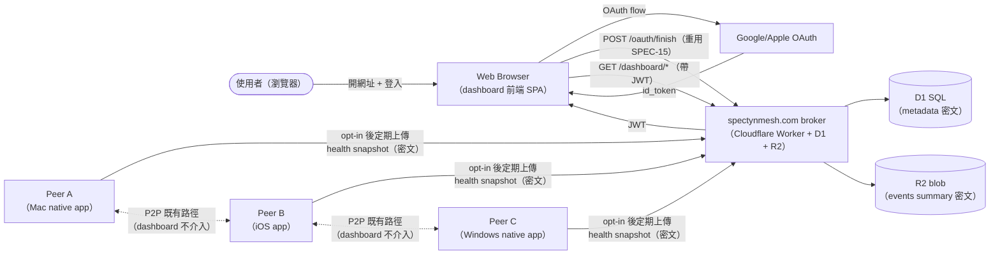
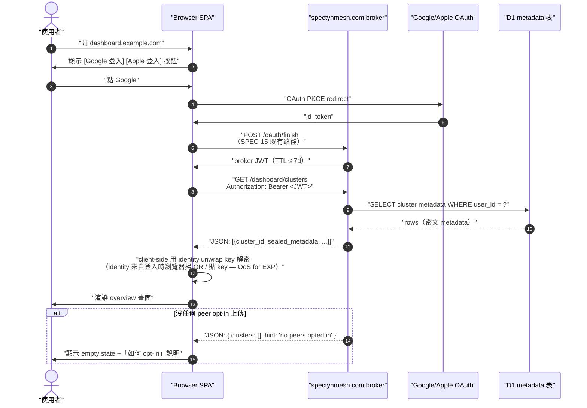

# SPEC-70-EXP · spectynmesh.com 唯讀網頁儀表板（read-only web dashboard for cluster health visibility）

> **EXP（experimental，實驗性）spec — 不是 v0.6.0 contract。** 本檔目的是把「未來想做」的設計輪廓畫出來，讓 v0.7.0+ cycle 開實作 spec 時有起點；§7-§10 等需要 wire-level 精度的章節在 EXP 階段刻意留白（OoS — out of scope，暫不做），不是漏寫。

---

## §0 Spec metadata

| Field | Value |
|---|---|
| Spec ID | `SPEC-70-EXP-web-dashboard` |
| Title | `spectynmesh.com 唯讀網頁儀表板` (English subtitle: `Opt-in read-only web dashboard for cluster health`) |
| Status | `DRAFT (post-v0.6.0)` |
| Version | `0.1.0` |
| Last updated | `2026-05-25` |
| Author | `Mark + Claude Opus 4.7 (1M context) / SPEC-70 EXP staging session` |
| Reviewer(s) | (待填) |
| Implementation owner | TBD（v0.7.0+ 接手者） |
| Target release | `v0.7.0+` |
| Pillar(s) served | `P1`（跨裝置 Mesh — 提供 mesh 自身的可觀察性表面）+ cross-pillar `X.observability`（讓 operator 看到 cluster 健康） |
| Track | `infra`（operator-facing 診斷工具；不屬 Life 也不屬 Work track） |
| Epic | `v0.7.0+ EXP01 web-dashboard` |
| BIG-GOAL phrase served | 「跑在你所有裝置上」（[BIG-GOAL.md](../../BIG-GOAL.md) §Four pillars · P1）— dashboard 讓使用者「看見」這句話正在發生 |
| Depends on | `SPEC-15-PROTOCOL-broker-vault-sync`（重用 OAuth + JWT 登入流）、`SPEC-50-SERVER-broker-api`（broker 端新增 dashboard endpoint 的 host）、`SPEC-29-SYSTEM-release-pipeline`（dashboard 自身的 CI/CD 部署） |
| Blocks | `(none in v0.6.0 — 全部 deferred)` |
| Template deviation | §7-§10 簡化或標 OoS，§8/§14/§15 完全略過 — 原因：EXP 階段只畫設計輪廓，wire-level 精度留給 v0.7.0+ 的 implementable spec |

---

## §1 TL;DR

### 1.1 繁中三段

**問題**：使用者目前要知道 cluster（叢集 = 自己的 mesh）健康狀態，只能在某一台機器跑 `spectyn cluster status` 或開該機器的 native（原生）app；若手邊只有 web browser（網頁瀏覽器）或沒裝 spectyn 的裝置就完全看不到。Operator（操作者，本檔指 cluster 擁有者）需要一個「不必登入任何特定機器」的 read-only（唯讀）觀察面。

**方案**：在已部署的 `spectynmesh.com` broker（中介伺服器）上加一個唯讀 web dashboard（網頁儀表板）。重用 SPEC-15 的 OAuth（開放授權）+ JWT（JSON Web Token，網頁權杖）登入 — 使用者用 Google/Apple 登入後，broker 從各 peer（節點）拉到的健康 metadata（中介資料 = 描述資料的資料）渲染成總覽 / cluster 詳情 / peer 列表 / event 串流四個畫面。所有 cluster 內容資料（vault 明文、event payload 明文）broker 端永遠看不到 — dashboard 只看 metadata。

**代價**：明確不做控制面板（不能改設定、不能派 task、不能讀 vault 明文 / event 明文）；不取代 native app；不離線可用（純 web，靠 broker 連線）；v0.6.0 不出，留 v0.7.0+；本檔不寫 wire-level schema/API（留給未來 implementable spec）。

### 1.2 English abstract

spectynmesh.com will expose an opt-in, read-only web dashboard so operators can observe cluster health from any browser without installing spectyn. Authentication reuses SPEC-15's Google/Apple OAuth plus broker-issued JWTs. The dashboard surfaces metadata that peers voluntarily publish to the broker — peer liveness, capability flags, recent task counts, error rate — across four screens (overview, cluster detail, peers, event stream). It never exposes vault plaintext or event payload plaintext: peer-side data is sealed with the user's identity key before upload, and the broker only stores metadata. The dashboard is explicitly not a control plane — no settings edit, no task dispatch, no plaintext read — and is deferred to v0.7.0+. This EXP spec sketches the design only; wire-level schema and API contracts are left to a follow-up implementable spec.

### 1.3 Glossary

> 本表覆蓋本檔用到的核心縮寫 + 英文名詞，繁中對照。同檔第二次出現後允許只用英文。
>
> - **dashboard（儀表板）** — 唯讀的健康狀態瀏覽介面，非控制面板
> - **broker（中介伺服器）** — `spectynmesh.com` 上跑的 Cloudflare Worker，本檔指它新增的 dashboard 路由
> - **OAuth（開放授權）** — RFC 6749 三方授權框架；登入用 Google/Apple，重用 SPEC-15
> - **JWT（JSON Web Token，網頁權杖）** — RFC 7519 bearer token，broker 簽發給瀏覽器 session
> - **peer（節點）** — spectyn mesh 裡的一台機器（手機 / 筆電 / 桌機都算）
> - **cluster（叢集）** — 同一使用者所有 peer 組成的 mesh
> - **metadata（中介資料）** — 描述資料的資料；本檔指 peer name / capability / 計數，不含明文內容
> - **vault（保險庫）** — SPEC-15 定義的 broker 端 key 儲存區（永遠加密）
> - **read-only（唯讀）** — 只能看不能改的存取模式
> - **opt-in（明示同意才開啟）** — 預設關閉，使用者主動啟用才生效

---

## §2 Context & Background

### 2.1 為什麼現在（其實是現在不做、未來做）

v0.6.0 cycle 把所有開發精力放在 4 pillars + 2 tracks 主幹（mesh / multimodal / evolve / encryption）跟 7 個 Sunday-deadline epic，沒有預算開新 surface。但在 dogfood（自食其力 = 自己用自家產品）過程中重複觀察到一個盲點：

- Operator 在某一台機器（如 Mac）跑 `spectyn cluster status`，只能看到「這台機器看到的 cluster 視圖」 — 其他 peer 是不是真活著、broker 看到幾台、有沒有 peer 卡住，要切到別台機器才知道。
- 手機 native app（SPEC-30/SPEC-33）有顯示「我這支手機的狀態」，但沒有 cluster-wide overview（叢集全景）。
- 偶爾在沒裝 spectyn 的裝置（如借朋友電腦、用平板 browser）只想看一眼 cluster 是不是還活著，目前無路徑。

因此 v0.7.0+ 規劃一個 broker-hosted（中介伺服器託管的）web dashboard 來補洞。

### 2.2 在 BIG-GOAL 哪裡

- **P1 跨裝置 Mesh** — BIG-GOAL §Four pillars P1「Spectyn is a peer-to-peer mesh, not server/client」。Dashboard 不違反這句話：它是觀察面（observability surface），不是控制面 — peer 之間照樣 P2P（peer-to-peer，端對端）通訊，broker 只是 metadata 中繼，不是必經路徑。
- **Cross-pillar X.observability** — 給 operator 「看見 mesh 正在跑」的能力，類似 SPEC-07-FOUNDATION-observability 的延伸；那份 spec 規範 client 端 telemetry（遙測），本檔規範把那些 telemetry 摘要呈現給瀏覽器。

### 2.3 既有解的歷史

- v0.5.0：完全沒有 cluster overview surface — 只有 per-peer 的 `spectyn cluster status` CLI（命令列）。
- v0.6.0：SPEC-26-SYSTEM-cluster-dispatch 引入 peer registry（節點登記表）但只在 RPC（遠端程序呼叫）層、無 UI。
- v0.6.0：native app（SPEC-30/SPEC-33/SPEC-40 等）有 per-platform 的 cluster 視圖，但無 cross-platform / no-install path。

### 2.4 相關 spec

- [`SPEC-15-PROTOCOL-broker-vault-sync.md`](SPEC-15-PROTOCOL-broker-vault-sync.md) — 提供 OAuth + JWT 登入流；本檔直接重用，不新發明 auth。
- [`SPEC-50-SERVER-broker-api.md`](SPEC-50-SERVER-broker-api.md) — broker 端 API 規範；本檔的 dashboard endpoint 是它的延伸命名空間（namespace 命名空間 = URL 前綴）。
- [`SPEC-29-SYSTEM-release-pipeline.md`](SPEC-29-SYSTEM-release-pipeline.md) — dashboard 前端的 build / deploy 流程沿用此 pipeline（管線 = 自動化流程鏈）。
- [`SPEC-07-FOUNDATION-observability.md`](SPEC-07-FOUNDATION-observability.md) — 定義 metric（量測指標）/ log（紀錄）/ trace（追蹤）格式；dashboard 顯示的是這份 spec 產出的子集。
- [`SPEC-04-FOUNDATION-error-catalog.md`](SPEC-04-FOUNDATION-error-catalog.md) — 錯誤碼來源，本檔不引入新 error。

---

## §3 Goals / Non-Goals / Out-of-Scope

### 3.1 Goals

- `[G1]` 使用者用 Google 或 Apple 登入 `spectynmesh.com/dashboard`，30 秒內看到自己 cluster 的 overview（peer 數 / 線上數 / 最近 24h task 數）。`(verifies via: T-dashboard-overview-load)`
- `[G2]` Dashboard 提供 4 個唯讀畫面：overview（總覽）/ cluster detail（叢集詳情）/ peers list（節點列表）/ events stream（事件串流摘要）— 全程不暴露任何 vault 明文或 event payload 明文。`(verifies via: T-dashboard-readonly-audit)`
- `[G3]` Broker 端對 dashboard 資料的處理符合「broker 不存明文」原則 — peer 上傳到 broker 的 health snapshot 必須先用 user 端 identity key 加密 metadata 欄位中的敏感片段（如 hostname、IP），broker 只在 dashboard render 前由 client 端 JavaScript 解密。`(verifies via: T-dashboard-privacy-e2e)`
- `[G4]` Dashboard 是 opt-in — 使用者第一次登入 broker 不會自動 enable，需在 broker settings 明示啟用 `dashboard_enabled = true` 後 peer 才開始上傳 health snapshot。`(verifies via: T-dashboard-optin-default-off)`
- `[G5]` Dashboard 前端不需要安裝任何 spectyn binary（執行檔）— 任意 modern browser（Chrome / Safari / Firefox / Edge 近 2 年版本）開網址即可用。`(verifies via: T-dashboard-browser-compat)`

### 3.2 Non-Goals

- `[NG1]` **不做控制面板** — dashboard 上沒有「重啟 peer」「派 task」「改設定」「刪 event」按鈕；任何寫入操作都要回到 native app 或 CLI。違反此原則等同把 broker 變成單一故障點（single point of failure），破壞 P1。
- `[NG2]` **不暴露 vault 明文** — vault key 永遠加密、永遠 client-side seal/unseal；dashboard 連 key 的 metadata 都不顯示（連 key 名都不列）。
- `[NG3]` **不暴露 event payload 明文** — event 內容（食物照片、focus session 音訊、coach 回應）broker 永不解密；dashboard 只看計數 / 時間軸 / 類別摘要。
- `[NG4]` **不取代 native app** — 本檔的 dashboard 是「無 spectyn 安裝時的 fallback 視窗」，不是主要 UX 介面。重大功能仍走 native app。
- `[NG5]` **不做 multi-tenant admin** — 不會做「我幫朋友看他的 cluster」這種功能；每個登入帳號只看自己的 cluster。

### 3.3 Out-of-Scope for this version

- `[OoS1]` 詳細 wire-level schema（資料結構規格）— 留給 v0.7.0+ implementable spec。
- `[OoS2]` 完整 wireframe（線框圖）/ visual design（視覺設計）/ design token（設計變數）對齊 — 留 SPEC-31 style 的 flow spec。
- `[OoS3]` 行動裝置原生 widget（小工具，如 iOS Home Screen widget）整合 — 純 web 不碰 native widget。

---

## §4 Job Stories

> Intercom 句型：**When** [情境], **I want to** [動機], **so I can** [結果]。每條映射到至少一個 §3.1 Goal。

- `[J1]` **When** 我人在外面用借來的筆電，只想確認家裡 cluster 是否還活著，**I want to** 在 browser 開個網頁登入就能看到 overview，**so I can** 不必跑回家或安裝 spectyn 就知道狀況。 (→ G1, G5)
- `[J2]` **When** 我手機 / 筆電 / 桌機 / 平板都有 peer，想看哪一台最近常掉線，**I want to** 在 dashboard 的 peers list 看到每台 last-seen（最後上線時間）+ uptime（運作時長）+ error count（錯誤計數），**so I can** 判斷要不要修哪一台。 (→ G2)
- `[J3]` **When** 我擔心 broker 是否偷看我資料，**I want to** 開 browser devtool（開發者工具）就能驗證「broker 回來的 payload 是 ciphertext（密文），瀏覽器端用我 identity 解密」，**so I can** 信任這個 dashboard 沒違反 P4 加密為先。 (→ G3)
- `[J4]` **When** 我從沒打開過 dashboard 也沒啟用，**I want to** 預設它就是關的、我 peer 不會自動上傳 health snapshot 給 broker，**so I can** 知道隱私是預設安全的。 (→ G4)

---

## §5 Personas

> 從 BIG-GOAL §Audience 6 種挑選；不造新人物。

### 5.1 Solo developer-operator（單人開發者兼營運者）

擁有 3-5 台裝置 mesh、自己當 ops（運維）的開發者。期待：dashboard 是「在外移動時的快速 health check 視窗」，不必扛 laptop。

### 5.2 Privacy-conscious power user（重視隱私的進階使用者）

之前因 cloud SaaS（軟體即服務）走光資料而轉用 spectyn；對 broker 任何新功能都先質疑「會不會看到我資料」。期待：dashboard 端對端可驗證 broker 看不到明文（J3 路徑）。

### 5.3 Onboarding-stage new user（初上手新使用者）

剛裝完 spectyn 30 秒 hello（SPEC-28）的人；還沒摸熟 native app。期待：dashboard 是「圖形化補充」，讓他在 browser 看一眼 cluster 比看 CLI 直覺。

---

## §6 System Architecture

### 6.1 System-context diagram



### 6.2 Component breakdown

| 元件 | 程式碼位置（規劃） | 職責一句話 | 對外介面（§9） |
|---|---|---|---|
| Dashboard SPA（single-page app，單頁應用） | `spectynmesh-io/dashboard/src/` | 渲染 4 個唯讀畫面、client-side 解密 metadata | 呼叫 broker `/dashboard/*` |
| Broker dashboard handler | `spectynmesh-io/src/dashboard.ts` | 接 SPA 請求、查 D1/R2、回密文 + metadata | 暴露 `/dashboard/*` REST |
| Peer health snapshot uploader | `core/src/dashboard_upload.rs` | opt-in 後每 N 秒上傳 sealed snapshot | 呼叫 broker `/dashboard/upload`（OoS — 詳細 endpoint v0.7.0+ 寫） |
| Snapshot sealer | `core/src/dashboard_seal.rs` | 用 user identity 加密 metadata 敏感欄位 | 內呼 `crypto::age::encrypt`（SPEC-13） |

### 6.3 Sequence diagram — 使用者登入 + 第一次看到 overview



> 註：上圖第 11 步「browser 端如何取得 identity unwrap key」是 EXP 階段最大未解問題 — 見 §18 Open Q3。

---

## §7 Data Model

> **EXP scope**：本節只列兩個核心 schema 的型別簽章（TypeScript interface + Rust struct），完整欄位字典 / SQL DDL（資料定義語言）/ JSON Schema validation（驗證規格）**OoS — defer to implementable spec in v0.7.0 cycle**。

### 7.1 `DashboardSession`（瀏覽器 session 元資料）

```typescript
// spectynmesh-io/dashboard/src/types.ts
export interface DashboardSession {
  session_id: string;          // ULID（Universally Unique Lexicographically Sortable Identifier，可排序 UUID）
  user_id: string;             // OAuth subject claim
  jwt_exp_ms: number;          // JWT 到期時間 (epoch ms)
  identity_unwrap_method: "qr_scan" | "paste" | "device_link";
  identity_loaded_at_ms: number | null;  // null = 尚未解密過任何 metadata
  enabled_clusters: string[];  // user 在 broker settings 勾選哪些 cluster 要顯示
}
```

```rust
// core/src/dashboard_types.rs (對 peer 端意義有限 — peer 不持有 session，這份 struct 主要給 e2e 測試 mock 用)
#[derive(serde::Serialize, serde::Deserialize, Debug, Clone)]
pub struct DashboardSession {
    pub session_id: String,
    pub user_id: String,
    pub jwt_exp_ms: i64,
    pub identity_unwrap_method: IdentityUnwrapMethod,
    pub identity_loaded_at_ms: Option<i64>,
    pub enabled_clusters: Vec<String>,
}

#[derive(serde::Serialize, serde::Deserialize, Debug, Clone)]
#[serde(rename_all = "snake_case")]
pub enum IdentityUnwrapMethod { QrScan, Paste, DeviceLink }
```

### 7.2 `ClusterHealthSnapshot`（peer 上傳給 broker 的健康快照）

```typescript
// spectynmesh-io/dashboard/src/types.ts
export interface ClusterHealthSnapshot {
  snapshot_id: string;                 // ULID
  cluster_id: string;
  peer_id: string;                     // 公開（非敏感）
  ts_ms: number;
  // 下列欄位整包 age-sealed by user identity，broker 看到的是 ciphertext blob
  sealed_payload: string;              // base64(age-encrypted JSON of SealedFields)
  // 公開摘要（broker 可看，避免 dashboard 每個 query 都要 client decrypt）
  peer_count_visible: number;
  online_count_visible: number;
}

export interface SealedFields {        // 加密在 sealed_payload 裡，broker 看不到
  hostname_hint: string;               // 例「Mark-MBA」
  os_family: "macos" | "windows" | "linux" | "ios" | "android";
  capabilities: string[];              // 如 ["gpu", "camera", "always-on"]
  last_24h_task_count: number;
  last_24h_error_count: number;
  uptime_s: number;
}
```

```rust
// core/src/dashboard_types.rs
#[derive(serde::Serialize, serde::Deserialize, Debug, Clone)]
pub struct ClusterHealthSnapshot {
    pub snapshot_id: String,
    pub cluster_id: String,
    pub peer_id: String,
    pub ts_ms: i64,
    pub sealed_payload: String, // base64(age ciphertext)
    pub peer_count_visible: u32,
    pub online_count_visible: u32,
}

#[derive(serde::Serialize, serde::Deserialize, Debug, Clone)]
pub struct SealedFields {
    pub hostname_hint: String,
    pub os_family: OsFamily,
    pub capabilities: Vec<String>,
    pub last_24h_task_count: u32,
    pub last_24h_error_count: u32,
    pub uptime_s: u64,
}

#[derive(serde::Serialize, serde::Deserialize, Debug, Clone)]
#[serde(rename_all = "snake_case")]
pub enum OsFamily { Macos, Windows, Linux, Ios, Android }
```

### 7.3 其他 schema — OoS

D1 DDL / R2 key naming convention / retention 規則 / migration plan — **Out of scope for EXP — defer to implementable spec in v0.7.0 cycle**。原因：DDL 一旦寫就是 wire contract（要做 migration），EXP 不該綁死。

---

## §8 State Machines

**OoS — defer to implementable spec in v0.7.0 cycle**。原因：dashboard 是 stateless（無狀態）查詢面，只有 SPA 的 UI loading / ready / error 三個微小狀態，不值得在 EXP 階段畫狀態圖。

---

## §9 API surface（簡化清單，非完整 contract）

> **EXP scope**：以下只列 endpoint 簽章 + 一句目的描述，**full request/response schema / 所有 error code / idempotency 規則 OoS — defer to implementable spec in v0.7.0 cycle**。

### 9.1 Broker 新增的 dashboard endpoint（命名空間 `/dashboard/*`）

| Method | Path | Purpose | Auth |
|---|---|---|---|
| `GET` | `/dashboard/clusters` | 列出登入 user 名下所有 enabled cluster（回密文 metadata） | Bearer JWT |
| `GET` | `/dashboard/cluster/{cluster_id}` | 取單一 cluster 的 overview snapshot（最新一筆） | Bearer JWT |
| `GET` | `/dashboard/cluster/{cluster_id}/peers` | 列出該 cluster 所有 peer 的最新 snapshot（密文） | Bearer JWT |
| `GET` | `/dashboard/cluster/{cluster_id}/events_summary?window=24h` | 回該 cluster 該時間窗的 event 計數 by category（不含明文） | Bearer JWT |
| `GET` | `/dashboard/cluster/{cluster_id}/peers/{peer_id}/recent` | 取單一 peer 最近 N 筆 snapshot（用於 sparkline 走勢） | Bearer JWT |
| `POST` | `/dashboard/settings/enable` | Opt-in 啟用 dashboard（toggle `dashboard_enabled = true`） | Bearer JWT |

### 9.2 不在本檔規範

- Peer → broker 的上傳 endpoint（`POST /dashboard/upload` 之類）— **OoS**，留 v0.7.0+ implementable spec 與 peer 端 `dashboard_upload.rs` 一起設計。
- 全部 error response 字典 — **OoS**，但承諾沿用 SPEC-04 catalog（見 §11）。
- Rate limit 數值 / idempotency key 規則 — **OoS**。

---

## §10 UI Screens（清單 + 一句描述，不寫 wireframe）

> **EXP scope**：列 4 個主畫面 + 用途，**詳細 wireframe / component inventory / state matrix OoS — defer to implementable spec via SPEC-31-style flow spec in v0.7.0 cycle**。

| # | Screen | 路由（route） | 一句用途 |
|---|---|---|---|
| 1 | Overview | `/` | 登入後第一畫面 — 顯示「N 個 cluster / M 台 peer 線上 / X 個 24h task」總覽卡片 |
| 2 | Cluster Detail | `/c/{cluster_id}` | 單一 cluster 的健康狀態 — peer 數走勢、最近 events 計數、capability 涵蓋率 |
| 3 | Peers List | `/c/{cluster_id}/peers` | 該 cluster 所有 peer 的 table — name (從 hostname_hint 解密) / OS / capabilities / last-seen / error count |
| 4 | Events Stream Summary | `/c/{cluster_id}/events` | 24h 時間軸 + 計數 by category（food / focus / habit / coach / task）— **不顯示任何 event payload 明文** |

進一步 visual / interaction / a11y（accessibility，無障礙）規範留 v0.7.0+ 寫 SPEC-31 等 flow spec 處理。

---

## §11 Error model

本檔**不引入新 error code**。所有 dashboard 端錯誤沿用 [`SPEC-04-FOUNDATION-error-catalog.md`](SPEC-04-FOUNDATION-error-catalog.md) 既有條目，重點重用：

- `auth_invalid` — JWT 過期 / 無效 → SPA 跳 OAuth re-login
- `rate_limited` — broker 端 rate limit 觸發 → 顯示 retry-after 倒數
- `not_found` — cluster_id 不存在或非本 user → 顯示「找不到此 cluster」
- `internal_error` — 通用後端錯誤 → 顯示通用錯誤頁 + correlation id（追蹤識別碼）
- `identity_decrypt_failed`（如 SPEC-04 已存在；否則 v0.7.0+ spec 新增）— SPA client-side 解密失敗 → 提示重新匯入 identity unwrap material

---

## §12 Performance budgets（簡略）

| Metric | Target | Hard limit | Measured by |
|---|---|---|---|
| Cold load dashboard overview（含 OAuth）p50 | < 5s | < 12s p95 | client-side timestamp |
| `GET /dashboard/clusters` server-side p50 | < 300ms | < 1.5s p95 | Cloudflare Worker analytics |
| Snapshot payload size per peer | < 4 KB sealed | < 16 KB | upload server log |
| Concurrent dashboard sessions per broker | 100 | 500（hard cap，超過拒登） | broker counter |

---

## §13 Privacy（核心章節）

這節是本檔的設計命脈，不能簡化。

### 13.1 設計原則

- **Broker 永遠看不到 cluster 內容明文**。Vault 明文已經被 SPEC-15 守住；本檔額外確保 health snapshot 內可能洩漏個資的欄位（hostname、IP hint、capability list）一律 sealed-by-identity，broker 只看密文 + 公開計數。
- **公開 metadata 嚴格 minimise（最小化）**。Broker 可看到的非密文欄位只有 `peer_count_visible` / `online_count_visible` / `cluster_id` / `peer_id` / `ts_ms` — 都不足以指認個人或還原內容。
- **Dashboard SPA 必須在 client-side 完成解密**。Broker 回 ciphertext，SPA 用瀏覽器端持有的 identity unwrap material（key / 拼字 phrase / 連結裝置）就地解，broker 全程不接觸明文。
- **Identity 不會 hardcode 在瀏覽器**。Browser session 結束後 identity material 從 memory 清除（不寫 localStorage 明文；若必要快取則用 IndexedDB + WebCrypto encrypt-at-rest 包一層）。
- **Opt-in 默認關閉**。Peer 在使用者沒明示同意前不上傳任何 health snapshot。Opt-in 設定本身會記在 broker D1 但只記 boolean，不記 audit log 明細。

### 13.2 威脅模型（STRIDE 快速掃）

| 類型 | 攻擊面 | 緩解 |
|---|---|---|
| Spoofing | 偽冒 user 登入看別人 cluster | OAuth + JWT subject claim 驗證；broker 端 query 全帶 user_id filter |
| Tampering | 改 ciphertext 騙 SPA | age v1 有 AEAD（authenticated encryption with associated data，帶驗證的加密）保護；解密失敗即拒 |
| Repudiation | broker 否認接收上傳 | 上傳 endpoint 回 snapshot_id + ts_ms 收據 |
| Information disclosure | broker 員工 / 攻擊者讀 D1 | sealed 欄位只有 ciphertext；公開欄位 minimise；D1 access 受 Cloudflare 控制 + log |
| Denial of service | 大量假上傳塞爆 broker | rate limit per JWT；snapshot size hard cap |
| Elevation of privilege | dashboard JWT 偷拿去當 vault JWT | JWT scope claim 分 `vault` vs `dashboard`；broker 端 endpoint 檢查 scope |

### 13.3 GDPR / 使用者刪除權

使用者按 broker 的「停用 dashboard 並刪資料」按鈕後，broker 必須在 24h 內刪光該 user 所有 D1 metadata row + R2 events summary blob — 沿用 SPEC-15 §3.1 G4 的 wipe SLA。

---

## §14 Migration

n/a（新功能 — 從零部署）。

---

## §15 OoS / 暫不做（彙整）

- §7 完整 schema / DDL — OoS
- §8 state machine — OoS（dashboard 是 stateless 查詢面）
- §9 完整 request/response / error map / idempotency — OoS
- §10 wireframe / interaction / a11y / copy table — OoS
- 行動裝置 native widget 整合 — OoS（永久 Non-Goal）
- 多帳號 / 多 tenant admin 視圖 — OoS（永久 Non-Goal）
- Real-time push（如 WebSocket / SSE）— OoS for v0.7.0；先 poll，未來看需求
- 控制面板能力（任何寫入操作 except `/settings/enable`）— 永久 Non-Goal

---

## §16 Risks

| # | Risk | Likelihood | Impact | Mitigation | Owner |
|---|---|---|---|---|---|
| R1 | 「dashboard 是控制面」誤解蔓延 — 社群以為可以從 web 派 task / 改設定 | 中 | 高（破壞 P1 P2P 信任） | 文件 + onboarding 反覆強調 read-only；UI 不渲染任何 write 按鈕 | future v0.7.0 owner |
| R2 | Browser-side identity unwrap material 流失 — XSS（cross-site scripting，跨站腳本攻擊）偷 key | 低-中 | 高（攻擊者可解 metadata） | strict CSP（content security policy，內容安全政策）+ SRI（subresource integrity，子資源完整性）+ identity material 不寫 localStorage |  |
| R3 | Peer 上傳頻率太高炸 broker quota | 中 | 中（影響 Cloudflare 帳單） | upload interval ≥ 60s + payload size hard cap + per-user rate limit |  |
| R4 | Opt-in 不夠 explicit — 使用者按到 enable 沒意識到 metadata 開始外流 | 中 | 中（隱私信任崩） | enable 流程加 confirmation modal + 明列「broker 會看到什麼 / 看不到什麼」 |  |
| R5 | 跟 SPEC-15 vault JWT 共用 secret 出問題 — 一邊洩漏全洩漏 | 低 | 高 | JWT scope claim 嚴格切分；signing key 分流 |  |
| R6 | EXP 階段設計 lock-in — 之後 implementable spec 想改設計但已有人寫程式跟著 EXP 走 | 中 | 中 | 本檔頂部明示「EXP, 非 contract」；blocking 限制只在 v0.7.0+ |  |

---

## §17 Alternatives Considered + Abandoned Ideas

### 17.1 Native cross-platform desktop app（取代 web dashboard）

**方案**：用 Tauri 寫獨立 cross-platform desktop 程式，叫 `spectyn-dashboard.app`，由 user 安裝後看 cluster。

**為何沒選**：J1 場景（借來的筆電 / 沒裝 spectyn 的裝置）直接破功 — 還是要安裝。而且 desktop app 重做一遍 packaging / sign / notarize 的 overhead 在 EXP 階段不划算。

**什麼條件會回來**：如果 web 端的 client-side 加解密 UX 太爛（identity 匯入流程使用者學不會），可能回頭做 desktop app 用本機 identity.key 自動讀。

### 17.2 Self-hosted dashboard（peer 自帶 web server）

**方案**：每台 peer 跑一個本機 web server（如 `spectyn serve --dashboard --port 8788`），user 在 LAN（區域網路）內開瀏覽器連 peer IP 看 dashboard。

**為何沒選**：違反 J1 「我人在外面」場景；且需要使用者懂 IP / port forwarding，新手退散。優點是 broker 完全不參與（更 P1 一致），缺點是 portability 接近 0。

**什麼條件會回來**：如果 broker 被 deprecate 或社群一致反對 broker-centric dashboard，可以做 self-host fallback。

### 17.3 GitHub Pages 純前端 + peer 直接被 browser 連

**方案**：dashboard 純靜態前端 host on GitHub Pages，瀏覽器透過 WebRTC（網頁即時通訊）直接連 peer 端。

**為何沒選**：WebRTC NAT（網路位址轉譯）穿透要 STUN/TURN signaling server — 又要 broker；且每 peer 要開 WebRTC port 增加攻擊面；J1 借機場景 browser 沒法跟 user 家裡 peer 對通。

**什麼條件會回來**：若 broker 信任度長期低落而 P2P signaling 框架成熟（如 libp2p browser node 穩定），可以考慮。

---

## §18 Open Questions & Decisions

| # | Question | Default assumption（v0.7.0 spec 不另議決時採用） | When needed |
|---|---|---|---|
| Q1 | Browser 端如何取得 identity unwrap material — QR scan 既有 device、貼 phrase、device-link 配對？三選一還是並陳？ | **並陳三種**，預設提 QR scan（最 friction-low） | v0.7.0 implementable spec |
| Q2 | Dashboard SPA host 在哪 — 跟 broker 同 origin（`spectynmesh.com/dashboard`） 還是分 subdomain（`dashboard.spectynmesh.com`）？ | **分 subdomain**（CSP 隔離較乾淨） | v0.7.0 deploy stage |
| Q3 | Browser session 結束後 identity material 是否完全清除，還是允許 IndexedDB encrypt-at-rest 加快下次登入？ | **完全清除**（隱私優先；下次登入再次 unwrap） | v0.7.0 UX 決策 |
| Q4 | Peer 上傳 health snapshot 的最小間隔是固定（60s）還是 adaptive（隨 cluster 活躍度調整）？ | **固定 60s**（簡單） | v0.7.0 peer-side spec |
| Q5 | Events stream summary 的 category 列表用哪份 schema？沿用 SPEC-16 event_storage 還是另立摘要分類？ | **沿用 SPEC-16** category 直接 group by | v0.7.0 schema 階段 |
| Q6 | 是否提供「分享 read-only snapshot link」給朋友看（時效 ≤ 1h）？ | **不做**（增 attack surface 又貼近 NG5） | 若使用者強烈要求才議 |

---

## §19 Testing

> **EXP scope**：詳細測試矩陣 / 覆蓋率目標 / 自動化測試棚 — **OoS — defer to implementable spec in v0.7.0 cycle**。本節只列佔位 placeholder（佔位 = 預留識別碼）讓未來 SPEC-60 補。

預定測項 ID（皆 placeholder）：

- `T-dashboard-overview-load` — Goal G1 / G5 — 端到端 OAuth + 第一畫面在 5s 內完成
- `T-dashboard-readonly-audit` — Goal G2 — 跑爬蟲掃 SPA bundle 確認沒有任何 write endpoint 呼叫
- `T-dashboard-privacy-e2e` — Goal G3 — broker mock 回 ciphertext，驗 SPA client-side 解密；mitmproxy 抓 broker request 確認無明文流出

完整測試規範等 v0.7.0+ implementable spec 與 SPEC-60-TESTING-strategy 對接。

---

## §20 Appendices

### A. Sample payloads

EXP 階段不附（避免被當 wire contract）；v0.7.0+ implementable spec 補。

### B. References

- SPEC-15 broker vault sync（OAuth + JWT 來源）
- SPEC-50 broker API（host server）
- SPEC-29 release pipeline（dashboard SPA build/deploy）
- SPEC-07 observability（metric / log / trace 來源）
- SPEC-04 error catalog（不新增 error）
- BIG-GOAL.md §Four pillars P1（peer-to-peer mesh, not server/client）

### C. Glossary（補完 §1.3 沒涵蓋的）

- **SPA（single-page app，單頁應用）** — 單一 HTML 載入後 client-side 路由換畫面的網頁架構
- **CSP（content security policy，內容安全政策）** — HTTP header 限制 browser 載入哪些資源
- **SRI（subresource integrity，子資源完整性）** — HTML 標籤上掛 hash 驗證載入檔案沒被改
- **AEAD（authenticated encryption with associated data，帶驗證的加密）** — 加密同時帶完整性檢查，age v1 用
- **XSS（cross-site scripting，跨站腳本攻擊）** — 在他人網站塞惡意 JS 的攻擊
- **STRIDE** — 微軟威脅建模框架 6 種攻擊類型（Spoofing / Tampering / Repudiation / Information disclosure / Denial of service / Elevation of privilege）

### D. Changelog

- **0.1.0 (2026-05-25)** — Initial EXP draft. §7-§10 刻意低精度，標 OoS；§13 privacy 為全檔最詳；blocks nothing in v0.6.0。

---

# EXP spec 寫作硬規則（適用本檔）

1. 不假裝 wire-level 精度 — §7-§10 明示 OoS。
2. 不引入新 dependency 到 v0.6.0 — `Blocks: none in v0.6.0`。
3. 不引入新 error code — 沿用 SPEC-04。
4. 不寫進 SPEC-00-INDEX active 區，至多放 EXP / future 區（由 INDEX 維護者決定）。
5. 文檔頂部明示「EXP, 非 contract」— 避免被讀成 implementable spec。
