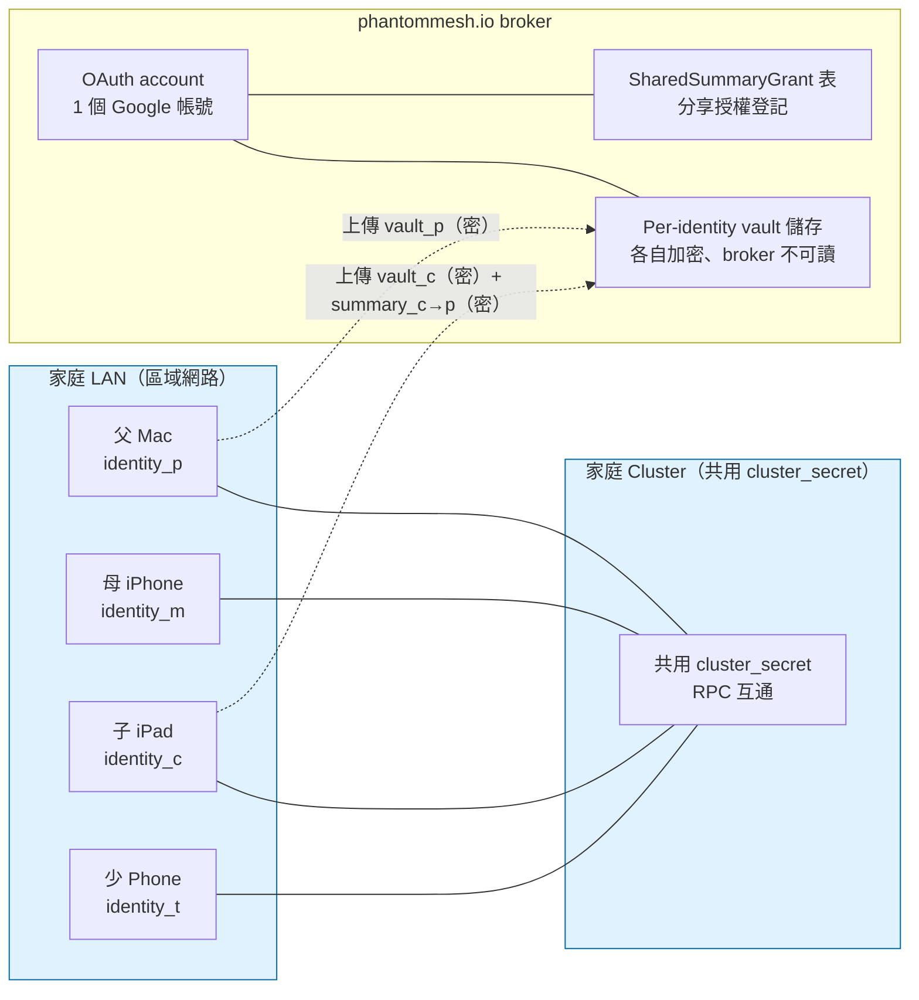
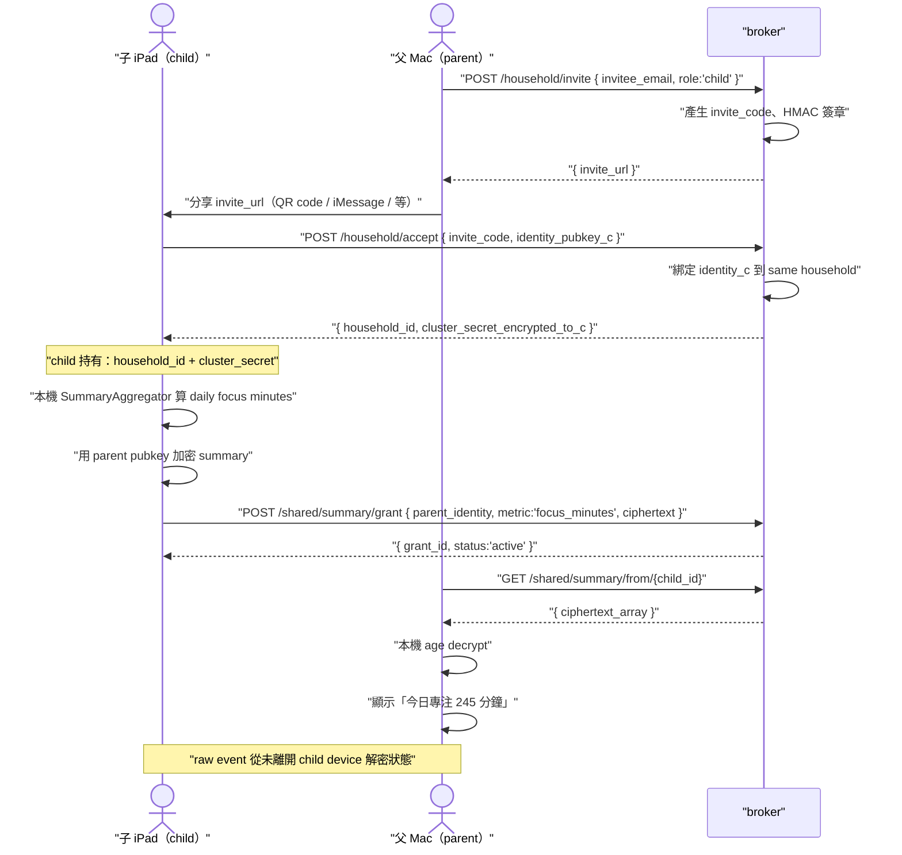
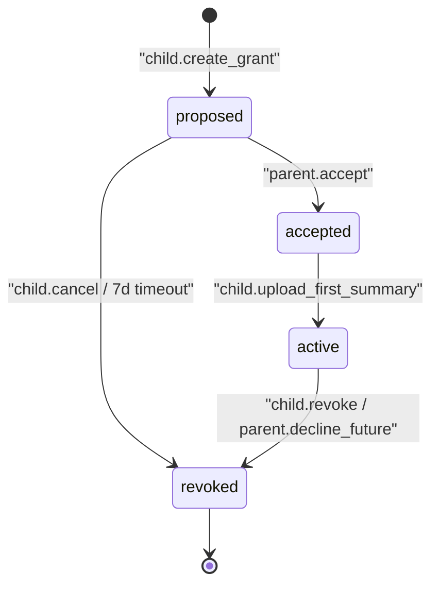

# SPEC-71-EXP-multi-user-household — 家庭多使用者模型（Household multi-user model）

> **Status**：`DRAFT (post-v0.6.0 EXP，實驗性、僅供 v0.7.0+ 規劃用)`。本檔不進 v0.6.0 GA（General Availability，公開正式版）的 ship-gate（出貨檢驗關卡）。
>
> **讀者門檻**：研究生 / 大學生第一次接觸本 repo（程式碼倉庫）。每個英文縮寫（acronym）或英文名詞（noun）首次出現旁註中文意譯。Mermaid 圖 label（標籤）一律用 `["..."]` 雙引號包，避免 syntax error（語法錯誤）。

---

## §0 Spec metadata

| Field | Value |
|---|---|
| Spec ID | `SPEC-71-EXP-multi-user-household` |
| Title | 家庭多使用者模型（Household multi-user model） |
| Status | `DRAFT (post-v0.6.0)` |
| Version | `0.1.0` |
| Last updated | `2026-05-25` |
| Author | operator + Claude Opus 4.7 (1M context) session 2026-05-25 |
| Reviewer(s) | （待填） |
| Implementation owner | （待填，v0.7.0+ epic owner） |
| Target release | `v0.7.0+` |
| Pillar(s) served | P4（加密為先）為主、cross-pillar X（家庭使用情境跨 P1+P2+P4） |
| Track | Life Track（生活軌道；非 Work Track） |
| Epic | `v0.7.0+ EXP02 multi-user`（household 家庭使用者） |
| BIG-GOAL phrase served | 「Data is yours alone to read; the model is yours to choose.」— 家庭場景下「yours」需從個人擴展為「個別家庭成員」 |
| Depends on | [`SPEC-12-PROTOCOL-identity-keypair.md`](SPEC-12-PROTOCOL-identity-keypair.md), [`SPEC-13-PROTOCOL-encryption-age.md`](SPEC-13-PROTOCOL-encryption-age.md), [`SPEC-15-PROTOCOL-broker-vault-sync.md`](SPEC-15-PROTOCOL-broker-vault-sync.md), [`SPEC-08-FOUNDATION-threat-model.md`](SPEC-08-FOUNDATION-threat-model.md) |
| Blocks | （v0.6.0 內無 spec 被擋；v0.7.0+ EXP02 epic 啟動才會解鎖） |
| Template deviation | `partial`：§7-§10 標 `OoS for EXP`（Out-of-Scope for EXP，實驗階段不深入）— 因 EXP 階段尚未進入 implementable（可實作）狀態，僅需骨架; §7 schema 2-layer (Rust + TS via ts-rs export tests) instead of 3-layer (Rust + TS + JSON Schema artifact). Rationale: ts-rs `#[ts(export)]` compile-time round-trip provides equivalent guarantee; JSON Schema artifact would duplicate maintenance burden for internal Rust-only types. |

---

## §1 TL;DR

### 1.1 繁中（三段）

**問題**：v0.6.0 假設「**1 個使用者 = 1 把 `identity.key`（身分金鑰檔）+ 1 個 cluster（叢集）**」。但實際家庭場景一家 4 口共用同 LAN（Local Area Network，區域網路）、共用 1 個 mesh（網狀網路）cluster；每位成員又有獨立隱私需求（父母不該看小孩 raw event 原始事件）。Apple Family Sharing（蘋果家庭共享）與 Google Family Link（家庭連結）能做帳務 / 監管，但雲端 SaaS（Software as a Service，軟體即服務）天生能讀到內容，違反 P4（加密為先）。

**方案**：家庭層引入兩個正交（orthogonal，相互獨立）概念：(1) **HouseholdMembership（家庭成員身分）**— 多個 `identity.key` 共享同一 `cluster_secret`（叢集共用密鑰）但 vault（保險庫）各自加密；(2) **SharedSummaryGrant（彙整分享授權）**— 兒童（child）在自己 device（裝置）端把 raw event 先彙整成 daily summary（每日摘要）並用父母 public key（公鑰）加密，broker（中介伺服器）只搬密文、家長解密後也只看得到「今日專注 245 分鐘」而非 raw event。

**代價**：(a) Broker schema（資料庫綱要）多一張表；(b) 兒童端 daily aggregation（每日彙整）需多算一次；(c) consent（同意）revoke（撤回）後歷史摘要保留還是刪由 child 端設定（非 broker）；(d) **不做** enterprise multi-tenant（企業多租戶）、不做 ABAC（Attribute-Based Access Control，屬性式存取控制）、不做跨 household 分享。

### 1.2 English abstract

This experimental spec extends Spectyn Mesh from a single-user model to a household model (typical 2–6 family members sharing a LAN). Each member keeps an independent per-device `identity.key`; vault encryption stays per-identity, so no member can decrypt another's raw events. Cross-member visibility is restricted to opt-in aggregated daily summaries: the child computes the summary locally, encrypts it with the parent's public key, and the broker stores only ciphertext. Parents cannot see raw events; consent is revocable; one Google account at the broker can bind up to N (default 6) identities for billing. The spec deliberately excludes enterprise SSO (Single Sign-On), attribute-based access control, and cross-household sharing — those are SaaS problems and violate Pillar P4 (encryption-first).

### 1.3 縮寫對照表（glossary for §1）

> | 縮寫 / 英文詞 | 中文意譯 | 一句解釋 |
> |---|---|---|
> | LAN（Local Area Network） | 區域網路 | 家裡 Wi-Fi 一張子網段，所有家庭成員 device 都在此 |
> | mesh | 網狀網路 | Spectyn 內每台 device 同時是 peer（同儕） + client（用戶端）的 P1 拓樸 |
> | cluster | 叢集 | 共享一份 `cluster_secret` 而能 RPC（Remote Procedure Call，遠端程序呼叫）互通的 peer 集合 |
> | vault | 保險庫 | 個人加密資料儲存區（`~/.spectyn-mesh/vault/*.age`） |
> | identity.key | 身分金鑰檔 | 每台 device 一把的 ed25519 私鑰，HKDF（雜湊金鑰衍生函數）派生 |
> | broker | 中介伺服器 | phantommesh.io 的雲端服務，跨 NAT 配對 + 付費同步 |
> | SaaS（Software as a Service） | 軟體即服務 | 廠商主機跑、使用者付費、廠商看得到資料的雲端產品模型 |
> | grant（noun） | 授權 | 一條 child → parent 的彙整分享允許紀錄 |
> | summary | 彙整 / 摘要 | 從 raw event 算出的非還原性聚合（如 daily focus minutes） |
> | aggregation | 聚合運算 | 把 N 筆 event 算成 1 個 metric 的過程 |
> | consent | 同意 / 授權同意 | 法律意義上的「我允許你看」標記 |
> | ABAC（Attribute-Based Access Control） | 屬性式存取控制 | 用屬性（年齡、部門）動態判斷的權限模型 |
> | tenant | 租戶 | SaaS 一個獨立隔離的客戶單位（企業用） |

---

## §2 Context & Background

### 2.1 為什麼現在做（v0.7.0+ 而非 v0.6.0）

**v0.6.0 假設失效的觸發點**：operator 2026-05 自家 dogfood（自食其食，自己用自己產品）時發現以下三個情境同時出現：

1. 自己在 Mac 跑 spectyn focus capture（專注時段 audio 記錄），但家中 node-a（Lin + Win/WSL2 雙系統電腦）已被家人借用，無法 join cluster（叢集）— 因為 `identity.key` 是「**device + user**」綁定，沒有 multi-user 概念。
2. 家長想知道小孩今天「是否有專注學習 30 分鐘」這個 daily aggregate metric（每日聚合指標），但不想看 raw audio / 不想看 raw text。v0.6.0 vault 是 all-or-nothing（全有或全無）加密，沒有「中間粒度（intermediate granularity）」分享能力。
3. broker 計費單位是「1 OAuth（Open Authorization，開放授權）account = 1 vault」，但家庭 plan（方案）應該允許 1 account 綁 N 個 identity，否則家庭採購不可行。

### 2.2 在 BIG-GOAL 哪裡

服務 **P4（加密為先）**，並橫向（cross-pillar）影響 P1（跨裝置 mesh）+ P2（多模態理解，因為 child 端要先做 multimodal capture 再 aggregate）。BIG-GOAL 句子「**Data is yours alone to read**」在家庭脈絡（household context）下，「yours」必須擴展為「個別 family member（家庭成員）」而非「家庭整體」。

### 2.3 既有解的歷史與痛點

| 既有解 | 痛點 |
|---|---|
| Apple Family Sharing（蘋果家庭共享） | 雲端 SaaS、Apple 看得到 raw 內容、不支援自架 broker |
| Google Family Link（Google 家庭連結） | 同上、且偏向 parental control（家長監管）而非 mutual sharing（雙向分享） |
| Microsoft Family Safety | Windows 中心、跨 OS（作業系統）支援差 |
| 自家手刻 — 多人共用 1 個 identity.key | 失去個別 vault 加密、任何成員 device 失竊則全家暴露 |
| 自家手刻 — N 個獨立 cluster 各自 mesh | 同 LAN 重複跑 mesh、無法分享 aggregation、broker 計費混亂 |

### 2.4 相關 spec

- [`SPEC-12-PROTOCOL-identity-keypair.md`](SPEC-12-PROTOCOL-identity-keypair.md) — `identity.key` 衍生規則；本 spec 不改該規則，只增 multi-identity（多身分）綁同 cluster 的能力
- [`SPEC-13-PROTOCOL-encryption-age.md`](SPEC-13-PROTOCOL-encryption-age.md) — age v1（age 加密格式第 1 版）格式；SharedSummaryGrant 的密文用 age recipients（收件人）多人加密能力
- [`SPEC-15-PROTOCOL-broker-vault-sync.md`](SPEC-15-PROTOCOL-broker-vault-sync.md) — broker vault 同步；本 spec 把單一 vault path 擴成 `/vault/<household>/<identity>/*`
- [`SPEC-08-FOUNDATION-threat-model.md`](SPEC-08-FOUNDATION-threat-model.md) — STRIDE 威脅模型；本 spec §13 在此基礎上加「家長越權」「兒童被脅迫 grant」兩種家庭專屬威脅

---

## §3 Goals / Non-Goals / Out-of-Scope

### 3.1 Goals

- `[G1]` 一家 6 人可同時 join（加入）同 cluster，個別 vault 互不可解密。`(verifies via: T-household-isolation-G1)`
- `[G2]` Child（兒童成員）能在自己 device 算 daily focus minutes summary（每日專注分鐘彙整），加密後送 broker。`(verifies via: T-household-grant-G2)`
- `[G3]` Parent（家長成員）能解密自己被 grant 的 summary，但**不能**解密 child 的 raw event vault blob（二進位資料塊）。`(verifies via: T-household-parent-readonly-G3)`
- `[G4]` Sharing grant（分享授權）狀態 ≤ 5 秒內反映到 broker（child 端 revoke 後 parent 下一次拉取得到 401）。`(verifies via: T-household-revoke-G4)`
- `[G5]` 1 broker OAuth account 可綁 ≥ 6 個 identity 且帳單合一。`(verifies via: T-household-billing-G5)`
- `[G6]` Audit log（稽核日誌）紀錄每次「grant 建立 / 使用 / revoke」並可由 child / parent 雙方查到。`(verifies via: T-household-audit-G6)`

### 3.2 Non-Goals（設計上明確不做）

- `[NG1]` 不做 **enterprise multi-tenant**（企業多租戶）— 一旦支援組織層級需要 IT admin、SSO、SCIM（System for Cross-domain Identity Management，跨域身分管理系統），這 violates BIG-GOAL Anti-Audience「企業 IT 採購窗口」條目。
- `[NG2]` 不做 **ABAC**（屬性式存取控制）— 家庭規模 < 10 人，bottom-up（由下而上）explicit grant 已足；ABAC 引入 policy engine（策略引擎）增複雜度且不可審計。
- `[NG3]` 不做 **跨 household sharing**（跨家庭分享）— 例如「我把我的 daily summary 分享給朋友」屬 social feature（社交功能），不在 Life Track 範疇。
- `[NG4]` 不做 **parent override / 強制可見**（家長強制可見子女資料）— child 永遠擁有 revoke 權；本 spec 不提供「家長後台強制解鎖」設計（無論未成年人保護法在哪一國），由各地法律遵循另外處理。
- `[NG5]` 不做 **broker-side aggregation**（伺服器端彙整）— 所有 aggregation 必須在 child device 上完成；broker 只 forward（轉發）ciphertext，否則 P4 失效。

### 3.3 Out-of-Scope for this EXP version

- `[OoS1]` 跨家庭 transfer（家庭遷出 / 遷入）— v0.8.0+ 再考慮
- `[OoS2]` Smart-home device（智慧家居裝置如 Hue 燈泡）作為 household member — 超出 mesh peer 定義
- `[OoS3]` 法律契約 PDF（Portable Document Format，可攜式文件格式）generation — 各國未成年監管法律差異大、需 legal review
- `[OoS4]` Family-wide LLM（大語言模型）共用 quota 計費 — 留 [`SPEC-72-EXP-paid-broker.md`](SPEC-72-EXP-paid-broker.md) 處理

---

## §4 Job Stories

- `[JS1]` **When** 我（家長）在客廳 Mac 設定好 spectyn 後想把家中其他 4 人也納入同 cluster，**I want to** 不必每台 device 各自付費也不必每台重設 broker account，**so I can** 一次完成家庭佈署。（→ G1, G5）
- `[JS2]` **When** 我（國中生 child）已 join 家庭 cluster 但不希望爸媽看到我聊天的 raw 內容，**I want to** 只勾選分享「daily focus minutes（每日專注分鐘）」與「is_active（今日是否在使用）」兩個 aggregate metric，**so I can** 維持隱私同時讓爸媽放心。（→ G2, G3）
- `[JS3]` **When** 我（家長）想知道小孩今天有沒有專心 ≥ 30 分鐘，**I want to** 在 family dashboard（家庭儀表板）看到一個數字而非任何訊息內容，**so I can** 尊重小孩隱私的同時做基礎 wellbeing（健康狀態）關心。（→ G3, G6）
- `[JS4]` **When** 我（child）對父母產生不信任、想撤回先前分享，**I want to** 在 app 內一鍵 revoke 並立即生效，**so I can** 不必聯絡客服、不必擔心廠商代我父母「申訴恢復」。（→ G4, G6）
- `[JS5]` **When** 我（配偶）想跟另一半共享部分 vault（如共用的家庭採購清單 vault），**I want to** 只分享指定 vault subset（子集合）而非整 vault，**so I can** 維持個人專案 vault 仍私密。（→ G2, G3）

---

## §5 Personas

從 BIG-GOAL Audience 6 種挑出 4 種對應的家庭角色：

1. **Parent（家長，40 歲、工程背景）**：自己是 spectyn power user（重度使用者），想把 P4 信任邊界（trust boundary）延伸到家人，但**不**想變成監控者。期待本 spec 提供「opt-in、可審計、不可繞過」的分享機制。
2. **Child（國小高年級，10–12 歲）**：被父母引導裝 spectyn 在自己 iPad，主要用 focus capture 做作業計時。期待**沒有人可以未經我同意看我的 raw 資料**。
3. **Teen（國高中，13–17 歲）**：自主性強、對隱私敏感、可能對家長分享後又撤回（grant churn 授權頻繁變動）。期待 revoke 即時、且 UI 沒有 dark pattern（暗黑模式 UX 誘導）讓家長重新申請。
4. **Spouse（配偶，家庭採購 / 行程協作角色）**：要跟另一半共享家庭日曆事件 / 採購清單，但個人工作 vault 維持私密。期待 vault-subset 分享。

---

## §6 System Architecture

### 6.1 System-context diagram



**信任邊界（trust boundary）**：LAN + Cluster 為一個信任邊界（成員之間信任 RPC 來源真實性）。Broker 為**零信任**（zero-trust）— broker 只見密文、不見任何明文。

### 6.2 Component breakdown

| 元件 | 程式碼位置（規劃） | 職責 | 對外介面 |
|---|---|---|---|
| `HouseholdManager` | `core/src/household/mod.rs` | 管理 identity 加入 / 退出 cluster | §9 `POST /household/invite`, `/accept` |
| `SummaryAggregator` | `core/src/household/aggregator.rs` | 在 child device 端把 raw events 算成 daily summary | 內部 trait |
| `GrantManager` | `core/src/household/grant.rs` | grant 建立 / revoke / list；產生密文 | §9 `/shared/summary/grant*` |
| `HouseholdDashboard` | `app/src/screens/HouseholdDashboard.tsx` | family member list + grant 狀態 UI | §10 screen |
| `broker-household.rs` | `server/src/handlers/household.rs` | broker 端 N-identity-per-account 綁定 | §9 endpoint |

### 6.3 Sequence diagram — child grants daily focus summary to parent



---

## §7 Data Model

> **OoS for EXP**：本 EXP 階段只列關鍵 2 個 schema（不含 raw event schema 因 SPEC-16 已涵蓋）。完整 schema migration 待 v0.7.0+ 正式立案時再填。

### 7.1 Schemas

#### 7.1.1 `HouseholdMembership`

| 欄位 | 型別 | 必填 | 預設 | 描述 | 範例 | 加密 |
|---|---|---|---|---|---|---|
| `household_id` | UUID v4 | Y | — | 家庭唯一識別碼 | `hh-7e3a...` | N |
| `identity_pubkey` | string (base32 ed25519) | Y | — | 成員 device public key | `KEEPL...XQ` | N |
| `role` | enum | Y | `member` | `owner` / `parent` / `child` / `member` | `child` | N |
| `joined_at` | ISO-8601 | Y | now | 加入時間戳 | `2026-06-01T10:00:00Z` | N |
| `display_name` | string ≤ 32 | N | `member` | 家庭內顯示名（不寫真名） | `kid_ipad` | Y（端到端） |
| `capacity_slot` | u8 | Y | — | 此 household 第 N 位（1-based） | `3` | N |

```typescript
// app/src/types/household.ts
export interface HouseholdMembership {
  householdId: string;
  identityPubkey: string;
  role: 'owner' | 'parent' | 'child' | 'member';
  joinedAt: string;
  displayName?: string;
  capacitySlot: number;
}
```

```rust
// core/src/household/types.rs
pub struct HouseholdMembership {
    pub household_id: Uuid,
    pub identity_pubkey: String,
    pub role: HouseholdRole,
    pub joined_at: DateTime<Utc>,
    pub display_name: Option<String>,
    pub capacity_slot: u8,
}
```

#### 7.1.2 `SharedSummaryGrant`

| 欄位 | 型別 | 必填 | 預設 | 描述 | 加密 |
|---|---|---|---|---|---|
| `grant_id` | UUID v4 | Y | — | 授權唯一識別碼 | N |
| `grantor_identity` | string | Y | — | 授權方（child）pubkey | N |
| `grantee_identity` | string | Y | — | 被授權方（parent）pubkey | N |
| `metric` | enum | Y | — | `focus_minutes` / `is_active` / `daily_calorie_summary` 等 | N |
| `frequency` | enum | Y | `daily` | `daily` / `weekly` | N |
| `state` | enum | Y | `proposed` | 見 §8 | N |
| `created_at` | ISO-8601 | Y | now | | N |
| `revoked_at` | ISO-8601 | N | null | 撤回時間 | N |
| `ciphertext_path` | string | N | — | broker 上密文檔位置 | N |

### 7.2 Storage location

- **本機**（child device）：`~/.spectyn-mesh/household/grants.sqlite` — grant list + 本地 summary 計算 cache
- **記憶體**：zustand store `useHouseholdStore`（key：`households`、`grants`、`familyMembers`）
- **Broker 遠端**：
  - `/household/<household_id>/membership.json` — 公開（成員列表）
  - `/vault/<household_id>/<identity_pubkey>/*.age` — per-identity 加密 vault（broker 不可讀）
  - `/grants/<household_id>/<grant_id>.json` — grant metadata（plaintext，broker 可讀以做 routing）
  - `/grants/<household_id>/<grant_id>/<date>.age` — 對應 summary 密文

### 7.3 Retention

- **Grant 紀錄**：revoke 後 broker 保留 metadata 90 天（for audit），ciphertext 立即刪除
- **過期未 accept 邀請**：7 天後 broker 自動清

### 7.4 Migration

從 v0.6.0 single-user 升級到 household：v0.6.0 vault path `/vault/<user>/*` 升級為 `/vault/<auto_generated_household_id>/<identity>/*`。詳見 §14。

---

## §8 State Machines

### 8.1 `SharingGrant` lifecycle



| From | Event | Guard | To | Side effect |
|---|---|---|---|---|
| `proposed` | `parent.accept` | grantee 是有效 parent identity | `accepted` | broker 寫 audit log |
| `proposed` | `child.cancel` | grantor 確認 | `revoked` | 刪 grant metadata |
| `proposed` | `timer.7d` | 未 accept | `revoked` | 同上 |
| `accepted` | `child.upload_first_summary` | summary ciphertext 通過格式驗證 | `active` | broker 寫密文檔 |
| `active` | `child.revoke` | grantor 確認 | `revoked` | broker 刪未來密文檔；歷史檔由 child 端設定保留與否 |
| `active` | `parent.decline_future` | grantee 確認 | `revoked` | 同上 |

---

## §9 API Contracts

> **OoS for EXP**：列 6 個 endpoint 骨架；request / error 細節 v0.7.0+ 正式立案時補。

### 9.1 `POST /household/invite`

- **Purpose**：parent 發出加入家庭邀請
- **Auth**：OAuth bearer token（家庭 owner / parent）
- **Request**：`{ "invitee_email_hash": "sha256(email)", "role": "child" }`
- **Success (200)**：`{ "invite_code": "...", "expires_at": "..." }`
- **Errors**：`401 auth_invalid`, `403 not_household_owner`, `429 rate_limited`, `409 household_capacity_exceeded`

### 9.2 `POST /household/accept`

- **Purpose**：invitee 完成加入
- **Request**：`{ "invite_code": "...", "identity_pubkey": "..." }`
- **Success (200)**：`{ "household_id": "...", "cluster_secret_for_me": "<age-encrypted-to-my-pubkey>" }`
- **Errors**：`410 household_invite_expired`, `409 capacity_slot_full`

### 9.3 `GET /household/members`

- **Purpose**：列出家庭成員（pubkey + display_name + role + joined_at）
- **Auth**：任一成員
- **Success**：`{ "members": [HouseholdMembership, ...] }`

### 9.4 `POST /shared/summary/grant`

- **Purpose**：child 建立分享授權並上傳第 1 份 summary
- **Request**：`{ "grantee_identity": "...", "metric": "focus_minutes", "frequency": "daily", "ciphertext": "<base64 age blob>" }`
- **Success**：`{ "grant_id": "...", "state": "active" }`
- **Errors**：`403 sharing_not_authorized`, `400 metric_unknown`

### 9.5 `DELETE /shared/summary/grant/{id}`

- **Purpose**：child 或 grantee parent revoke
- **Auth**：grantor 或 grantee
- **Success (204)**：no body
- **Errors**：`404`, `403 not_party_to_grant`

### 9.6 `GET /shared/summary/from/{child_id}`

- **Purpose**：parent 拉某 child 給自己的所有 active grant 之 latest summary
- **Auth**：必須是該 child 的 grantee
- **Success**：`{ "grants": [{ "grant_id": "...", "metric": "...", "ciphertext_latest": "..." }] }`
- **Errors**：`403 sharing_not_authorized`（不是 grantee 或 grant 已 revoke）

---

## §10 UI Components & Screens

> **OoS for EXP**：列 5 個 screen 名稱與 1 行 purpose；完整 wireframe / a11y label 待 v0.7.0+ 立案。

### 10.1 Screen catalog

| Screen | Route | Purpose |
|---|---|---|
| Household Settings（家庭設定） | `/settings/household` | 顯示自己屬於哪個 household + 角色 + 退出按鈕 |
| Invite Member（邀請成員） | `/settings/household/invite` | parent 產生 invite code、選擇 role、share URL |
| View Family（家庭成員一覽） | `/family` | list 所有 member + role + display_name + joined_at |
| Sharing Grants（分享授權管理） | `/family/grants` | child view：我分享給誰、什麼 metric、可一鍵 revoke。parent view：誰分享給我什麼 metric |
| Aggregated Dashboard（家庭聚合儀表板） | `/family/dashboard` | parent 看 child 的 daily summary（純數字 / chart，不含任何 raw text） |

---

## §11 Error Catalog

引用 [`SPEC-04-FOUNDATION-error-catalog.md`](SPEC-04-FOUNDATION-error-catalog.md)，本 spec 新增 4 條：

| Code | When | User copy (zh-TW) | User copy (en) | Dev detail | Recovery action | Retryable? |
|---|---|---|---|---|---|---|
| `household_invite_expired` | invite_code 超過 7 天未 accept | 「邀請已過期，請家長重發。」 | "Invitation expired. Ask the host to resend." | broker 刪 invite record | parent 重發 | N |
| `sharing_grant_revoked` | grant 已 revoke 但 parent 仍嘗試讀 | 「該分享已被撤回。」 | "This sharing grant has been revoked." | grant.state==revoked | 聯繫 grantor 或結束 | N |
| `sharing_not_authorized` | caller 不是 grantee 或 grant 不存在 | 「無權讀取此分享。」 | "Not authorized to read this share." | 401-equivalent | 確認身份 | N |
| `household_capacity_exceeded` | household 已達 N 人上限 | 「家庭成員已達上限（6 人）。」 | "Household member limit reached (6)." | capacity_slot 用盡 | 升級或移除成員 | N |

---

## §12 Cross-Cutting — Performance Budgets

| Metric | Target | Hard limit | Measured by |
|---|---|---|---|
| Invite → accept round trip | < 30 秒 p50 | < 2 分鐘 p95 | client log |
| Daily summary aggregation（1 day raw events → ciphertext） | < 200ms p50 | < 1 秒 p95 | child device bench |
| Grant revoke 反映到 broker | < 5 秒 p95 | < 30 秒 p99 | broker propagation test |
| `GET /shared/summary/from/{child_id}` 1 child × 5 grants | < 300ms p50 | < 2 秒 p95 | server-side timing |

---

## §13 Privacy & Legal — **本 spec 核心章節**

### 13.1 信任與威脅模型擴充（基於 SPEC-08）

| 威脅（threat） | 描述 | 緩解（mitigation） |
|---|---|---|
| Parent 越權讀 child raw event | 家長強行要求 broker / 廠商提供 child vault | broker 無 master key，無法解密；child vault 用 child identity 加密 |
| Child 被脅迫 grant | parent 物理脅迫 child grant 所有 metric | 不可完全避免；mitigation 為 (a) revoke 隨時可用 (b) audit log 兩方都能查 (c) UI 明確顯示「即將分享內容」 |
| Sibling 越權讀 sibling | 兄弟姊妹 device 都在同 cluster 但要互不可見 | per-identity vault 加密 → 同 cluster ≠ 同 vault |
| Broker insider 攻擊 | broker 員工試圖讀家庭資料 | broker 只見密文；audit log + warrant canary（搜索票警示）為 SPEC-08 範疇 |
| 離婚 / 分居後仍持有 grant | 家長離開 household 但 active grant 沒清 | UI 在「退出家庭」流程強制 list 並逐條 revoke |

### 13.2 Aggregation 在 child 端的硬規則

- **Raw events 不離開 child device 解密狀態**。`SummaryAggregator` 必須在 child 本機跑、輸出僅是 numeric / boolean / enum，不含字串內容。
- 允許的 metric whitelist（白名單）— v0.7.0+ 預期初版只開：
  - `focus_minutes`（int，當日專注分鐘總和）
  - `is_active`（bool，當日是否使用 spectyn ≥ 5 分鐘）
  - `daily_calorie_total`（int，當日食物 capture 估算熱量總和）
  - `screen_unlock_count`（int，bonus，當日 device 解鎖次數）
- **不**允許 metric：raw text snippet / image hash / location / app usage 詳細

### 13.3 Consent revocable（同意可撤回）

- Child 端 revoke 在 device 上即生效（停止上傳新 summary）；broker 端在 ≤ 5 秒內傳播
- Revoke 後**歷史已上傳的 ciphertext**：預設**保留** 30 天可由 child 設定為「立即刪」or「保留 1 年」
- Parent 不可阻止 revoke、不可拖延 revoke

### 13.4 各國法律差異註記（informational，非 normative）

> 本 spec 不取代 legal review。各地未成年人 / 監護權法律差異請於發行前由 operator + 法律顧問另行 review。

| 地區 | 焦點法律 | 對本 spec 影響 |
|---|---|---|
| 歐盟（EU） | GDPR-K（兒童一般資料保護規則）、age of consent 13–16 各國不同 | 13/14 歲以下需家長 verifiable consent；本 spec 提供 audit log 但未自動驗證 |
| 美國（US） | COPPA（Children's Online Privacy Protection Act，兒童線上隱私保護法，< 13 歲）| 不直接適用（spectyn 不是 directed-to-children service），但 broker 端帳號註冊應加註 |
| 台灣 | 個人資料保護法、兒少法 | 監護人對未成年資料管理權，本 spec 不剝奪此權 |
| 中國大陸 | PIPL（Personal Information Protection Law，個人信息保護法）、未成年人保護法 | 14 歲以下需父母同意；mesh 在境內運作的合規性 case-by-case |

### 13.5 14+ 國家家長監管法律差異 — 取捨總結

不同國家對「家長能否強制看子女資料」立場差異極大（從美式 strong parental override 到歐式 child-rights-leaning）。本 spec 採**最嚴格立場**：**child 永遠可 revoke**，將 jurisdictional override（司法管轄區強制覆寫）責任留給 future legal layer，**不**內建後門。

---

## §14 Migration — single-user → household

### 14.1 Trigger

User 在 Household Settings 點「Convert to household」按鈕。

### 14.2 Steps

1. broker 為現有 OAuth account 產生 `household_id`
2. broker 把現有 `/vault/<user>/*` rename 為 `/vault/<household_id>/<owner_identity>/*`
3. 現有 identity 在 `HouseholdMembership` 表登記為 `owner` role + capacity_slot=1
4. broker 回 `{ household_id }` 給 device；device 本機重寫 `~/.spectyn-mesh/config.toml` 加 `household_id` 欄
5. 後續 invite flow 開放

### 14.3 Rollback

24 小時內可一鍵 rollback（broker rename 反向 + DB row 刪除）。> 24h 後僅可手動 export → 重灌。

---

## §15 Out-of-Scope（重申）

- 企業 SSO（IdP integration、SAML 2.0、OIDC 自訂 claim）
- 跨組織 sharing（A 家 child → B 家 parent）
- 群組 chat / 共用對話 thread
- 家庭 LLM quota pool（屬 [`SPEC-72-EXP-paid-broker.md`](SPEC-72-EXP-paid-broker.md) 範疇）

---

## §16 Risks

| # | Risk | Likelihood | Impact | Mitigation | Owner |
|---|---|---|---|---|---|
| R1 | 法律 — 13 歲以下兒童 grant 是否需 verified parental consent，本 spec 未自動驗證 | High | High（合規風險） | invite flow 加註齡確認 checkbox + delayed-launch 直到 legal review | operator |
| R2 | 兒童隱私 — 家長透過 social engineering（社交工程）誘導 child grant 過廣 metric | Medium | High | UI 強制顯示每個 metric 的範例值；revoke 一鍵 | UX owner |
| R3 | 親子衝突 — revoke 後 parent 在現實世界對 child 施壓 grant 回去 | Medium | Medium | 非技術可解；提供「冷靜期」UI：revoke 後 24h 無法重新 grant | UX owner |
| R4 | Consent fatigue（同意疲勞）— grant 提示太頻繁 user 無感點 yes | Medium | Medium | 同 grantee/metric 重提示 ≤ 1/week；用 onboarding 集中設定 | UX owner |
| R5 | Mesh 信任邊界混淆 — cluster_secret 共享後成員以為 vault 也共享 | High | Medium | onboarding 第 1 步明確圖示「cluster 共用 / vault 各自」 | docs owner |
| R6 | Broker 多 identity 綁同 account 後 1 個 device 失竊導致整 household 計費被盜 | Low | Medium | OAuth 重新驗證頻率 + per-identity revoke at broker | broker owner |

---

## §17 Alternatives Considered + Abandoned Ideas

### 17.1 Alternative A — 全家共用 1 個 identity.key

**描述**：簡化為「家庭 = 1 個 mega-identity」、所有 device 拷貝同 `identity.key`、broker vault 單一。

**為何沒選**：
- 1 device 失竊 → 全家 vault 暴露
- 無法做 child / parent 角色區分
- 違反 P4「Data is yours alone」— `yours` 變模糊

**什麼條件會回來考慮**：never. 此方案根本性違反 P4。

### 17.2 Alternative B — broker 端 SaaS 加密代管（Cognito-style）

**描述**：broker 持 master key，child vault 用 broker 加密，broker 依 grant policy 動態解密轉給 parent。

**為何沒選**：
- broker 持 master key 即可讀全部資料，違反 BIG-GOAL Anti-Audience「我不想信任 SaaS」
- legal exposure：subpoena（傳票）可強迫 broker 交出明文
- 變成 Apple Family Sharing 翻版

**什麼條件會回來考慮**：never under P4. 若有一天 pivot 為 SaaS-only 商業版可重評（但此情境本 spec 已宣告 NG1）。

### 17.3 Alternative C — OAuth scope-only（不用 grant 系統）

**描述**：完全用 OAuth 2.0 scope 表達 parent 對 child 的讀取權限，broker 依 scope 放行。

**為何沒選**：
- OAuth scope 是 string flag，broker 還是要實際讀檔，等同 broker 看得到內容 → 違反 P4
- scope grant 沒有 child-side revoke 力度（OAuth refresh token 可被 broker 拒絕 revoke）
- 不易做端到端加密

**什麼條件會回來考慮**：若 broker 演化為純 routing layer + 加上 client-side scope enforcement 可考慮（但這已等同本 spec 的 SharedSummaryGrant）。

### 17.4 Alternative D — Apple Family Sharing rebrand（薄包裝）

**描述**：直接 wrap Apple Family Sharing API，iOS only。

**為何沒選**：
- 跨平台失敗（Android / Linux / Windows family 無法用）
- 內容仍經 iCloud
- 違反 P1 跨裝置 mesh 的 OS 中立性

**什麼條件會回來考慮**：never.

---

## §18 Open Questions

| # | Question | Default assumption | When needed |
|---|---|---|---|
| Q1 | Household 最大成員數 N？預設 6 是否合理？ | 6（cover 4 大人 + 2 小孩） | v0.7.0+ design freeze |
| Q2 | invite_code 失效時間 7 天是否太短？ | 7 天（balance security + UX） | v0.7.0+ usability test |
| Q3 | Daily summary 應 push 還是 pull？ | pull（parent 主動拉，省 child device 電） | beta test feedback |
| Q4 | Aggregation 用 homomorphic encryption（同態加密）能否避免 child 端先算？ | 不用（HE 太重、無實用 lib for daily summary use-case） | 等成熟 HE lib |
| Q5 | Multi-parent 家庭（如離異 co-parenting）如何處理 2 個 parent 在不同 household？ | 視作 2 個 household，child 同時 join 兩個 | legal review |
| Q6 | Grant audit log 保留多久後可被 child 強制刪除？ | 90 天 default，可設 30–365 天 | v0.7.0+ DPO（資料保護長）confirm |
| Q7 | 1 個 device 是否可同時屬於多個 household？ | No（v0.7.0+ 限制 1:1）；超出加複雜度 | v0.7.0+ feature freeze |
| Q8 | Aggregation metric whitelist 由 broker 強制還是 client 自律？ | client 自律 + broker schema 拒絕 unknown metric name | spec review |

---

## §19 Testing strategy

引用 [`SPEC-60-TESTING-strategy.md`](SPEC-60-TESTING-strategy.md)。本 spec 涉及測項（placeholder ID，待 SPEC-60 收錄）：

- `T-household-isolation-G1` — 6 identity join 同 cluster，互相 RPC 通；但 vault 解密測：identity A 拿 identity B 的 vault blob 必須 decrypt fail
- `T-household-grant-G2` — child 端 SummaryAggregator 1 day → ciphertext < 200ms；ciphertext 用 parent privkey 可解；用 sibling privkey 解密 fail
- `T-household-parent-readonly-G3` — parent 試圖呼叫 `GET /vault/<household>/<child_identity>/raw_event/*` 必須回 403
- `T-household-revoke-G4` — child revoke 後，parent 下次 `GET /shared/summary/from/{child_id}` 在 ≤ 5 秒內回 `sharing_grant_revoked`
- `T-household-billing-G5` — broker 帳單 endpoint 對 1 account / 6 identity 顯示合計用量
- `T-household-audit-G6` — child 與 parent 都能 GET 同份 audit log，包含 grant created / used / revoked 3 類事件

測試環境：
- Unit：core/src/household/* Rust unit tests
- Integration：broker mock + 3 simulated peer（owner / parent / child）
- E2E：實機 — Mac owner + iPhone parent + iPad child；手動跑 §6.3 sequence 一遍

期望覆蓋率：Rust unit ≥ 80%；integration 覆蓋 §6.3 happy + 5 個 §11 error case；E2E 1 happy path per quarter。

---

## §20 Appendices

### A. Sample payloads

待 v0.7.0+ implementation 時補。預期放於 `appendix/sample-payloads/household/`。

### B. References

- age v1 spec: <https://github.com/FiloSottile/age>
- HKDF (RFC 5869): <https://datatracker.ietf.org/doc/html/rfc5869>
- COPPA (15 U.S.C. §§ 6501–6506)
- GDPR-K (Article 8, EU 2016/679)
- Apple Family Sharing developer docs（對標、非實作參考）

### C. Glossary（本 spec 新增 term）

| Term | 中文 | Definition |
|---|---|---|
| household | 家庭 | 1 組共享 `cluster_secret` 且 broker 帳務合一的 identity 集合（預設 ≤ 6 人） |
| grant | 授權 | 一筆 child → parent 的彙整分享允許紀錄 |
| grantor | 授權方 | 建立 grant 並上傳 ciphertext 的一方（通常是 child） |
| grantee | 被授權方 | 可讀 grant 內容的一方（通常是 parent） |
| capacity_slot | 容量位 | household 內第 N 個成員的編號（1-based, ≤ 6） |
| aggregation | 聚合運算 | raw events → numeric / boolean / enum metric 的不可還原運算 |

### D. Changelog

- **2026-05-25** `0.1.0` — Initial DRAFT. operator + Claude Opus 4.7 (1M context). Covers §0–§20 骨架；§7-§10 標 `OoS for EXP`；§13 為核心 privacy chapter；§17 列 4 個 abandoned alternative；§19 列 6 個 placeholder test ID。
