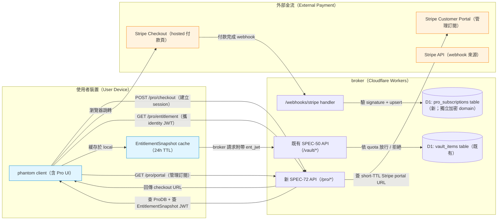
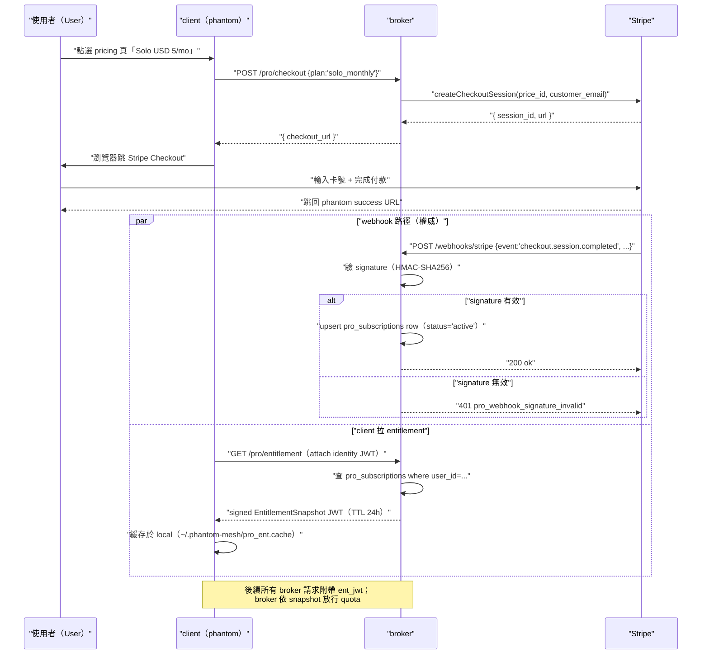
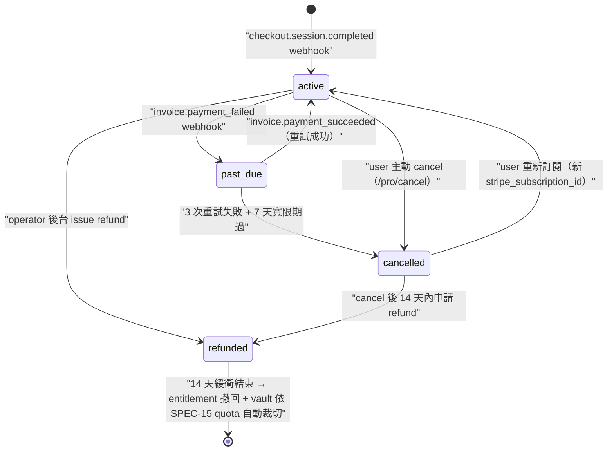

# SPEC-72 · 付費 broker 商業化 — Pro tier 訂閱與 entitlement（paid-broker Pro tier subscription + entitlement layer）

> **EXP 實驗性 spec — 目標 release v0.7.0+。** 本檔規範 broker（中介伺服器）商業化分層（commercialization layer）的 wire（線路契約）、資料模型、UX 流程與 privacy（隱私）邊界，**完全不規範** v0.6.0 行為 — 本檔 ship 前 v0.6.0 broker 維持 free + capped（免費 + 配額封頂），所有 user 一視同仁。

---

## §0 Spec metadata

| 欄位（Field） | 內容（Value） |
|---|---|
| 規格識別碼（Spec ID） | `SPEC-72-EXP-paid-broker` |
| 標題（Title） | 付費 broker 商業化 — Pro tier 訂閱與 entitlement（English subtitle: paid-broker — Pro tier subscription + entitlement layer for opt-in cloud sync upgrade） |
| 狀態（Status） | `DRAFT (post-v0.6.0)` |
| 版本（Version） | `0.1.0` |
| 最後更新（Last updated） | `2026-05-25` |
| 作者（Author） | `operator + Claude Code (claude-opus-4-7-1m, 2026-05-25 session)` |
| 評審者（Reviewer(s)） | （待填，建議：operator + 一位獨立 SaaS（軟體即服務，Software as a Service）創業者法律顧問） |
| 實作負責人（Implementation owner） | `phantommesh-io/workers/pro-billing/`（Cloudflare Workers TypeScript，待建）+ `core/src/pro_entitlement.rs`（client entitlement cache，待寫，~200 行）+ `app/src/routes/pro/*`（Tauri UI，待寫，5 screens） |
| 目標 release（Target release） | `v0.7.0+` |
| 服務的 pillar（支柱） | `cross-pillar X`（跨支柱商業化層 — 不歸 P1/P2/P3/P4 任一 user-facing pillar；它是 sustainability infra（永續基礎設施）讓 operator 不靠廣告 / 不靠賣 data 持續維護專案） |
| Track | `infra（基礎設施 — revenue path 收入路徑）` |
| Epic | `v0.7.0+ EXP03 paid-broker`（v0.6.0 不含） |
| BIG-GOAL phrase served | `BIG-GOAL.md line 31`：「**Cloud sync is Pro opt-in, never default**」（本檔規範 Pro tier 是 opt-in upgrade，free user 任何核心 mesh 功能不受影響）**+** `BIG-GOAL.md line 126-129`：「**Reversible — One command deletes all data ... Cloud sync (Pro) can be turned off and erased.**」（本檔強制 refund 後 14 天緩衝再撤回 entitlement，user 隨時可 cancel + erase）。兩段 phrase 均經 grep `docs/superpowers/BIG-GOAL.md` 驗證真實存在於該檔。 |
| 依賴（Depends on） | `SPEC-15-PROTOCOL-broker-vault-sync`（free quota 100 vault item × 1 MB 在彼定義；本檔規範 Pro 升級後的 quota 數字）、`SPEC-50-SERVER-broker-api`（broker server-side wire；本檔新增 6 個 endpoint 與既有 `/vault/*` 並存）、`SPEC-08-FOUNDATION-threat-model`（PCI（Payment Card Industry，支付卡產業）scope 拒入決定來源）、`SPEC-13-PROTOCOL-encryption-age`（entitlement JWT 不能解密 vault；vault 仍走 age v1 + per-account `vault_seal_key`） |
| 阻擋（Blocks） | 無（v0.6.0 不含；ship 後可 unblock 後續 EXP04 multi-region 與 EXP05 family-plan 細部 wire） |
| 模板偏離（Template deviation） | §10 簡化為 5 screens（pricing / checkout / manage / usage / family invite），不出 component matrix（EXP 階段 design token 沿用 SPEC-02）；§14 標 `n/a`（Pro tier wire 跨平台一致，無 OS-specific divergence）；§7 不出 JSON Schema 第三層（EXP 階段只列 TS + Rust round-trip） |

---

## §1 TL;DR

**問題（What user pain / system gap does this solve）**：v0.6.0 broker（中介伺服器）以 operator 自掏腰包補貼方式提供免費 vault（保險庫）同步 + demo-relay（demo 中繼）LLM（大型語言模型）relay，封頂於 100 vault item × 1 MB 與 30 demo request（請求）/ fingerprint（指紋）/ 24h。重度 user（多設備 + 大量 LLM provider key + 家庭多人）撞配額但目前**無付費升級管道** — operator 也無正規收入路徑支撐長期維護，被迫只能靠個人補貼或停服。同時 BIG-GOAL §P4 第 31 行明令 cloud sync 必須 Pro opt-in，本檔不能讓 Pro 成為**強制路徑**或**綁架核心 mesh 功能**的工具。

**方案（One-sentence design summary）**：引入 Pro tier（付費等級）作為純 opt-in 升級 — 透過 Stripe（金流處理服務）Checkout 完成付款後 broker 簽發 ephemeral JWT（暫時性 JSON Web Token，網頁權杖）攜帶 entitlement（授權範圍）snapshot，client 端緩存最多 24h 並用於放寬 vault quota（5000 item × 5 MB; family plan 6 identity (owner + 5 members)）、unlimited LLM relay（含 rate limit 抗濫用）、priority cross-device sync 與 family plan（家庭方案，1 帳號綁 6 identity (owner + 5 members 對齊 SPEC-71)）；6 個新 REST（具狀態傳輸）endpoint + 6 個新 error code（錯誤代碼）+ Stripe webhook signature（簽章）強制驗證。

**代價（Trade-offs accepted + what we're not doing）**：(a) PCI scope（支付卡產業合規範圍）整段外包 Stripe — broker 永遠不接觸信用卡明文（plaintext PAN，主帳號），代價是某些 sanction（制裁）區域（俄羅斯 / 部分中東國家）Stripe 不支援，這些 user 無法 Pro 升級；(b) 不做 freemium-by-mesh-feature（按 mesh peer 數收費 / 按 RPC（遠端程序呼叫）次數收費）— 這違反 BIG-GOAL「mesh peer 平等」核心；(c) 不接 ads（廣告）、不賣 user data（個資 / vault content / event log），凡此皆寫進 §3.2 Non-Goals 鎖死；(d) refund（退款）後 entitlement 撤回但 vault content 不刪 14 天緩衝（避免誤刪導致使用者資料一鍵蒸發）；(e) 中港台 PPP（Purchasing Power Parity，購買力平價）discount（折扣）採白名單 IP-based、非自動 — 有 abuse（濫用）VPN 規避風險，但這比強推全價更貼近專案精神。

**English abstract**: SPEC-72 specifies the Pro tier commercialization layer for the phantom-mesh broker, targeting v0.7.0+. v0.6.0 broker is free-and-capped (100 vault items × 1 MB per SPEC-15; 30 demo-relay requests per fingerprint per 24h per SPEC-52); heavy users hit those caps without an upgrade path, and the operator lacks a sustainable revenue channel. Pro tier is a strictly opt-in upgrade: users complete payment via Stripe Checkout, the broker issues a short-TTL (≤ 24h) JWT carrying an `EntitlementSnapshot`, and the client caches it locally to unlock raised quotas (5000 vault items × 5 MB), unlimited LLM relay (rate-limited per the SPEC-50 sliding window), priority cross-device sync, and an optional family plan (one account binds up to 6 identities (1 owner + 5 members per SPEC-71), see SPEC-71). PCI compliance scope is fully delegated to Stripe — the broker never touches plaintext PAN. Six new REST endpoints (`POST /pro/checkout`, `GET /pro/portal`, `GET /pro/entitlement`, `POST /webhooks/stripe`, `POST /pro/cancel`, `GET /pro/usage`), six new error codes, and one new state machine (`Subscription`: `active` / `past_due` / `cancelled` / `refunded`) are introduced. Hard guardrails: Pro tier never gates core P2P (peer-to-peer) mesh functionality; the broker decouples payment identity from vault content (separate database tables, separate encryption domains); no ads, no data brokering, ever.

---

> **📚 全檔縮寫 + 英文名詞對照表**（給第一次接觸 phantom-mesh 的研究生 / 大學生讀者；同檔第二次出現後允許只用英文）：
>
> | 縮寫 / 名詞 | 中文 | 一句話解釋 |
> |---|---|---|
> | **Stripe** | 金流處理服務商 | 美國上市的線上付款處理平台，承擔 PCI 合規範圍 |
> | **PCI** | 支付卡產業 | Payment Card Industry — 信用卡資料安全合規標準（PCI-DSS） |
> | **PPP** | 購買力平價 | Purchasing Power Parity — 各國 GDP 換算同等消費力的折扣依據 |
> | **SaaS** | 軟體即服務 | Software as a Service — 訂閱制雲端軟體商業模式 |
> | **SOHO** | 小型辦公 / 居家辦公 | Small Office / Home Office — 小團隊 user segment |
> | **SLA** | 服務水準協議 | Service Level Agreement — 服務可用率 / 回應時間承諾 |
> | **JWT** | 網頁權杖 | JSON Web Token — 含簽章可驗證的短壽命授權字串 |
> | **TTL** | 存活時間 | Time To Live — 一張 token 或快取的有效期限 |
> | **entitlement** | 授權範圍 | 一個 user 帳號目前可享用的功能 / 配額快照 |
> | **webhook** | 反向回呼 | Stripe 主動 POST 通知 broker 「訂閱狀態改變」的事件 wire |
> | **idempotency key** | 冪等鍵 | 重複請求帶同一 key 只執行一次的防重機制 |
> | **broker** | 中介伺服器 | phantom-mesh 的 Cloudflare Workers 伺服器端 |
> | **vault** | 保險庫 | broker 上儲存的 user sealed 設定（LLM key、cluster 設定） |
> | **PAN** | 主帳號 | Primary Account Number — 信用卡 16 位卡號明文 |
> | **refund** | 退款 | user 取消訂閱並要求退回款項 |
> | **freemium** | 免費增值 | 基礎功能免費 + 進階功能收費的混合模式 |

---

## §2 Context & Background

### 2.1 為什麼現在（觸發本檔的事件）

phantom-mesh v0.6.0 已 ship local-first（本地優先）BYOM（Bring Your Own Model，自帶模型）mesh + optional broker vault sync，operator 自費補貼 Cloudflare Workers + Cerebras / Groq commodity tier LLM key。三件事同時發生使付費路徑成為必要：

1. **Heavy user 撞配額**：早期採用者多設備（iPhone + Android + 3 desktop）+ 多 LLM provider 多 key，100 vault item 上限不夠用，回報「想付費換更高配額」。
2. **Operator 收入路徑**：純 OSS（開放原始碼軟體，Open Source Software）+ 個人補貼撐不過 12 個月；不付費就停服或砍功能。
3. **Family use case**：使用者反映「想用同一個帳號管全家 5 個人的 phantom identity」（見 SPEC-71-EXP-multi-user-household），這天然是付費賣點。

不做付費，operator 只剩三條路：(a) 接 ads / (b) 賣 user data / (c) 停服。三條都違反 BIG-GOAL；故開第四條：opt-in Pro tier。

### 2.2 在 BIG-GOAL 哪裡（pillar / track / phrase 引用 verbatim）

- 主要對應 **`BIG-GOAL.md` 第 31 行**（pillar P4「Privacy by default（預設隱私）」第 5 列）：
  > 「資料加密，只你能讀 | E2EE at rest + in-mesh. **Cloud sync is Pro opt-in, never default.**」
- 與 **`BIG-GOAL.md` 第 126-129 行**（3 operational principles 第 3 條「Reversible（可逆）」）：
  > 「**Reversible** — One command deletes all data ... Cloud sync (Pro) can be turned off and erased. Nothing should be irreversible from the user's side.」
- Track 對應 BIG-GOAL 兩 track 之外的 **infra**（基礎設施）— commercialization 不歸 Life Track / Work Track，是支撐兩 track 永續的金流層。

兩段 phrase 均經 `grep -n "Cloud sync is Pro opt-in\|Reversible" docs/superpowers/BIG-GOAL.md` 驗證真實存在（line 31 + 126/128-129），非 hallucination（幻覺生成）。

### 2.3 既有解的歷史

v0.5.0：無 broker、無 cloud sync，純 local-first。配額問題不存在（沒 cloud）；商業化問題不存在（無 server cost）。
v0.6.0：引入 SPEC-15 broker vault sync + SPEC-50 broker API + SPEC-52 demo-relay。Server cost 出現、配額問題出現。SPEC-15 §16 已標「Pro tier 計費路徑 OoS」，把責任推給本檔。
v0.7.0+（本檔）：補完 Pro tier wire。

### 2.4 競品對照（Comparable products）

| 競品 | 定價策略 | phantom-mesh Pro 學了什麼 / 沒學什麼 |
|---|---|---|
| **Tailscale Personal Pro** | USD 5 / mo 個人版；free tier 100 device | 學：個人 Pro 價位；簡單 unlimited 訴求。沒學：device-count gate（device 數封頂） — phantom mesh peer 數不收費，違反 BIG-GOAL「peer 平等」核心 |
| **Cloudflare Zero Trust SOHO** | USD 7 / user / mo，企業特化 | 沒學：per-user pricing 太複雜；phantom 走 per-account（每 account 一價） |
| **Apple iCloud+** | USD 0.99-9.99 / mo 純儲存階梯 | 學：階梯儲存價位透明、用 lifetime 一次買斷取代某些階梯。沒學：純 storage 計費 — phantom Pro 不是賣 GB |
| **Bitwarden Family** | USD 3.33 / mo / family（6 user） | 學：family plan 設計（1 付費綁多 identity）— phantom 走 6 identity / family (owner + 5 members)（見 SPEC-71）。沒學：unlimited device count（phantom 本來就 unlimited，free 也不限） |

---

## §3 Goals / Non-Goals / Out-of-Scope

### 3.1 Goals（本 spec 一旦實作完，下列為真；EXP 階段測項 ID 為 placeholder）

- `[G1]` Free user 升級 Pro 流程從點擊 pricing 頁到 entitlement 生效，p50 ≤ 60 秒（含 Stripe Checkout 跳轉 + webhook 處理）。`(verifies via: T-pro-checkout-e2e)`
- `[G2]` Pro entitlement JWT TTL ≤ 24h，broker 不接受 TTL > 24h 的 entitlement；client 強制每 ≤ 23h 重新拉一次 `/pro/entitlement`。`(verifies via: T-pro-entitlement-ttl)`
- `[G3]` Refund / cancel 後 client 偵測 entitlement 撤回 ≤ 5 分鐘（下一輪 `/pro/entitlement` heartbeat 或 webhook 觸發 push）；vault content 保留 14 天緩衝再依 SPEC-15 quota 自動裁切。`(verifies via: T-pro-refund-rollback)`
- `[G4]` Stripe webhook signature 驗證 100% 強制 — 不帶或簽章錯一律 `401 pro_webhook_signature_invalid`，broker 無「測試模式」可繞過。`(verifies via: T-pro-webhook-signature)`
- `[G5]` Free user 任何核心 P2P mesh RPC（mesh peer discovery、task dispatch、capture event push）**永遠不檢查 entitlement** — 即使 broker 完全離線、Stripe 完全掛掉，free user 的 local mesh 功能 100% 不受影響。`(verifies via: T-pro-free-mesh-unaffected)`
- `[G6]` 付費 record（subscription_id、stripe_customer_id、付款金額、付款方式）與 vault content（sealed LLM key、cluster 設定）在 broker D1 是**獨立 table、獨立加密 domain**；admin SQL 查詢付費 record 無法 join 出 vault content。`(verifies via: T-pro-privacy-separation)`

### 3.2 Non-Goals（設計上不該做，非「以後做」）

- `[NG1]` **不做 freemium-by-mesh-feature** — 不按 mesh peer 數 / RPC 次數 / cluster size 收費。Mesh peer 平等是 BIG-GOAL「Cluster = first-class」核心。
- `[NG2]` **不賣 user data** — 任何形式：分析（analytics）、行銷（marketing）、個資交易、vault content 解密後分析。違反 P4 Privacy 永久禁止。
- `[NG3]` **不接 ads（廣告）** — UI 任何角落、email、push notification 都不出現第三方廣告。
- `[NG4]` **不做 enterprise SLA（企業服務水準協議）** — 不承諾 99.9% uptime（執行時間），不簽 NDA（保密協議，Non-Disclosure Agreement），不接受採購合約。Enterprise 客戶來信統一引到「self-host broker，see SPEC-50」。
- `[NG5]` **Pro tier 不阻擋 free user 核心功能** — Free user 永遠可用 BYOM、local mesh、capture（捕捉）、coach（教練）、event log。Pro 只 unlock broker-mediated 便利功能（更大 vault quota、unlimited demo-relay relay、priority sync、family plan）。
- `[NG6]` **不做 cryptocurrency 支付** — 不接 Bitcoin / Ethereum / stablecoin。理由：稅務複雜、洗錢風險、operator 一人團隊無能力合規處理。Stripe 唯一管道。

### 3.3 Out-of-Scope（之後可能做，本版不規範）

- `[OoS1]` **Enterprise sales 流程** — 採購單、發票客製、退稅、跨國發票 — 全留 v0.8.0+ 或永不做。
- `[OoS2]` **On-prem broker license（自架 broker 商業授權）** — OSS Apache-2.0 已允許企業自架；商業授權只在「客戶要求 indemnification（侵權賠償保障）」才考慮，本檔不寫。
- `[OoS3]` **Refund 政策細節（退款規則）** — 多少天內無條件退、部分使用後比例退、家庭方案退單一帳號等 — 留 legal 顧問起草 ToS（Terms of Service，服務條款），本檔僅承諾「refund 後 14 天緩衝」是技術行為。
- `[OoS4]` **發票 / 統一編號（台灣稅務發票）** — 留 v0.8.0+ 接金流商發票模組（如綠界）。Pro tier v0.7.0 只發 Stripe 預設 PDF receipt（英文收據）。
- `[OoS5]` **Multi-region broker（多區域 broker）** — Pro tier 不承諾低延遲，只承諾優先序高於 free。多區域留 EXP04。
- `[OoS6]` **教育 / NGO（非政府組織）免費 Pro** — 之後可開白名單但本版不做。

---

## §4 Job Stories（Intercom 句型）

每條都映射到 §3.1 Goals。

- `[JS1]` **When** 我家裡 5 台裝置（iPhone / Android / Mac / Linux 桌機 / 工作筆電）每台都需要同步 8 個 LLM provider key + cluster 設定，**I want to** 不必每台手動貼 key，**so I can** 一次付費換更高 vault quota 自動 sync 完。 (→ G1, G3)
- `[JS2]` **When** 我是家長想用同一付費帳號管全家 5 人（含 2 個小孩），**I want to** 不必每人各買一份 Pro，**so I can** USD 12/mo family plan 一次搞定 5 identity 共享。 (→ G1, see SPEC-71-EXP-multi-user-household)
- `[JS3]` **When** 我是開發者想 sponsor（贊助）這個專案永續發展，**I want to** 一次性買 lifetime（終身）方案，**so I can** 用一筆錢支持 operator + 鎖死 Pro 不必每月扣款。 (→ G1, see §16 risk lifetime cap)
- `[JS4]` **When** 我重視 privacy 但仍想付費支持，**I want to** 知道我付的錢跟我的 vault content 在 broker 是完全分開的，**so I can** 不擔心付費資訊洩漏會關聯回我的 LLM 使用紀錄。 (→ G6)
- `[JS5]` **When** 我訂閱 Pro 後反悔想 cancel，**I want to** 一鍵取消 + 14 天內可救回 vault content，**so I can** 不怕誤刪、不被綁定（lock-in）。 (→ G3)

---

## §5 Personas

從 BIG-GOAL Audience 6 種挑：

1. **Heavy-Vault User（重度 vault 使用者）**：5+ 裝置、8+ LLM provider key、撞 100 item 上限。期待：付 USD 5/mo 換更大 vault + priority sync。
2. **Family Coordinator（家庭協調者）**：家長 / 室友代表，要付一筆錢管全家 phantom identity。期待：family plan 6 identity (owner + 5 members) / 12 USD/mo。
3. **Indie-Dev Sponsor（開發者贊助者）**：想用付費表態支持專案永續，可能本身配額用不到 Pro。期待：lifetime USD 200 一次買斷 + 名字進 sponsor wall（OoS for v0.7.0）。
4. **Privacy-First Subscriber（隱私優先付費者）**：付費可以、揭露身份不行。期待：付費資訊與 vault content 在 broker 嚴格分離、broker 看不到 vault 明文（既有 SPEC-15 已保證、本檔強化付費 record 分離）。

不服務的 persona（明列）：Enterprise IT、Reseller（轉售商）、Compliance Officer（合規長）— 都引到 self-host。

---

## §6 System Architecture

### 6.1 系統脈絡圖（Mermaid flowchart）



**信任邊界（trust boundary）**：Stripe 區段（橘）broker 視為外部不可信來源，所有 webhook 強制驗 signature；user device（藍）broker 視為合法請求但仍走 identity JWT 驗證；ProDB 與 VaultDB **分 schema、分加密 domain**（§13 細述）。

### 6.2 元件分解

| 元件 | 程式碼位置 | 職責 | 對外介面 |
|---|---|---|---|
| `pro-billing handler` | `phantommesh-io/workers/pro-billing/index.ts` | 6 個 `/pro/*` endpoint 路由 | §9.1 全部 |
| `webhook verifier` | `phantommesh-io/workers/pro-billing/webhook.ts` | Stripe signature 驗證 + 事件分派 | §9.1 `/webhooks/stripe` |
| `entitlement signer` | `phantommesh-io/workers/pro-billing/entitlement.ts` | 查 ProDB → 簽 EntitlementSnapshot JWT | §9.1 `/pro/entitlement` |
| `pro_entitlement.rs` | `core/src/pro_entitlement.rs` | client 端 cache + heartbeat（心跳） | §9.2 `ProEntitlement` trait |
| `pro UI routes` | `app/src/routes/pro/{pricing,checkout,manage,usage,family}.tsx` | 5 screens | §10 |

### 6.3 主流程（sequence diagram）



---

## §7 Data Model

EXP 階段僅列 TypeScript（前端 / Workers）+ Rust（client），不出 JSON Schema 第三層。

### 7.1 `ProSubscription`（D1 table；broker 端權威）

| 欄位 | 型別 | 必填 | 預設 | 描述 | 範例 | 加密 |
|---|---|---|---|---|---|---|
| `subscription_id` | TEXT PK | Y | — | 內部 ULID | `01J7K...` | N |
| `user_public_id` | TEXT FK | Y | — | SPEC-50 `users.public_id` 關聯 | `01J7M...` | N |
| `stripe_customer_id` | TEXT | Y | — | Stripe 客戶 ID | `cus_Q5...` | N（PCI scope Stripe 持有） |
| `stripe_subscription_id` | TEXT | Y | — | Stripe 訂閱 ID | `sub_Q5...` | N |
| `plan` | TEXT enum | Y | — | `solo_monthly` / `solo_yearly` / `family_monthly` / `family_yearly` / `lifetime` | `solo_monthly` | N |
| `status` | TEXT enum | Y | `active` | §8 狀態機 | `active` | N |
| `current_period_end` | INTEGER | Y | — | Unix epoch ms | `1742160000000` | N |
| `cancelled_at` | INTEGER | N | NULL | cancel 時間 | NULL | N |
| `refunded_at` | INTEGER | N | NULL | refund 時間 | NULL | N |
| `region` | TEXT | Y | `default` | `default` / `ppp_tw` / `ppp_cn` / `ppp_hk` | `default` | N |
| `created_at` | INTEGER | Y | now | record 建立時間 | `1740000000000` | N |

**TypeScript**（broker Workers）：

```ts
interface ProSubscription {
  subscription_id: string;          // ULID
  user_public_id: string;            // FK to users.public_id
  stripe_customer_id: string;        // cus_xxx
  stripe_subscription_id: string;    // sub_xxx
  plan: 'solo_monthly' | 'solo_yearly' | 'family_monthly' | 'family_yearly' | 'lifetime';
  status: 'active' | 'past_due' | 'cancelled' | 'refunded';
  current_period_end: number;        // ms epoch
  cancelled_at: number | null;
  refunded_at: number | null;
  region: 'default' | 'ppp_tw' | 'ppp_cn' | 'ppp_hk';
  created_at: number;
}
```

**Rust**（client，唯讀緩存）：

```rust
#[derive(Debug, Serialize, Deserialize, Clone)]
pub struct ProSubscription {
    pub subscription_id: String,
    pub user_public_id: String,
    pub stripe_customer_id: String,
    pub stripe_subscription_id: String,
    pub plan: ProPlan,
    pub status: ProStatus,
    pub current_period_end: i64,
    pub cancelled_at: Option<i64>,
    pub refunded_at: Option<i64>,
    pub region: ProRegion,
    pub created_at: i64,
}
```

Round-trip 驗證：TS ↔ Rust 12 個欄位 1-to-1 對應；CI 中以 `serde_json::to_string(&rust) == JSON.stringify(ts)` 跨語言 fixture 比對。

### 7.2 `EntitlementSnapshot`（JWT payload；broker 簽 + client 緩存）

| 欄位 | 型別 | 描述 | 範例 |
|---|---|---|---|
| `sub` | string | user_public_id | `01J7M...` |
| `tier` | enum | `free` / `pro` | `pro` |
| `vault_quota_items` | int | 配額 item 數 | `5000` |
| `vault_quota_bytes_per_item` | int | 單 item 上限 bytes | `5242880`（5 MB） |
| `relay_unlimited` | bool | demo-relay 是否解除 30/day | `true` |
| `priority_sync` | bool | 跨裝置同步優先序高 | `true` |
| `family_seats` | int | family plan identity 上限 | `6`（family，owner+5 members）/ `1`（solo） |
| `iat` | int | issued at（Unix epoch s） | `1742000000` |
| `exp` | int | expires at（≤ iat + 86400） | `1742086400` |

**TypeScript**：

```ts
interface EntitlementSnapshot {
  sub: string;
  tier: 'free' | 'pro';
  vault_quota_items: number;
  vault_quota_bytes_per_item: number;
  relay_unlimited: boolean;
  priority_sync: boolean;
  family_seats: number;
  iat: number;
  exp: number;
}
```

### 7.3 Storage location

- **broker（D1）**：`pro_subscriptions` table + `pro_webhook_events` audit table（30 天保留）。**獨立於** `vault_items` table — 不同 SQL schema，admin 查詢無法 join。
- **client（local）**：`~/.phantom-mesh/pro_ent.cache`（JSON，TTL 24h，過期自動刪）。
- **Stripe（外部）**：所有信用卡明文、PCI scope record — broker **永不接觸**。

### 7.4 Retention

- `pro_subscriptions` 永久保留（會計用途）；refund 後不刪 row，僅標 `status='refunded'`。
- `pro_ent.cache` user `phantom pro logout` 立即刪 + TTL 24h 自動過期。
- `pro_webhook_events` 30 天滾動保留（debug 用，不含 PCI 資料）。

### 7.5 Migration

新建 — 無 v0.6.0 → v0.7.0 schema migration。新 D1 table 隨 v0.7.0 broker deploy 一次建。Free user 升級 Pro 走 §14 流程。

---

## §8 State Machines

### 8.1 `Subscription` 生命週期



### 8.2 Transition table

| From | Event | Guard | To | Side effect |
|---|---|---|---|---|
| `*` | `checkout.session.completed` | sig 驗證通過 + plan 有效 | `active` | upsert row；log audit |
| `active` | `invoice.payment_failed` | sig 驗證通過 | `past_due` | email 通知 user；entitlement 仍簽 24h |
| `past_due` | `invoice.payment_succeeded` | sig 驗證通過 | `active` | 重設 `current_period_end` |
| `past_due` | 7 天寬限 + 3 次重試失敗 | broker cron | `cancelled` | entitlement 下次 heartbeat 退回 `tier=free` |
| `active` | `POST /pro/cancel` | identity JWT 有效 | `cancelled` | Stripe API 同步 cancel；保留 `current_period_end` 至期末 |
| `cancelled` / `active` | `refund.issued` | operator 觸發 | `refunded` | 14 天倒數 → entitlement 撤回 |

---

## §9 API Contracts

### 9.1 HTTP endpoints（broker）

#### `POST /pro/checkout`
**Purpose**: 建立 Stripe Checkout session 並回傳跳轉 URL。
**Auth**: identity JWT（SPEC-50 既有）in `Authorization: Bearer <jwt>` header。
**Request body**: `{ "plan": "solo_monthly" | "solo_yearly" | "family_monthly" | "family_yearly" | "lifetime", "region": "default" | "ppp_tw" | "ppp_cn" | "ppp_hk" }`
**Success (200)**: `{ "checkout_url": "https://checkout.stripe.com/c/pay/cs_...", "session_id": "cs_..." }`
**Errors**:
- `400 pro_region_unavailable`: 該 region 未開放（如 sanction 國家）
- `409 pro_subscription_already_active`: user 已有 active 訂閱（請改走 portal 升降級）
- `503`: Stripe API 暫不可用
**Idempotency**: 帶 `Idempotency-Key` header 重送回同一 session_id（Stripe SDK 原生支援）。
**Rate limit**: 10/min/user（防 checkout-spam）。

#### `GET /pro/portal`
**Purpose**: 簽 short-TTL Stripe Customer Portal 連結，user 在 Stripe 端管理付款方式 / 升降級 / 看發票。
**Auth**: identity JWT。
**Success (200)**: `{ "portal_url": "https://billing.stripe.com/p/session/...", "expires_in_s": 600 }`
**Errors**: `404 pro_entitlement_expired`（user 無 active 訂閱）

#### `GET /pro/entitlement`
**Purpose**: 簽當前 EntitlementSnapshot JWT。client 每 ≤ 23h 拉一次。
**Auth**: identity JWT。
**Success (200)**: `{ "entitlement_jwt": "eyJhbGc...", "expires_at": 1742086400 }`
**Errors**: `401`（identity JWT 過期）

#### `POST /webhooks/stripe`
**Purpose**: Stripe → broker 事件回呼。**broker 無「測試模式」可繞 signature**。
**Auth**: Stripe-Signature header（HMAC-SHA256 with `STRIPE_WEBHOOK_SECRET`）。
**Request body**: Stripe raw event（`checkout.session.completed` / `invoice.payment_failed` / `invoice.payment_succeeded` / `customer.subscription.deleted` / `charge.refunded`）。
**Success (200)**: `{ "received": true }`
**Errors**:
- `401 pro_webhook_signature_invalid`: 簽章不符或缺少
- `400`: 事件型別未知（直接 ack 但不處理；log audit）
**Idempotency**: 帶 Stripe `event.id` 去重；同 event 處理一次後存入 `pro_webhook_events` table，重送直接 200。

#### `POST /pro/cancel`
**Purpose**: user 主動取消訂閱（不退款，保留至 period end）。
**Auth**: identity JWT。
**Request body**: `{ "confirm": true, "reason"?: "string ≤ 500 chars" }`
**Success (200)**: `{ "status": "cancelled", "active_until": 1742160000000 }`
**Errors**: `404 pro_entitlement_expired`（已無 active 訂閱）

#### `GET /pro/usage`
**Purpose**: 回傳 user 當期配額使用統計（vault item 數、demo-relay request 數）。
**Auth**: identity JWT + ent_jwt。
**Success (200)**: `{ "vault_items_used": 1234, "vault_items_quota": 5000, "relay_requests_last_24h": 567, "relay_unlimited": true, "period_start": ..., "period_end": ... }`
**Errors**: `401`

### 9.2 In-process trait（Rust client）

```rust
pub trait ProEntitlement {
    /// 從 cache 讀目前 entitlement；過期則自動觸發 refresh
    fn current(&self) -> Result<EntitlementSnapshot, ProError>;
    /// 強制從 broker refresh（heartbeat 用）
    async fn refresh(&self) -> Result<EntitlementSnapshot, ProError>;
    /// 檢查某 quota dimension 是否允許（vault_items / relay）
    fn allow(&self, dim: QuotaDim, requested: u64) -> Result<(), QuotaError>;
}
```

### 9.3 Tauri commands（5 條）

| Command | Args | Return | Platform |
|---|---|---|---|
| `pro_checkout_start` | `{ plan, region }` | `{ checkout_url }` | all |
| `pro_portal_open` | `{}` | `{ portal_url }` | all |
| `pro_entitlement_get` | `{}` | `EntitlementSnapshot` | all |
| `pro_cancel` | `{ confirm, reason? }` | `{ status, active_until }` | all |
| `pro_usage_get` | `{}` | `UsageStats` | all |

---

## §10 UI Components & Screens（簡化 5 screens）

EXP 階段不出 component matrix；沿用 SPEC-02 design token。

#### Screen 1: Pricing（/pro/pricing）
**Purpose**: 4 個方案橫排：Solo Monthly / Solo Yearly（省 17%）/ Family Yearly / Lifetime（限量）。
**Copy 要點**：強調「Free tier 永遠夠用、Pro 是 opt-in」、「不接 ads / 不賣 data」、PPP discount 自動偵測 IP 顯示。
**Edge case**: Lifetime 售完 → 該卡灰掉 + 「已售完（1000/1000）」。

#### Screen 2: Checkout（/pro/checkout）
**Purpose**: 過渡頁，呼叫 `pro_checkout_start` 後立即跳 Stripe hosted 頁。
**Copy**: 「即將跳轉到 Stripe 完成付款...」+ loading spinner。
**Edge case**: `pro_region_unavailable` → 顯示「您的區域目前不支援付款 — 請見 [FAQ]」。

#### Screen 3: Manage Subscription（/pro/manage）
**Purpose**: 顯示當前 plan、period end、cancel 按鈕、跳 Stripe portal 連結。
**Copy**: cancel 按鈕需 2 次確認（防誤點）。
**A11y**: cancel 按鈕需 destructive role announcement（VoiceOver / TalkBack 念「警告：取消訂閱」）。

#### Screen 4: Usage Stats（/pro/usage）
**Purpose**: 顯示 vault item 數 / 配額條、demo-relay 24h 使用量、距下次重置時間。
**Copy**: 接近配額時（≥ 90%）紅字提示。

#### Screen 5: Family Invite（/pro/family）
**Purpose**: family plan 持有者邀請 5 identity（owner 自己 + 5 members = 6 total） 加入；產生 invite link（24h TTL）。
**Cross-ref**: invite link wire 細節見 SPEC-71-EXP-multi-user-household。

---

## §11 Error Catalog（新增 6 條，登錄至 SPEC-04）

| Code | When | User copy (zh-TW) | User copy (en) | Dev detail | Recovery | Retryable |
|---|---|---|---|---|---|---|
| `pro_payment_failed` | Stripe Checkout 付款被拒 | 付款未成功，請改用其他卡片 | Payment failed, try another card | Stripe error: `card_declined` / `insufficient_funds` | 換卡重試 | Yes（手動） |
| `pro_entitlement_expired` | client 拿 ent_jwt 過 24h 仍用 | 您的 Pro 授權已過期，請重新登入 | Pro entitlement expired, please re-login | ent_jwt `exp` < now | 觸發 `/pro/entitlement` refresh | Yes（自動） |
| `pro_quota_exceeded` | 配額用盡（vault item 數 / bytes） | 已達 Pro 配額上限，請至 manage 升級 | Pro quota exceeded, upgrade in manage page | quota dimension + 數字附 detail | 升級 plan 或刪舊 item | No |
| `pro_region_unavailable` | sanction 區域或 Stripe 不支援 | 您的區域暫不支援付款 | Your region is not supported for payment | Stripe `country_unsupported` 或 internal allowlist 拒 | 聯絡 operator | No |
| `pro_webhook_signature_invalid` | Stripe webhook signature 驗失敗 | (broker→Stripe 內部) | (internal) | HMAC mismatch | 檢查 `STRIPE_WEBHOOK_SECRET` | No |
| `pro_subscription_already_active` | user 重複 checkout | 您已有 Pro 訂閱，請至 manage 升降級 | You already have an active Pro subscription | DB check found `status='active'` row | 走 `/pro/portal` | No |

---

## §12 Cross-Cutting（簡略）

### 12.1 Performance Budgets

| Metric | Target | Hard limit | Measured by |
|---|---|---|---|
| `/pro/checkout` 回傳時間 | < 500ms p50 | < 2s p95 | Cloudflare Analytics |
| `/pro/entitlement` 簽 JWT | < 100ms p50 | < 500ms p95 | Workers metric |
| webhook 處理 | < 200ms p50 | < 1s p95 | Workers metric |
| client cache hit ratio | ≥ 99% | — | client telemetry（opt-in） |

### 12.2 Observability

- Counter：`pro_checkout_started` / `pro_checkout_completed` / `pro_webhook_received{type}` / `pro_entitlement_signed` / `pro_quota_rejected{dim}`
- Log（broker）：webhook event_id + status + duration_ms；**永不 log** card / customer email / vault content
- Alert：webhook 連續 5 次 signature_invalid → email operator（可能 Stripe rotate secret 漏更新）

---

## §13 Cross-Cutting — Privacy & Security（**本檔核心**）

### 13.1 PCI scope 完全外包 Stripe

- broker **永不接觸**信用卡明文 PAN（Primary Account Number）；Stripe hosted Checkout 頁直接於 Stripe domain 收卡。
- broker D1 只存 `stripe_customer_id` / `stripe_subscription_id`（這些是 Stripe 內部 opaque ID，非 PCI 資料）。
- Stripe Webhook secret 存於 Cloudflare Workers secret（非 D1，非 source code）。

### 13.2 付費 record ↔ vault content 嚴格分離

- `pro_subscriptions` table 與 `vault_items` table **位於同 D1，但獨立 schema**。
- broker 不存在任何 SQL view / API 可同時查詢「某 user 的付費紀錄 + 該 user 的 vault content」。
- vault content 仍依 SPEC-13 走 age v1 + per-account `vault_seal_key` 封裝；broker 無 vault decrypt 能力（既有 SPEC-15 保證，本檔不放鬆）。
- 即使 broker 整個 D1 dump 外洩，攻擊者拿到的是：付費 metadata（plan / status / 時間戳）+ sealed vault blob（不可解）。**兩者無法 join 出 user 的 LLM 使用內容**。

### 13.3 Entitlement JWT 設計

- 走 HS256 + 既有 `derive_subkey("broker-jwt-sign")`（SPEC-12）共用簽鑰；EXP 階段不引入新 key domain。
- TTL ≤ 24h 強制（broker 拒簽更長 TTL）；過期 client 必須 re-fetch — 確保 refund / cancel 後 ≤ 24h 內生效。
- Snapshot 不含 `stripe_customer_id` / 付款方式 — 只含 quota 數字 + tier；client 端就算 jwt 被偷也只能用配額、看不到付費資訊。

### 13.4 STRIDE 快速掃

| 威脅 | 場景 | 緩解 |
|---|---|---|
| **Spoofing** | 偽造 webhook 假裝 Stripe | 強制 signature 驗證；密鑰僅在 Workers secret |
| **Tampering** | 改 ent_jwt quota 數字 | HS256 簽章 + broker 端複查（重 quota 操作仍查 DB） |
| **Repudiation** | user 否認付款 | Stripe 端有 audit log；broker `pro_webhook_events` 30 天 |
| **Information disclosure** | D1 外洩 | §13.2 分離設計；付費 record + vault sealed 無法 join 出明文 |
| **DoS** | webhook 灌爆 | Cloudflare DDoS 防護 + signature 驗失敗早退 |
| **Elevation of privilege** | free user 偽造 Pro ent | HS256 簽章；client 自簽無 server key 簽不出有效 jwt |

---

## §14 Rollout & Migration

### 14.1 Free → Pro 升級流程

1. user 點 pricing → `pro_checkout_start` → Stripe Checkout → 付款完成。
2. Stripe webhook → broker upsert `pro_subscriptions` 為 `active`。
3. client 下次 `/pro/entitlement` heartbeat（≤ 23h 內）拿到 `tier='pro'` snapshot。
4. UI 即時更新（Tauri event push「entitlement_changed」）；vault quota 即刻放寬。
5. 既有 free quota 內的 vault item 全部保留，新增不再受 100 限制。

### 14.2 Pro → Free 降級（cancel / refund）

1. user `/pro/cancel` 或 operator issue refund。
2. broker 更新 `status='cancelled'` 或 `'refunded'`；entitlement 下次 heartbeat 退回 `tier='free'`。
3. **vault content 不立即刪** — 14 天緩衝期內全部保留可讀（但不能新增超過 free quota）。
4. 14 天後依 SPEC-15 free quota（100 item × 1 MB）自動裁切，**裁切前 user 收到 7 天 + 1 天兩封提醒 email**。
5. 裁切策略：按 `updated_at` 從舊到新刪，保留最新 100 item。

### 14.3 Feature flag

- `PRO_ENABLED` Cloudflare Workers env var；off 時 6 個 `/pro/*` endpoint 全回 `501 Not Implemented`。
- client 端 `pro_ui_enabled` Tauri config；off 時隱藏所有 Pro UI（free user 看不到 pricing 頁）。
- 這讓 v0.7.0 ship 時可分階段 rollout（先開內部 dogfood，再全網）。

### 14.4 Kill switch

operator 一鍵把 `PRO_ENABLED=false` 即停接新訂閱；既有訂閱 entitlement 仍走 24h TTL 自然過期，14 天 vault 緩衝 + email 通知。

### 14.5 CHANGELOG / release-notes draft

```
v0.7.0+ — Pro tier opens
- New: opt-in Pro tier (USD 5/mo solo, USD 12/mo family, USD 200 lifetime — limited to 1000 seats)
- Raised quotas for Pro: vault 5000 items × 5 MB, unlimited demo-relay relay
- Family plan: 1 account → 6 identities (owner + 5 members) (see SPEC-71)
- Privacy: payment record separated from vault content at DB level (see SPEC-72 §13.2)
- Free tier unchanged: all P2P mesh features work without payment
```

---

## §15 Out-of-Scope（重申，承上 §3.3）

- Enterprise sales / on-prem broker license / ToS legal text / 台灣統一發票 / multi-region broker / 教育白名單 / cryptocurrency — 全留後續。

---

## §16 Risks & Open Questions

### 16.1 Risks（≥ 5）

| Risk | Likelihood | Impact | Mitigation | Owner |
|---|---|---|---|---|
| PCI compliance 誤觸（broker 不小心存到 PAN） | Low | Critical（罰款 + 商譽） | 強制 Stripe hosted Checkout；code review 禁止 import `card_number` 字串；CI grep 阻擋 | operator |
| Stripe 區域限制（俄 / 部分中東無法付） | High | Medium（縮限 TAM） | §11 `pro_region_unavailable` 明示；FAQ 引到 self-host broker | operator |
| Refund 騙取（買 → 用 → refund 反覆） | Medium | Low（單金額小） | Stripe 端 risk rule + 同卡同 customer 6 月內二次 refund 黑名單 | operator |
| Quota arbitrage（多帳號共享一份 Pro） | Medium | Low（family plan 已提供合法路徑） | EntitlementSnapshot 綁 user_public_id；同 jwt 並發 ≥ 10 IP → log audit；不立即 ban | operator |
| 中國 / 俄羅斯區域支付受限 + 規避（VPN PPP fraud） | Medium | Low（金額不大但破壞 PPP 信任） | PPP 折扣採白名單 IP 範圍 + 偵測 VPN ASN（自治系統）後降回 default price；不主動 ban | operator |
| Stripe webhook secret 外洩 → 偽造訂閱 | Low | High | Workers secret 環境變數獨立於 source；按季 rotate；audit log alert 任何 sig invalid 異常 | operator |
| Lifetime 售完後 user 期待落空 | Medium | Low | UI 即時顯示「999/1000」倒數；售完後該方案灰掉 + 提示 yearly 替代 | operator |

### 16.2 Open Questions（待 operator / future-self 回答）

| # | Question | 預設假設 | When needed |
|---|---|---|---|
| Q1 | Lifetime 1000 seats 是否分批釋出（每月 100）還是一次全開？ | 一次全開 | v0.7.0 ship 前 |
| Q2 | family plan 是否允許 invite 後再剔除（seat 釋出可重用）？ | 允許，但 30 天冷卻防 abuse | v0.7.0 ship 前 |
| Q3 | PPP 折扣百分比實際數字？ | TW 40% / CN 50% / HK 30% off | v0.7.0 ship 前 |
| Q4 | Stripe 替代金流（如 Paddle / Lemon Squeezy）是否要 day-1 ready？ | 不，Stripe only；別家留 v0.8.0+ | v0.7.0 ship 後評估 |
| Q5 | Pro user 是否有 priority email support？ | 無 — 走 GitHub issue 公開排隊（避免私下 SLA 承諾） | v0.7.0 ship 前 |
| Q6 | refund 14 天緩衝是寫死還是 user 可調短？ | 寫死 14 天，避免 footgun | v0.7.0 ship 前 |
| Q7 | family plan 6 identity 是否可跨地理區（TW + US 混合）？ | 可，但帳號 region 以付款者為準（PPP 不可疊用） | v0.7.0 ship 前 |
| Q8 | entitlement JWT 簽鑰是否獨立於 SPEC-12 broker-jwt-sign？ | EXP 階段共用；GA 前評估獨立 | v0.7.0 ship 前 |

---

## §17 Alternatives Considered + Abandoned Ideas（≥ 3）

### 17.1 Donation only（純捐款，無 Pro tier）

只接 GitHub Sponsors / Open Collective / Ko-fi，不分 tier。
**為何沒選**：捐款收入不穩定（typical OSS 月捐 < USD 100），無法支撐 Cloudflare Workers + LLM commodity tier 補貼成本（demo-relay 月燒 USD 30 + vault sync 帶寬 + Pro 後預期 LLM relay 暴增）。重度 user 也回報「想付固定月費換明確配額而非感性捐款」。
**什麼條件會回來考慮**：v0.7.0 ship 後 6 月內 Pro 訂閱 < 50，且捐款 + Sponsors 月入 ≥ USD 500，可考慮砍 Pro 改純贊助模型。

### 17.2 GitHub Sponsors only

只走 GitHub 內建 Sponsor 機制（不接 Stripe）。
**為何沒選**：(a) GitHub Sponsors 不支援 quota / entitlement wire — 純自願贊助無 SLA-style 兌現；(b) 不支援 family plan 結構；(c) GitHub 抽成 0% 看似好但無法處理 PPP / refund / 跨幣別自動換算 — 對國際 user 體驗差。
**什麼條件會回來考慮**：GitHub Sponsors 推出「tier + entitlement webhook」（目前無 roadmap）。

### 17.3 Ad-supported（接廣告）

UI 任何角落塞第三方廣告聯播網（如 Carbon Ads / Google AdSense）換營收。
**為何沒選**：**永久拒絕**。違反 BIG-GOAL P4 Privacy 核心（廣告 SDK 必然帶 tracker）；違反 dogfood 原則（operator 自用不想看廣告）；違反「不被資料商品化」品牌承諾。寫進 §3.2 NG3 鎖死。
**什麼條件會回來考慮**：永遠不。

### 17.4 Data brokering（賣 user data）

把 vault content / event log / capture 摘要去識別後賣給研究機構或行銷公司。
**為何沒選**：**永久拒絕**。違反 BIG-GOAL P4；違反 SPEC-08 threat model 對 broker 信任的根本假設；違反 user 對 phantom-mesh 的核心信任（隱私品牌）。即使「匿名化」也已被多次研究證明可 re-identify。寫進 §3.2 NG2 鎖死。
**什麼條件會回來考慮**：永遠不。

### 17.5 Pay-per-use（按使用量計費，無月費）

按 vault GB-month / LLM relay request 數計費，類似 AWS。
**為何沒選**：(a) 增加 user 認知負擔（不知道每月會被扣多少）；(b) 鼓勵 user 自我審查（少存少用 → 損產品價值）；(c) 計費 wire 比固定月費複雜 10 倍，operator 一人團隊維護不來。
**什麼條件會回來考慮**：v0.8.0+ 若 Pro 用戶數 > 10000 且明確需要更彈性計費，可作為 Pro Premium tier。

---

## §18 Risks & Open Questions

（合併入 §16；本節留為模板對齊用，內容已上移）

---

## §19 Testing strategy

EXP placeholder T-ID（v0.7.0 ship 前細化）：

| Test ID | Scope | Tool | 期望覆蓋 |
|---|---|---|---|
| `T-pro-checkout-e2e` | 從 pricing → Stripe sandbox → 付款 → entitlement 生效 | Playwright + Stripe test mode | happy path |
| `T-pro-webhook-signature` | webhook 帶 / 不帶 / 錯誤 signature 三組 | curl 對 staging broker | 401 / 200 / 401 |
| `T-pro-entitlement-ttl` | ent_jwt TTL > 24h 應被 broker 拒簽 | Rust unit + workers unit | TTL 邊界 |
| `T-pro-refund-rollback` | refund 後 ≤ 5min entitlement 撤回 + 14 天 vault 緩衝 | integration（Stripe test mode） | refund timing |
| `T-pro-free-mesh-unaffected` | broker 完全離線 / Stripe 完全掛 → free user mesh / capture / coach 100% 正常 | Rust e2e（offline broker） | resilience |
| `T-pro-privacy-separation` | SQL inject `SELECT vault_items JOIN pro_subscriptions` 應失敗（無共用 view） | SQL fuzz | schema separation |

測試環境：staging broker（Cloudflare Workers preview）+ Stripe test mode（`sk_test_*`）；不對 production Stripe 跑 e2e。

---

## §20 Appendices

### A. Sample payloads（待 v0.7.0 ship 前移至 `appendix/sample-payloads/spec-72/`）

- `pro-checkout-request.json`
- `pro-checkout-response.json`
- `stripe-webhook-checkout-completed.json`
- `entitlement-jwt-decoded.json`
- `pro-usage-response.json`

### B. References

- Stripe Checkout docs: <https://stripe.com/docs/checkout>
- Stripe Webhooks signature verification: <https://stripe.com/docs/webhooks/signatures>
- PCI-DSS scope reduction via hosted payment pages: <https://www.pcisecuritystandards.org/>
- World Bank PPP factor data: <https://data.worldbank.org/indicator/PA.NUS.PPP>
- Tailscale pricing reference（competitive benchmark）: <https://tailscale.com/pricing>

### C. Glossary

見 §1 後對照表（17 條）。

### D. Changelog

| Version | Date | Author | Changes |
|---|---|---|---|
| `0.1.0` | 2026-05-25 | operator + Claude Code (claude-opus-4-7-1m) | Initial draft — EXP for v0.7.0+. 6 endpoints, 6 errors, 1 state machine, 5 screens, 5 alternatives, 8 open questions. |

---

**End of SPEC-72-EXP-paid-broker.md**
