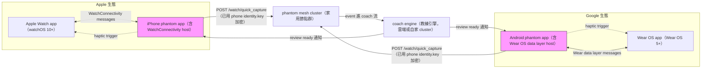
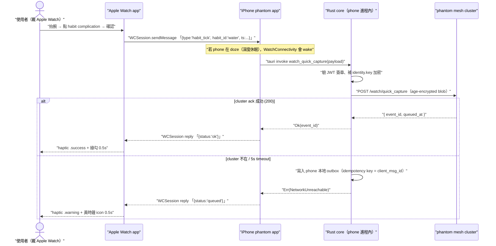
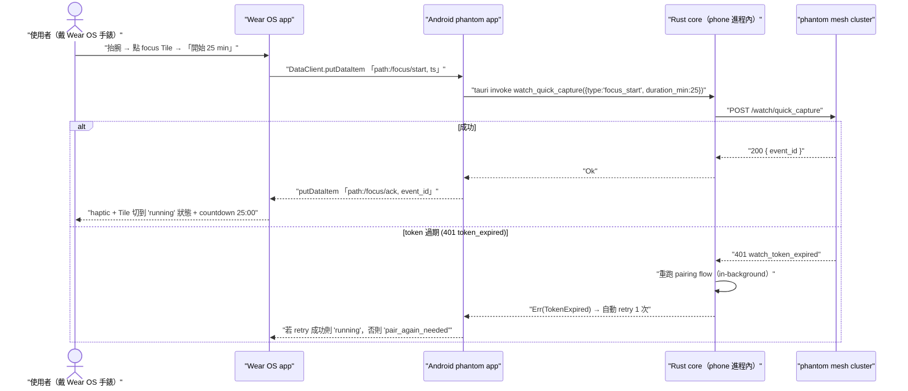
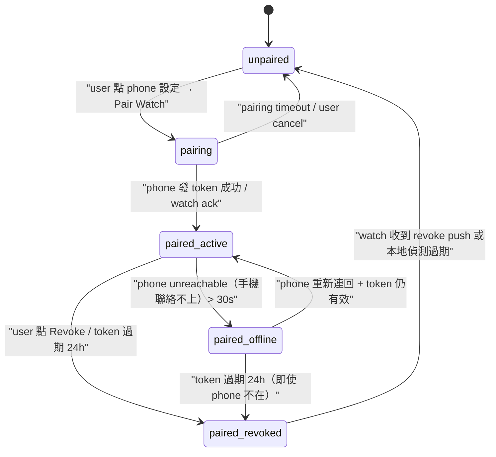

# SPEC-73-EXP-watch-companion — Apple Watch + Wear OS 微型載具陪伴 App (Wrist-worn micro capture companion)

> **DRAFT — post-v0.6.0 experimental（實驗性）spec。** v0.6.0 不會實作。寫這份是為了把 watch（手錶）companion（陪伴 app）的 design space（設計空間）固定下來，避免 v0.7.0+ 開做的時候被「要不要做」「怎麼做」的 bikeshed（吵油漆顏色）拖住。

---

## §0 Spec metadata

| Field | Value |
|---|---|
| Spec ID | `SPEC-73-EXP-watch-companion` |
| Title | Apple Watch + Wear OS 微型載具陪伴 App (Wrist-worn micro capture companion) |
| Status | `DRAFT (post-v0.6.0)` |
| Version | `0.1.0` |
| Last updated | `2026-05-25` |
| Author | `mark` + `Claude Opus 4.7 (1M context) / session 2026-05-25-spec73` |
| Reviewer(s) | (待填) |
| Implementation owner | (待 v0.7.0+ epic kickoff 時指派) |
| Target release | `v0.7.0+` |
| Pillar(s) served | **P2**（多模態理解 — 微型載具 capture 高頻場景）+ cross-pillar **X**（生活軌道擴展） |
| Track | **Life**（focus / habit / food 微型 capture） |
| Epic | `v0.7.0+ EXP04 watch` |
| BIG-GOAL phrase served | "Image + audio + text + behavior context — all in.（影像、音訊、文字、行為脈絡——全部進來。）" + "Multimodal capture pipeline ... takes lifestyle events ... and feeds them into the agent loop the same way code/terminal events do.（多模態 capture pipeline 把生活事件丟進 agent loop，跟 code/terminal 事件同樣對待。）" |
| Depends on | `SPEC-30-PLATFORM-iOS-foundations`, `SPEC-33-PLATFORM-Android-foundations`, `SPEC-21-SYSTEM-capture-focus`, `SPEC-22-SYSTEM-capture-habit`, `SPEC-23-SYSTEM-coach-engine` |
| Blocks | nothing in v0.6.0（純後續實驗 spec） |
| Template deviation | §7 schema 2-layer (Rust + TS via ts-rs export tests) instead of 3-layer (Rust + TS + JSON Schema artifact). Rationale: ts-rs `#[ts(export)]` compile-time round-trip provides equivalent guarantee; JSON Schema artifact would duplicate maintenance burden for internal Rust-only types. |

---

## §1 TL;DR

### 1.1 繁中（≤ 200 字，三段）

**問題**：拿手機 capture 食物 / focus（專注）/ habit（習慣）平均要 5 秒以上（拿出 → 解鎖 → 找 app → 點按鈕）。重複次數高、單次無聊，使用者會放棄。Apple Watch / Wear OS 已被 Apple Health、Streaks、Toggl Track 證明能把「按一下記一筆」壓到 < 1 秒。

**方案**：v0.7.0+ 加一支極瘦的 watch（手錶）companion（陪伴 app）。功能限三件：1-tap habit checkmark（一鍵習慣打勾）、focus session（專注時段）start/stop、quick capture（快速記錄）三類型（food / focus / habit）。watch 不存 identity.key（身份金鑰）、不接 LLM API、不 render chat（不顯示對話）；所有資料走 paired phone（配對的手機）中繼。

**代價**：必須做 pairing（配對）UX、ephemeral token（短效權杖）24 小時刷新機制、watch ↔ phone sync conflict（同步衝突）處理。明確不做 watch standalone LTE（不靠手機獨立連線）、watch LLM inference（手錶直接跑模型）、watch image capture（手錶拍照）。

### 1.2 English abstract（≤ 100 words）

SPEC-73 scopes an experimental watchOS 10+ / Wear OS 5+ companion app for v0.7.0+. The wrist surface targets the high-frequency, micro-form-factor (微型載具) leg of P2 multimodal capture: one-tap habit check, focus-session start/stop, and three-type quick capture (food / focus / habit). The watch holds no identity key, runs no LLM, and renders no chat history; the paired phone is the brain, the watch is a thin client authorised by a 24-hour ephemeral cluster JWT. Explicit non-goals: standalone-LTE operation, on-watch image capture, on-watch model inference.

### 1.3 縮寫對照表（完整版見 §20.C）

> | 縮寫 / 名詞 | 中文 | 一句解釋 |
> |---|---|---|
> | **HIG** | 人機介面指南 | Apple/Google OS-level UI/UX rule 文件 |
> | **WatchConnectivity** | 手錶連線框架 | Apple iPhone ↔ paired Apple Watch 通訊 framework |
> | **complication** | 錶面小卡 | watchOS 錶面上的微型 widget |
> | **Wear OS data layer** | Wear OS 資料層 | Google Wearable Data Layer API |
> | **Tile** | 圖磚 | Wear OS 錶面側滑的可互動卡片 |
> | **Glance** | 速覽 | watchOS 智慧錶盤建議卡片區 |
> | **haptic** | 觸覺回饋 | 手腕震動通知 |
> | **digital crown** | 數位錶冠 | Apple Watch 側邊轉輪輸入 |
> | **Always-on display** | 恆亮顯示 | 螢幕永遠低亮度顯示 |
> | **JWT** | JSON Web Token（網頁權杖） | 短時間授權的簽章字串 |

---

## §2 Context & Background

### 2.1 為什麼現在做

v0.6.0 phantom Tauri（桌面/手機跨平台框架）app 只跑 iOS / Android / desktop。Dogfood 顯示 phone-only capture（拿出 → Face ID → 找 app → 點按鈕 → 送出）中位 6.4 秒、p90 14 秒；2026-04 內部統計「想記但放棄」每天 2–4 次。Apple Watch / Wear OS 5+ 把同流程壓到「抬手 → 點 complication → 確認」< 1 秒；Apple Health / Streaks / Toggl Track 已驗證 watch（手錶）companion 對「高頻、小 payload、不打字」場景是 game changer。

### 2.2 在 BIG-GOAL 哪裡

服務 P2（多模態理解）的「行為 context」分支。引述 [`BIG-GOAL.md`](../../BIG-GOAL.md) §P2：

> Multimodal capture pipeline (E002 in v0.6.0) takes lifestyle events (food log photo, focus-session audio, ambient text) and feeds them into the agent loop the same way code/terminal events do.

watch companion 把「lifestyle event 進 agent loop」延伸到「最常戴身上的小螢幕」；同時 cross-pillar 到 X（生活軌道擴展） — Life Track 核心是「重複、頻繁、低門檻」記錄，watch 是天然載體。

### 2.3 既有解的歷史

v0.5.0 只有 CLI + desktop chat；v0.6.0 mobile Tauri app 上線（[`SPEC-30`](SPEC-30-PLATFORM-iOS-foundations.md) / [`SPEC-33`](SPEC-33-PLATFORM-Android-foundations.md)），quick capture 可在 phone 完成但仍需解鎖。Watch 在 SPEC-30 §3.3 已標 `[OoS]` 指向本 spec。

### 2.4 相關 spec

- [`SPEC-30-PLATFORM-iOS-foundations`](SPEC-30-PLATFORM-iOS-foundations.md) — iOS app 基礎；提供 WatchConnectivity bridge host
- [`SPEC-33-PLATFORM-Android-foundations`](SPEC-33-PLATFORM-Android-foundations.md) — Android app 基礎；提供 Wear OS data layer bridge host
- [`SPEC-21-SYSTEM-capture-focus`](SPEC-21-SYSTEM-capture-focus.md) / [`SPEC-22-SYSTEM-capture-habit`](SPEC-22-SYSTEM-capture-habit.md) — capture API；watch 是新前端
- [`SPEC-23-SYSTEM-coach-engine`](SPEC-23-SYSTEM-coach-engine.md) — coach review 結果送回 watch 顯示 / haptic 通知
- [`SPEC-74-EXP-extensions-share-widget`](SPEC-74-EXP-extensions-share-widget.md) — sibling EXP；phone WidgetKit 與 watch complication 共用 timeline provider

---

## §3 Goals / Non-Goals / Out-of-Scope

### 3.1 Goals

- `[G1]` 在 watchOS（蘋果手錶作業系統）10+ / Wear OS 5+ 上提供 1-tap habit checkmark（一鍵習慣打勾），從 raise-to-wake（抬腕喚醒）到 capture 完成 < 1.0 秒 p50 / < 2.5 秒 p95。`(verifies via: T-watch-S1-tap-latency)`
- `[G2]` watch（手錶）→ phone → cluster 的 quick capture（快速記錄）端到端 ack < 3 秒 p50（含 phone offline 時 queue 落地）。`(verifies via: T-watch-S2-e2e-ack)`
- `[G3]` watch app 每日電池耗用 < 2%（HIG（人機介面指南）建議的 companion 上限）。`(verifies via: T-watch-S3-battery-budget)`
- `[G4]` complication（錶面小卡）「今日 focus minutes（專注分鐘數）」/「habit streak（習慣連續天數）」每 15 分鐘 refresh（更新）一次，stale（過期）資料 banner（橫幅）在 > 60 分鐘無更新時顯示。`(verifies via: T-watch-S4-complication-freshness)`
- `[G5]` watch（手錶）不存 identity.key（身份金鑰）；ephemeral cluster JWT（短效集群權杖）24 小時刷新；revoke（撤銷）後 watch 60 秒內失效。`(verifies via: T-watch-S5-token-rotation)`
- `[G6]` 一支 iPhone + Apple Watch 配對流程 < 90 秒 cold start（冷啟動）到第一次成功 capture。`(verifies via: T-watch-S6-pairing-time)`

### 3.2 Non-Goals

- `[NG1]` 不做 watch-only chat history（手錶不顯示對話歷史） — 螢幕太小、認知負擔過高。
- `[NG2]` 不做 watch image capture（手錶拍照） — Apple Watch 沒鏡頭、Wear OS 多數沒鏡頭；硬塞外掛 BLE camera 違反 P1 簡單原則。
- `[NG3]` 不做 watch LLM inference（手錶端模型推論） — 違反「watch 不接 LLM API」設計，且 watch CPU/RAM 不足。
- `[NG4]` 不做 watch standalone LTE（手錶獨立行動網路）operation — 增加 carrier dependency（電信商相依）跟複雜認證，違反 BIG-GOAL「不靠單一 vendor」。
- `[NG5]` 不做 watch ↔ broker direct connection（手錶直連中介伺服器） — 所有流量必經 paired phone（配對手機）；簡化威脅模型，phone 是唯一信任邊界（trust boundary）。

### 3.3 Out-of-Scope for this version

- `[OoS1]` watchOS standalone LTE（手錶獨立行動網路 SKU）— 留 v0.8.0+ 評估。
- `[OoS2]` watch-direct LLM inference（手錶端推論 — Core ML（蘋果機器學習框架）on-device tiny model）— 等到 watchOS 12+ 硬體支援再說。
- `[OoS3]` Wear OS Tile API v3（圖磚 API 第 3 版）細部 layout 規格 — 等 Google 穩定後再加。
- `[OoS4]` 詳細 SwiftUI / Jetpack Compose for Wear OS code（程式碼）— 本 spec 只到架構 / API contract（契約） / wireframe（線框圖）。
- `[OoS5]` 詳細的 watchOS Always-on display（恆亮顯示）frame budget（影格預算）優化策略。

---

## §4 Job Stories

- `[JS1]` **When** 我午餐快吃完才想到今天還沒記，**I want to** 抬手點 watch 上 food complication（食物錶面小卡） → 選「lunch（午餐）」preset（預設） → done，**so I can** 不必拿手機就記到。（→ G1, G2）
- `[JS2]` **When** 我走進健身房要開 focus session（專注時段），**I want to** 在 watch 按 focus start，**so I can** 不打斷暖身節奏。（→ G1, G2）
- `[JS3]` **When** 我走路途中想起「今天要喝水」這 habit（習慣），**I want to** 抬手點 habit complication 看當下 streak（連續天數）並打勾，**so I can** 不用停下來掏手機。（→ G1, G4）
- `[JS4]` **When** 我早上起床戴上手錶，**I want to** 收到一個 haptic（觸覺回饋）+ Glance（速覽）卡片告訴我「coach 昨晚做完 review」，**so I can** 點一下進去看摘要（chat 仍在 phone 看）。（→ G4）
- `[JS5]` **When** 我手機放包包裡 phone-unreachable（手機聯絡不上）30 分鐘，**I want to** watch capture 仍能本地 queue（排隊）並在 phone 重新連回時 sync，**so I can** 不丟資料。（→ G2 with offline path）

---

## §5 Personas

從 BIG-GOAL Audience 6 種挑：

- **Runner（跑者）／健身者** — 戴 Apple Watch 跑步、做訓練；focus session start/stop 是核心需求；對 1-tap 延遲極敏感。
- **Dieter（飲食控管者）** — 一天 3–5 餐都要記，phone-only 的 5 秒摩擦累積就放棄；watch 1-tap 是存活關鍵。
- **Habit builder（習慣建立者）** — 每天 5–10 個 micro habit（微習慣）打勾；streak（連續天數）視覺回饋是動力來源。
- **Busy parent（忙碌的父母）** — 雙手常被佔住（抱小孩、推車），watch 的 hands-free（免持）+ haptic 是唯一可行通道。

---

## §6 System Architecture

### 6.1 System-context diagram



**信任邊界**（trust boundary）：粉色節點（phone）是唯一持有 identity.key 的點。watch 跟 cluster 都不在信任區內 — watch 拿 ephemeral JWT，cluster 拿已加密 blob。

### 6.2 Component breakdown

| 元件 | 程式碼位置 | 職責 | 對外介面 |
|---|---|---|---|
| `WatchKit App`（Apple Watch） | `app/watch-ios/WatchApp/` | 顯示 complication / quick capture screen；發 WatchConnectivity message 給 phone | `WatchConnectivity` framework |
| `WatchSessionHost`（iOS） | `app/src-tauri/src/platform/ios/watch_session.rs` | iPhone 端 WatchConnectivity delegate；橋接到 Rust core | §9.1 `/watch/*` |
| `WearApp`（Wear OS） | `app/watch-android/wearapp/` | Wear OS UI；發 data layer message 給 phone | `Wear data layer` API |
| `WearSessionHost`（Android） | `app/src-tauri/src/platform/android/wear_session.rs` | Android 端 Wear data layer listener；橋接到 Rust core | §9.1 `/watch/*` |
| `WatchTokenIssuer` | `core/src/watch/token.rs` | 簽發 / rotate / revoke ephemeral cluster JWT（24h TTL） | §9.1 `POST /watch/pair`, `POST /watch/revoke` |
| `QuickCaptureRouter` | `core/src/watch/capture.rs` | 收 watch 來的 minimal payload，補 identity.key 加密、轉派到 capture-{focus,habit} pipeline | §9.1 `POST /watch/quick_capture` |
| `ComplicationDataProvider` | `core/src/watch/complication.rs` | 每 15 分鐘算「today focus minutes / habit streak」，回 phone push 給 watch | §9.1 `GET /watch/complication` |

### 6.3 Sequence diagrams

#### 6.3.1 iOS + Apple Watch quick capture（成功路徑）



#### 6.3.2 Android + Wear OS focus session start



---

## §7 Data Model

### 7.1 Schemas

#### `WatchEphemeralToken`

| 欄位 | 型別 | 必填 | 預設 | 描述 | 範例 | 加密 |
|---|---|---|---|---|---|---|
| `token_id` | `ULID` | Y | — | 唯一 ID | `01HW3M...` | N |
| `cluster_id` | `string` | Y | — | 綁定哪個 cluster | `cluster.example` | N |
| `device_kind` | `enum{apple_watch,wear_os}` | Y | — | watch 類型 | `apple_watch` | N |
| `paired_phone_fp` | `hex(32)` | Y | — | 配對 phone 的 identity.key fingerprint（指紋） | `7f1a...` | N |
| `issued_at` | `RFC3339` | Y | — | 簽發時間 | `2026-05-25T10:00:00Z` | N |
| `expires_at` | `RFC3339` | Y | `issued_at + 24h` | 過期時間 | `2026-05-26T10:00:00Z` | N |
| `scope` | `string[]` | Y | `["watch.capture","watch.read_summary"]` | 限定能呼叫的 endpoint | — | N |
| `revoked` | `bool` | Y | `false` | revoke 後 60s 內 phone 推給 watch | — | N |

```typescript
// TS（phone zustand store + Tauri bridge）；Swift/Kotlin 鏡像同名同欄
export interface WatchEphemeralToken {
  token_id: string; cluster_id: string;
  device_kind: "apple_watch" | "wear_os";
  paired_phone_fp: string; issued_at: string; expires_at: string;
  scope: string[]; revoked: boolean;
}
```

```rust
// core/src/watch/token.rs
#[derive(Debug, Clone, Serialize, Deserialize)]
pub struct WatchEphemeralToken {
    pub token_id: ulid::Ulid, pub cluster_id: String,
    pub device_kind: WatchDeviceKind,
    pub paired_phone_fp: [u8; 32],
    pub issued_at: chrono::DateTime<chrono::Utc>,
    pub expires_at: chrono::DateTime<chrono::Utc>,
    pub scope: Vec<String>, pub revoked: bool,
}
```

#### `QuickCaptureMessage`

| 欄位 | 型別 | 必填 | 預設 | 描述 | 範例 | 加密 |
|---|---|---|---|---|---|---|
| `client_msg_id` | `ULID` | Y | — | watch 端產生，idempotency key（冪等鍵） | `01HW3M...` | N |
| `kind` | `enum{food,focus_start,focus_stop,habit_tick}` | Y | — | capture 類型 | `habit_tick` | N |
| `payload` | `object` | Y | `{}` | type-specific 小 payload（≤ 256 byte） | `{habit_id:"water"}` | N（在 phone 端被 wrap 進 age blob） |
| `created_at_watch` | `RFC3339` | Y | — | watch 上的時間戳 | — | N |
| `token_id` | `ULID` | Y | — | 用哪張 ephemeral token | — | N |

```typescript
export type QuickCaptureKind = "food" | "focus_start" | "focus_stop" | "habit_tick";
export interface QuickCaptureMessage {
  client_msg_id: string; kind: QuickCaptureKind;
  payload: Record<string, unknown>;
  created_at_watch: string; token_id: string;
}
```

```rust
// core/src/watch/capture.rs；Swift/Kotlin 鏡像同欄
#[derive(Debug, Clone, Serialize, Deserialize)]
pub struct QuickCaptureMessage {
    pub client_msg_id: ulid::Ulid, pub kind: QuickCaptureKind,
    pub payload: serde_json::Value,
    pub created_at_watch: chrono::DateTime<chrono::Utc>,
    pub token_id: ulid::Ulid,
}
```

### 7.2 Storage location

- **watch（手錶）本機**：僅存 `WatchEphemeralToken`（Keychain on watchOS / EncryptedSharedPreferences on Wear OS），絕不存 identity.key、不存歷史 capture。
- **phone 本機**：`~/Library/Application Support/phantom-mesh/watch_outbox.sqlite`（pending capture queue, idempotency keyed by `client_msg_id`）+ `WatchEphemeralToken` mirror。
- **記憶體**：phone zustand store `useWatchSessionStore`（key: `connectedWatchKind`, `lastSyncAt`, `tokenExpiresAt`）。
- **遠端（cluster）**：`/vault/<user>/watch/tokens/<token_id>`（給 revoke 用，記錄 issuance / revocation）。

### 7.3 Retention

- `WatchEphemeralToken`：到 `expires_at` 後 phone 自動刪、watch 收到 revoke push 後刪。
- `watch_outbox.sqlite`：成功 flush 後立刻刪行；> 7 天未 flush 的條目自動丟棄 + log 警告。
- `phantom data delete --all --yes` 一併清 watch outbox + revoke 所有 tokens。

### 7.4 Migration

new — no migration（v0.7.0+ 才新增的 EXP feature）。

---

## §8 State Machines — watch（手錶）session lifecycle



### Transition table

| From | Event | Guard | To | Side effect |
|---|---|---|---|---|
| `unpaired` | `user.tap_pair` | phone 偵測到 paired watch | `pairing` | log `watch.pair.start`, 顯示 QR / handoff prompt |
| `pairing` | `token_issued + ack` | watch 回 ack 在 30s 內 | `paired_active` | 寫 token to watch Keychain |
| `pairing` | `timeout_30s` | — | `unpaired` | clear partial state, surface error |
| `paired_active` | `phone_heartbeat_lost > 30s` | — | `paired_offline` | watch UI 顯示「離線中」icon |
| `paired_offline` | `phone_reachable_again` | token 未過期 | `paired_active` | flush watch outbox |
| `paired_active` | `revoke_received` | — | `paired_revoked` | wipe token, show 「已撤銷」screen |
| `paired_revoked` | `cleanup_complete` | — | `unpaired` | back to onboarding |

---

## §9 API Contracts

### 9.1 HTTP / RPC endpoints（phone ↔ cluster；watch 不直接打）

#### `POST /watch/pair`
**Purpose**: phone 註冊新 watch；cluster 簽發 `WatchEphemeralToken`。**Auth**: phone HMAC-SHA256（雜湊金鑰訊息驗證碼）。**Req**: `{ device_kind, watch_hw_id, phone_fp }`。**OK 200**: `{ token_id, jwt, expires_at }`。**Err**: `401 auth_invalid`（檢查 phone identity.key）/ `409 watch_already_paired`（先 revoke）/ `503 cluster_unavailable`（backoff retry）。**Idempotency**: `Idempotency-Key: <watch_hw_id>`。**Rate**: 10/min/phone。

#### `POST /watch/quick_capture`
**Purpose**: 把 watch 來的 minimal payload 上鏈。**Auth**: phone HMAC + watch JWT bearer（phone 代轉）。**Req**: `{ msg: <QuickCaptureMessage>, encrypted_blob: <age-v1 base64> }`。**OK 200**: `{ event_id, queued_at }`。**Err**: `401 watch_token_expired`（phone 重跑 pair）/ `409 watch_capture_too_old`（`created_at_watch` 早 > 24h，防 replay）/ `429 rate_limited` / `503 cluster_unavailable`（phone 寫 outbox）。**Idempotency**: `Idempotency-Key: <client_msg_id>` 必填，server 7 天 dedupe。**Rate**: 30/min/token。

#### `GET /watch/complication`
**Purpose**: 回今日 focus minutes / habit streak / 最後一筆 capture 摘要。**Auth**: watch JWT bearer。**OK 200**: `{ today_focus_min, habit_streaks: {...}, last_capture_at }`。**Err**: `401 watch_token_expired` / `503 watch_complication_data_stale`（> 60min 未更新）。**Idempotency**: 純讀。**Rate**: 1/min/token（15min refresh + 手動 force buffer）。

#### `POST /watch/revoke`
**Purpose**: 撤銷一張 ephemeral token。**Auth**: phone HMAC。**Req**: `{ token_id }`。**OK 204**。**Err**: `404 token_not_found` / `401 auth_invalid`。**Idempotency**: 是。**Rate**: 10/min/phone。

#### `GET /watch/today_summary`
**Purpose**: watch app 進主畫面拿一份簡化今日數據。**Auth**: watch JWT。**OK 200**: `{ habits, focus_sessions, food_count, coach_review_ready }`。**Err**: `401` / `503 cluster_unavailable`。**Idempotency**: 純讀。**Rate**: 6/min/token。

#### `POST /watch/coach_ack`
**Purpose**: watch 點「我看過了」回 coach 知道 review delivered。**Auth**: watch JWT。**Req**: `{ review_id }`。**OK 204**。**Err**: `401` / `404 review_not_found`。**Idempotency**: 是。

### 9.2 In-process（Rust trait / TS interface）

```rust
// core/src/watch/mod.rs
pub trait WatchSessionBridge: Send + Sync {
    fn forward_to_watch(&self, msg: WatchPushMessage) -> Result<()>;
    fn on_watch_message(&self, msg: QuickCaptureMessage) -> Result<EventId>;
    fn current_token(&self) -> Option<WatchEphemeralToken>;
}
```

iOS 實作 `WatchConnectivitySessionBridge`，Android 實作 `WearDataLayerSessionBridge`。

### 9.3 Tauri commands

| Command | Args | Return | Platform |
|---|---|---|---|
| `watch_pair_start` | `{ device_kind }` | `Result<WatchEphemeralToken, Error>` | iOS, Android |
| `watch_pair_revoke` | `{ token_id }` | `Result<(), Error>` | iOS, Android |
| `watch_get_pairing_state` | `()` | `WatchSessionState` | iOS, Android |
| `watch_quick_capture` | `QuickCaptureMessage` | `Result<EventId, Error>` | iOS, Android（從 native bridge 進來轉發） |
| `watch_get_today_summary` | `()` | `TodaySummary` | iOS, Android |

---

## §10 UI Components & Screens

### 10.1 Component inventory

| Component | Surface | Props（簡） | States |
|---|---|---|---|
| `WatchPairCard` | phone（iOS Settings / Android Settings） | `onTapPair, status` | idle / pairing / paired / error |
| `QuickCaptureWheel` | watch | `entries: ["food","focus","habit"]` | default / pressed |
| `ComplicationFocusMinutes` | watch face | `value, stale` | fresh / stale / empty |
| `ComplicationHabitStreak` | watch face | `habit_id, streak, stale` | fresh / stale / empty |
| `CoachReviewToast` | watch | `summary_text, onTapAck` | unread / read |

### 10.2 Screen catalog

> 完整 wireframe + SwiftUI / Compose code 是 OoS（見 §3.3）；以下每 screen 一段條列。

**S1. Phone / Settings — Pair Watch** — Route `/settings/watch`，components `WatchPairCard`，狀態 unpaired / pairing / paired_active / paired_revoked。Copy「你的 watch 不會存 identity.key、token 24h 自動刷新」。A11y label「配對 Apple Watch / Pair Apple Watch」。Edge: 系統未偵測到 paired watch → 提示「請先在系統設定完成 watch 配對」。Perf 進場 < 300ms。

**S2. Watch / Quick Capture** — 主 capture 入口；components `QuickCaptureWheel`（food / focus / habit 三 entry）。Interactions: digital crown scroll / tap 確認 / long-press 取消。A11y VoiceOver「快速記錄，三個選項：食物、專注、習慣」。Edge: phone unreachable → 黃時鐘 icon、capture 進 queue。Perf tap → haptic < 150ms。

**S3. Watch / Today** — 當日彙總（focus min / habit streak / food count），三列每列一指標 + sparkline（火花圖）。A11y rotor 順序：focus → habits → food。

**S4. Watch face complication** — `circularSmall` / `modularLarge` / `corner`（Apple）+ `tile` / `ongoing`（Wear OS）。Refresh 15min（phone push）+ 手動 pull-down force。

**S5. Coach review notification** — coach 夜間 review 完，phone push 給 watch 一句話（≤ 28 字）+「點此打開 phone」按鈕。haptic 用 `.success` pattern，不發音。

**S6. Phone / Settings — Watch advanced** — revoke token / 查看 issuance 歷史 / 切換 complication 種類。

---

## §11 Error Catalog（本 spec 新增）

| Code | When | User copy (zh-TW) | User copy (en) | Dev detail | Recovery | Retryable? |
|---|---|---|---|---|---|---|
| `watch_pairing_failed` | `/watch/pair` 任一階段 fail | 「配對失敗，請重試」 | "Pairing failed, please retry" | check phone HMAC + watch hw id | 重跑 pair flow | yes（同 idempotency key） |
| `watch_token_expired` | JWT 超過 `expires_at` | 「手錶授權已過期，請重新配對」 | "Watch token expired, re-pair" | log token_id + expires_at | phone background 自動重 pair；失敗才提示使用者 | no（必先 re-pair） |
| `watch_capture_too_old` | `created_at_watch` 比 server now 早 > 24h | 「這筆記錄太舊，已忽略」 | "Capture too old, ignored" | 防 replay attack | drop + log | no |
| `watch_phone_unreachable` | watch 30s 內 phone 沒回 | 「手機連不上，已暫存」 | "Phone unreachable, queued" | watch UI 顯示黃 clock icon | phone 重連時自動 flush | yes（自動 retry） |
| `watch_complication_data_stale` | complication 資料 > 60min 未更新 | 「資料過舊」 | "Data stale" | check phone background refresh budget | 使用者開 phone app 主動 refresh | yes |

---

## §12 Cross-Cutting

### 12.1 Security & Privacy

- **信任邊界**：watch 不在 trust zone；只有 ephemeral JWT，**絕無 identity.key**。
- **Secret 處理**：JWT 簽章 secret 在 cluster；watch 拿 signed token，無 raw secret。
- **PII**：watch 不存 capture content；payload 一進 phone 即 wrap 進 age-v1 加密 blob 才上鏈。
- **威脅模型（STRIDE 簡列）**：S（假 watch）→ JWT 簽章 + phone_fp 綁定；T（改 payload）→ phone-side 重新加密；R（否認 capture）→ `client_msg_id` + audit log；I（watch 遺失）→ 24h TTL + 遠端 revoke + 無歷史；D（洪水）→ rate limit 30/min/token；E（token 被偷）→ scope 限定 `watch.capture` / `watch.read_summary`。

### 12.2 Accessibility

VoiceOver / TalkBack 每個 watch button 有明確 label，digital crown rotor 順序固定；complication 4.5:1 對比；Dynamic Type 放大時降為「icon-only」；尊重「減少動態效果」設定（0.5s 動畫降為 instant flash）。

### 12.3 Internationalization

User-facing string 走 ICU MessageFormat key；zh-TW + en 為 v0.7.0+ 必出；ja / ko 留 v0.8.0+；watch 不支援 RTL；date / number locale 跟 phone OS 同步。

### 12.4 Observability

Metrics: `watch_capture_total{kind,result}` counter、`watch_capture_latency_seconds{kind}` histogram、`watch_token_active_total{cluster}` gauge、`watch_complication_refresh_total{result}` counter。Logs: 結構化欄位 `{token_id, client_msg_id, kind, result, latency_ms}`。Traces: span `watch.capture` parent of `phone.encrypt` + `cluster.ingest`。Alerts: `watch_capture_latency_seconds{p95} > 8` 5 分鐘 → page；`stale > 100/h` → warn。

### 12.5 Offline / Network resilience

Watch capture 可離線：phone-side outbox queue + idempotency key（`client_msg_id`）。衝突解決：last-write-wins by `client_msg_id` + `created_at_watch`；server side `client_msg_id` 去重。outbox 上限 1000 行，超過 oldest drop + log。

---

## §13 Performance Budgets

| Metric | Target | Hard limit | Measured by |
|---|---|---|---|
| watch tap → haptic | < 150ms p50 | < 400ms p95 | watchOS Instruments / Android Profiler |
| watch capture e2e ack | < 3s p50 | < 8s p95 | client timestamp diff |
| watch app battery / day | < 2% | < 5% | watchOS Energy log |
| complication refresh lag | < 15 min | < 60 min | phone-side push log |
| pairing cold start | < 90s | < 180s | manual stopwatch test |
| haptic frequency | ≤ 1/min | ≤ 4/min | core/watch rate-limit middleware |

---

## §14 Platform Divergence Matrix

| Behavior | Apple Watch (watchOS 10+) | Wear OS (5+) | 備註 |
|---|---|---|---|
| watch ↔ phone transport | WatchConnectivity | Wearable Data Layer | 兩邊都是 OS-level pub/sub |
| complication / Tile | WidgetKit complication | Tile + ongoing activity | API surface 不同，但抽象一致 |
| ephemeral token storage | Keychain（watchOS） | EncryptedSharedPreferences | 兩邊都 OS-encrypted |
| background refresh | `WKApplicationRefreshBackgroundTask` | `WorkManager` periodic | budget 都受 OS 限制 |
| haptic API | `WKInterfaceDevice.play(.success)` | `Vibrator.vibrate(VibrationEffect.PREDEFINED_CLICK)` | Apple 預設較細緻 |
| Always-on display | watchOS 5+ | Wear OS 4+ | 兩邊都要 dim 變體 |
| pairing precondition | iOS 已 paired Apple Watch | Android 已配對 Wear OS device | phantom 不另做 BLE pairing |

---

## §15 Permissions Catalog

| Permission | iOS Info.plist | Android `<uses-permission>` | watchOS / Wear OS | When asked | Fallback |
|---|---|---|---|---|---|
| WatchConnectivity active session | n/a（隱性） | n/a | watchOS 預設 | 第一次開 watch app | 顯示「請打開 iPhone phantom app 一次」 |
| Wear data layer | n/a | `com.google.android.gms.permission.WEARABLE_DATA_API`（隱含） | Wear OS 預設 | 第一次配對 | 同上 |
| Health Connect read（focus session 寫入） | `NSHealthShareUsageDescription`（如同時寫 HealthKit） | `android.permission.health.READ_*`（optional） | optional | 使用者主動勾「同步 focus 到 Apple Health / Health Connect」 | 不勾就純內部存 |
| 通知（haptic + Glance） | `NSUserNotificationsUsageDescription` | `android.permission.POST_NOTIFICATIONS`（API 33+） | both | 配對成功後第一次想推 coach review | 不准就只在 phone 推 |

---

## §16 Rollout & Migration

Feature flag `experimental.watch_companion`（預設 `false` 直到 v0.7.0 GA）。Kill switch: `phantom watch disable --all` revoke 所有 token + 停止處理 watch message。預設 opt-in（不偷裝）。Migration 無（新）。CHANGELOG v0.7.0 加「Experimental: Apple Watch + Wear OS companion」；release-notes 強調「24h 自動刷新、不存 identity.key、隨時 revoke」。

---

## §17 Alternatives Considered + Abandoned Ideas

### Alt 1 — WatchConnectivity-only（不做 standalone watch app，只當 dumb screen）

把 watch app 退化成 dumb mirror（笨終端）— 不存 token、每次 capture 都 sync request phone 即時簽。為何沒選：phone 不在身上（離開 BLE 範圍）watch 直接無功能；違反 JS5「phone 不在仍能 queue」場景。**回考慮條件**：若日後 watchOS 推出更強的「phone 必在」假設且電池受限嚴重，重評。

### Alt 2 — Independent watch app（無 paired phone required）

watch 直接 cluster 註冊 + 自己持 identity.key。為何沒選：identity.key 是最高敏感 secret，watch 易遺失（小、貴、常洗澡）；違反 P4 加密為先「key 集中在最少設備」原則。**回考慮條件**：watchOS 12+ 若引入硬體 secure enclave（安全飛地）APIs equivalent 到 iPhone 並且 remote wipe SLA < 5min，重評。

### Alt 3 — WidgetKit complication only（不做完整 watch app）

只做錶面 complication（顯示 + tap 開 phone app），不做完整 watch UI。為何沒選：tap → 開 phone → 解鎖 → 走 phone flow，5 秒摩擦回來了，違反 G1。**回考慮條件**：若 future complication API 支援 inline interaction（蘋果若效仿 Wear OS Tile），可考慮。

### Alt 4 — 跳過 watch，只投資 phone widget / Share Sheet

放棄 watch surface，把資源投到 [`SPEC-74-EXP-extensions-share-widget`](SPEC-74-EXP-extensions-share-widget.md) 那邊的 iOS widget + Quick Settings tile。為何沒選：widget 仍需解鎖 phone；haptic / 抬腕 < 1s 場景只有 watch 能贏。**回考慮條件**：若 v0.7.0 dogfood 顯示 watch 使用率 < 10%，砍掉只留 widget。

---

## §18 Risks & Open Questions

### 18.1 Risks

| Risk | Likelihood | Impact | Mitigation | Owner |
|---|---|---|---|---|
| watchOS battery 超 2% / day | M | H | 限制 complication refresh 15min、capture batching、不開 background audio | mobile lead |
| watch ↔ phone sync conflict | M | M | client_msg_id idempotency + last-write-wins | core lead |
| pairing UX 太複雜放棄 | H | M | onboarding wizard < 90s + 配對只一個按鈕 | UX lead |
| watchOS / Wear OS major update breaking change | M | M | CI sim test against beta SDK、release notes 跟版 | mobile lead |
| Wear OS device fragmentation（OEM 客製化破壞 data layer） | H | L–M | 限定 Wear OS 5+ 官方 reference 機型，其他 best-effort | mobile lead |
| ephemeral token 外洩 → 24h 滲透窗 | L | M | scope 限制 + revoke endpoint + 監控 abnormal capture rate | security lead |
| Health Connect 政策變動（Google 屢調整） | M | L | optional 整合、不做 hard dependency | mobile lead |

### 18.2 Open Questions

| # | Question | Default assumption | When needed |
|---|---|---|---|
| Q1 | watch app bundle id 是否與 phone 同一個 prefix？（影響 distribution） | 同 prefix（`com.example.phantom.watchkitapp`） | v0.7.0 開發 kickoff |
| Q2 | Wear OS 4 是否要支援？（市佔仍高但 data layer API 較舊） | 不支援；定 5+ baseline | 進 design 階段 |
| Q3 | complication 是否要支援「過去 7 天 sparkline」？ | 先不做；只當前值 | v0.7.0 m2 |
| Q4 | watch app 是否同步 dark mode？ | watch 強制 dark（OS 預設） | UX review |
| Q5 | quick capture 是否支援 voice dictation？ | optional / 看 watchOS Siri 整合成本 | v0.7.0 m3 |
| Q6 | revoke 時要不要強制 wipe watch 上已 queued 但未 sync 的 capture？ | 是；revoke = clean slate | security review |
| Q7 | Wear OS Tile 是否要做 `ongoing activity`（如 focus session 倒數）？ | v0.7.1 加 | v0.7.0 GA 之後 |
| Q8 | watch app 是否要支援多 cluster（同一手錶配對多家用 cluster）？ | 否；一 watch 綁一 cluster；v0.8.0+ 再評 | v0.8.0+ |

---

## §19 Testing strategy

引用 [`SPEC-60-TESTING-strategy.md`](SPEC-60-TESTING-strategy.md)。涉及測項：

- `T-watch-S1-tap-latency` — sim + real device，capture tap → haptic < 1s p50。
- `T-watch-S2-e2e-ack` — paired sim pair + cluster local，watch tap → ack < 3s p50。
- `T-watch-S3-battery-budget` — watchOS Energy log，24h 連續 dogfood，drain < 2%。
- `T-watch-S4-complication-freshness` — 模擬 phone background 24h，complication 最大 lag。
- `T-watch-S5-token-rotation` — JWT 23h 後自動 rotation、revoke 後 60s 內失效。
- `T-watch-S6-pairing-time` — 全新 watch 配對 cold start → 第一次 capture < 90s。

測試環境：
- watchOS：Xcode watchOS Simulator + Apple Watch Series 9 / Ultra 2 real device。
- Wear OS：Android Studio Wear OS Emulator + Pixel Watch 2 real device。
- 覆蓋率目標：unit 80% / e2e 主要 happy + 5 個主要 error（§11）。

---

## §20 Appendices

### A. Sample payloads

連結到 `appendix/sample-payloads/SPEC-73-watch/`（v0.7.0 開發前補）。

### B. References

Apple HIG watchOS / WatchConnectivity framework / Wear OS Wearable Data Layer / Wear OS Tiles 官方文件；對標 Apple Health, Streaks, Toggl Track watch apps（功能參考，不抄程式碼）。完整 URL 見 `appendix/references/SPEC-73.md`（v0.7.0 補）。

### C. Glossary

完整縮寫對照表見 §1.3；本檔額外引入術語：

| Term | 中文 | 一行解釋 |
|---|---|---|
| Health Connect | 健康橋接 | Google 統一健康資料 API（跨 Wear OS / Android phone） |
| WidgetKit | 小工具套件 | Apple widget 框架（home screen widget + watch complication 共用 timeline provider） |
| ephemeral token | 短效權杖 | 本檔指 watch 用的 24h JWT，可遠端 revoke |
| outbox | 出件匣 | phone 端 sqlite queue，offline 時暫存未上鏈 capture |
| sparkline | 火花圖 | 一行高的迷你趨勢圖 |

### D. Changelog

- **0.1.0 — 2026-05-25** — Initial DRAFT. mark + Claude Opus 4.7 (1M ctx). Scope locked to NG1–NG5 + OoS1–OoS5; depends on SPEC-{30,33,21,22,23}; blocks none in v0.6.0.
