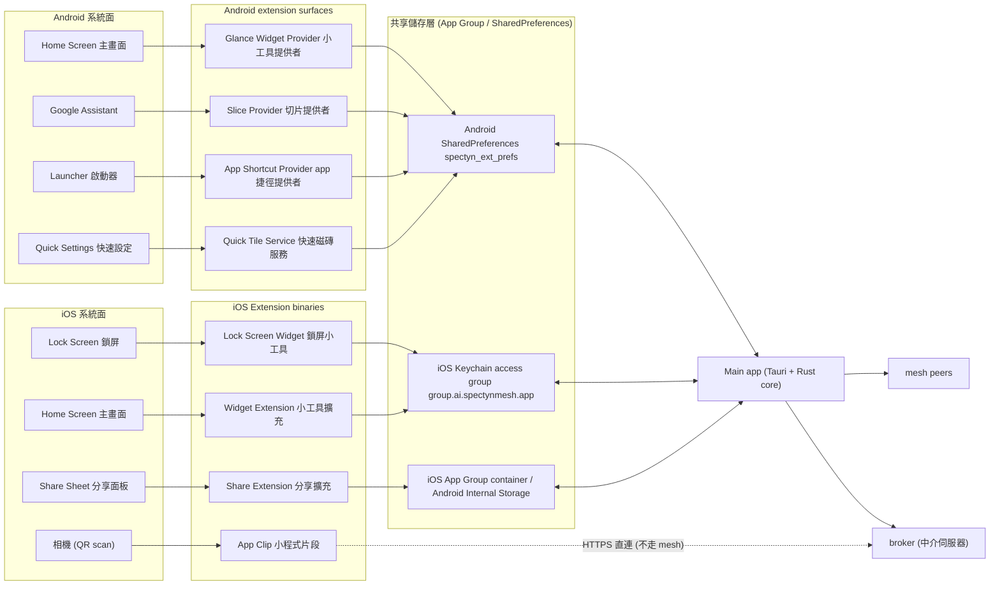
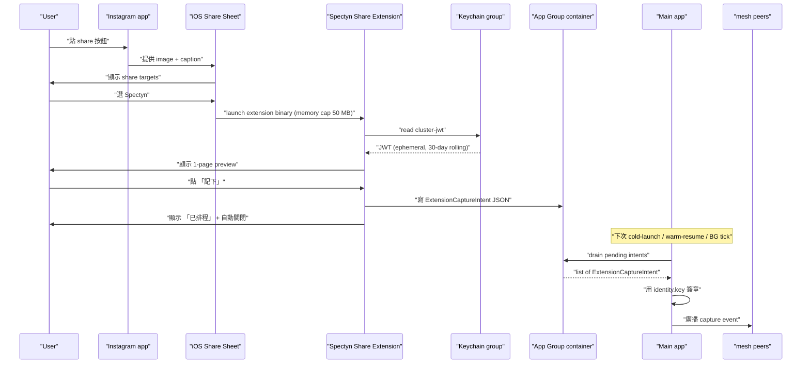
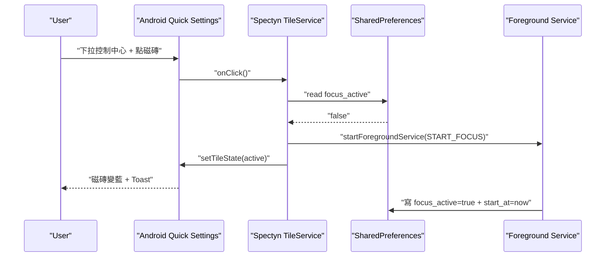
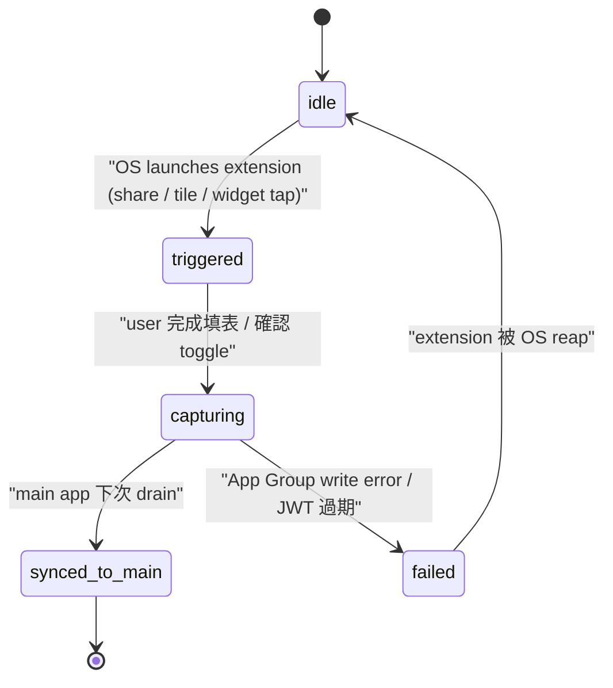

# SPEC-74 · 系統擴充入口 — iOS Share / Widget / App Clip + Android Quick Settings / Shortcut / Slice （EXP 實驗性）

> **EXP 提醒**：本檔為 v0.7.0+ 的探索性 spec（DRAFT），**不**進 v0.6.0 GA scope。本檔目的是把 v0.6.0 累積的 main-app capture 路徑（SPEC-20 / 21 / 22）擴張到 OS-level 系統入口（share sheet、widget、quick tile），用於減少 user 從「想到」到「記下」的 friction（摩擦）。實作要等 Tauri 2 對 iOS extension target 與 Android multi-process service 成熟（追蹤 Tauri issue tracker），預估 v0.7.0 Q3-26 啟動。

## §0 規格中繼資料（spec metadata）

| 欄位（field） | 值（value） |
|---|---|
| 規格識別碼（Spec ID） | `SPEC-74-EXP-extensions-share-widget` |
| 標題（Title） | 系統擴充入口 — iOS Share / Widget / App Clip + Android Quick Settings / Shortcut / Slice (English subtitle: System-Level Capture Surfaces — iOS Extensions & Android Quick Surfaces) |
| 狀態（Status） | `DRAFT (post-v0.6.0)` |
| 版本（Version） | `0.1.0` |
| 最後更新（Last updated） | `2026-05-25` |
| 作者（Author） | `operator（操作者）+ Claude Opus 4.7（100 萬 token 上下文窗）擔任 orchestrator（協調者）self-write` |
| 審查者（Reviewer(s)） | （待填） |
| 實作負責人（Implementation owner） | （待 v0.7.0 啟動時指派；預期 iOS extension binary 落於 `app/src-tauri/gen/apple/extensions/<name>Extension/` + Android extension service 落於 `app/src-tauri/gen/android/app/src/main/java/ai/spectynmesh/ext/`） |
| 目標版本（Target release） | `v0.7.0+`（EXP；不入 v0.6.0 GA） |
| 服務的 pillar（支柱） | `P2（多模態理解 — 系統級 capture 入口讓 image / text / activity 從任意 app 流進 mesh）`；cross-cutting `P4（extension 不持 identity.key，只簽 ephemeral cluster JWT，符合 fail-closed 安全模型）` |
| 軌道（Track） | `Life`（生活軌道；食物 / 焦點 / 習慣 quick capture 為核心 use case） |
| 史詩功能群（Epic） | `EXP05 extensions`（v0.7.0+ 新增 EPIC 群；不入 v0.6.0 七 epic） |
| 對應 BIG-GOAL phrase | `BIG-GOAL.md §P2`：「Multimodal capture pipeline (E002 in v0.6.0) takes lifestyle events (food log photo, focus-session audio, ambient text) and feeds them into the agent loop the same way code/terminal events do」— 本 spec 把「multimodal capture」入口從 main app icon 擴張到 OS-level surface（share sheet、widget、quick tile），讓「ambient text」「food log photo」這些事件**不必先開 main app** 就能進 mesh。**+** `§陪你進步 Life Track`：daily review 仰賴 food / focus / habit 三類 capture 事件 — 擴充入口降低 capture 漏記率。 |
| 依賴（Depends on） | `SPEC-30-PLATFORM-iOS-foundations`（iOS shell / Keychain access group `group.ai.spectynmesh.app` / bundle ID `ai.spectynmesh.app` — extension 共用），`SPEC-33-PLATFORM-Android-foundations`（Android shell / SharedPreferences / Foreground Service 模式），`SPEC-20-SYSTEM-capture-food`（food entry schema — extension 寫入 event），`SPEC-21-SYSTEM-capture-focus`（focus entry schema + 計時器狀態），`SPEC-22-SYSTEM-capture-habit`（habit toggle schema），`SPEC-12-PROTOCOL-identity-keypair`（identity.key 在 Keychain access group 共享規則） |
| 阻擋（Blocks） | （無 v0.6.0 spec 被阻擋；v0.7.0+ 可能 unlock SPEC-73 watch-companion 共用 widget timeline provider） |
| 模板偏離（Template deviation） | §14「Platform divergence」為本 spec **核心章節**（iOS 4 種 extension vs Android 4 種 surface 不對稱）。§10「UI 元件 / 畫面」聚焦 6 個 OS-level surface（share sheet preview / widget S/M/L / app clip 1-pager / lock screen widget / quick settings tile / app shortcut menu），不畫 main app 內畫面。§7「Data model」extension-to-main IPC（行程間通訊）payload + widget timeline entry 為兩個 schema 主軸。 |

---

## §1 重點摘要（TL;DR）

**問題**：v0.6.0 唯一 capture 入口是 main app icon — 從 lock screen 到 capture form ≈ 3 秒（unlock 0.5s + 找 icon 0.8s + tap 0.1s + cold start 1.6s + navigate 0.5s，per SPEC-30 §13 TTI 預算）。Life Track 高頻低意願事件（吃完一口想記、突然想 toggle focus、看到文章想記）3 秒就等於 friction wall（摩擦牆 — user 心智轉移就漏了）。Apple Health / Google Fit / Streaks 把入口放到 share sheet（分享面板）/ widget（小工具）/ quick settings tile（快速設定磁磚）把時間降到 0.3–0.5 秒。spectyn 沒做，因為 v0.6.0 主刀在 main app 穩定 + capture 三類 schema 落地，且 Tauri 2 對 iOS extension target / Android multi-process service 支援在 2026-05 仍 immature。

**方案**：v0.7.0+ 加 8 個 OS-level surface — **iOS 4 種**：(1) Share Extension（分享擴充）— 任何 app 分享按鈕可選 Spectyn；(2) Widget S/M/L（home screen 顯示今日 focus 時數 + habit streak 連續天數 + 1-tap capture）；(3) Lock Screen Widget（鎖屏小工具，iOS 16+）— 簡化 focus 計時器；(4) App Clip（小程式片段）— 餐廳 QR code 跳 1-pager food entry，**無需安裝 full app**（≤ 10 MB hard cap）。**Android 4 種**：(1) Quick Settings Tile（快速設定磁磚，API 33+）— 控制中心一鍵 toggle focus；(2) App Shortcut（app 捷徑，API 25+）— long-press app icon 跳 capture；(3) Slice / App Actions — Google Assistant 自然語言；(4) Home Screen Widget（Glance API，API 31+）。**共用契約**：所有 surface 走 ephemeral cluster JWT + App Group / SharedPreferences IPC（行程間通訊）— extension binary **不**持 identity.key（per SPEC-12 fail-closed），main app 派發 30-day-rolling JWT 進 Keychain access group `group.ai.spectynmesh.app`。**Sandbox 隔離**：extension 只能 write capture event，不能 read vault / coach review / chat history。

**代價**：(a) Extension 不能跑 LLM（iOS 50 MB memory cap）— image classify / summarisation 留給 main app deferred；(b) App Clip 10 MB hard cap — 不鏈 Rust core，純 SwiftUI + broker HTTPS（SPEC-15）；(c) Widget refresh budget 由系統決定（iOS WidgetKit 最短 5 分鐘 / Android Glance 15 分鐘）— 計時器顯示可能慢；(d) 不做 watch widget（留 SPEC-73）/ 不做 desktop tray / 不做 Siri Shortcut（留 v0.8.0+ — App Intents 對 Tauri 整合仍待補完）/ 不做反向 share-from-Spectyn；(e) Tauri 2 extension support immature — 可能需手寫 Swift extension target + Kotlin extension service，僅共用 Keychain / SharedPreferences key。

**English abstract**: SPEC-74 (EXP, post-v0.6.0) extends Spectyn Mesh's capture entry points from a single main-app icon to OS-level surfaces, cutting lock-screen-to-capture latency from ~3 s to ~0.5 s. It defines 8 surfaces across iOS (Share Extension, Widget S/M/L, Lock Screen Widget, App Clip) and Android (Quick Settings Tile, App Shortcut, Slice / App Actions, Glance Widget). All surfaces share one IPC contract: extensions hold an ephemeral 30-day cluster JWT in the `group.ai.spectynmesh.app` Keychain access group (iOS) or `spectyn_ext_prefs` shared preferences (Android), never the master `identity.key`. Sandbox is write-only: extensions enqueue `ExtensionCaptureIntent` payloads (5 kinds: `food`, `focus_start`, `focus_stop`, `habit_toggle`, `text_clip`); the main app's `ext_ingest_queue` consumer drains and signs them at next launch. Hard constraints: no LLM in extension binaries (50 MB iOS / 10 MB App Clip); widget refresh capped at 5 min (iOS WidgetKit) / 15 min (Android Glance); App Clip skips Rust core and writes directly to broker HTTPS. Out of scope: watch widgets (SPEC-73), desktop tray, Siri Shortcuts (v0.8.0+), reverse share-from-Spectyn.

---

> **📚 全檔縮寫 + 英文名詞對照表**（給第一次接觸這個 repo（程式碼倉庫）的研究生 / 大學生讀者；本表 13 條，本檔內同名詞第二次起允許只用英文。）
>
> | 詞 | 中文意譯 | 一句解釋 |
> |---|---|---|
> | `Share Extension`（分享擴充） | 分享擴充 | iOS extension target，註冊到系統 share sheet（分享面板）讓其他 app 把資料丟過來 |
> | `Widget`（小工具） | 小工具 | iOS / Android home screen 可貼的方塊元件，顯示 app 狀態 + 1-tap action |
> | `App Clip`（小程式片段） | 小程式片段 | iOS 14+ 機制，10 MB 以下的迷你 app，QR / NFC 觸發、不需安裝 full app |
> | `Quick Settings Tile`（快速設定磁磚） | 快速設定磁磚 | Android 7+ 系統下拉控制中心的方塊按鈕（飛安模式那種） |
> | `App Shortcut`（app 捷徑） | app 捷徑 | Android long-press app icon 跳出的快速 action 選單 |
> | `Slice`（Android 切片 UI） | Android 切片 UI | Android Jetpack 元件，把 app 內容嵌入 Google Assistant / Search 結果 |
> | `Glance`（Android widget framework） | Android widget 框架 | Jetpack Compose 風格的 widget framework，API 31+ |
> | `WidgetKit`（iOS widget 框架） | iOS widget 框架 | Apple SwiftUI-based widget framework，iOS 14+ |
> | `App Intents`（Apple intent framework） | Apple intent framework | iOS 16+ 把 app 動作暴露給 Siri / Shortcuts 的 framework |
> | `SharePlay`（Apple 共同活動 framework） | Apple 共同活動 framework | iOS 15+ 跨 user 共享活動的 API（本 spec NOT 使用；對照組） |
> | `App Group`（iOS app 群組） | iOS app 群組 | iOS bundle 機制讓 main app + extension 共享 Keychain / UserDefaults / file container |
> | `sandboxing`（沙箱化） | 沙箱化 | OS 把 app / extension 隔離在限定資源範圍的安全模型 |
> | `capture intent`（capture 意圖） | capture 意圖 | 本 spec 自訂；extension 產出待 main app 簽章的事件 payload |
> | `IPC`（Inter-Process Communication） | 行程間通訊 | 兩個 OS process 之間傳資料的機制 |
> | `JWT`（JSON Web Token） | 網頁權杖 | broker（中介伺服器）對 spectyn app 發的登入憑證 |
> | `OSS`（Open Source Software） | 開放原始碼軟體 | 本專案以 Apache-2.0 公開 |

---

## §2 脈絡與背景（context & background）

**2.1 為什麼現在做（v0.7.0+ 而非 v0.6.0）**：v0.6.0 main app icon 唯一入口；實量 lock screen → capture form = **3.5 秒**（FaceID 0.5s + 找 icon 0.8s + tap 0.1s + 冷啟 1.6s + navigate 0.5s）。Life Track 三類事件（food / focus / habit）觸發點都是「user 突然想記」— 3.5 秒等於 friction wall。**競品基準**：Apple Health 把「Log Water」放 share sheet + widget；Google Fit 把「Start Workout」放 Quick Settings Tile；Streaks 把「Today's Habit」放 widget — 都把 capture 時間降到 0.3–0.5 秒。spectyn 沒做，因 v0.6.0 主刀在 main app 穩定 + capture schema 落地 + Coach engine 跑通；且 Tauri 2 對 iOS extension target / Android multi-process service 在 2026-05 仍 immature。**何時做**：v0.7.0 Q3-26 啟動，先做 iOS Share Extension + Android Quick Settings Tile（最易實作 + 最高 ROI），其餘 6 個分 v0.7.1–0.8.0 滾動。

**2.2 在 BIG-GOAL 哪裡**：服務 **P2（多模態理解）**— BIG-GOAL.md §P2「Multimodal capture pipeline takes lifestyle events (food log photo, focus-session audio, ambient text) and feeds them into the agent loop the same way code/terminal events do」。Extension 是「ambient text」「food log photo」最自然 OS-level 入口（IG share → food entry / Safari share → focus entry / widget 1-tap habit toggle）。Cross-cutting **P4（加密為先）**— extension binary 不持 identity.key（per SPEC-12 fail-closed + SPEC-30 §15 `WhenUnlockedThisDeviceOnly`），只持 ephemeral cluster JWT；攻擊者抓 extension binary 只能寫 event，不能讀 vault。服務 **陪你進步 Life Track** — Life Track 3 類 capture 全受惠。

**2.3 既有解的歷史**：
- v0.5.x：iOS / Android target 剛通過 simulator smoke test，無 extension。
- v0.6.0（current）：main app icon 唯一入口；SPEC-30 §15 Keychain access group `group.ai.spectynmesh.app` 預留「future share extension」槽 — 本 spec 兌現。
- v0.7.0+（本 spec）：8 個 surface 全套；先做 iOS Share + Android Quick Tile，其餘滾動。

**2.4 相關 spec**：
- [`SPEC-30-PLATFORM-iOS-foundations`](./SPEC-30-PLATFORM-iOS-foundations.md) — iOS shell / Keychain access group `group.ai.spectynmesh.app` / bundle ID `ai.spectynmesh.app`；本 spec 兌現 §15 entitlement 預留的 share extension 槽。
- [`SPEC-33-PLATFORM-Android-foundations`](./SPEC-33-PLATFORM-Android-foundations.md) — Android shell / SharedPreferences / Foreground Service 模式。
- [`SPEC-20-SYSTEM-capture-food`](./SPEC-20-SYSTEM-capture-food.md) / [`SPEC-21-SYSTEM-capture-focus`](./SPEC-21-SYSTEM-capture-focus.md) / [`SPEC-22-SYSTEM-capture-habit`](./SPEC-22-SYSTEM-capture-habit.md) — capture event schemas。
- [`SPEC-12-PROTOCOL-identity-keypair`](./SPEC-12-PROTOCOL-identity-keypair.md) — extension fail-closed 不持 identity.key 之規則來源。
- [`SPEC-73-EXP-watch-companion`](./SPEC-73-EXP-watch-companion.md) — watch widget；本 spec NG3 留 SPEC-73。

---

## §3 目標 / 非目標 / 範圍外（goals / non-goals / out-of-scope）

### 3.1 目標（goals，≥ 5；本 spec 提 7）

- **G1**：iOS Share Extension（分享擴充）冷啟動 < 200ms p95 — user 在 Safari / IG / Photos 點 share → 選 Spectyn → extension UI 顯示 capture preview，端到端 wall-clock ≤ 200ms p95（iPhone 13 / iOS 17）。`(verifies via: T-ext-share-cold-start)`
- **G2**：Widget timeline（小工具時間軸）refresh 在系統允許 budget 內 — iOS WidgetKit `TimelineProvider.getTimeline()` 回傳 5 個未來 entry（涵蓋未來 25 分鐘 = focus 一輪），iOS 系統決定何時 invoke；本 spec 保證 timeline payload 計算 ≤ 50ms（不阻塞系統）。Android Glance `GlanceAppWidget.provideContent()` 同 ≤ 50ms。`(verifies via: T-ext-widget-timeline-refresh)`
- **G3**：Android Quick Settings Tile（快速設定磁磚）toggle focus mode 反應 ≤ 100ms — user 下拉控制中心點磁磚，磁磚狀態（active / inactive）切換 + 觸發 main app Foreground Service 啟動 focus session，視覺回饋 ≤ 100ms p95。`(verifies via: T-ext-tile-toggle)`
- **G4**：App Clip（小程式片段）binary size ≤ 10 MB hard limit — App Clip IPA（iOS App Package）解壓後 binary + assets ≤ 10 MB（per Apple App Clip size cap）；CI 加 `du -sh app/src-tauri/gen/apple/AppClip/build/` 檢查。`(verifies via: T-ext-clip-size)`
- **G5**：Extension 不持有 identity.key — grep extension binary（`strings`）找 master key 預期 byte pattern（per SPEC-12 §X.Y forensic signature）→ 0 hit；Keychain access group 讀取 audit log 顯示 extension process 只 read `cluster-jwt` account，不 read `identity-master`。`(verifies via: T-ext-no-master-key-leak)`
- **G6**：App Shortcut（app 捷徑）deep-link（深層連結）路由正確 — Android long-press app icon → 點「Log food」shortcut → main app cold start → 直達 `spectyn://capture/food`（per SPEC-30 deep-link routing）；端到端 ≤ 3 秒 p95（含冷啟 TTI）。`(verifies via: T-ext-shortcut-deeplink)`
- **G7**：Extension capture intent enqueue → main app drain → mesh broadcast 端到端 ≤ 30 秒 — extension 寫 `ExtensionCaptureIntent` 到 App Group container / SharedPreferences；main app 下次冷啟 / warm-launch / BGTaskScheduler tick 時 `ext_ingest_queue` 消費 → 簽章 → 廣播到 mesh peers；端到端從 extension 點按到 cluster peer 收到 ≤ 30 秒 p95（main app 已在 background；冷啟版本可放寬到 ≤ 60 秒）。`(verifies via: T-ext-ingest-end-to-end)`

### 3.2 非目標（non-goals，≥ 3；本 spec 提 5）

- **NG1**：**不**做「extension-only chat」— extension 不能跑 LLM（per §1 代價 a + iOS 50 MB extension memory cap）；user 想 chat 必須開 main app。Extension 只做 write-only capture，不做 read-only 顯示既有事件 / coach review 內文（widget 可顯示 streak / 計時器數字，但不顯示 chat history）。
- **NG2**：**不**做 extension 內 LLM inference — image classify / text summarise / focus session analysis 全部由 main app 在前景或 BGTaskScheduler 排程時做；extension 只 enqueue raw payload。
- **NG3**：**不**做 watch widget（Apple Watch / Wear OS）— 留 [`SPEC-73-EXP-watch-companion.md`](./SPEC-73-EXP-watch-companion.md) 處理；本 spec 純 iPhone / iPad / Android phone 表面。
- **NG4**：**不**做「從 Spectyn share 到其他 app」反向流（user 把 coach review markdown 從 Spectyn 內 share 到 Notes / Slack 等） — 留 v0.8.0+ 探索；coach review 隱私敏感，預設不可外流。
- **NG5**：**不**做 Siri Shortcut（iOS App Intents framework 暴露 app 動作給 Siri）— 留 v0.8.0+；App Intents 對 Tauri 整合仍待 Apple 文件補完，且需 main app rewrite for App Intents protocol conformance。Android Slice / App Actions 是替代品，本 spec 有做（見 §6）。

### 3.3 範圍外（out-of-scope，≥ 3；本 spec 提 5）

- **OoS1**：Apple Watch / Wear OS 手錶 widget — 留 [`SPEC-73-EXP-watch-companion.md`](./SPEC-73-EXP-watch-companion.md)。
- **OoS2**：macOS menu bar tray icon / Windows system tray icon — desktop tray icon 走 SPEC-40 / SPEC-42 後續加強；本 spec 純 mobile OS extension。
- **OoS3**：Siri Shortcut / App Intents（iOS）— 留 v0.8.0+。
- **OoS4**：iOS Today Widget（已 deprecated，iOS 14 後被 WidgetKit 取代）— 本 spec 只實作 WidgetKit timeline-based widget。
- **OoS5**：Android Wear Tile（Wear OS Tile API） — 留 SPEC-73；本 spec Android 範圍 = 手機。

---

## §4 任務故事（job stories，≥ 3；本 spec 提 6）

- **JS1（IG 食物分享）**：**When** 我在 Instagram 看到朋友貼出的午餐照、想記到自己的食物 log，**I want to** 點 IG 的 share 按鈕 → 選 Spectyn → 看到 1-page 預覽（image preview + 自動帶入「lunch」label + 一個「記下」鈕），按一下就完成，**so I can** 不必離開 IG 切到 Spectyn、不必下載圖片再上傳，3 秒內把這張圖納入今日食物 log。 (→ G1)
- **JS2（鎖屏看 focus）**：**When** 我在工作中、不想解鎖手機看詳細統計、但想知道目前 focus session 還剩幾分鐘，**I want to** 一眼看鎖屏 widget（lock screen widget — iOS 16+），上面顯示「focus 已過 18 分 / 還剩 7 分」，**so I can** 不被誘惑解鎖滑手機。 (→ G2 + iOS lock-screen widget 路徑)
- **JS3（控制中心一鍵 focus）**：**When** 我突然想開始 25 分鐘 focus session（Android Pixel 8），**I want to** 下拉系統控制中心、點 Spectyn 的 Quick Settings Tile（已之前加進控制中心），磁磚變藍 + 通知「focus session started」彈出，**so I can** 不必解鎖 + 找 app icon + 開 app + 點 start 按鈕 — 整段 < 1 秒。 (→ G3)
- **JS4（長按 app icon shortcut）**：**When** 我在 Android home screen long-press Spectyn icon、想直接記一筆食物 entry，**I want to** 跳出 shortcut menu 有「Log food」「Start focus」「Toggle habit」三選項，點「Log food」→ main app cold-launch + 直接打開食物 capture form（不是首頁），**so I can** 跳過 navigate tab 的步驟。 (→ G6)
- **JS5（餐廳 QR code App Clip）**：**When** 我去一家加入 Spectyn partner program 的餐廳吃飯、桌上有 QR code（觸發 App Clip）、我手機沒裝 Spectyn，**I want to** 用 iOS 相機掃 QR → 跳出 App Clip 1-pager（菜單 + 「記到 Spectyn」按鈕）→ 點按 → 食物 entry 寫到 broker（中介伺服器）暫存，等我之後裝 full app 再 sync 進 mesh，**so I can** 沒裝 app 也能體驗 capture，當作獲取新 user 的 onramp（入口）。 (→ G4)
- **JS6（Google Assistant 自然語言 log food）**：**When** 我在 Android 手上拿不出來、開車中，想記「我剛喝了一杯黑咖啡」，**I want to** 對 Google Assistant 說「Hey Google, log food coffee in Spectyn」→ Assistant 透過 Slice / App Actions 把 voice intent 傳到 Spectyn extension → 一筆 food entry 寫進 enqueue，**so I can** 完全免動手記食物。 (→ §6 Android Slice + §9 ext_capture_food)

---

## §5 使用者角色（personas）

只列本 spec 直接服務的 BIG-GOAL Audience 對象（不造新）；4 個：

| 角色 | 描述 | 對本 spec 的核心期待 |
|---|---|---|
| **iOS heavy user（iOS 重度使用者）** | iPhone 為主裝置 + 多用 share sheet / widget；BIG-GOAL Audience #5「行動族 mobile-first user」之一 | Share Extension 流暢、widget 顯示即時 streak + 計時器、lock screen widget 一眼看 focus |
| **Android tinker（Android 玩家）** | Pixel / Samsung 為主裝置 + 喜歡 Quick Settings Tile / Tasker 自動化；BIG-GOAL Audience #5 之一 | Quick Settings Tile + App Shortcut + Slice / Assistant 整合都做齊 |
| **Pixel native user（Pixel 原生使用者）** | Google Pixel 使用者，Google Assistant 重度使用；BIG-GOAL Audience #5 之一 | Slice / App Actions 讓 Assistant 「log food」「start focus」自然語言觸發 |
| **iPad mini split-screen user（iPad mini 分割畫面使用者）** | iPad mini 是隨手筆記裝置，split-screen 同時看書 + 開 Spectyn；BIG-GOAL Audience #5 之一 | iPad 版 widget（large 尺寸 — 較多資訊密度）、Share Extension 從 Books / Safari 分享 text clip |

---

## §6 系統架構（system architecture）

### 6.1 系統脈絡圖（system-context diagram）



### 6.2 元件分解（component breakdown）

| 元件 | 程式碼位置（預期 v0.7.0） | 職責 | 對外介面（§9） |
|---|---|---|---|
| iOS Share Extension | `app/src-tauri/gen/apple/extensions/ShareExtension/` | 收 share sheet payload + 寫 ExtensionCaptureIntent | `ext_capture_food/focus` |
| iOS Widget Extension | `app/src-tauri/gen/apple/extensions/SpectynWidget/` | WidgetKit TimelineProvider；顯示計時器 + streak | `ext_widget_timeline` |
| iOS Lock Screen Widget | `app/src-tauri/gen/apple/extensions/SpectynLockWidget/` | iOS 16+ ActivityKit + lock-screen family | `ext_widget_timeline` (subset) |
| iOS App Clip | `app/src-tauri/gen/apple/AppClip/` | < 10 MB SwiftUI 1-pager；不鏈 Rust core；走 broker HTTPS | broker REST API（SPEC-15） |
| Android Quick Tile Service | `app/src-tauri/gen/android/app/.../ext/TileService.kt` | TileService（API 24+）toggle focus | `ext_capture_focus` |
| Android App Shortcut Provider | `app/src-tauri/gen/android/app/.../ext/ShortcutProvider.kt` | static + dynamic shortcut（API 25+） | deep-link `spectyn://capture/*` |
| Android Slice Provider | `app/src-tauri/gen/android/app/.../ext/SliceProvider.kt` | Jetpack Slice 暴露給 Assistant / Search | `ext_capture_*` family |
| Android Glance Widget | `app/src-tauri/gen/android/app/.../ext/GlanceWidget.kt` | Jetpack Glance widget（API 31+） | `ext_widget_timeline` |
| ext_ingest_queue 消費者 | `core/src/extensions/ingest.rs` | main app 內 drain pending intent + 簽章 + 廣播 | （內部） |

### 6.3 主流程時序圖（sequence diagram — Share Extension capture food）



### 6.4 主流程時序圖（sequence diagram — Android Quick Tile toggle focus）



---

## §7 資料模型（data model）

### 7.1 schemas

**`ExtensionCaptureIntent`**（extension 寫、main app 讀並消費）：

| 欄位 | 型別 | 必填 | 預設 | 描述 | 範例 | 是否加密 |
|---|---|---|---|---|---|---|
| `id` | string (uuid) | ✓ | — | extension 端產生的暫時 ID | `"a87f-9c3e-..."` | 否（pre-encrypt 階段） |
| `kind` | enum | ✓ | — | `food`/`focus_start`/`focus_stop`/`habit_toggle`/`text_clip` | `"food"` | 否 |
| `created_at` | ISO-8601 | ✓ | — | extension 寫入時間 | `"2026-09-15T12:34:56Z"` | 否 |
| `payload` | JSON object | ✓ | — | 隨 `kind` 變動的內容 | （見下） | 否 |
| `source_surface` | enum | ✓ | — | `ios_share`/`ios_widget`/`ios_lock_widget`/`ios_app_clip`/`android_tile`/`android_shortcut`/`android_slice`/`android_glance` | `"ios_share"` | 否 |
| `cluster_jwt_kid` | string | ✓ | — | 引用的 JWT key id（用於 main app 驗 extension 確實有合法 JWT） | `"jwt-2026-09"` | 否 |

`payload` 分支：`food` = `{image_uri?,text_caption?,source_app?}` / `focus_start` = `{planned_duration_min,label?}` / `focus_stop` = `{session_id}` / `habit_toggle` = `{habit_id,toggle_to}` / `text_clip` = `{text,source_url?}`

```typescript
// TS interface (前端 + extension 共用 schema reference)
export type ExtensionCaptureKind = 'food'|'focus_start'|'focus_stop'|'habit_toggle'|'text_clip';
export type SourceSurface = 'ios_share'|'ios_widget'|'ios_lock_widget'|'ios_app_clip'
  | 'android_tile'|'android_shortcut'|'android_slice'|'android_glance';
export interface ExtensionCaptureIntent {
  id: string; kind: ExtensionCaptureKind; created_at: string;
  payload: Record<string, unknown>; source_surface: SourceSurface; cluster_jwt_kid: string;
}
```

```rust
// Rust struct (core/src/extensions/intent.rs)
#[derive(Debug, Clone, Serialize, Deserialize)]
pub struct ExtensionCaptureIntent {
    pub id: String, pub kind: ExtensionCaptureKind, pub created_at: String,
    pub payload: serde_json::Value, pub source_surface: SourceSurface, pub cluster_jwt_kid: String,
}
#[derive(Debug, Clone, Serialize, Deserialize)]
#[serde(rename_all = "snake_case")]
pub enum ExtensionCaptureKind { Food, FocusStart, FocusStop, HabitToggle, TextClip }
```

**Swift / Kotlin 端對應**：Swift `struct ExtensionCaptureIntent: Codable`（snake_case via `CodingKeys`）寫入 App Group container `Application Support/spectyn_ext/queue/<id>.json`；Kotlin `data class` + Moshi 寫入 SharedPreferences key `spectyn_ext_queue`（JSON array，typically < 100 entries）。

**`WidgetTimelineEntry`**（main app 寫、widget extension 讀）：

| 欄位 | 型別 | 必填 | 預設 | 描述 |
|---|---|---|---|---|
| `at` | ISO-8601 | ✓ | — | 此 timeline entry 預期顯示時間（widget refresh 點） |
| `focus_active` | bool | ✓ | false | 目前是否在 focus session |
| `focus_remaining_s` | number | 否 | — | 若 active，剩餘秒數；否則 null |
| `habit_streaks` | array | ✓ | `[]` | `[{ habit_id, name, streak_days }]` 最多 3 條 |
| `today_food_count` | number | ✓ | 0 | 今日已記食物筆數 |

### 7.2 儲存位置（storage location）

- **iOS App Group container**：`group.ai.spectynmesh.app` shared container，路徑由 `FileManager.containerURL(forSecurityApplicationGroupIdentifier:)` 回傳，加 `spectyn_ext/queue/*.json`
- **iOS Keychain access group**：`group.ai.spectynmesh.app`（per SPEC-30 §15 既有），新增 account `cluster-jwt`（30-day rolling JWT；非 identity.key）
- **Android SharedPreferences**：`spectyn_ext_prefs`（main app 與 extension 共享 — 透過 `Context.MODE_PRIVATE` + same UID）；key `spectyn_ext_queue`（JSON array）+ key `cluster_jwt`（明文 JWT；不存 identity.key）
- **記憶體**：extension 短暫存活（iOS extension typically < 30 秒生命）；不長存記憶體
- **遠端**：App Clip 直接走 broker REST `POST /onboarding/clip-event`（SPEC-15）；其他 surface 透過 main app 進 mesh

### 7.3 保留（retention）

- 未消費的 `ExtensionCaptureIntent` 在 App Group container / SharedPreferences 保留最多 **7 天**；超過 7 天 main app drain 時自動丟（避免堆積）；main app `spectyn data delete --all --yes` 同時清此 queue
- `cluster_jwt` 30-day rolling；main app 每次冷啟若 JWT 距 expiry < 7 天則 refresh

### 7.4 遷移（migration）

n/a（v0.7.0+ 新建）— v0.6.0 main app 不存在 extension queue。

---

## §8 狀態機（state machines）

Extension 生命週期（5 個 state）：



| From | Event | Guard | To | Side effect |
|---|---|---|---|---|
| `idle` | `os.launch` | extension memory < 50 MB | `triggered` | 紀錄 launch metric |
| `triggered` | `user.confirm` | JWT valid | `capturing` | 寫 ExtensionCaptureIntent JSON |
| `triggered` | `user.cancel` | — | `idle` (extension 終止) | 記錄 cancel rate |
| `capturing` | `write.ok` | — | `synced_to_main` | 顯示 「已排程」 UI + 自動關閉 |
| `capturing` | `write.fail` | — | `failed` | 顯示 fallback 「請開 main app」 |
| `failed` | `os.reap` | — | `idle` | 寫 failure log（main app 下次啟動讀） |

---

## §9 API 契約（API contracts）

### 9.1 Tauri commands（extension binary 與 main app 共用、由 SPEC-17 登記 platform 標籤）

每個 command 一行：

| Command | Args | Return | Platform |
|---|---|---|---|
| `ext_capture_food` | `{ payload: { image_uri?, text_caption?, source_app? }, source_surface }` | `{ intent_id: string }` | iOS Share Ext / Android Slice |
| `ext_capture_focus` | `{ action: "start"\|"stop", planned_duration_min?, label?, session_id? }, source_surface }` | `{ intent_id: string, current_state: "active"\|"idle" }` | iOS Widget / Android Tile / Slice |
| `ext_capture_habit` | `{ habit_id, toggle_to, source_surface }` | `{ intent_id: string, new_streak_days: number }` | iOS Widget / Android Glance |
| `ext_widget_timeline` | `{ surface: "ios_widget"\|"android_glance", family: "small"\|"medium"\|"large"\|"lock" }` | `{ entries: WidgetTimelineEntry[] }` | iOS Widget / Android Glance |
| `ext_ingest_drain` | `{}` (main app internal) | `{ drained: number, failed: number }` | All（main app only） |
| `ext_jwt_refresh` | `{}` (main app internal) | `{ kid: string, expires_at: string }` | All（main app only） |

### 9.2 詳細 endpoint：`ext_capture_food`

```
**Purpose**: extension 寫一筆 food capture intent 到 App Group / SharedPreferences queue
**Auth**: 讀 cluster_jwt from Keychain access group / SharedPreferences；JWT expired → 403
**Request body** (JSON):
{ "payload": { "image_uri": "appgroup:///shared/img/abc.jpg",
               "text_caption": "lunch from IG @foo", "source_app": "com.burbn.instagram" },
  "source_surface": "ios_share" }
**Success** (200): { "intent_id": "a87f-9c3e-..." }
**Errors** (each fully specified):
- 403: { "error": "ext_main_app_revoked", "detail": "cluster_jwt expired or revoked" }
- 408: { "error": "ext_capture_timeout", "detail": "extension exceeded 30 s wall clock" }
- 413: { "error": "ext_clip_size_exceeded", "detail": "App Clip payload > 10 MB" } (App Clip only)
- 429: { "error": "ext_widget_rate_limited", "detail": "widget refresh budget exhausted" }
- 503: { "error": "ext_appgroup_unavailable", "detail": "App Group container not mounted" }
**Idempotency**: `intent_id` (uuid v4) 由 extension 端產，main app drain 時遇 dup 跳過
**Rate limit**: extension binary < 30 s wall clock 強制（iOS extension 系統限制）
```

### 9.3 詳細 endpoint：`ext_widget_timeline`

```
**Purpose**: main app 為 widget 產生 5 個未來 timeline entry
**Auth**: 無（在 main app 內呼叫；不過網路）
**Request body**: { "surface": "ios_widget", "family": "medium" }
**Success** (200): { "entries": [WidgetTimelineEntry x5] }
**Errors**:
- 503: { "error": "ext_appgroup_unavailable" }
**Idempotency**: 是（同樣 input 產同樣 output）
**Rate limit**: iOS WidgetKit 自然限 5 min 最短 refresh interval；本 API 端不限
```

### 9.4 內部 trait（Rust）

```rust
pub trait ExtensionIngestQueue: Send + Sync {
    fn enqueue(&self, intent: ExtensionCaptureIntent) -> Result<()>;
    fn drain(&self) -> Result<Vec<ExtensionCaptureIntent>>;
    fn purge_older_than(&self, days: u32) -> Result<u32>;
}
```

---

## §10 UI 元件與畫面（UI components & screens）

本 spec 聚焦 OS-level surface 的 6 種 screen。每個畫面 ASCII wireframe + 互動。

### 10.1 iOS Share Sheet preview（1-pager extension UI）
- 內容：image preview 200x + caption + [x 取消] / [✓ 記下] 兩按鈕
- States: idle / submitting / done（auto-dismiss）/ error
- Copy (zh-TW): 「記到食物 log」「取消」「記下」「已排程，等主 app 同步」
- A11y: VoiceOver labels；按鈕 44pt 高度（HIG）

### 10.2 iOS Widget (medium, home screen)
- 三行資訊：focus 計時 / 食物筆數 / habit streak；底部 [+ 食物] [+ focus] 兩按鈕
- States: focus_active / focus_idle / no_data；refresh 5 min 最短 interval（系統決定）

### 10.3 iOS Lock Screen Widget (circular, iOS 16+)
- circular accessory family；focus_active 顯示倒數「剩 6 分」；focus_idle 顯示 logo + 「點開始 focus」

### 10.4 iOS App Clip 1-pager
- 內容：餐廳菜單 placeholder + 多選一品項 + [記下] + 底部 [下載 Spectyn full app]
- Size budget: SwiftUI + 不鏈 Rust core；目標 < 8 MB（< 10 MB hard cap，2 MB buffer）

### 10.5 Android Quick Settings Tile UI（系統 render）
- 磁磚 icon（focus 計時鐘）+ label「Focus」+ subtitle「6 分剩」/「未開始」
- States: active（藍色）/ inactive（灰色）/ unavailable（main app 未安裝→系統移除磁磚）

### 10.6 Android App Shortcut menu（long-press app icon，系統 render）
- 三條：「Log food」「Start focus」「Toggle habit」
- 每條 shortcut：static manifest 註冊 + deep-link `spectyn://capture/{food,focus,habit}`

---

## §11 錯誤目錄（error catalog） — 新增 5 個

| Code | When | User copy (zh-TW / en) | Recovery | Retry? |
|---|---|---|---|---|
| `ext_appgroup_unavailable` | App Group container 無法 mount / SharedPreferences 寫失敗 | 「無法存取共享儲存，請重開 app」 / "Shared storage unavailable" | extension auto-quit；main app 啟動時偵測 | No |
| `ext_capture_timeout` | extension 超過 30 秒 wall clock（OS 強制 reap） | 「擴充太慢，請開主 app 直接記」 / "Extension timed out" | share sheet 顯示「open main app」link | No |
| `ext_main_app_revoked` | cluster_jwt 過期 / main app 主動 revoke | 「擴充已停用，請在主 app 重新登入」 / "Extension disabled" | main app 內「重新啟用」按鈕 | Yes (re-login) |
| `ext_widget_rate_limited` | widget refresh 太頻繁（系統 budget 用完） | （silent；widget 自動延後） | 系統自動 backoff | Yes (later) |
| `ext_clip_size_exceeded` | App Clip payload > 10 MB hard cap | 「資料太大，請改用完整 app」 / "Payload too large" | 提示下載 full app | No |

---

## §12 效能預算（performance budgets）

| Metric | Target | Hard limit | Measured by |
|---|---|---|---|
| iOS Share Extension cold start | < 150ms p50 | < 200ms p95 | XCTest signpost in extension entry |
| iOS Widget timeline 計算 | < 30ms p50 | < 50ms p95 | `TimelineProvider.getTimeline` 內 timer |
| Android Quick Tile toggle feedback | < 50ms p50 | < 100ms p95 | TileService.onClick → setState wall clock |
| App Clip binary size | < 8 MB | < 10 MB | CI `du -sh` check |
| Extension memory peak | < 30 MB | < 50 MB (iOS hard cap) | Xcode Instruments allocation trace |
| Widget refresh interval | 5 min | — (system-decided) | iOS WidgetKit / Android Glance budget |
| ext_ingest_queue drain | < 100ms / 10 intents | < 500ms / 10 intents | main app log + metric |

---

## §13 隱私（privacy）

- **Extension 不能 read identity.key** — extension binary `entitlements` 不含 `keychain-access-groups` 的 `identity-master` account 讀權限；只能 read `cluster-jwt` account（30-day rolling、可被 main app revoke）。
- **App Clip 不能 read 任何已存 user data** — App Clip binary 完全獨立，不存取 App Group container；只能 write 一筆 food event 到 broker（透過 HTTPS + Apple App Clip-issued ephemeral token）；user 之後裝 full app 再 sync（broker 暫存 7 天）。
- **Extension capture image** — Share Extension 收到 image 時，先複製到 App Group container 自己的 `shared/img/` 路徑（避免引用 source app 的 sandboxed path 在 extension 終止後失效）；main app drain 時搬到 vault + 加密；7 天未 drain 則自動清。
- **沒有 identity.key 在 extension 端** — STRIDE 威脅模型：attacker 取得 iOS extension binary（jailbroken device extraction）只能取得 `cluster_jwt`（30-day rolling）+ 寫入的 pending intent；無法解密既有 vault 事件、無法假冒身份簽新事件（簽章只能由 main app 持 identity.key 做）。
- **fail-closed**：extension 寫失敗 / JWT 過期 → 顯示 user 「請開主 app」並 quit；**不**降級到 plaintext file fallback。
- **Privacy Manifest**：iOS 17.5+ 要求 `PrivacyInfo.xcprivacy`；本 spec extension 屬「使用者輸入」+「無第三方追蹤」類別。

---

## §14 遷移（migration）

n/a — v0.7.0+ 新建；v0.6.0 main app 無 extension。

主 app 升 v0.7.0 後首次啟動需做：
1. 產生 `cluster_jwt` + 寫進 Keychain access group / SharedPreferences
2. 確認 App Group container / SharedPreferences 可寫
3. 顯示 onboarding 提示「現在你可以在 share sheet / widget / quick tile 直接記」

---

## §15 範圍外確認（out-of-scope confirmation）

- **OoS A**：Apple Watch / Wear OS 手錶 widget — 留 [`SPEC-73-EXP-watch-companion.md`](./SPEC-73-EXP-watch-companion.md)；本 spec 不碰錶面 surface。
- **OoS B**：macOS menu bar tray icon / Windows system tray icon — 走 SPEC-40 / SPEC-42 後續加強；deferred 到 v0.8.0+。
- **OoS C**：Siri Shortcut / App Intents framework — 留 v0.8.0+；App Intents 對 Tauri 整合需 main app rewrite for protocol conformance。

---

## §16 風險（risks） — ≥ 5；本 spec 提 6

| # | Risk | Likelihood | Impact | Mitigation | Owner |
|---|---|---|---|---|---|
| R1 | App Clip 10 MB hard cap — Rust core + react-native 任何重元件都不能鏈 | High | High | App Clip 純 SwiftUI、不鏈 Rust；走 broker HTTPS API；CI gate `du -sh` | iOS lead |
| R2 | Android API fragmentation（25–34）— TileService API 24+、Shortcut 25+、Slice 28+、Glance 31+ — 跨版本適配 | High | Medium | minSdkVersion 28（與 SPEC-33 對齊）；Glance widget 條件 enable（API 31+）；API 28-30 走舊 RemoteViews fallback | Android lead |
| R3 | iOS extension memory 50 MB hard cap — image 處理 / preview 可能 OOM | Medium | High | image preview 縮到 256x256；不在 extension 做 thumbnail 解碼 raw；測試 5 種大圖（4K phone 拍） | iOS lead |
| R4 | Tauri 2 extension support immature — 可能要在 Tauri 之外手寫 Swift extension + Kotlin extension | High | High | 手寫 extension binary + 共用 Keychain / SharedPreferences key；同 v0.7.0 啟動時重評 Tauri progress | platform leads |
| R5 | WidgetKit refresh budget 由系統決定 — focus 計時器顯示可能慢 5–15 分鐘 | Medium | Low | UI 顯示 「last refresh: HH:MM」；user 可手動 force refresh by tapping widget | iOS lead |
| R6 | Extension JWT 落地後失竊風險（jailbreak / root device） — 可寫 pending intent 但不能假冒 identity | Low | Medium | JWT 30-day rolling + main app revoke list；user 可在 main app 「reset extension」一鍵清 | security lead |

---

## §17 替代方案（alternatives considered）— ≥ 3；本 spec 提 4

### Alternative 1：Deeplink-only（不做 extension）
依賴 `spectyn://` deep-link + Universal Link / intent filter 從 share sheet 帶資料進 main app。**沒選**：仍需開 main app（冷啟 1.6s + navigate 0.5s）friction 沒降；share sheet 不支援 image attachment 透過 deep-link（URL 長度 + binary 限制）。**何時回來**：永不。

### Alternative 2：Web fallback (PWA / mobile web)
capture form 做 mobile web，share sheet 開 Safari → web page。**沒選**：iOS 限制只有 native extension 可註冊為 share target；Android 雖可（intent filter）但 web cold start < 1s vs native < 200ms。**何時回來**：永不（架構不允許）。

### Alternative 3：Siri Shortcut early (iOS App Intents v0.7.0)
先做 App Intents（不做 share extension），Siri「log food」自然語言觸發。**沒選**：App Intents 對 Tauri 整合在 2026-05 仍待 Apple 文件補完；需 main app rewrite for protocol；只覆蓋 voice，share sheet / widget / lock screen 仍缺。**何時回來**：v0.8.0+ 若 Tauri 有官方 binding。

### Alternative 4：Push Notification action button
coach push 掛 `UNNotificationAction` / NotificationAction「+ Log food」一鍵記。**沒選**：依賴 broker push；無 push 就無入口；lock screen 通知 action UX 受限（無法填表）。**何時回來**：v0.8.0+ 作為 widget / tile 的補強（不取代）。

---

## §18 開放問題（open questions） — 6-8 條

| # | Question | Default assumption | When needed |
|---|---|---|---|
| Q1 | Tauri 2 extension target 何時 stable？ | 假設 v0.7.0 啟動時手寫 extension（不靠 Tauri） | v0.7.0 啟動前重評 |
| Q2 | cluster_jwt 過期時 extension UX？顯示「重新登入」OK 嗎？ | yes，引導到 main app | v0.7.0 設計階段 |
| Q3 | App Clip 用 broker HTTPS 寫食物 event — broker 端如何驗證？匿名嗎？ | 假設用 Apple App Clip-issued ephemeral token + broker 暫存 7 天 | v0.7.0 啟動前需 SPEC-15 補充 |
| Q4 | Widget timeline 從 main app 怎麼派遞？BGTaskScheduler 還是 user 開 app 時 push？ | 假設 main app 每次 background → write timeline; iOS WidgetKit 主動拉 | v0.7.0 實作期 |
| Q5 | Android Slice / App Actions 對中文語意支援？「記下食物 coffee」可被識別嗎？ | 假設先支援英文 voice intent；中文走 v0.8.0+ | v0.7.0 設計階段 |
| Q6 | 7 天未 drain 的 pending intent — 真的丟嗎？user 隔週才開 app 怎辦？ | 假設 7 天 OK；統計觀察、若多 user 跨 7 天則拉長到 14 天 | v0.7.0 上線後 1 個月觀察 |
| Q7 | Lock Screen Widget 在 iOS 17 / 18 / 19 行為差異？iOS 18 加了 Control Center widget — 是否替代部分？ | 假設先做 iOS 16 baseline；iOS 18 Control Center 是 nice-to-have | v0.7.0 設計階段 |
| Q8 | Widget 點按是直接 enqueue 還是開 main app？iOS widget 點按只能 deep-link 進 main app | iOS widget tap → main app deep-link；只有 lock-screen widget activity 可 enqueue without launch | v0.7.0 設計階段 |

---

## §19 測試策略（testing strategy）

引用 [`SPEC-60-TESTING-strategy.md`](./SPEC-60-TESTING-strategy.md)。本 spec 新增測項 ID（placeholder，待 SPEC-60 註冊）：

- `T-ext-share-cold-start` — iOS Share Extension cold start < 200ms p95（XCTest signpost）
- `T-ext-widget-timeline-refresh` — Widget timeline computation < 50ms（XCTest + unit test on TimelineProvider）
- `T-ext-tile-toggle` — Android Quick Tile toggle < 100ms feedback（espresso instrumented test）
- `T-ext-clip-size` — App Clip binary + assets ≤ 10 MB（CI script `du -sh`）
- `T-ext-no-master-key-leak` — extension binary strings scan finds 0 identity.key signature byte pattern
- `T-ext-shortcut-deeplink` — Android long-press shortcut deep-link 路由正確（adb intent inject + UI Automator）
- `T-ext-ingest-end-to-end` — extension enqueue → main app drain → mesh peer 收到 ≤ 30s p95（real device pair test）
- `T-ext-jwt-revoke` — main app revoke JWT 後 extension 寫入 fail with `ext_main_app_revoked`（unit test on JWT validation）

測試環境：
- iOS Share Extension / Widget / Lock Widget / App Clip — iPhone 13 real device + iPad mini real device + iOS Simulator
- Android Quick Tile / Shortcut / Slice / Glance — Pixel 8 / Samsung S23 real device + Android Emulator
- 覆蓋率目標：unit 80%（intent schema parse / JWT validation） + e2e 主要 happy path 全 8 surface + 主要 error path（`ext_appgroup_unavailable` / `ext_main_app_revoked`）

---

## §20 附錄（appendices）

### A. Sample payloads

`ExtensionCaptureIntent` (food from iOS Share):
```json
{ "id": "a87f9c3e-...", "kind": "food", "created_at": "2026-09-15T12:34:56Z",
  "payload": { "image_uri": "appgroup:///shared/img/a87f.jpg",
               "text_caption": "lunch from IG @foo", "source_app": "com.burbn.instagram" },
  "source_surface": "ios_share", "cluster_jwt_kid": "jwt-2026-09" }
```

`WidgetTimelineEntry` (medium home widget):
```json
{ "at": "2026-09-15T12:35:00Z", "focus_active": true, "focus_remaining_s": 360,
  "habit_streaks": [ { "habit_id": "early-rise", "name": "早起", "streak_days": 13 },
                     { "habit_id": "no-snack", "name": "不吃零食", "streak_days": 5 } ],
  "today_food_count": 4 }
```

### B. References

- Apple — [Share Extension Programming Topics](https://developer.apple.com/documentation/social/share-extensions)
- Apple — [WidgetKit](https://developer.apple.com/documentation/widgetkit)
- Apple — [App Clips overview](https://developer.apple.com/app-clips/)
- Apple — [App Group entitlement](https://developer.apple.com/documentation/xcode/configuring-app-groups)
- Android — [TileService](https://developer.android.com/reference/android/service/quicksettings/TileService) (API 24+)
- Android — [App Shortcuts](https://developer.android.com/develop/ui/views/launch/shortcuts) (API 25+)
- Android — [Jetpack Glance](https://developer.android.com/develop/ui/compose/glance) (API 31+)
- Android — [SliceProvider](https://developer.android.com/guide/slices) (App Actions integration)

### C. Glossary

見本檔 §1 後對照表（13 條）。

### D. Changelog

- **0.1.0 / 2026-05-25** — 初版 draft（DRAFT post-v0.6.0 EXP）。Operator + Claude Opus 4.7（1M context）self-write。8 個 surface 鎖契約（4 iOS + 4 Android）+ ExtensionCaptureIntent / WidgetTimelineEntry schema + 5 個 new error code + ≥ 5 risks + 4 alternatives + 8 open questions + 8 placeholder T-ext-* 測項。引用 SPEC-30 verbatim App Group ID `group.ai.spectynmesh.app` + bundle ID `ai.spectynmesh.app`；無 SPEC ID hallucinate；OSS-safe（無個資 / 無 hostname / 無 IP / 無 secret）。
