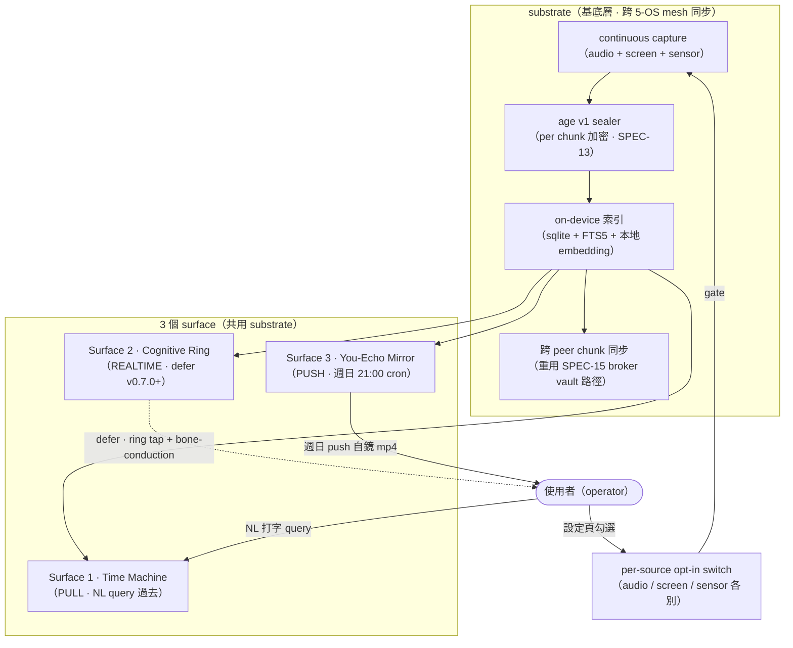
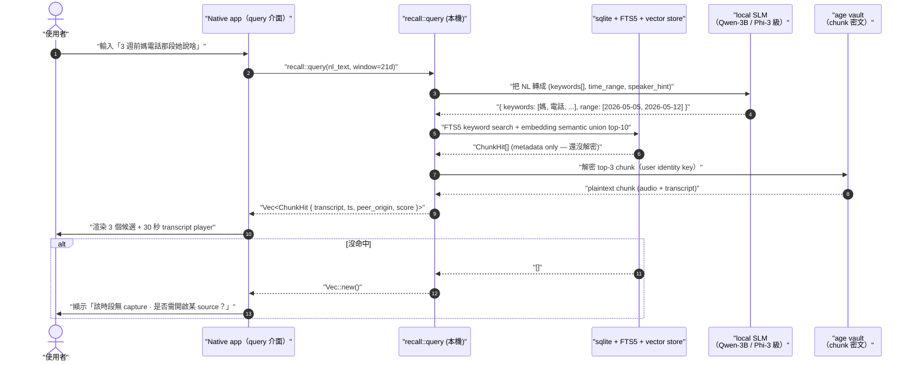

# SPEC-75-EXP · phantom recall — 時間 / 記憶層（time / memory layer）

> **EXP（experimental，實驗性）spec — 不是 v0.6.0 contract。** 本檔目的是把「未來想做」的設計輪廓畫出來，讓 v0.7.0+ cycle 開實作 spec 時有起點；§7-§10 等需要 wire-level（線層 = 程式對程式介面層）精度的章節在 EXP 階段刻意留白（OoS — out of scope，暫不做），不是漏寫。phantom recall 是 phantom-mesh 上的「時間層」——24/7 環境捕捉（ambient capture）+ 跨裝置 mesh + 端到端加密 + 三種表面（pull / realtime / push），把「上次 X 講啥」這種問題從「猜不到」變成「30 秒回放」。

---

## §0 Spec metadata

| Field | Value |
|---|---|
| Spec ID | `SPEC-75-EXP-phantom-recall` |
| Title | `phantom recall — 時間 / 記憶層` (English subtitle: `phantom recall — the time / memory layer`) |
| Status | `DRAFT (post-v0.6.0)` |
| Version | `0.1.0` |
| Last updated | `2026-05-26` |
| Author | `Mark + Claude Opus 4.7 / SPEC-75 EXP staging session` |
| Reviewer(s) | （待填） |
| Implementation owner | TBD（v0.7.0+ 接手者） |
| Target release | `v0.7.0+` |
| Pillar(s) served | `P1`（跨裝置 mesh — substrate 跨 5 OS 同步 sealed chunk）+ `P2`（多模態理解 — audio + screen + sensor 同 pipeline）+ `P3`（進化網 — 記憶就是 evolve 的長期燃料）+ cross-cutting `P4`（加密為先 — 所有 capture chunk age v1 sealed） |
| Track | `Life`（時間 / 記憶最先擊中 Life Track：「上次媽說啥」「這週對誰講『等一下』幾次」；Work Track 受益但不主導） |
| Epic | `v0.7.0+ EXP02 phantom-recall` |
| BIG-GOAL phrase served | 「**看得到你的生活與程式**」（[BIG-GOAL.md](../../BIG-GOAL.md) §Statement / §Per-phrase commitment line 27）— recall 把「看得到」從「event 當下」延伸到「任意時刻回放」；同時呼應 line 17「**越用越懂你**」（恆久記憶 = evolve 的長期燃料）與 line 29「**陪你進步**」（you-echo mirror 是行為自鏡） |
| Depends on | `SPEC-13-PROTOCOL-encryption-age`（chunk 一律 age v1 sealed）、`SPEC-16-PROTOCOL-event-storage`（chunk index 走 sqlite + FTS5）、`SPEC-20-SYSTEM-capture-food` / `SPEC-21-SYSTEM-capture-focus` / `SPEC-22-SYSTEM-capture-habit`（既有 capture wire 延伸 continuous mode）、`SPEC-25-SYSTEM-skill-extraction`（skill bank 借鏡記憶分層策略）、`SPEC-12-PROTOCOL-identity-keypair`（per-device key 派生 chunk encryption key） |
| Blocks | `(none in v0.6.0 — 全部 deferred)` |
| Template deviation | §7-§10 簡化或標 OoS；§8 完全略過（recall pipeline 是 stream-based，不適 state machine）；§14 / §15 略過 per EXP 慣例 — 原因：EXP 只畫設計輪廓，wire-level 精度留 v0.7.0+ implementable spec |

---

## §1 TL;DR

### 1.1 繁中三段

**問題**：人類記憶力有上限，但生活有下限——3 週前媽說的某句話、上禮拜開會某個 metric（指標）、半年前自己腦中閃過的 phantom-mesh idea、上個月對伴侶講「等一下」的次數，全部都會忘。Operator（操作者，本檔指 cluster 擁有者）目前唯一的記憶外掛是手機相簿 + 偶爾的 chat history，碎、不能 query、不會自我回顧。市場上的 Rewind.ai 已停運、Limitless 鎖硬體、ChatGPT 限本平台，沒有一個產品**同時**滿足「跨 5 OS / E2E（end-to-end，端到端）加密 / 本地優先 / 可 NL（natural language，自然語言）query / 自動 self-mirror（自鏡）」。

**方案**：在 phantom-mesh substrate（基底層）之上加一個 `phantom recall` 時間層。substrate 是 24/7 ambient capture（環境式被動捕捉 = audio + screen + sensor），跨 5-OS mesh peer（節點）以 age v1 端對端加密、on-device（本機）semantic-indexed（語意索引）。之上長出三個 surface（介面）共用同一個 substrate：(1) **Time Machine**（PULL，自然語言 query 過去）「3 週前跟媽談 X 那段確切說啥？」→ 30 秒 transcript（逐字稿）clip；(2) **Cognitive Ring**（REALTIME，defer 到 v0.7.0+ 因 hardware）智慧戒指敲一下 → bone-conduction（骨傳導耳機）whisper 0.8 秒提醒忘記的字；(3) **You-Echo Mirror**（PUSH，週日 21:00 cron）5 分鐘自鏡影片，由你真實語句 + 行為 pattern 組成。

**代價**：不做 cross-user share（隱私硬邊界）；不做 cloud capture upload（违反 P4 + Consent-gated capture）；continuous capture 對電力 / 儲存 / 法律（單方錄音管轄區）都不友善——substrate 必有 hard opt-in、每 surface 有獨立 off switch；Cognitive Ring 整段 defer 因為智慧戒指 API + bone-conduction earbud BLE（Bluetooth Low Energy，低功耗藍牙）低延遲是 hardware 挑戰；Apple / Google 隨時可能封 continuous audio capture，本檔有 fallback 退守 screen-only 計畫；v0.6.0 不出，留 v0.7.0+；本檔不寫 wire-level schema / API（留給未來 implementable spec）。

### 1.2 English abstract

`phantom recall` adds a time / memory layer on top of phantom-mesh's existing substrate. The substrate is a 24/7 ambient capture pipeline (audio + screen + sensor) running on every mesh peer across all five operating systems, sealed end-to-end with age v1 (SPEC-13), indexed on-device with sqlite + FTS5 (SPEC-16) and a local embedding store, and synced across the user's cluster via the same RPC fabric as existing capture wires (SPEC-20/21/22). Three surfaces share that substrate: (1) **Time Machine** — natural-language pull queries against the past, returning ~30-second transcript clips of any moment ("what did mom actually say three weeks ago when we talked about X?"); (2) **Cognitive Ring** — a real-time prompt loop triggered by a smart-ring tap, whispering a forgotten name or number through a bone-conduction earbud within 0.8 seconds (deferred to a hardware-mature later release); (3) **You-Echo Mirror** — a weekly Sunday-evening cron that aggregates the week's capture into a 5-minute self-mirror video built from the user's own sentences and behavior patterns. Hard non-goals: cross-user share, cloud capture upload, default-on without explicit per-source opt-in. This EXP spec sketches the design only; wire-level schema and API contracts are left to a follow-up implementable spec in the v0.7.0+ cycle.

### 1.3 Glossary

> 本表覆蓋本檔用到的核心縮寫 + 英文名詞，繁中對照。同檔第二次出現後允許只用英文。完整補集在 §20 附錄 C。

> - **substrate（基底層）** — 24/7 ambient capture pipeline，所有 surface 共用的底層資料來源
> - **surface（介面）** — 站在 substrate 之上、給 user 直接看到的功能（本檔 3 個：Time Machine / Cognitive Ring / You-Echo Mirror）
> - **ambient capture（環境式被動捕捉）** — 不需 user 主動按按鈕，由 OS 後台持續收 audio / screen / sensor 訊號
> - **continuous capture（持續捕捉）** — ambient 的另一個說法；強調「不是片段式」「沒有開始 / 結束按鈕」
> - **E2E（end-to-end encryption，端到端加密）** — 資料從 capture device 到 query device 全程加密，沒有任何中介看得到明文
> - **age（加密格式 v1）** — Filippo Valsorda 設計的現代簡化加密格式，phantom-mesh 既有 SPEC-13 標準
> - **chunk（區塊）** — substrate 把 stream 切成定長（如 30 秒）的單元；每個 chunk 獨立 sealed、獨立 indexed
> - **time machine（時光機）** — Surface 1，pull-style NL query 過去任一時刻
> - **cognitive ring（認知戒指）** — Surface 2，real-time tap-to-whisper 提示忘記的字
> - **you-echo mirror（自鏡映像）** — Surface 3，weekly push 自鏡影片
> - **bone-conduction（骨傳導耳機）** — 透過顱骨振動傳音，不塞耳道，戴 ring + earbud 不影響對話聽感
> - **SLM（small language model，小型語言模型）** — 參數 ≤ 8B 的本地可跑 LLM；本檔用於 on-device transcript + semantic match
> - **transcript（逐字稿）** — audio 轉成 text 的結果，附 timestamp（時間戳）
> - **NL query（自然語言查詢）** — 用人話問問題，不寫 SQL / 不點選單
> - **opt-in（明示同意）** — 預設關閉，使用者主動啟用才生效
> - **dogfood（自食其力）** — 自己長期使用自家產品作為主要測試方式
> - **mesh peer（網狀節點）** — phantom-mesh 裡的一台機器（手機 / 筆電 / 桌機 / 平板都算）

---

## §2 Context & Background

### 2.1 為什麼現在（其實是現在不做、未來做）

v0.6.0 cycle 把所有預算放在 4 pillars + 2 tracks 主幹 + 7 個 Sunday-deadline epic（食物 capture / focus 計時 / habit / coach / 技能庫 evolve / 30s hello / release pipeline），沒有空間開新 surface。但有 4 個觀察累積出「時間層」這個方向：

1. **既有 capture wire 已 60% 寫好**——SPEC-20 / 21 / 22 已實作食物、focus、habit 三類 capture 的 event ingestion + age 加密 + sqlite 落地。Substrate 化（變成「萬物皆 chunk」）的增量成本比想像低。
2. **dogfood 反覆撞同一問題**——Operator 自己用 phantom 一個月，最常想要的「就一個 query」是「上次跟 X 講過 Y 那段在哪」。既有 chat history 不夠（不涵蓋語音 + 螢幕）。
3. **競品 verified empty**——Rewind.ai 停運（2026-Q1），Limitless 把功能鎖在自家 hardware（不跨 OS），ChatGPT memory 只在 chatgpt.com 內。phantom-mesh 的 cross-5-OS + E2E + no-cloud 是市場唯一未填的座標。
4. **履歷 demo 衝擊強**——「30 秒回放 3 年前任何時刻」對任何 reviewer 都是視覺震撼，比 chart 或 dashboard 更有 narrative。

但 v0.6.0 沒空間，且 substrate 化動到 capture wire 的根，必須等 SPEC-20/21/22 在 v0.6.0 達 Stage 4 真實實作後才能延伸 continuous mode。因此規劃 v0.7.0+ EXP02 接手。

### 2.2 在 BIG-GOAL 哪裡

- **「看得到你的生活與程式」**（BIG-GOAL line 27）——這句話原本只承諾「event 當下看得到」；recall 把它延伸到「任意過去時刻可回放」。生活的時間維度從「現在」展開到「整個過往」。
- **「越用越懂你」**（BIG-GOAL line 17）——skill bank 技能庫（SPEC-25）是「行為 → 技能」的短時演進；recall 是「行為 → 永久記憶」的長時演進。兩者相補：skill 是「歸納」，recall 是「原始素材庫」。skill 想升級時可以回頭翻 recall 找更多 example。
- **「陪你進步」**（BIG-GOAL line 29，Life Track 主承諾）——You-Echo Mirror 直接服務這條：把 user 自己這週的語句 / 行為 pattern 映回他自己面前（不是 coach 來說教，是 user 自己看），是「自鏡進步」的具體機制。
- **P1 跨裝置 Mesh** + **P2 多模態理解** + **P3 進化網** + **P4 加密為先**——同時擊中 4 個 pillar 是少見的特性，這是把 recall 升到「flagship 候選」的關鍵理由。

### 2.3 既有解的歷史

- v0.5.0：完全沒有時間層；只有當下對話 + chat history（單一 sessionId 內）。
- v0.6.0：SPEC-16 event storage 引入 sqlite + FTS5，能搜「過去某類事件」但**沒有 audio / screen / sensor 的 raw chunk**；SPEC-20/21/22 三條 capture wire 只在 user 主動觸發時 capture（單張食物照、單次 focus session、單筆 habit chip），不是 ambient。
- v0.6.0：SPEC-25 skill bank 技能庫把「行為 → 技能」做成 6 步迴圈，但 skill 的原始素材依賴 capture wire 觸發 — 沒有 continuous source，skill 的廣度有上限。

### 2.4 相關 spec

- [`SPEC-13-PROTOCOL-encryption-age.md`](SPEC-13-PROTOCOL-encryption-age.md) — substrate 每個 chunk 走 age v1 sealed，加密格式不另立。
- [`SPEC-16-PROTOCOL-event-storage.md`](SPEC-16-PROTOCOL-event-storage.md) — chunk metadata + FTS5 索引重用既有 sqlite 落地路徑。
- [`SPEC-20-SYSTEM-capture-food.md`](SPEC-20-SYSTEM-capture-food.md) / [`SPEC-21-SYSTEM-capture-focus.md`](SPEC-21-SYSTEM-capture-focus.md) / [`SPEC-22-SYSTEM-capture-habit.md`](SPEC-22-SYSTEM-capture-habit.md) — 既有 capture wire；本檔規劃延伸這三條到 continuous mode 而非另開新 wire（minimise 變動面）。
- [`SPEC-25-SYSTEM-skill-extraction.md`](SPEC-25-SYSTEM-skill-extraction.md) — skill bank 的記憶分層（tiered memory）借鏡同一概念用於 recall 結果排序。
- [`SPEC-12-PROTOCOL-identity-keypair.md`](SPEC-12-PROTOCOL-identity-keypair.md) — chunk encryption key 從 `~/.phantom-mesh/identity.key` HKDF-SHA256 派生。
- [`SPEC-08-FOUNDATION-threat-model.md`](SPEC-08-FOUNDATION-threat-model.md) — continuous capture 引入的新威脅面（單方錄音法律 / 同事室友 bystander）寫入此 spec 補充。
- [`SPEC-04-FOUNDATION-error-catalog.md`](SPEC-04-FOUNDATION-error-catalog.md) — 不引入新 error code。

---

## §3 Goals / Non-Goals / Out-of-Scope

### 3.1 Goals

- `[G1]` Substrate 在所有 5 個 OS（macOS / Windows / Linux / iOS / Android）的 phantom-mesh peer 上能以 ≤ 8% 平均 CPU + ≤ 200 MB RAM 跑 continuous capture 24 小時不漏 chunk。`(verifies via: T-recall-substrate-24h-soak)`
- `[G2]` 所有 capture chunk 在落地前 100% 走 age v1 加密、broker 或任何 mesh peer 之外的第三方在任何時刻都看不到明文。`(verifies via: T-recall-chunk-plaintext-audit)`
- `[G3]` Time Machine surface 對 NL query「上次跟 X 講過 Y 那段在哪」在 7 天歷史窗內 p50 ≤ 3 秒回 top-3 候選 transcript clip（每段 ≤ 30 秒）。`(verifies via: T-recall-time-machine-latency)`
- `[G4]` You-Echo Mirror surface 每週日 21:00 ± 30 分鐘自動產出 ≤ 5 分鐘 mp4，內容包含 ≥ 3 段該週真實語句片段 + ≥ 1 個行為 pattern 數值（如「對 X 講 Y 幾次」）。`(verifies via: T-recall-youecho-weekly-cron)`
- `[G5]` Substrate 必須 opt-in per source（audio / screen / sensor 各別開關）+ per OS（在某台 peer 全關不影響其他 peer），off switch 在 native app 設定頁 ≤ 5 秒找得到。`(verifies via: T-recall-optin-find-time)`
- `[G6]` 跨 peer chunk 同步（同一 cluster 內 peer A capture 的 chunk 在 peer B 可被 query）在 cluster 內 LAN（local area network，區域網路）環境 ≤ 60 秒一致。`(verifies via: T-recall-cross-peer-sync)`

### 3.2 Non-Goals

- `[NG1]` **不做 cross-user share**——同一個 cluster 內的 chunk 永遠只屬於 cluster 擁有者；不會做「我給朋友看我這段 recall」分享連結。違反此原則直接破壞 P4。
- `[NG2]` **不做 cloud capture upload**——substrate 永遠 local-first，chunk 永不上傳雲端 broker 明文。Pro tier 的 cross-peer 同步走 broker vault（已加密），broker 仍看不到明文。
- `[NG3]` **不取代 chat history**——既有 chat history 是「對話 thread 結構化資料」，recall 是「raw stream + semantic index」。兩者並存，不互相覆蓋。
- `[NG4]` **不做 RLHF（reinforcement learning from human feedback，人類回饋強化學習）**——recall 是記憶，不是訓練；想把 recall 拿去 fine-tune 模型是另一個 repo 的工作（`phantom-training`）。
- `[NG5]` **預設不啟用**——install phantom 後 recall substrate 預設關閉，需 user 在 native app 明示啟用 + 每個 source 個別勾選；不接受任何「裝完就開始錄」設計。
- `[NG6]` **不主動上傳到 LLM provider**——chunk 內容只送本地 SLM 做 transcript + embedding；若 user 顯式按「用 frontier model 重寫摘要」才送雲端，且要顯示一次性確認框。
- `[NG7]` **不做 always-on hotword 喚醒**（「Hey phantom」之類）——substrate 是 continuous passive capture，不是 voice assistant；hotword wake 屬 SPEC-23 coach delivery 範疇。

### 3.3 Out-of-Scope for this version

- `[OoS1]` 詳細 wire-level schema（recall_wire.rs / recall_vault.rs 的 Rust struct + TypeScript interface 對應）——留 v0.7.0+ implementable spec。
- `[OoS2]` 完整 wireframe / visual design / design token 對齊——留 SPEC-31 / SPEC-41 style 的 platform flow spec。
- `[OoS3]` Cognitive Ring surface 整段——defer 到 v0.7.0+，等 ring API（Ultrahuman SDK / Oura cloud API / 第三方）+ bone-conduction earbud BLE 低延遲 stack 任一條成熟。
- `[OoS4]` 法律與管轄差異（單方錄音同意制度 vs 雙方同意制度）的具體實作——留 SPEC-08 威脅模型補充章節 + per-region settings UI 規範。
- `[OoS5]` Bystander（旁人）detection / consent prompting——技術可行度低，留 v0.8.0+ 研究議題。
- `[OoS6]` SLM 選型（Qwen-3B / Phi-3 / Gemma-2B 哪個 transcript 品質最好）——留實作期 benchmark。

---

## §4 Job Stories

> Intercom 句型：**When** [情境], **I want to** [動機], **so I can** [結果]。每條映射到至少一個 §3.1 Goal。

- `[J1]` **When** 我跟媽通完電話 3 週後想起她講過某句話但記不清細節，**I want to** 在 phantom 打字問「3 週前媽電話那段她說啥？」**so I can** 拿到 30 秒 transcript clip 確認原意，不必憑記憶腦補。 (→ G3)
- `[J2]` **When** 我週末看上週工作回顧，**I want to** 收到一個 5 分鐘 You-Echo Mirror video 看到我自己本週重複的口頭禪 + 對誰講過幾次「等一下」+ 哪天 focus 最久，**so I can** 不必另開 dashboard 就自然反思。 (→ G4)
- `[J3]` **When** 我擔心 substrate 在背景偷錄不該錄的，**I want to** 在 native app 設定頁 5 秒內找到「全停 audio capture」開關，**so I can** 隨時切斷信任。 (→ G5)
- `[J4]` **When** 我在 Mac 跑 phantom 一週、然後切到手機問同樣 NL query，**I want to** Mac 上 capture 的 chunk 在手機上也搜得到（cluster 內一致），**so I can** 不必記「哪段在哪台」。 (→ G6)
- `[J5]` **When** 我用 phantom 6 個月後想知道半年前自己對某個 project 的 first reaction，**I want to** 用一句 NL query「半年前第一次提到 project X 在哪」就跳到當時 transcript，**so I can** 回到那個 mental state 重啟思考。 (→ G3)
- `[J6]` **When** 我換新筆電並 setup phantom，**I want to** substrate 預設關閉、我主動勾選後才開始 capture，**so I can** 知道自己對 capture 範圍有完整掌控。 (→ G5, NG5)

---

## §5 Personas

> 從 BIG-GOAL §Audience 6 種挑選；不造新人物。

### 5.1 People who want both private AI workforce AND daily coach（BIG-GOAL Audience #1）

擁有 3-5 台裝置 mesh、同時用 phantom 做 work（code / research）+ life（食物 / focus / habit）的人。期待：recall 把「我這週做了啥」從碎片變整合視角，You-Echo Mirror 是週末自然反思的最低 friction 形式。

### 5.2 Privacy-conscious individuals（BIG-GOAL Audience #2）

記者、律師、研究員、異議人士。期待：substrate 端到端可驗證 broker / 雲端 / 任何第三方都看不到明文；opt-in 預設關閉；單一指令完全刪除（沿用 `phantom data delete --all --yes`）。

### 5.3 Hardware tinkerers（BIG-GOAL Audience #3）

有 Pi cluster / 家用 server / 老筆電的人。期待：substrate 可以 offload 重活到家裡 always-on peer（轉 transcript / 建 embedding index），mobile 端只負責輕量 capture + query。

---

## §6 System Architecture

### 6.1 Substrate + 3 surfaces 全景



### 6.2 Component breakdown（規劃）

| 元件 | 程式碼位置（規劃） | 職責一句話 | 對外介面 |
|---|---|---|---|
| Continuous capture wire | `core/src/recall_capture_wire.rs`（~600 LOC） | 三個 source（audio / screen / sensor）的 ambient ingest；延伸既有 SPEC-20/21/22 capture wire 而非全新 | 內部 emit `RawChunk` event |
| Substrate sealer | `core/src/recall_seal.rs`（~200 LOC） | 每個 RawChunk 用 user identity 派生的 chunk key age v1 sealed | 內部呼 `crypto::age::encrypt`（SPEC-13） |
| On-device index | `core/src/recall_index.rs`（~400 LOC） | chunk metadata 寫 sqlite + FTS5；transcript / screen-OCR text 走本地 SLM 產生 + 寫 FTS5 + embedding 寫本地 vector store | 暴露 `recall::query(nl_text, window) -> Vec<ChunkHit>` |
| Cross-peer sync | `core/src/recall_sync.rs`（~300 LOC） | 重用 SPEC-15 broker vault 路徑，把 sealed chunk + index delta 在 cluster 內 peer 之間 ≤ 60s 同步 | 走既有 RPC fabric |
| Time Machine surface | `app/src/screens/recall-time-machine.tsx`（待寫） | NL query 輸入框 + 結果 list + 30 秒 transcript player | UI 呼 `recall::query` |
| You-Echo Mirror surface | `core/src/recall_youecho.rs`（~400 LOC） + `app/src/screens/recall-youecho-player.tsx`（待寫） | 週日 21:00 cron aggregate 該週 chunk → ffmpeg 拼 5 min mp4 + TTS narration | OS 級 cron / launchd / Task Scheduler |
| Cognitive Ring surface | `core/src/recall_ring.rs`（OoS for v0.7.0+） | ring tap → 取最近 30s chunk → SLM 抽關鍵字 → bone-conduction earbud 0.8s whisper | 暫不規範 |
| Per-source opt-in store | `core/src/recall_optin.rs`（~100 LOC） | 三個 source × 每個 peer 的 boolean store，predicate 進 capture wire gate | sqlite settings 表 |

### 6.3 Sequence diagram — Time Machine NL query 走一遍



> 註：本檔不畫 Cognitive Ring 與 You-Echo Mirror 的 sequence — 前者整段 OoS，後者是純 cron triggered batch job（pseudocode 在 §6.4）。

### 6.4 You-Echo Mirror 週日 batch pseudocode（規劃輪廓）

```text
每週日 21:00 由 OS cron / launchd / Task Scheduler 觸發：
  1. 算 [start_of_week, now] 範圍
  2. 從 recall_index 撈該範圍所有 chunk metadata
  3. 用本地 SLM 找「重複出現 ≥ 3 次」的句子 / 行為 pattern
  4. 挑 ≤ 5 段 audio chunk（多樣化來源 / 時段）
  5. 挑 ≤ 3 個 behavior pattern 數值（如「對 X 講 Y N 次」）
  6. 用 ffmpeg 拼成 ≤ 5 min mp4：audio 片段 + TTS narration + 簡單字卡
  7. 通知 user：native app push「本週 You-Echo 已就緒」
  8. mp4 落地在本機 vault；user 主動點才解密播放
```

---

## §7 Data Model

> **EXP scope**：本節只列兩個核心 schema 的型別簽章意圖，**完整欄位字典 / sqlite DDL（資料定義語言）/ JSON Schema validation OoS — defer to implementable spec in v0.7.0 cycle**。原因：substrate 一旦寫 wire 就要做 migration，EXP 階段不該綁死欄位細節。

### 7.1 `RawChunk`（capture 出來的原始片段，sealed 前）

概念欄位（v0.7.0+ implementable spec 寫精確型別）：

- `chunk_id`：ULID（Universally Unique Lexicographically Sortable Identifier，可排序唯一 ID）
- `peer_id`：哪台 peer 產生
- `source`：`audio` / `screen` / `sensor` 其中一個
- `ts_start_ms` / `ts_end_ms`：定長窗（如 30 秒）
- `raw_bytes`：source 對應的原始位元組（audio = pcm wav；screen = frame jpeg seq；sensor = json）
- `os_context`：擷取時 OS 提供的 hint（active window title / sensor 名）— 此欄位 sealed-only，**broker 永不看到**
- `consent_state`：capture 當下 opt-in 的 boolean 快照（事後 audit 可知 capture 時授權範圍）

### 7.2 `SealedChunk` + `ChunkIndexRow`（sealed 後 + 索引）

`SealedChunk`：sealed_payload（age ciphertext）+ public minimal metadata（chunk_id / peer_id / ts_start_ms / source 類別 enum — 不含原始內容）；落地 vault。

`ChunkIndexRow`：FTS5 行包含 transcript / OCR text（本地 SLM 產出後寫入，明文留本機 sqlite，**永不外送**）+ embedding 向量（外部 vector store row）+ 回指 `chunk_id`。

### 7.3 其他 schema — OoS

完整 Rust struct + TypeScript interface 對齊、sqlite DDL、vector store schema、跨 peer sync delta format、版本化（schema migration）規則 — **Out of scope for EXP — defer to implementable spec in v0.7.0 cycle**。

---

## §8 State Machines

**OoS — defer to implementable spec in v0.7.0 cycle**。原因：substrate 是 stream-based pipeline，主要 state 只有「capture gate on/off」一個 bool（per source × per peer），不值得在 EXP 階段畫狀態圖。Surface 1 是 stateless query，Surface 3 是 cron triggered batch，Surface 2 整段 OoS。

---

## §9 API surface（簡化清單，非完整 contract）

> **EXP scope**：以下只列關鍵函式簽章 + 一句目的，**full request/response schema / error map / idempotency 規則 OoS — defer to implementable spec in v0.7.0 cycle**。

### 9.1 本機呼叫（Rust core 暴露給 Tauri / CLI）

| 函式 | 用途 |
|---|---|
| `recall::query(nl_text, window) -> Vec<ChunkHit>` | Time Machine 主入口；NL query 過去 chunk |
| `recall::optin_set(source, peer_id, enabled)` | Opt-in 開關（per source × per peer） |
| `recall::optin_get_all() -> OptInState` | 設定頁讀目前授權狀態 |
| `recall::youecho_latest() -> Option<MirrorVideoPath>` | UI 拿最近一次 You-Echo Mirror 結果 |
| `recall::wipe_all()` | 沿用 `phantom data delete --all --yes` 路徑，刪光所有 chunk |

### 9.2 跨 peer RPC（重用 SPEC-15 broker vault + SPEC-10 mesh-rpc）

| RPC | 用途 |
|---|---|
| `/rpc/recall/chunk_sync_since/:ts` | Peer B 向 peer A 拉 ts 之後新 chunk metadata + sealed payload |
| `/rpc/recall/query_distribute` | （v0.7.0+ 評估）把 NL query 分散到 cluster 內多 peer 並聯回 |

### 9.3 不在本檔規範

- 完整 endpoint request / response schema — **OoS**
- 全部 error code — **OoS**（承諾沿用 SPEC-04 catalog，不新增）
- Rate limit / backpressure（背壓）數值 — **OoS**

---

## §10 UI Screens（清單 + 一句描述，不寫 wireframe）

> **EXP scope**：列 4 個主畫面，**詳細 wireframe / component inventory / state matrix OoS — defer to SPEC-31 / SPEC-41 / SPEC-43 / SPEC-45 platform flow spec in v0.7.0 cycle**。

| # | Screen | 路由 | 一句用途 |
|---|---|---|---|
| 1 | Time Machine query | `/recall` | NL query 輸入框 + 結果 list + 30 秒 transcript player |
| 2 | You-Echo Mirror player | `/recall/youecho` | 顯示最新一支 5 min mp4；list 過去週的 mirror |
| 3 | Substrate opt-in settings | `/settings/recall` | 三 source × N peer 矩陣 toggle + 一鍵全停 |
| 4 | Storage / wipe | `/settings/recall/storage` | 顯示 chunk 數 + 佔空間；按鈕觸發 `recall::wipe_all` 二次確認 |

Cognitive Ring（Surface 2）整段 UI 不在此版規範。

---

## §11 Error model

本檔**不引入新 error code**。所有 recall 端錯誤沿用 [`SPEC-04-FOUNDATION-error-catalog.md`](SPEC-04-FOUNDATION-error-catalog.md) 既有條目，重點重用：

- `not_found` — chunk_id 不存在（已被 wipe / TTL 過期）
- `auth_invalid` — identity 解密失敗（key 不對 / 換過 device）
- `rate_limited` — 跨 peer sync 達 broker rate cap
- `internal_error` — 通用，攜帶 correlation id
- `storage_full` — 本機 chunk vault 接近磁碟上限（沿用既有 SPEC-16 條目）
- `consent_revoked` — capture 當下 opt-in，事後 user 撤回；query 該段時提示「此 chunk 已被撤回，無法解密」

---

## §12 Performance budgets（簡略）

| Metric | Target | Hard limit | Measured by |
|---|---|---|---|
| Substrate continuous CPU 平均 | < 5% | < 8%（高峰 ≤ 15% 短瞬） | OS top / Activity Monitor |
| Substrate RAM working set | < 150 MB | < 200 MB | OS process inspector |
| 每分鐘 chunk 落地 size（audio + screen 同開） | < 4 MB | < 8 MB（壓縮後） | vault dir du |
| Time Machine NL query p50 | < 3 s | < 8 s p95 | client-side timestamp |
| You-Echo Mirror 週日 batch 完成時間 | < 8 min | < 20 min | cron log |
| 跨 peer chunk sync 落差 | < 60 s（LAN） | < 5 min（WAN） | sync log |
| 24 小時 soak 漏 chunk 率 | 0% | < 0.1% | T-recall-substrate-24h-soak |

---

## §13 Privacy（核心章節）

這節是本檔的設計命脈，不能簡化。

### 13.1 設計原則

- **每個 chunk 走 age v1 sealed 才落地**——RawChunk → SealedChunk 中間沒有「先落明文磁碟、之後再加密」的窗口。Sealer 在 capture wire 同步呼叫。
- **本地 SLM 產出的 transcript / OCR 也是敏感資料**——明文留本機 sqlite + FTS5（為 query 效能必要），但**絕不**離開本機（不送任何 cloud LLM）。Pro tier 跨 peer sync 把這些走 SPEC-15 broker vault（同樣 sealed，broker 看不到明文）。
- **per-source opt-in 預設關閉**——install phantom 後 substrate 不會自動 capture；user 必須在 native app 設定頁主動勾 audio / screen / sensor 三選一以上才開始。
- **per-peer opt-in 互不傳染**——peer A 啟用不會 propagate 到 peer B；換新 device 必須重新勾。
- **撤回機制（consent revocation）**——user 撤回某 source 後，新 chunk 立即停 capture；舊 chunk 可選「撤回時即刪」或「保留可查」（per-source 設定）。撤回後 query 該段顯示 `consent_revoked`。
- **法律邊界（單方錄音 vs 雙方錄音）**——美國加州 / 歐盟若干 / 香港等地的雙方同意錄音規範是 user 自己的責任；本檔的 substrate 預設 OFF + 明示 opt-in + 每個 audio chunk 帶 `consent_state` 是技術緩解，不是法律保證。settings 頁須附法律提醒連結（每地 boilerplate）。
- **Bystander（旁人）問題**——substrate ambient capture 必然錄到旁人聲音；本檔 v0.1.0 不解這個問題（OoS5），但要求 audio chunk 不對外分享 / 不上傳雲端、user 自己負責不外流。

### 13.2 威脅模型（STRIDE 快速掃 + 新增 BYP / LEG）

> STRIDE = Spoofing / Tampering / Repudiation / Information disclosure / Denial of service / Elevation of privilege；BYP = bystander privacy；LEG = legal / regulatory。

| 類型 | 攻擊面 | 緩解 |
|---|---|---|
| Spoofing | 偽冒 user identity 解別人 chunk | per-device key 從 identity.key HKDF 派生；不同 user identity 不同 |
| Tampering | 改 sealed chunk 騙 query result | age v1 AEAD 帶完整性檢查；解密失敗即拒 |
| Repudiation | broker 否認接收同步 chunk | 沿用 SPEC-15 同步收據機制 |
| Information disclosure | 攻擊者讀本機 vault | vault 整個 age sealed；OS 帳號被攻破才暴露（本檔不解 OS 級威脅） |
| Denial of service | 大量假 chunk 塞爆儲存 | 每分鐘 chunk 落地 size hard cap + 本機 quota |
| Elevation of privilege | recall query 拿到不該看的別 user chunk | identity 邊界硬切；不存在 cross-user share |
| **BYP**（bystander privacy） | 旁人對話被錄 | 預設關閉 + per-source opt-in + 撤回機制；技術 v0.1.0 不解，文件警示 |
| **LEG**（legal / regulatory） | 在雙方同意管轄區 substrate 違法 | 設定頁附法律提醒；user 自選；技術不擔保 |

### 13.3 GDPR / 使用者刪除權

使用者按設定頁的「永久刪除所有 recall 資料」按鈕後：

- `recall::wipe_all()` 沿用既有 `phantom data delete --all --yes` 路徑
- 24h 內刪光本機 vault + sqlite + FTS5 + vector store + You-Echo mp4 + broker vault 鏡像（沿用 SPEC-15 §3.1 wipe SLA）
- 操作不可逆；確認流程要兩次點擊 + typed `DELETE` 字串

---

## §14 Migration

n/a（新功能 — 從零部署，無既有 user data 要轉）。

---

## §15 OoS / 暫不做（彙整）

- §7 完整 schema / DDL — OoS（v0.7.0+ implementable spec）
- §8 state machine — OoS（substrate 是 stream pipeline，state 太微）
- §9 完整 request/response / error map / idempotency — OoS
- §10 wireframe / interaction / a11y（accessibility，無障礙）/ copy table — OoS
- Cognitive Ring surface 整段 — OoS for v0.7.0+（hardware blocker）
- Bystander detection / consent prompting — OoS（v0.8.0+ 研究）
- 法律 per-region 自動切換（單方 / 雙方錄音）— OoS（v0.7.0+ implementable spec 補）
- Cross-user share — 永久 Non-Goal（NG1）
- Cloud capture upload 明文 — 永久 Non-Goal（NG2）
- RLHF / fine-tune — 永久 Non-Goal（NG4），屬另一 repo

---

## §16 Risks

| # | Risk | Likelihood | Impact | Mitigation | Owner |
|---|---|---|---|---|---|
| R1 | Apple / Google 封 continuous audio capture API（如 iOS 強制 mic indicator + 限背景時長） | 中-高 | 高（Surface 1 / 3 退守 screen-only） | 預先設計 graceful degradation：audio 不可時 substrate 自動降級 screen-only + sensor；UI 顯示「audio 已被 OS 限制」 | future v0.7.0 owner |
| R2 | 24/7 capture 對筆電 / 手機電力衝擊太大 | 中 | 中-高（user 抱怨就停用） | 平均 CPU < 5% hard target + per-peer 可關 + 用本機 SLM 而非 cloud（省網路電力） |  |
| R3 | 本機儲存爆掉（chunk 大量累積） | 高 | 中（user 體驗痛 + 系統警報） | 每 chunk 量化壓縮（如 audio opus 16kbps）+ 預設 90 天 TTL + 滿了自動 demote 到 cold storage |  |
| R4 | 法律灰區（單方 / 雙方錄音管轄差異） | 高 | 高（最壞被罰 / 訴訟） | 設定頁強制法律提醒 + per-region UX warning + audio chunk 帶 `consent_state` audit trail；本檔不擔保合法 |  |
| R5 | Bystander 投訴 — 旁人發現被錄抗議 | 中 | 中 | 警示文件 + 預設 audio OFF；v0.8.0+ 研究 bystander detection |  |
| R6 | EXP 階段設計 lock-in — 之後 implementable spec 想改但已有人寫程式跟著 EXP 走 | 中 | 中 | 本檔頂部明示「EXP, 非 contract」；blocking 限制只在 v0.7.0+ |  |
| R7 | Rewind.ai 復活 + cross-platform | 低-中 | 中（市場 narrative 弱化） | phantom 的差異化在 mesh + E2E + no-cloud；narrative 強調這三點而非「我們有時間機」 |  |
| R8 | 本地 SLM transcript 品質不夠 → query 命中率低 → user 失望 | 中 | 中-高 | 實作期 benchmark Qwen-3B / Phi-3 / Gemma-2B；若都不行 fallback 給 user 選「用 cloud frontier 重 transcript（一次性確認）」 |  |

---

## §17 Alternatives Considered + Abandoned Ideas

### 17.1 Cloud-side capture upload + cloud LLM index（最快但違反 P4）

**方案**：substrate 把 chunk 上傳到 phantommesh.io broker，broker 跑 transcript + index，user 從任何 device 走 web dashboard query。Tech 最熟、entirely Cloudflare Worker + R2 + 第三方 transcription（如 Whisper API）即可，4 週做完。

**為何沒選**：徹底破壞 P4「資料加密，只你能讀」。chunk 一旦上傳明文，broker 員工 / 攻擊者 / 法庭傳票任一條都能讀。即便加密上傳，cloud LLM transcript 要解密才能跑，明文窗一定打開。違反 BIG-GOAL §What this rules out 的「Cloud-only or SaaS-only」+ 「Background recording / surveillance defaults」雙條。

**什麼條件會回來**：永遠不會以「明文上傳」形式回來。可能的折衷是「user 顯式按『請 frontier model 重摘要此段』時走一次性 confirmation + 即用即丟 token」——但這已在本檔 NG6 框定為 user-triggered，不是 default。

### 17.2 純 user-triggered capture（永遠不 ambient）

**方案**：放棄 24/7 substrate，只在 user 主動按「現在記」按鈕或喚「Hey phantom 記一下」hotword 時 capture。完全 consent-explicit、零法律風險、零電力風險。

**為何沒選**：摧毀本檔核心 value——「上次 X 講啥」這類 query 的前提是「user 當時沒意識到該記」。若每段都要 user 主動記，phantom recall 就退化成「進階版備忘錄」，跟 Apple Notes + Otter.ai 沒差。BIG-GOAL line 29「陪你進步」+ line 17「越用越懂你」要求 phantom 能「在 user 沒留意時也累積長期素材」——這需要 ambient。

**什麼條件會回來**：如果跨多管轄區法律風險評估後發現 ambient 在 phantom-mesh 目標市場（北美 / 歐盟 / 日本 / 台灣）普遍不可行，可能退守此方案。

### 17.3 第三方 capture device（Limitless / Friend / Humane 風）

**方案**：phantom-mesh 自己不做 capture wire，只當記憶層；capture 由 user 戴 Limitless 吊牌 / Friend 項鍊 / 智慧戒指 / smart glass 等專用 hardware 收，via BLE / USB sync 到 phantom-mesh。

**為何沒選**：(a) 違反 BIG-GOAL §What rules out 的 single-vendor 邊界——user 必須買特定 hardware；(b) 跨 5-OS 已有 mesh peer 都能 capture（mic / screen / sensor 都在），何必再加 hardware；(c) Limitless / Friend / Humane 自己都還沒 product-market fit，押在不穩 hardware 上風險高；(d) 第三方 hardware 多半 cloud-dependent，違反 P4。

**什麼條件會回來**：智慧戒指（Ultrahuman / Oura）作為 **Cognitive Ring 觸發器**（而非主 capture source）會在 v0.7.0+ 回來——但僅當 ring tap 是 trigger、capture 主源仍是 mesh peer 既有 mic / screen。

### 17.4 把 recall 收進 SPEC-25 skill bank 技能庫（不獨立 spec）

**方案**：把 recall 看成 skill bank 技能庫的「raw event 來源延伸」，不另立 spec、不另立 wire；既有 SPEC-25 的 6 步迴圈直接消費 continuous capture。

**為何沒選**：(a) skill bank 是「歸納後的可重用模式」，recall 是「原始 raw stream」——抽象層級不同，混在一起會讓 SPEC-25 scope 爆炸；(b) recall 的三個 surface（pull / realtime / push）跟 skill bank 的 6 步是完全不同 UX 模型，不該共 spec；(c) recall 的法律 / 隱私 / 電力風險面比 skill bank 大一個量級，需獨立 review。

**什麼條件會回來**：不會。但 recall substrate 出來後可以**餵** SPEC-25 judge step 更廣 source（「上週 user 對什麼 topic 重複表達了 N 次」這類 candidate skill），這是設計上的協同而非合併。

---

## §18 Open Questions & Decisions

| # | Question | Default assumption（v0.7.0 spec 不另議決時採用） | When needed |
|---|---|---|---|
| Q1 | Chunk 定長 30 秒還是動態（依語意斷句）？ | **固定 30 秒**（簡單 + 等長易索引）；動態斷句留 v0.8.0+ | v0.7.0 implementable spec |
| Q2 | 本地 SLM 選誰跑 transcript（Qwen-3B / Phi-3 / Gemma-2B / Whisper.cpp）？ | **Whisper.cpp**（專做 transcription，已成熟）；semantic 部分另選 SLM | 實作 benchmark 期 |
| Q3 | Embedding 用本地（如 `bge-small`）還是 commodity cloud（如 `text-embedding-3-small`）？ | **本地優先**（嚴守 NG6）；cloud 只在 user 顯式 opt-in | v0.7.0 implementable spec |
| Q4 | 跨 peer chunk 同步是 push（producer 主動傳）還是 pull（query peer 找 producer）？ | **pull**（producer 不知 query 何時出現；pull 比較好 backpressure） | v0.7.0 wire spec |
| Q5 | You-Echo Mirror video 預設 ≤ 5 min 還是 user 可調？ | **預設 5 min**，settings 可 1 / 5 / 10 三選 | v0.7.0 UX 決策 |
| Q6 | Substrate 在 iOS / Android 是否可在背景持續跑（OS 背景限制）？ | **iOS 須走 NSE / live activity 變通；Android 走 foreground service**；若 OS 全擋則該 device 退守 user-triggered | v0.7.0 platform spec |
| Q7 | 法律 boilerplate 由 phantom-mesh 維護還是引用第三方法律 SaaS？ | **自己維護一份 per-region 模板**，禁用任何 user-tracking 第三方 | v0.7.0 legal review |
| Q8 | Chunk TTL 預設 90 天還是無限？ | **預設 90 天**，settings 可 30 / 90 / 365 / 無限 | v0.7.0 UX 決策 |

---

## §19 Testing

> **EXP scope**：詳細測試矩陣 / 覆蓋率目標 / 自動化測試棚 — **OoS — defer to implementable spec in v0.7.0 cycle**。本節只列佔位 placeholder（佔位 = 預留識別碼）讓未來 SPEC-60 補。

預定測項 ID（皆 placeholder）：

- `T-recall-substrate-24h-soak` — Goal G1 — 5 OS 各跑 24h continuous capture，平均 CPU / RAM / 漏 chunk 率達標
- `T-recall-chunk-plaintext-audit` — Goal G2 — sealer 路徑 fuzz test + grep vault / broker mirror 任何時刻無明文
- `T-recall-time-machine-latency` — Goal G3 — 餵入 7 天合成 chunk，NL query p50 ≤ 3 s
- `T-recall-youecho-weekly-cron` — Goal G4 — mock 一週 chunk，週日 21:00 cron 觸發 + 產出 mp4 內容驗證
- `T-recall-optin-find-time` — Goal G5 — UX 測 ≤ 5 秒可找到 off switch
- `T-recall-cross-peer-sync` — Goal G6 — 同 cluster 兩 peer LAN sync ≤ 60 s 一致

完整測試規範等 v0.7.0+ implementable spec 與 SPEC-60-TESTING-strategy 對接。

---

## §20 Appendices

### A. Sample payloads

EXP 階段不附（避免被當 wire contract）；v0.7.0+ implementable spec 補。

### B. References

- SPEC-13 encryption-age（chunk sealer 的加密格式）
- SPEC-16 event-storage（sqlite + FTS5 索引重用）
- SPEC-20 / 21 / 22 capture-food / focus / habit（既有 capture wire 的延伸基礎）
- SPEC-25 skill-extraction（tiered memory 設計借鏡）
- SPEC-12 identity-keypair（per-device key 派生）
- SPEC-15 broker-vault-sync（跨 peer chunk 同步路徑）
- SPEC-08 threat-model（continuous capture 新威脅面待補章節）
- SPEC-04 error-catalog（不新增 error）
- BIG-GOAL.md §Statement / Per-phrase commitment「**看得到你的生活與程式**」、「**越用越懂你**」、「**陪你進步**」
- 同期姊妹候選：`scripts/ai/output/agent-1000/CANDIDATE-B-phantom-personas.md`（persona 層；與本檔 paired flagship，獨立 spec 另寫）

### C. Glossary（補完 §1.3 沒涵蓋的）

- **AEAD（authenticated encryption with associated data，帶驗證的加密）** — 加密同時帶完整性檢查，age v1 用
- **HKDF（hash-based key derivation function，雜湊金鑰衍生函數）** — 從 master identity key 派生 per-chunk key 用
- **BLE（Bluetooth Low Energy，低功耗藍牙）** — 智慧戒指 / earbud 連手機的通訊協定
- **TTL（time to live，存活時間）** — chunk 自動過期的設計欄位
- **STRIDE** — 微軟威脅建模框架 6 種攻擊類型
- **OCR（optical character recognition，光學文字辨識）** — 把 screen capture frame 裡的文字抽出來建索引
- **TTS（text to speech，文字轉語音）** — You-Echo Mirror 的 narration 走 TTS 拼接
- **cron** — Unix 風格定時任務排程；macOS 對應 launchd、Windows 對應 Task Scheduler、iOS / Android 對應 OS 背景任務 API
- **frontier provider** — 旗艦級 LLM provider（Anthropic / OpenAI / Google）；本檔限制不送 chunk 內容到 frontier，除非 user 顯式 opt-in 單次重摘要
- **LAN（local area network，區域網路）** / **WAN（wide area network，廣域網路）** — 跨 peer sync 的兩種網路情境
- **NSE（Notification Service Extension）** — iOS 背景任務變通機制之一
- **foreground service** — Android 維持背景常駐的官方機制

### D. Changelog

- **0.1.0 (2026-05-26)** — Initial EXP draft。Substrate + 3 surface 設計輪廓鎖定；§7-§10 刻意低精度標 OoS；§13 privacy + §17 alternatives 為全檔最詳；blocks nothing in v0.6.0；Cognitive Ring 整段 defer 到 v0.7.0+ hardware mature 後。

---

# EXP spec 寫作硬規則（適用本檔）

1. 不假裝 wire-level 精度 — §7-§10 明示 OoS。
2. 不引入新 dependency 到 v0.6.0 — `Blocks: none in v0.6.0`。
3. 不引入新 error code — 沿用 SPEC-04。
4. 不寫進 SPEC-00-INDEX active 區，至多放 EXP / future 區（由 INDEX 維護者決定）。
5. 文檔頂部明示「EXP, 非 contract」— 避免被讀成 implementable spec。
