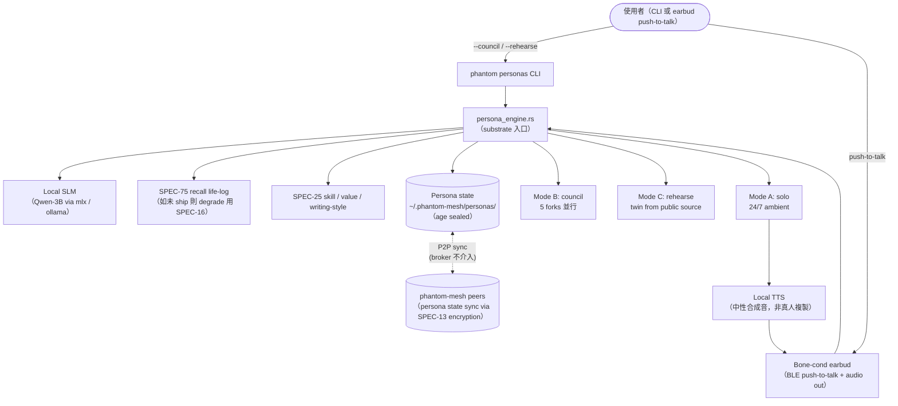
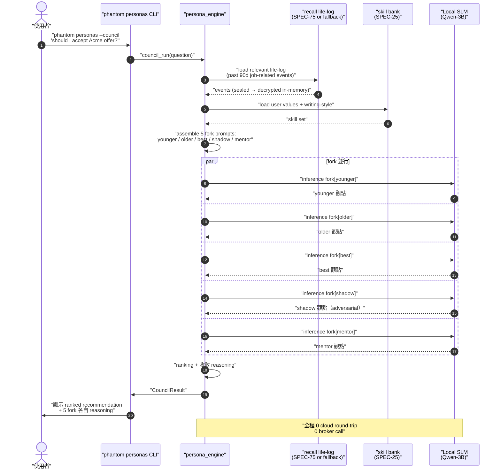

# SPEC-76-EXP · phantom personas — 多重自我層 (persona / multi-self layer)

> **EXP（experimental，實驗性）spec — 不是 v0.6.0 contract。** 本檔目的是把「未來想做」的多重自我設計輪廓畫出來，讓 v0.7.0+ cycle 開實作 spec 時有起點；§7-§10 等需要 wire-level（線路層級）精度的章節在 EXP 階段刻意留白（OoS — out of scope，暫不做），不是漏寫。
>
> **核心承諾**：本檔不發明新 dependency（相依套件）、不引入新 error code（錯誤碼）、不壓在 v0.6.0 contract 上。

---

## §0 Spec metadata

| Field | Value |
|---|---|
| Spec ID | `SPEC-76-EXP-phantom-personas` |
| Title | `phantom personas — 多重自我層 (persona / multi-self layer)` |
| Status | `DRAFT (post-v0.6.0)` |
| Version | `0.1.0` |
| Last updated | `2026-05-26` |
| Author | `Mark + Claude Opus 4.7` |
| Reviewer(s) | (待填) |
| Implementation owner | TBD（v0.7.0+ 接手者） |
| Target release | `v0.7.0+` |
| Pillar(s) served | `P3`（進化網 — 把 self-evolution 從 skill 層擴到 persona 層）+ `P2`（多模態理解 — 加入 voice 通道）+ cross-pillar `X.privacy`（本地 SLM，metadata 與 voice 永不上雲） |
| Track | `Life`（多重自我屬於 fat-loss / focus / habit / daily review / ambient memory 之外的新 Life surface — 內在對話與外在演練） |
| Epic | `v0.7.0+ EXP03 phantom-personas` |
| BIG-GOAL phrase served | 「**越用越懂你**」（[BIG-GOAL.md](../../BIG-GOAL.md) §Statement / §Per-phrase commitment）— persona 層把「懂你」從 skill 抽取進化成「能扮演你」的多重版本；同時服務「跑在你所有裝置上」（P1 substrate 重用） |
| Depends on | `SPEC-25-SYSTEM-skill-extraction`（提供 skill / value / writing-style 來源資料）、`SPEC-75-EXP-phantom-recall`（提供 life-log substrate；sibling EXP 平行撰寫中，本檔 reference 不阻塞）、`SPEC-14-PROTOCOL-llm-providers`（local SLM 走 provider trait，例如 mlx 或 ollama backend） |
| Blocks | `(none in v0.6.0 — 全部 deferred)` |
| Template deviation | §7-§10 簡化或標 OoS，§8/§14/§15 完全略過 — 原因同 SPEC-70-EXP / SPEC-75-EXP：EXP 階段只畫設計輪廓，wire-level 精度留給 v0.7.0+ implementable spec |

---

## §1 TL;DR

### 1.1 繁中三段

**問題**：phantom-mesh 目前的 agent（智能體 = AI 代理人）都是「外部助理」— 你問它答、你派 task（任務）它跑。但人在做重大決定時最需要的不是一個外部助理，而是「**多個我自己**」可以辯論、預演、陪伴。具體場景：(a) 接不接某 job offer（工作邀約）— 想聽自己的多版本意見；(b) 下週要面試 / 加薪 / 分手 — 想先跟對方的 digital twin（數位分身）adversarial rehearse（對抗式預演）幾次；(c) 24/7 ambient（環境式）想要一個本地、私密、用 life-log 形成的「第二人」陪聊但 cloud LLM 違反 P4。

**方案**：在 phantom-mesh 上加一個 **persona 層**（人格層），與 SPEC-25 skill 層、SPEC-75 recall 層平行。Substrate（基板）為本地 SLM（small language model，小型語言模型，例如 Qwen-3B）+ phantom recall 提供的 life-log + 從 skill 萃取的 values（價值觀）/ writing-style（書寫風格） + 可選 bone-conduction earbud（骨傳導耳機）通道。Persona 層提供三種 mode（模式）：**Mode B council（內在會議）** 5 個你的版本辯論 / **Mode C rehearse（對抗演練）** 對手 twin 模擬 / **Mode A solo（24/7 第二人）** ambient 陪伴。Ship order（出貨順序）為 B → C → A（先快、再痛點、最後 ambitious）。

**代價**：明確不做 cloud-hosted（雲端託管）persona（會違反 P4 + 把你最敏感的 life-log 送出去）；不做 voice-cloning / deepfake（深度偽造，用合成聲音冒充真人）— Mode A 的 voice 用中性合成音，Mode C rehearse 不複製對方真實聲線；不在 v0.6.0 ship；ethics（倫理）顧慮 — sycophantic（迎合式）persona 違反「shame-free 但不 agreement-machine」原則，shadow-self（陰影自我）人格故意設成 adversarial（對抗式）不討好你。本檔不寫 wire-level schema / API（留給未來 implementable spec）。

### 1.2 English abstract

phantom personas adds a **multi-self layer** to phantom-mesh: a local-SLM-powered (Qwen-3B-class) engine that draws on the user's life-log (via SPEC-75 phantom recall), extracted skills/values/writing-style (via SPEC-25), and an optional bone-conduction earbud channel to synthesize three interaction modes. **Mode B council** runs 5 forks of the user (younger / older / best-self / shadow / mentor archetype) that debate any decision and return a ranked, reasoned recommendation. **Mode C rehearse** ingests public-source material about a counterparty (interviewer, manager, partner) to build a digital twin the user adversarially rehearses against before a high-stakes conversation. **Mode A solo** is a 24/7 ambient second-self over a bone-conduction earbud, fitting the user's conversational style over months. Everything runs locally — broker never sees persona payloads, no cloud LLM call by default, voice synthesis stays on-device, no real-person voice cloning. Ship order is B (2w) → C (3w) → A (4-5w). Ethics: explicitly anti-sycophantic — the shadow-self persona is built to disagree, and Mode C twins are practice partners, not influence weapons. This EXP spec sketches the design only; wire-level schema, full API contracts, and on-device SLM benchmark targets are left to a follow-up implementable spec.

### 1.3 Glossary

> 本表覆蓋本檔用到的核心縮寫 + 英文名詞，繁中對照。同檔第二次出現後允許只用英文。
>
> - **persona（人格）** — 一份可被 LLM 扮演的角色設定 + 上下文資料（不是真人，但呈現方式接近）
> - **multi-self layer（多重自我層）** — 本檔提案的新層，與 skill 層 / recall 層 並列
> - **SLM（small language model，小型語言模型）** — 參數量 1-7B 級可在 consumer device 跑的 LLM；本檔基準為 Qwen-3B 量級
> - **substrate（基板）** — 上層 mode 共用的基礎能力（本地 SLM + life-log + values + voice 通道）
> - **mode（模式）** — persona 層暴露給使用者的三種互動形式：council / rehearse / solo
> - **council（內在會議）** — Mode B：5 個 user 自己的版本辯論
> - **rehearse（對抗演練）** — Mode C：跟對手 twin 對練
> - **solo（單一陪伴）** — Mode A：1 個 ambient 第二人
> - **twin（數位分身）** — 用公開資料（LinkedIn / Twitter / blog / GitHub）建出的對方 LLM 角色
> - **shadow-self（陰影自我）** — Carl Jung 心理學概念；本檔指 council 5 forks 之一，扮演你怕承認的那部分
> - **best-self（最佳自我）** — council 5 forks 之一，扮演你嚮往的版本
> - **mentor archetype（導師原型）** — council 5 forks 之一，扮演你心中理想導師
> - **bone-conduction earbud（骨傳導耳機）** — 不入耳道、用顱骨振動傳音的耳機；持續配戴友善
> - **RLHF（reinforcement learning from human feedback，人類回饋強化學習）** — 主流 LLM 訓練讓模型偏好「使用者點讚」回答，產生 sycophancy 副作用
> - **sycophancy（迎合性）** — LLM 為討好使用者而說同意 / 誇讚 / 不反駁的傾向
> - **IFS（Internal Family Systems，內在家庭系統治療）** — Richard Schwartz 心理治療法，把人格視為多個 sub-personality 集合；council mode 設計靈感來源
> - **adversarial（對抗式）** — 對手 / 反方 / 不討好的回應姿態；本檔用於 Mode C twin 與 shadow-self persona
> - **deepfake（深度偽造）** — 用 AI 合成的影音模仿真人；本檔明確 abandon（見 §17.3）
> - **ambient（環境式）** — 不需主動操作、持續在背景中存在的互動形態
> - **agent（智能體）** — phantom 既有的角色化 LLM 執行單元，例如 `agent.coach` / `agent.master`

---

## §2 Context & Background

### 2.1 為什麼現在（其實是現在不做、未來做）

v0.6.0 cycle 焦點是 4 pillars + 2 tracks 主幹（mesh / multimodal / evolve / encryption）跟 7 個 Sunday-deadline epic（截止期限週末交付的史詩級任務）。phantom personas 是「v0.6.0 GA（general availability，正式上市）後的 reward queue（獎勵佇列）」之一，跟 SPEC-75 phantom recall 同列為下一波 sci-fi 級 flagship（旗艦功能）。

觸發此檔的觀察：
- Operator（操作者，本檔指 phantom 擁有者）做重大決定時（接不接某 offer、要不要分手、面試準備）反覆出現「希望多個版本的自己辯論」「想先預演對方反應」的需求，但既有 `agent.coach` 是單一外部助理人格，不擅長扮演**你自己的多重版本**。
- bone-conduction earbud 在 operator 日常已成標配（跑步 / 通勤 / 散步），形成持續可用的低干擾互動通道，卻沒被 phantom-mesh 任一現有 agent 使用。
- 本地 SLM（Qwen-3B 量級）在 Mac M-series + iPad / iPhone A-series 上已可達 100-200 tokens/s，到了「足夠 ambient 對話」的門檻 — 不必再讓「私人第二人」依賴 cloud LLM。

### 2.2 在 BIG-GOAL 哪裡

- **P3 進化網（Evolve Mesh）** — BIG-GOAL §Four pillars P3「Phantom self-evolves with each user」。Persona 層是 self-evolution 的下一階：skill 層（SPEC-25）解決「我學會做什麼」，persona 層解決「我形成成什麼樣的角色」。council 5 forks 隨 life-log 累積會更貼近真實使用者的多面性，是 evolution 的具象呈現。
- **P2 多模態理解** — BIG-GOAL §Four pillars P2「Image + audio + text + behavior context — all in」。Mode A solo 透過 bone-cond earbud 引入長時 audio 通道；Mode C rehearse 引入 voice synthesis（合成音，**不複製真人**）作為輸出 modality（模態）。
- **Cross-pillar X.privacy** — 本檔關鍵設計約束：persona payload 永遠不上雲。本地 SLM + on-device voice synth + sealed-by-identity persona state，broker 看不到任何 persona 內容。
- **「越用越懂你」phrase commitment** — BIG-GOAL §Per-phrase commitment 對此 phrase 的承諾是「Adaptive — self-evolution from interaction; cross-node skill sharing」。Persona 層把這個承諾從「skill 共享」擴到「人格成型」— 你用越久，council 5 forks 越像你的真實多面性。

### 2.3 既有解的歷史

- v0.5.0：只有 `agent.coach` 單一外部助理；無「扮演你自己」概念。
- v0.6.0：SPEC-25 skill-extraction 引入 skill / value 抽取，但只用於 task routing（任務派發），不用於 persona 生成。
- v0.6.0：SPEC-14 llm-providers 已支援多 provider；理論上可掛 local mlx / ollama backend，但目前還沒實際 wire 本地 SLM 進 persona use-case。

### 2.4 相關 spec

- [`SPEC-25-SYSTEM-skill-extraction.md`](SPEC-25-SYSTEM-skill-extraction.md) — 提供 skill / value / writing-style 來源資料；persona 層直接讀 skill bank 不重新發明 extraction。
- [`SPEC-75-EXP-phantom-recall.md`](SPEC-75-EXP-phantom-recall.md) — sibling EXP（平行撰寫中）。提供 life-log substrate；本檔 reference 但不阻塞 — Mode A solo 在 SPEC-75 ship 前可先用 SPEC-16 event_storage 既有資料 degrade 運作。
- [`SPEC-14-PROTOCOL-llm-providers.md`](SPEC-14-PROTOCOL-llm-providers.md) — local SLM 走既有 provider trait（mlx / ollama / local-http backend）；本檔不發明新 provider 路徑。
- [`SPEC-04-FOUNDATION-error-catalog.md`](SPEC-04-FOUNDATION-error-catalog.md) — 錯誤碼來源，本檔不引入新 error。
- [`SPEC-13-PROTOCOL-encryption.md`](SPEC-13-PROTOCOL-encryption.md) — persona state at-rest（靜止資料）一律 age v1 sealed，沿用此 spec。
- BIG-GOAL.md §Three operational principles — `Shame-free` / `Consent-gated capture` / `Reversible` 三原則本檔逐條對齊（見 §13）。

---

## §3 Goals / Non-Goals / Out-of-Scope

### 3.1 Goals

- `[G1]` Operator 用 `phantom personas --council "<decision>"` 在 ≤ 3 分鐘內得到 5 個 self-fork（自我分身）的辯論結果與 ranked recommendation（排序建議），全程本地 SLM。`(verifies via: T-personas-council-latency)`
- `[G2]` Operator 用 `phantom personas --rehearse <topic> --counterparty <linkedin-url>` 可建立一個 counterparty twin 並進行至少 5 輪對話演練，twin 風格在 5 輪後仍未漂移成 agreement-machine（迎合機）。`(verifies via: T-personas-rehearse-adversarial-stability)`
- `[G3]` Mode A solo 在配戴 bone-cond earbud 期間，從 push-to-talk（按住說話）觸發到第一個 token 回應 ≤ 2s（local SLM on-device），全程不發出任何 cloud LLM 請求。`(verifies via: T-personas-solo-local-only + T-personas-solo-latency)`
- `[G4]` Persona state（包含 5 council forks 的 prompt template、rehearse 中的 twin profile、solo 的長期對話記憶）一律 sealed at-rest by identity key — broker 永遠看不到 persona 內容。`(verifies via: T-personas-privacy-e2e)`
- `[G5]` Council 5 forks 中 `shadow-self` 與 `mentor` 兩個 fork 對使用者問題的回應，需通過「anti-sycophancy（反迎合）測試」— 在含有明顯 leading question（誘導性提問）的測例上不無條件附和。`(verifies via: T-personas-council-anti-sycophancy)`
- `[G6]` Persona 層所有 mode 預設關閉（opt-in，明示同意才開啟）；首次啟用顯示 confirmation modal（確認對話框）清楚列示「會用到哪些 life-log 資料 / 會啟用 voice 通道 / 如何停用」。`(verifies via: T-personas-optin-default-off)`

### 3.2 Non-Goals

- `[NG1]` **不做 cloud-hosted persona** — persona engine 全部 on-device；不開 broker 端 persona endpoint。違反此原則等同把 user 的 multi-self 樣本送上雲，破壞 P4 + 違背「越用越懂你 = 你的」精神。
- `[NG2]` **不做 voice-cloning of real persons** — Mode A solo 用中性合成音；Mode C rehearse 的 twin 用通用合成音 + 文字風格模仿，**不取對方真實聲線樣本**。即使對方公開 podcast 有錄音也不採。
- `[NG3]` **不做「替你跟人對話」的代理人** — persona 是練習對象（C）/ 辯論對象（B）/ 內在陪伴（A），不會被派去替使用者實際回 email / 接電話 / 寫訊息給第三方。違反此即進入 BIG-GOAL Anti-Audience「autonomous agents I never have to look at」禁區。
- `[NG4]` **不取代真人關係 / 不取代心理治療** — Mode A solo 不是「電子伴侶」、不是「替代朋友 / 家人」、不是「替代諮商師」。文案與 onboarding 全程明示。違反此進入 BIG-GOAL Anti-Audience「clinical / medical AI that diagnoses me」禁區。
- `[NG5]` **不上 phantom-mesh broker 同步 persona state** — persona state 只跨 user 自己的 peer（節點）同步（透過既有 mesh + SPEC-13 encryption），broker 完全不介入。
- `[NG6]` **不做 persona marketplace（人格市集）** — 不允許下載別人的 persona template；persona 必須由 user 自己 life-log 生成。違反此就變第三方角色扮演 app，不是「你的多重自我」。

### 3.3 Out-of-Scope for this version

- `[OoS1]` 詳細 wire-level schema（persona / twin / council session 的完整資料結構）— 留給 v0.7.0+ implementable spec。
- `[OoS2]` 本地 SLM 的 benchmark target（吞吐量 / 記憶體足跡 / 模型量化策略） — 留 v0.7.0+ 與實際選型同步定。
- `[OoS3]` Mode C 對手公開資料 scrape（資料抓取）的具體爬取策略 / rate limit（請求速率限制） / robots.txt 遵守流程 — 留 implementable spec。
- `[OoS4]` Mode A solo 的「long-term personality drift（人格漂移）監測」演算法 — 6 個月以上 telemetry 才能評估，超出 EXP 範圍。
- `[OoS5]` Counterparty twin（Mode C）涉及對真人之模型表徵的 ethical review 流程（如 IRB-style consent，研究倫理委員會式同意） — EXP 階段先靠 §13 私下原則 + Non-Goal 約束，正式 review 流程留 v0.7.0+。

---

## §4 Job Stories

> Intercom 句型：**When** [情境], **I want to** [動機], **so I can** [結果]。每條映射到至少一個 §3.1 Goal。

- `[J1]` **When** 我收到一份 job offer 想決定要不要接，**I want to** 跑 `phantom personas --council "should I accept this Acme offer?"` 讓 5 個我（年輕 / 年長 / 最佳 / 陰影 / 導師）辯論並給出排序建議，**so I can** 在做決定前看到自己內在多面性的整理，而不是只憑當下情緒。 (→ G1, G5)
- `[J2]` **When** 我下週要面試一位特定主管，**I want to** 跑 `phantom personas --rehearse interview --counterparty linkedin.com/in/jane-doe` 跟一個用她公開風格建出的 twin 預演 5 輪，**so I can** 上場時不會被她的提問風格嚇到。 (→ G2)
- `[J3]` **When** 我戴 bone-cond earbud 在散步 / 通勤 / 做家事，**I want to** push-to-talk 跟 Mode A solo 自然講話、得到知道我 life-log 上下文的回應，**so I can** 有一個本地、私密、24/7 的「第二人」陪我消化日常。 (→ G3)
- `[J4]` **When** 我擔心自己的 multi-self 樣本（最私密的內在對話）會不會被任何雲端服務看到，**I want to** 從 `phantom personas --status` 確認所有 mode 皆為 local-only、broker 端 zero traffic，**so I can** 信任 P4 加密為先承諾在 persona 層也成立。 (→ G4)
- `[J5]` **When** 我跑 council 問一個明顯誘導性的問題（如「我做了 X，這 100% 對吧？」），**I want to** 至少 shadow-self 與 mentor 兩個 fork 有反方意見不無條件附和，**so I can** 信任這不是另一個 RLHF 迎合機。 (→ G5)
- `[J6]` **When** 我第一次裝完 phantom 還沒準備好用 persona 層，**I want to** persona 預設關閉、不會自動讀 life-log、不會佔 CPU 跑 SLM，**so I can** 在自己準備好 + 看清會用什麼資料前不被驚嚇。 (→ G6)

---

## §5 Personas

> 從 BIG-GOAL §Audience 6 種挑選；不造新人物。

### 5.1 People who want both a private AI workforce AND a daily coach（既要 AI 隊伍又要日常教練的人）

BIG-GOAL Audience #1，v0.6.0 主要目標族群。本檔最直接受眾：他們已經有用 phantom 的習慣，Life Track 教練（coach）對他們有效；persona 層是把教練從「外部助理」升級成「多重自己」的下一步。期待：council 幫做 weekly review 時的「自我對話」、solo 幫日常情緒消化。

### 5.2 Privacy-conscious individuals（重視隱私的個人）

BIG-GOAL Audience #2（journalists / lawyers / researchers / dissidents）。對「persona engine」這個概念第一反應是質疑「我最私密的內在對話會不會被偷」。本檔對他們的承諾：100% on-device、broker 0 traffic、persona state sealed at-rest。期待：J4 路徑可驗證。

### 5.3 Solo developers and small teams（單人開發者與小團隊）

BIG-GOAL Audience #4。對 Mode C rehearse 最有興趣 — 面試 / 募資 pitch / 客戶 demo 預演對他們是高頻痛點。期待：J2 路徑能在不上雲的前提下達到對話自然度。

---

## §6 System Architecture

### 6.1 System-context diagram



> 註：圖中**完全沒有**指向 broker / cloud LLM 的箭頭 — 此為設計核心 invariant（不變式）。任何後續實作若引入 broker 或 cloud 通道即視為違反 §3.2 NG1 / NG5。

### 6.2 Component breakdown

| 元件 | 程式碼位置（規劃） | 職責一句話 | 對外介面（§9） |
|---|---|---|---|
| `persona_engine.rs` | `core/src/persona_engine.rs` | substrate 入口；組裝 prompt + 呼叫 SLM + 管 persona state | CLI + Tauri command |
| `voices_wire.rs` | `core/src/voices_wire.rs` | Persona / TwinProfile / CouncilSession / SoloSession wire types | ts-rs 自動匯出 |
| Mode B council orchestrator | `core/src/persona_council.rs` | 5 forks 並行 inference + 收斂 ranking | `personas_council_run` Tauri cmd |
| Mode C rehearse orchestrator | `core/src/persona_rehearse.rs` | 對手公開資料抓 + twin profile 建 + 對練 session 管 | `personas_rehearse_start` cmd |
| Mode A solo loop | `core/src/persona_solo.rs` | 長 session 管理 + bone-cond BLE 整合 + TTS pipeline | `personas_solo_listen` cmd |
| Local SLM bridge | `core/src/persona_slm.rs` | 走 SPEC-14 provider trait 接 mlx / ollama / local-http | 內呼 `LlmProvider::chat` |
| Persona state sealer | `core/src/persona_seal.rs` | 用 user identity 加密 persona state at-rest | 內呼 `crypto::age::encrypt`（SPEC-13） |

### 6.3 Sequence diagram — Mode B council 一次決策辯論



### 6.4 Ship order（出貨順序）— 為何 B → C → A

| Wave | Mode | Effort | 為何此序 |
|---|---|---|---|
| 1 | Substrate（`voices_wire.rs` + `persona_engine.rs` + Local SLM bridge） | ~3 週 | 三 mode 共用，必先 |
| 2 | **Mode B council** | ~2 週 | 最快可 dogfood；operator 現在就有決策需要（job offer / phantom roadmap）；不需 hardware；純 LLM prompting |
| 3 | **Mode C rehearse** | ~3 週 | Operator 求職中，最 immediate 痛點；需要 public-source 抓取 + TTS pipeline |
| 4 | **Mode A solo** | ~4-5 週 | 最 ambitious；需 hardware test（BLE 穩定度）+ 長期 personality-drift 觀察 |

> 完整 timeline（assume 連續開）：**9-13 週** dogfood-ready；實際 v0.7.0+ 視 GA 後優先序拆分到多版本（見 §11 Roadmap-style notes）。

---

## §7 Data Model

> **EXP scope**：本節只列核心 wire type 的型別簽章（Rust struct + TypeScript interface）；完整欄位字典 / 儲存佈局 / migration plan **OoS — defer to implementable spec in v0.7.0 cycle**。

### 7.1 `Persona`（單一人格定義 — council / twin / solo 共用基底）

```rust
// core/src/voices_wire.rs
#[derive(serde::Serialize, serde::Deserialize, Debug, Clone)]
#[cfg_attr(feature = "ts-rs", derive(ts_rs::TS))]
pub struct Persona {
    pub persona_id: String,        // ULID
    pub kind: PersonaKind,
    pub display_name: String,      // e.g. "younger-self" / "Jane-twin" / "solo"
    pub created_at_ms: i64,
    pub last_used_ms: Option<i64>,
    pub source_seed: PersonaSeed,  // 哪些 life-log / public source 拼出來的
}

#[derive(serde::Serialize, serde::Deserialize, Debug, Clone)]
#[serde(rename_all = "snake_case")]
pub enum PersonaKind {
    CouncilFork(CouncilArchetype),
    CounterpartyTwin,
    Solo,
}

#[derive(serde::Serialize, serde::Deserialize, Debug, Clone)]
#[serde(rename_all = "snake_case")]
pub enum CouncilArchetype { Younger, Older, BestSelf, ShadowSelf, Mentor }

#[derive(serde::Serialize, serde::Deserialize, Debug, Clone)]
pub struct PersonaSeed {
    // sealed at-rest — broker 永不看到此 struct 解密後內容
    pub lifelog_window_ms: Option<(i64, i64)>,   // council / solo 用
    pub public_source_urls: Vec<String>,          // rehearse twin 用
    pub style_hints: Vec<String>,                 // writing-style / tone 提示
}
```

```typescript
// app/src/lib/generated/voices/Persona.ts (ts-rs 自動產出)
export type PersonaKind =
  | { tag: "council_fork", value: CouncilArchetype }
  | { tag: "counterparty_twin" }
  | { tag: "solo" };
export type CouncilArchetype = "younger" | "older" | "best_self" | "shadow_self" | "mentor";
export interface Persona {
  persona_id: string;
  kind: PersonaKind;
  display_name: string;
  created_at_ms: number;
  last_used_ms: number | null;
  source_seed: PersonaSeed;
}
```

### 7.2 `CouncilSession`（Mode B 單次辯論 session）

```rust
// core/src/voices_wire.rs
#[derive(serde::Serialize, serde::Deserialize, Debug, Clone)]
pub struct CouncilSession {
    pub session_id: String,            // ULID
    pub question: String,
    pub started_at_ms: i64,
    pub forks: Vec<CouncilForkOutput>,
    pub ranked_recommendation: String,
    pub anti_sycophancy_score: Option<f32>,  // 0.0-1.0 — 自評是否避開 leading question 附和
}

#[derive(serde::Serialize, serde::Deserialize, Debug, Clone)]
pub struct CouncilForkOutput {
    pub archetype: CouncilArchetype,
    pub stance: ForkStance,
    pub reasoning: String,
}

#[derive(serde::Serialize, serde::Deserialize, Debug, Clone)]
#[serde(rename_all = "snake_case")]
pub enum ForkStance { Accept, Decline, Defer, Reframe }
```

### 7.3 其他 schema — OoS

`CounterpartyTwin` 完整 schema / `SoloSession` 長期對話記憶結構 / persona state 儲存目錄佈局 / migration plan — **Out of scope for EXP — defer to implementable spec in v0.7.0 cycle**。原因：這些一旦寫就形成 wire contract（線路合約 = 之後要 backward-compat 的格式），EXP 階段不該綁死。

---

## §8 State Machines

**OoS — defer to implementable spec in v0.7.0 cycle**。原因：persona 三個 mode 的內部 state 差異大（council 一次性 / rehearse 多輪 / solo 長 session），各自有獨立狀態圖；在 EXP 階段畫一張通用圖會過度簡化、畫三張又超出設計輪廓尺度。留 implementable spec 拆。

---

## §9 API surface（簡化清單，非完整 contract）

> **EXP scope**：以下只列 CLI subcommand（子指令）+ Tauri command 簽章 + 一句目的描述。**Full request/response schema / 所有 error code / idempotency 規則 / streaming 協定 OoS — defer to implementable spec in v0.7.0 cycle**。

### 9.1 CLI 子指令（`phantom personas <subcmd>`）

| Subcommand | Purpose |
|---|---|
| `phantom personas --council "<question>"` | 跑一次 5-fork 內在辯論，回 ranked recommendation |
| `phantom personas --rehearse <topic> --counterparty <url-or-handle>` | 建 twin 並起一次 rehearse session |
| `phantom personas --solo` | 起 Mode A solo 24/7 daemon（背景進程，需 earbud BLE 配對） |
| `phantom personas --status` | 列當前 active mode、persona 數量、最後 SLM 推論時間（J4 路徑） |
| `phantom personas --enable <mode>` / `--disable <mode>` | Opt-in 切換 |
| `phantom personas --wipe <persona_id>` / `--wipe-all` | 刪除 persona state（reversible 原則） |

### 9.2 Tauri commands（前端 panel 用）

| Command | Purpose |
|---|---|
| `personas_council_run(question: string)` | 啟動 council 並 streaming 5 fork 推論進度 |
| `personas_council_history(limit: number)` | 列過往 council session（純 metadata + summary） |
| `personas_rehearse_start(opts)` | 建 twin + 起 session |
| `personas_rehearse_message(session_id, text)` | 對 twin 送一句、streaming 回 |
| `personas_solo_listen()` | 開始 push-to-talk 監聽 |
| `personas_status()` | J4 路徑：列 broker call count = 0 等指標 |
| `personas_enable(mode)` / `personas_disable(mode)` | Opt-in toggle |
| `personas_wipe(target)` | 刪除 |

### 9.3 不在本檔規範

- Persona state P2P 同步的具體 wire protocol — **OoS**，沿用 phantom-mesh 既有 mesh sync（SPEC-26 / SPEC-13），但具體 envelope schema 留 v0.7.0+。
- Local SLM 走 mlx vs ollama vs llama.cpp 的選型決策 — **OoS**，留 v0.7.0+ benchmark 後決定（見 §16 R3）。
- 全部 error response 字典 — **OoS**，但承諾沿用 SPEC-04 catalog。

---

## §10 UI Surfaces（清單 + 一句描述，不寫 wireframe）

> **EXP scope**：列 4 個主 surface + 用途，**詳細 wireframe / interaction / a11y（無障礙）OoS — defer to implementable spec via SPEC-31-style flow spec in v0.7.0 cycle**。

| # | Surface | 載體 | 一句用途 |
|---|---|---|---|
| 1 | CLI panel | `phantom personas --council` 終端輸出 | 純文字 ranked recommendation + 5 fork breakdown |
| 2 | Tauri "Council" view | desktop / mobile app | 5 fork 並列顯示，每個 fork 一張卡，stance icon + reasoning |
| 3 | Tauri "Rehearse" view | desktop / mobile app | 雙欄對話介面（你 vs twin），右側 sidebar 顯示 twin profile 與 public source 出處 |
| 4 | Bone-cond earbud（Mode A） | BLE earbud + 系統通知列 | 無 GUI；push-to-talk 觸發 + TTS 回應；狀態靠系統通知顯示「solo on/off」 |

進一步 visual / interaction / a11y / copy table 規範留 v0.7.0+ 寫 SPEC-31 等 flow spec 處理。

---

## §11 Error model + Roadmap notes

### 11.1 Error model

本檔**不引入新 error code**。所有 persona 端錯誤沿用 [`SPEC-04-FOUNDATION-error-catalog.md`](SPEC-04-FOUNDATION-error-catalog.md) 既有條目，重點重用：

- `provider_unavailable` — local SLM 未載入或 OOM（記憶體不足） → CLI 提示安裝 / 量化 / fallback
- `not_found` — persona_id 不存在 → 顯示「persona 已被刪除或從未建立」
- `rate_limited` — Mode C rehearse 對公開資料源短時抓太多次 → 顯示 retry-after
- `auth_invalid` — identity key 解 persona state 失敗 → 提示重新 unlock
- `internal_error` — 通用 → 顯示 correlation id

若 v0.7.0+ implementable spec 發現需要新 error（例如 `slm_context_window_exceeded`），於該 spec 補入 SPEC-04 catalog，**不在本 EXP 中發明**。

### 11.2 Roadmap-style notes（呼應 §6.4 ship order）

| 版本 | 預計 ship |
|---|---|
| v0.6.0 GA（2026-06-15） | **不含本檔任何功能** — 本檔全部 deferred |
| v0.7.0 | Substrate + Mode B council |
| v0.8.0 | Mode C rehearse |
| v0.9.0 | Mode A solo（含 long-term personality-drift 觀察） |

此表為 EXP 規劃，不是 contract — 實際排程由 GA 後 retrospective 決定。

---

## §12 Performance budgets（簡略）

| Metric | Target | Hard limit | Measured by |
|---|---|---|---|
| Mode B council 總 wall clock（5 fork 並行） | < 60s p50 | < 180s p95 | CLI timestamp |
| Mode A solo push-to-talk → first token | < 2s | < 5s p95 | engine timing log |
| Local SLM throughput on Mac M-series | ≥ 100 tok/s | ≥ 50 tok/s minimum | provider self-report |
| Persona state on-disk per user | < 100 MB | < 1 GB hard cap | `phantom personas --status` |
| Cloud / broker call count from persona engine | **0** | **0**（任何 ≥ 1 即視為違反 NG1） | network audit test |

---

## §13 Privacy（核心章節）

這節是本檔的設計命脈，不能簡化。

### 13.1 設計原則

- **100% on-device persona engine**。Local SLM + on-device TTS + local life-log lookup；broker、cloud LLM、第三方 voice API 全程不接觸 persona payload。違反此即破壞 NG1 + NG5 + 違 P4。
- **Persona state always sealed at-rest**。`~/.phantom-mesh/personas/` 目錄下所有檔案以 user identity key（SPEC-13）age v1 seal；offline 機器抓硬碟也只看到 ciphertext（密文）。
- **公開資料抓取 minimise + 可審計**（Mode C twin）。只接受 user 明示的 counterparty URL；抓回的原始 HTML / JSON 保留 audit trail（追蹤紀錄）讓 user 可查 twin 的 reasoning 依據；不爬非提供的 URL。
- **Voice 通道 consent-gated**（Mode A solo）。Earbud BLE 必須 user 主動配對；push-to-talk 是按住才聽，**不做 always-listening**（永久監聽）；TTS 用中性合成音，**不取真人聲線樣本**。違反此即進入 BIG-GOAL「Consent-gated capture」三原則禁區。
- **Reversible**。`phantom personas --wipe-all` 一個指令刪光所有 persona state；解除 BLE earbud 一個按鈕；停用某 mode 立即生效不留 background daemon。對齊 BIG-GOAL §Three operational principles 第三條。
- **Opt-in 默認關閉**。所有 mode 第一次裝完都是 disabled；enable 流程強制顯示 confirmation modal 列示「會用到哪些資料 / 開啟哪些通道 / 如何停用」。
- **No personality export（不導出人格）**。Persona state 不允許「打包寄給朋友」/ 不允許「上傳分享」/ 不允許「給第三方 service inspect」。對齊 NG6。

### 13.2 威脅模型（STRIDE 快速掃）

| 類型 | 攻擊面 | 緩解 |
|---|---|---|
| Spoofing | 別人拿到 persona state 假裝是你 | persona state sealed by identity key；無 identity 就只是 ciphertext blob |
| Tampering | 改 persona prompt 使 fork 偏離 | age v1 AEAD（authenticated encryption with associated data，帶驗證的加密）保護；解密失敗即拒 |
| Repudiation | engine 否認某次 council 結果 | session log 保留 (sealed)；user 可回查 |
| Information disclosure | 攻擊者讀 `~/.phantom-mesh/personas/` | 該目錄全 sealed；唯一明文是 transient in-memory inference |
| Denial of service | 惡意 question 觸 SLM OOM | input length cap；fork 並行數 hard cap（5）；SLM 容量保險 |
| Elevation of privilege | persona engine 拿 user identity 做別的事 | engine 只持有 identity 在 inference 短時段；不寫入 vault；不發 broker call |
| **Persuasion-of-self（新增類型）** | shadow-self 被刻意 inject prompt 讓它變 sycophancy | anti-sycophancy 測試（G5）gate；fork prompt template 受 SPEC-25 skill 約束、不可被使用者運行時改 archetype 性格 |

### 13.3 Anti-sycophancy 設計（呼應 G5 / J5）

- `shadow-self` fork 的 system prompt 明示「你的職責是指出 user 沒考慮到的反方論點與失敗風險；即使 user 問題帶有強烈傾向，你不無條件附和」。
- `mentor` fork 的 system prompt 明示「你的職責是給長期視角；如 user 短期想法跟長期 value 衝突，你優先指出衝突」。
- Council ranking 演算法不允許「5 fork 全部 accept」的結果取最高信心分 — 至少要有 1 fork 提出 caveat（注意點）才視為 high-confidence。
- 測試 `T-personas-council-anti-sycophancy` 用 ≥ 10 個 leading question fixture（測試樣本）驗證 shadow + mentor 不全部附和。

### 13.4 對齊 BIG-GOAL 三原則

| 原則 | 本檔對齊作法 |
|---|---|
| **Shame-free** | Council reasoning 模板禁用「你又…」「你怎麼還是…」式句構；CLI / panel 文案 review gate；shadow-self 雖 adversarial，但 adversarial-on-content 不 adversarial-on-person |
| **Consent-gated capture** | Mode A push-to-talk 才聽、不做 always-listening；Mode C 只爬 user 明示 URL；Mode B 不對話只回查 |
| **Reversible** | `phantom personas --wipe-all`；mode 切換即時；earbud 拔對即停 |

---

## §14 Migration

n/a（新功能 — 從零部署，無既有 persona state 需 migrate）。

---

## §15 OoS / 暫不做（彙整）

- §7 完整 schema / 儲存目錄佈局 / migration — OoS
- §8 state machine — OoS（三 mode 差異大，留 implementable spec 拆）
- §9 完整 request/response / error map / idempotency / streaming protocol — OoS
- §10 wireframe / interaction / a11y / copy table — OoS
- Local SLM 選型與 benchmark target — OoS（v0.7.0+ 實測決定）
- Mode C twin 公開資料抓取的具體 scrape 策略 / robots.txt 處理 — OoS
- Long-term personality drift 監測演算法 — OoS（需 6+ 月 telemetry）
- Counterparty twin 涉真人之 ethical review 流程（IRB-style）— OoS
- Persona marketplace / 跨用戶分享 — **永久 Non-Goal**（NG6）
- Cloud-hosted persona / cloud LLM fallback — **永久 Non-Goal**（NG1）
- Real-person voice cloning — **永久 Non-Goal**（NG2）
- Persona 替使用者實際對外回 email / 接電話 — **永久 Non-Goal**（NG3）

---

## §16 Risks

| # | Risk | Likelihood | Impact | Mitigation | Owner |
|---|---|---|---|---|---|
| R1 | Local SLM（Qwen-3B）throughput 在 user device 不達 100 tok/s → Mode A solo UX 崩 | 中 | 高（核心承諾跳票） | EXP 階段先測 Mac M-series + iPhone A17 baseline；不達標則 (a) 換量化更激進的 model (b) 推遲 Mode A、優先 B + C；底線 fallback：在 user 同意下接受「本地 SLM 不足、可選本地網路 OLLAMA host 機」(仍 on-prem，不違反 NG1) | v0.7.0+ owner |
| R2 | Anti-sycophancy 失敗 — shadow + mentor 仍變迎合機 | 中 | 高（破壞 G5 + 違背 P3 真實演化精神） | prompt template 嚴格 gating；T-personas-council-anti-sycophancy 在 CI 必跑；user 可手動 inspect fork prompt（透明） |  |
| R3 | mlx / ollama / llama.cpp 三個 local SLM backend 在不同 OS 表現差異大 | 中 | 中 | SPEC-14 provider trait 抽象；EXP 階段不選型，留 v0.7.0+ 三平台 benchmark |  |
| R4 | Mode C rehearse 被誤用為「擬定操弄對方話術」工具 | 低-中 | 高（破壞 BIG-GOAL Audience anti #3 與品牌信任） | onboarding 與 CLI help 明示「practice partner, not influence weapon」；NG3 約束 |  |
| R5 | Mode A solo 被用戶誤當「心理諮商替代品」 | 中 | 高（破壞 NG4 + 進入 BIG-GOAL Anti-Audience clinical 禁區） | onboarding 明示「不是治療、不是替代真人關係」；高關鍵字（自殺 / 自傷）自動 fallback 顯示「請聯絡專業資源」 |  |
| R6 | Bone-cond earbud BLE 連線不穩定 → Mode A push-to-talk 失敗率高 | 中 | 中 | earbud 配對流程加 latency 測試；fallback 接受手機 mic |  |
| R7 | EXP 階段設計 lock-in — 之後 implementable spec 想改但有人已跟著 EXP 寫程式 | 中 | 中 | 本檔頂部明示「EXP, 非 contract」；blocking 限制只在 v0.7.0+ |  |
| R8 | 公開資料抓取（Mode C）誤觸目標方 ToS（terms of service，服務條款）/ 法律灰區 | 中 | 中 | 抓取限制在 user 明示 URL + 公開頁面 + 遵守 robots.txt；audit trail 可導出 |  |

---

## §17 Alternatives Considered + Abandoned Ideas

### 17.1 Cloud-hosted persona engine（雲端託管多重自我）

**方案**：把 persona engine host 在 broker / 第三方 GPU cloud（如 Modal / Replicate），用 frontier LLM（GPT-4o / Claude / Gemini）驅動 fork inference。技術上立即可行、品質可能更高。

**為何沒選**：
- 破 P4「資料加密，只你能讀」— 你最私密的 multi-self 樣本送上雲，是 phantom-mesh 哲學的根本背叛。
- 破 NG1 + NG5 — 一旦 cloud 走通就會有人說「local SLM 不夠好我們開 cloud opt-in」，這個門一開就回不去。
- 從產品定位：persona 層的賣點正是「**本地** + **多重自我**」二者合體；少了 local，就只是另一個 ChatGPT character。

**什麼條件會回來**：**none**。即使 local SLM 永遠跟不上 frontier，本檔寧可推遲 Mode A solo、推遲整個 EXP，也不開 cloud 通道。底線寫死。

### 17.2 Single-self chat-bot（單一第二人，沒有 council / 沒有 rehearse）

**方案**：只做 Mode A solo，跳過 council 和 rehearse — 直接做一個本地、知道你 life-log 的 24/7 chat-bot。最像 *Her*、最少元件、最快 ship。

**為何沒選**：
- 跟 `agent.coach` 區隔不夠 — 既有 coach 已是「外部助理 + 知道你 context」，再做一個只是換 voice 通道，價值增量小。
- 缺 sci-fi 級 differentiator — 市場上類 *Her* 的 single-self companion app 已存在（Replika 系列）；phantom 進場沒新貢獻。
- 違反 evolve mesh 哲學 — P3 講 self-evolution 與 cross-node skill sharing；單一人格是線性進化，**多重人格才能對齊多 device / 多 context 的真實使用**。
- IFS（Internal Family Systems）研究顯示，人在做重大決策時自然啟動 multi-part deliberation；council mode 是把這個直接做出來，比 single-self 更貼近認知科學。

**什麼條件會回來**：如果 Mode B / Mode C dogfood 均失敗、council 5 fork 被用戶覺得「重複嘈雜」、rehearse 沒人用，則回退 single-self；但 EXP 階段優先賭 multi-self 差異化。

### 17.3 Voice-cloning of real persons（合成真人聲線）— Mode C twin

**方案**：Mode C rehearse 的 twin 不用通用中性合成音，而是從對方公開 podcast / 訪談影片抽取 voice sample，做 voice clone，讓你跟「聽起來像對方」的 twin 對練。技術上 Eleven Labs / OpenVoice 等已成熟。

**為何沒選**：
- **法律風險**：deepfake 立法在多國（美 / 歐 / 台）2024-2026 都在推緊；voice cloning 未經本人同意已開始被視為 unlawful（不合法）使用。phantom-mesh 不想踩這條線。
- **倫理風險**：即使 user 個人使用「練面試」，voice clone 樣本一旦被 leak（如 phantom 被駭、user device 被 forensic），可被用於詐騙 / 冒充。產品方有責任不創造此 attack surface。
- **品牌風險**：「私人 AI 跑在你裝置上」與「合成真人聲音」的訊息組合容易被讀成「監控加冒充」，與 BIG-GOAL 價值衝突。
- **產品價值小**：rehearse 主要價值是練「對話風格與提問模式」，不是「聽起來像誰」；通用中性合成音 + 文字風格模仿已涵蓋 90% 價值。

**什麼條件會回來**：**none**。本檔承諾 NG2 永久禁。即使社群要求、即使法律允許，phantom personas 不做 real-person voice cloning。

### 17.4 RLHF-tuned agreement-machine companion（用 RLHF 訓練純迎合型陪伴 persona）

**方案**：Mode A solo 用 RLHF（reinforcement learning from human feedback，人類回饋強化學習）fine-tune，最大化「user 給讚」訊號。會得到一個極度友善、從不反駁、永遠認可你的 companion。

**為何沒選**：
- BIG-GOAL §Three operational principles 第一條「Shame-free」不等於 sycophantic。Shame-free 是「不羞辱」；sycophantic 是「不挑戰」— 兩個不一樣。
- IFS 與多數實證心理治療共識：真正幫助 user 成長的 inner voice 必須能挑戰、能反映 blind spot（盲點）；只迎合的 voice 反而強化 echo chamber（同溫層）。
- 從產品差異化：市場上的 RLHF 迎合機已過剩（多數 frontier LLM 都偏 sycophancy）；phantom 進場若再加一個，沒有貢獻。
- 從 audience #2（privacy-conscious / 含 journalists、researchers）期待：他們需要的是「能反駁的內在聲音」，不是「永遠按讚的同溫層」。

**什麼條件會回來**：**none**。anti-sycophancy 寫進 G5 與 §13.3 是底線承諾。

---

## §18 Open Questions & Decisions

| # | Question | Default assumption（v0.7.0 spec 不另議決時採用） | When needed |
|---|---|---|---|
| Q1 | Council 固定 5 fork 還是讓 user 自訂 N（3-7）？ | **固定 5**（younger / older / best / shadow / mentor）— 簡單 + 對齊 IFS 經典 part 數 | v0.7.0 implementable spec |
| Q2 | Local SLM 用 mlx（Mac 原生加速）/ ollama（跨平台）/ llama.cpp（最廣相容）哪一個？ | **三者並陳走 SPEC-14 provider trait**，runtime 偵測平台選最佳 | v0.7.0 benchmark stage |
| Q3 | Mode A solo 在沒戴 earbud 時也跑 background SLM 還是只有戴上時才 spawn？ | **只有戴上 + push-to-talk 時 spawn**（省電、強化 consent-gated） | v0.7.0 implementable spec |
| Q4 | Mode C twin 公開資料 freshness（新鮮度） — 每次 rehearse 重抓還是 cache 1-7 天？ | **cache 7 天，user 可手動 refresh**（reduce scrape 壓力 + 尊重對方 ToS） | v0.7.0 implementable spec |
| Q5 | Persona state 跨 user 自己的 peer 同步策略 — 全 peer 都帶 / 只主 peer 帶？ | **只主 peer（user 指定的 anchor peer）帶**；其他 peer 透過 mesh request 借調 | v0.7.0 implementable spec |
| Q6 | shadow-self fork 強度可調嗎？ | **不可調**（避免 user 把 adversarial 關掉變 sycophancy；symmetric 對等於 RLHF 反 pattern） | 若實測太 harsh 才議 |
| Q7 | 是否提供「council 結果 export」（如複製到日記）？ | **可 export 純文字、明示警示「persona 內容外洩等同自願公開」**；不做自動上雲 | v0.7.0 UX 決策 |
| Q8 | 是否允許 user 命名自訂 council fork（e.g. 不只 5 archetype，加「30 歲生小孩版本」）？ | **不允許 in v0.7.0**；v0.8.0+ 視需求；先讓 5 archetype 跑穩 | post-v0.8.0 |

---

## §19 Testing

> **EXP scope**：詳細測試矩陣 / 覆蓋率目標 / 自動化測試棚 — **OoS — defer to implementable spec in v0.7.0 cycle**。本節只列佔位 placeholder（佔位 = 預留識別碼）讓未來 SPEC-60 補。

預定測項 ID（皆 placeholder，對應 §3.1 Goals）：

- `T-personas-council-latency` — Goal G1 — council 5 fork 在 standard hardware 並行 < 60s p50
- `T-personas-rehearse-adversarial-stability` — Goal G2 — 5 輪後 twin 不漂移成迎合機
- `T-personas-solo-local-only` — Goal G3 — 用 mitmproxy / network sandbox 攔截，確認 0 cloud call
- `T-personas-solo-latency` — Goal G3 — push-to-talk → first token < 2s p50
- `T-personas-privacy-e2e` — Goal G4 — 確認 persona state 全 sealed + broker 0 traffic
- `T-personas-council-anti-sycophancy` — Goal G5 — ≥ 10 leading question fixture，shadow + mentor 通過率 ≥ 95%
- `T-personas-optin-default-off` — Goal G6 — 新裝預設無任何 persona 啟用

完整測試規範等 v0.7.0+ implementable spec 與 SPEC-60-TESTING-strategy 對接。

---

## §20 Appendices

### A. Sample payloads

EXP 階段不附（避免被當 wire contract）；v0.7.0+ implementable spec 補。

### B. References

- SPEC-25 skill-extraction（skill / value / writing-style 來源）
- SPEC-75 phantom-recall（life-log substrate，sibling EXP）
- SPEC-14 llm-providers（local SLM 走既有 provider trait）
- SPEC-13 encryption（persona state at-rest）
- SPEC-04 error catalog（不新增 error）
- SPEC-16 event_storage（recall 未 ship 時 Mode A solo 的 degrade source）
- SPEC-26 cluster-dispatch（persona state P2P sync 沿用既有 mesh）
- BIG-GOAL.md §Per-phrase commitment「越用越懂你」+ §Four pillars P3 / P2 + §Three operational principles

### C. Glossary（補完 §1.3 沒涵蓋的）

- **AEAD（authenticated encryption with associated data，帶驗證的加密）** — 加密同時帶完整性檢查，age v1 用
- **OOM（out of memory，記憶體不足）** — 程式因記憶體耗盡崩潰
- **BLE（Bluetooth Low Energy，藍牙低功耗）** — Mode A bone-cond earbud 連線通道
- **TTS（text-to-speech，文字轉語音）** — 把文字合成成可聽聲音的元件
- **STRIDE** — 微軟威脅建模框架 6 種攻擊類型 + 本檔自加第 7 種「Persuasion-of-self（自我說服攻擊）」
- **fork（分身）** — 本檔指 council 一次推論中的單一 archetype 實例
- **dogfood（自食其力）** — 自家先用自家產品作為主要使用者
- **archetype（原型）** — Carl Jung 心理學概念，本檔指 council 5 fork 的人格類別
- **CLI（command-line interface，命令列介面）** — 終端機操作介面
- **ULID（Universally Unique Lexicographically Sortable Identifier，可排序唯一識別碼）** — 取代 UUID 的時序友善識別碼

### D. Changelog

- **0.1.0 (2026-05-26)** — Initial EXP draft. §7-§10 刻意低精度，標 OoS；§13 privacy + §17.3/17.4 ethics 為全檔最詳；blocks nothing in v0.6.0；ship order B → C → A 寫入 §6.4 + §11.2；anti-sycophancy 寫入 G5 + §13.3 + §17.4 三層約束。

---

# EXP spec 寫作硬規則（適用本檔）

1. 不假裝 wire-level 精度 — §7-§10 明示 OoS。
2. 不引入新 dependency 到 v0.6.0 — `Blocks: none in v0.6.0`。
3. 不引入新 error code — 沿用 SPEC-04。
4. 不寫進 SPEC-00-INDEX active 區，至多放 EXP / future 區（由 INDEX 維護者決定）。
5. 文檔頂部明示「EXP, 非 contract」— 避免被讀成 implementable spec。
6. **本檔額外硬規則**：persona engine 永遠不發 cloud / broker request（NG1 + NG5 + §12 metric "cloud call count = 0"）；不做 real-person voice cloning（NG2）；不做迎合機 persona（G5 + §13.3 + §17.4）。
