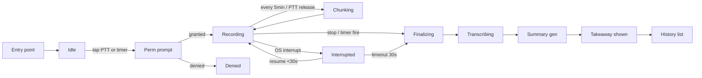

# SPEC-21 Capture Focus — Wireframe（線框稿）

> **Stage 1/3** of the user-flow chain · 線框稿（Wireframe）→ [視覺稿（Mockup）](./SPEC-21-capture-focus-mockup.md) → [原型（Prototype）](./SPEC-21-capture-focus-prototype.md)
> **Status**: draft v0.3（R0 ship → R1 8-state FSM 命名 + iOS B'/C' frame + invariants Stop≤2 操作 + History tab lock → R2 補 PTT/Timer 互斥 + Web breakpoint pointer + Android JIT note → R3 補 Mermaid Chunking 節點 + Android Denied/JIT 一句 + desktop interrupt notify invariant + Linux PulseAudio note + Web breakpoint pointer + 9-state 算數 → R4 macOS dropdown Stop→Pause 順序同步 mockup → R5 header 升 v0.3 → R6 收尾：Web breakpoint 內文加 pointer 條件、PTT/Timer 措辭跟 mockup 對齊 → R7 metadata：History tab Web 表加 pointer、Web caveat 開放問題標已決）· **Last updated**: 2026-05-27
> **Spec**: [`SPEC-21-SYSTEM-capture-focus`](../specs/v060-deep-spec/SPEC-21-SYSTEM-capture-focus.md) · §10 UI/UX
> **這份的工作範圍**：只談「功能 + 操作流」。沒有色彩、字體、icon 規格、最終文案 — 那些在 Mockup。沒有手勢 timing、動畫、失敗路徑 — 那些在 Prototype。

## 為什麼 wireframe 先做

按 [iThome Day6 文](https://ithelp.ithome.com.tw/articles/10295775) 的定義：Wireframe 是「快速把 UI 功能與佈局呈現出來，讓開發團隊能專注在需求到操作流程」。文案用 Lipsum 佔位，元件只用矩形圓形，避免團隊在色彩 / 字體上分心。本檔遵循這個原則 — placeholder 都標 `[label]`、size 標 `S/M/L` 而非 px。

## H2.3 revert 教訓 — 寫在前面

被 revert 的 FocusCapturePanel 嵌在 Dashboard 右欄。錯在：

1. Dashboard 是「狀態 surface」（看叢集），不是「動作 surface」（做事）
2. Focus 是高摩擦動作（權限提示 / 麥克風暖機 / 鎖屏控制），需獨立 screen
3. SPEC-21 §10 早就規定 dedicated `Focus.tsx` + tray/menubar 入口

本檔所有平台都改用 dedicated surface。

## 通用 session 狀態鏈（9-state 含 2 sub-state，所有平台共用）

```
Idle → Requesting(perm) → Recording ──┬→ Chunking      (sub-state, 自迴圈)
                                       └→ Interrupted   (sub-state, OS 觸發)
       → Finalizing → Transcribing → SummaryGen → Done
```

- **主鏈 7 state**: Idle / Requesting / Recording / Finalizing / Transcribing / SummaryGen / Done
- **2 sub-state**: Chunking（每 5min flush，自迴圈回 Recording） / Interrupted（OS 中斷，30s 內 resume 回 Recording、超時轉 Finalizing）
- 節點命名跟下方 User Flow Mermaid 圖一致（Idle / Perm / Rec / Chunking / Int / Fin / ASR / LLM / Done）

差別在「觸發點」、「螢幕大小」、「背景錄音是否可行」。其餘共用。

## User Flow 總圖（所有平台）



---

## iOS — PTT hero（行動族）

**進入點**：app bottom-nav `[Focus tab]` · home-screen widget（v0.7+） · Siri shortcut（v0.7+）

```
[A. Focus Idle]                       [B. Perm Prompt — iOS system]
┌──────────────────────┐              ┌──────────────────────────┐
│ [back]    [title]    │              │ "[app] wants to access   │
│                      │              │  the microphone"         │
│      [clock-face]    │              │                          │
│                      │              │  [Don't Allow]  [Allow]  │
│   [duration-picker]  │              └──────────────────────────┘
│   25 | 50 | custom   │
│                      │
│ ┌──────────────────┐ │
│ │  [PTT button L]  │ │
│ └──────────────────┘ │
│                      │
│   [start-timer btn]  │
│                      │
│   [trust-badge]      │
└──────────────────────┘

  ↓ tap PTT / start-timer (first time → B)
  ↓ allow → C

[C. Recording — Timer]                [D. Lock-screen control]
┌──────────────────────┐              ┌──────────────────────┐
│  [elapsed/total]     │              │   [app name]         │
│   [waveform]         │              │   Focus · [elapsed]  │
│                      │              │   [pause]  [stop]    │
│  [pause]  [stop]     │              └──────────────────────┘
│                      │              (system media control)
│  [chunk-count]       │
│  [trust-badge]       │
└──────────────────────┘

  ↓ user locks phone → D rendered by OS
  ↓ user taps stop / timer fires → E

[E. Finalizing]                       [F. Done — Takeaway card]
┌──────────────────────┐              ┌──────────────────────┐
│  [spinner]           │              │  [success icon]      │
│  [transcribe-msg]    │              │  [duration + count]  │
│                      │              │  ─────────────       │
│  [llm-msg]           │              │  [takeaway-body]     │
└──────────────────────┘              │                      │
                                      │  [view-full] [new]   │
                                      └──────────────────────┘

[B'. Denied — 覆蓋 Idle 半透明遮罩]    [C'. Interrupted — Recording 變體]
┌────────────────────────┐            ┌──────────────────────┐
│  [mic-denied-icon]     │            │  [elapsed/total]     │
│                        │            │   [waveform-frozen]  │  ← 灰
│  [denied-headline]     │            │                      │
│  [reassurance-copy]    │            │  [pause]  [stop]     │
│                        │            │                      │
│  [open-settings-btn]   │            │  [interrupted-msg]   │  ← 「電話中已暫停」
└────────────────────────┘            │  [trust-badge]       │
                                      └──────────────────────┘
```

**Wireframe 重點**:
- 螢幕 A、C、F 是 dedicated focus screen（非 dashboard 嵌入）
- B 由 iOS 系統渲染、開發者無權更動版面
- D 透過 `MPNowPlayingInfoCenter`，版面由 iOS 鎖屏控制
- B' 是 user 拒絕權限後覆蓋 Idle 的遮罩卡（不切螢幕），降低中斷感
- C' 是 Recording 的 sub-state 變體（OS 中斷時 waveform 凍結 + interrupted 訊息），30s 內 resume 自動回 C
- PTT 大按鈕跟 timer 按鈕**並存在 A**（同層 toggle）— PTT 按住期間 Timer disabled（見 invariants）
- F 出現後可滾到 History tab，本 wireframe 不畫 history（OoS3）

---

## Android — 3 perm gates

**進入點**：app drawer · **Quick Settings tile (v0.6.0 ship per SPEC-34 §146 G5)** · Capture tab → Focus（per SPEC-34 §30(A) IA `Home / Coach / Capture / Settings`）· home widget（v0.7+）

```
[A. Focus Idle] ─── 同 iOS A ───
       │
       ▼ tap PTT or start-timer
[B1. RECORD_AUDIO prompt]    ← Android runtime perm
       │ allow
       ▼
[B2. POST_NOTIFICATIONS prompt]  ← Android 13+, optional but needed for FG-service UI
       │ allow / skip
       ▼
(FOREGROUND_SERVICE_MICROPHONE — manifest-granted, no prompt)
       │
       ▼
[C. Recording] ─── 同 iOS C ───
       │ 同時：
       ▼
[D. FG-service notification in shade]
┌──────────────────────────┐
│ [icon] Focus · [elapsed] │
│ Tap to open │ [stop]     │
└──────────────────────────┘
       │ stop
       ▼
[E. Finalizing] → [F. Done] ─── 同 iOS ───
```

**Wireframe 重點**:
- 比 iOS 多一個 perm gate（POST_NOTIFICATIONS），且可拒絕（仍能錄，但無 shade UI）
- D 是 FG-service 通知，**不是**鎖屏卡 — 它常駐在通知欄
- WorkManager 排 ASR job（app 被殺仍會收工）
- **RECORD_AUDIO 採 JIT runtime perm**（按 PTT / Timer 才問，不在進 Focus tab 時問）— 已是現行 flow
- **Denied 行為同 iOS B'**：拒絕 RECORD_AUDIO 後覆蓋 Idle 為遮罩卡 + 設定 deep link，不另畫 frame

---

## macOS — 全域快捷鍵 + Sheet 開始

**進入點**：`⌘⇧F` global shortcut · menu bar dropdown → "Start focus" · main window `[Focus tab]`

```
[trigger: ⌘⇧F or menu bar item]
                │
                ▼
[A. Start Sheet — overlay current window]
┌──────────────────────────────┐
│ [title]              [close] │
│ ──────────────────────────── │
│ Duration:                    │
│  ( ) [opt-1]                 │
│  ( ) [opt-2]                 │
│  (•) Custom: [num] min       │
│                              │
│ Goal tag (optional):         │
│  [text-input]                │
│                              │
│ [trust-badge]                │
│                              │
│        [cancel]  [start]     │
└──────────────────────────────┘
                │ start
                ▼ (first time → TCC mic prompt)
                ▼
[B. Menu bar icon: idle → recording state]
                │
                ▼ click icon → dropdown
[C. Menu bar dropdown — recording]
┌──────────────────────┐
│ Focus [elapsed/total]│
│ [waveform-mini]      │
│ ──                   │
│ [stop & finalize]    │  ← 提到 pause 上方（recording 中最高優先，與 Windows tray invariant 同）
│ [pause]              │
└──────────────────────┘
                │ stop / timer fire
                ▼
[D. Toast: finalizing]   →   [E. Notification banner: done — click to read]
                                     │ click
                                     ▼
                              [F. Main window — Focus tab — takeaway card]
```

**Wireframe 重點**:
- 開始 sheet（不是 popover），因為要 duration + tag 兩個輸入
- 沒有 PTT（鍵盤輸入情境不適合 press-and-hold）
- Menu bar icon 是 24/7 唯一視覺指標（避免「我忘了在錄？」焦慮）
- Takeaway 落在 main window，**不嵌 Dashboard**

---

## Windows — Tray + 真窗 sheet

**進入點**：`Win+Shift+F`（user opt-in，per SPEC-43 fallback rationale 避撞 enterprise app） · system tray icon · main window `[Focus tab]`

```
[trigger: tray right-click → "Start focus…" OR ⌘⇧F]
                │
                ▼
[A. Start Window — small modal window]
        ⟨同 macOS A 內容⟩
                │ start
                ▼
[B. Tray icon: idle → recording]
                │
                │ hover tooltip:  "Focus [elapsed/total] — click for controls"
                │ right-click:
                ▼
[C. Tray context menu]
┌──────────────────────────┐
│ Focus [elapsed/total]     │  (status, disabled row)
│ ──                        │
│ [stop & finalize]         │  ← 提到 pause 上方（recording 中最高優先）
│ [pause]                   │
│ ──                        │
│ Open [app name]           │
└──────────────────────────┘
                │ stop / timer
                ▼
[D. ActionCenter toast: finalizing]
                ▼
[E. ActionCenter toast: done — persists until dismissed]
                │ click
                ▼
[F. Main window — Focus tab — takeaway card]
```

**Wireframe 重點**:
- 開始用真窗（不是 popover），因 Windows 沒 transient-popover shell affordance
- Tray right-click 是主控（Windows 慣例：右鍵看選項）
- ActionCenter 通知 persists 比 mac Notification Center banner 友善（Win 用戶常 miss banner）
- 預設**不**註冊 global shortcut（避開撞 user hotkey）

---

## Linux — best-effort

**進入點**：main window `[Focus tab]`（最可靠） · system tray icon（KDE / Cinnamon / XFCE — GNOME 無預設 tray） · `⌘⇧F`（要 user 自己用 wmctrl/kwin 設）

```
[trigger: main window Focus tab → button (most reliable)
          OR tray icon → "Start focus"]
                │
                ▼
[A. Start Window — X11/Wayland window]
        ⟨同 macOS A 內容⟩
                │ start
                ▼
[B. Tray icon: idle → recording] (best-effort, may not exist on GNOME)
                │
                ▼
[C. Tray right-click menu — same shape as Windows] (if tray exists)
                │ stop / timer
                ▼
[D. notify-send desktop notification: finalizing]
                ▼
[E. notify-send: done — click to open]
                │ click
                ▼
[F. Main window — Focus tab — takeaway card]
```

**Wireframe 重點**:
- 不承諾鎖屏控制（SPEC-21 §10.2 NG6）
- 不承諾全域 shortcut（教 user 自己接 wmctrl / KWin shortcut）
- Main window Focus tab 是 canonical surface；tray 是 bonus
- whisper.cpp 是唯一 on-device ASR 選擇
- **無 OS-level mic permission gate**（per SPEC-44 信任邊界 + Linux wireframe lock）— PulseAudio / PipeWire 不像 iOS/Android 有 runtime prompt；裝置失敗直接走 `focus.err.no_mic` (B' device-error 螢幕)

---

## Web / mobile-web — degraded

**進入點**：browser 開 `https://<mac-tailscale-host>:7878/` → `[Focus tab]` → start

```
[A. Focus Idle — in-tab]    ⟨同 mobile-native A 但加 warning bar⟩
                │ start
                ▼
[B. Browser perm prompt: "Allow [origin] to use microphone?"]
                │ allow
                ▼
[C. Recording — with caveat banner]    [C'. 上傳失敗 sub-state]
┌──────────────────────────────┐       ┌──────────────────────────────┐
│ ⚠ [tab-must-stay-visible-msg]│       │ ⚠ [upload-failed-msg]        │  ← 紅色變體
│  [waveform]                  │       │  [waveform-frozen]           │  ← 灰
│  [pause]  [stop]             │       │                              │
└──────────────────────────────┘       │  [retry-btn] [save-offline]  │  ← 兩條救濟
                │ stop / timer         │  [trust-badge]               │
                ▼                       └──────────────────────────────┘
[D. Finalizing] → [E. Done — in same tab]      ↑
                                        host unreachable 時切到此 sub-state
                                        retry 成功回 C；save-offline 寫 browser 端 queue
```

**Wireframe 重點**:
- Caveat banner 全程可見（tab 切走會掛）
- 沒有 D（鎖屏）— browser 不給
- Chunks 上傳到 spectyn-serve（不存 browser）
- ASR 在 host（serve UI 那台 Mac/PC），不在 browser 內
- C' 處理 host 不可達（網路斷 / serve 重啟）— 暫存策略 / 重試次數 / queue 儲存格式留 SPEC-17 tauri-bridge 決定，本檔只畫 frame
- **Breakpoint 切換**：`< 768px` 或 `pointer: coarse` 用 mobile-PTT 為主版型（hero PTT 大鈕 + Timer 副選）；`≥ 768px` 且 `pointer: fine` 用 desktop Timer-only 版型（沒有 PTT — 桌機鍵盤情境不合）；切點走 CSS media query `@media (min-width: 768px) and (pointer: fine)`。pointer 條件解 iPad 盲區（>768px 但純觸控應走 mobile 版）

---

## Cross-platform invariants（線框層面）

不論平台，以下元素**必須**存在（具體樣式在 Mockup 決定，互動在 Prototype 決定）:

- 計時器（elapsed / total）— Recording 中
- 波形視覺指示（waveform）— Recording 中（即使 stub 也要在）
- Stop 操作 — Recording 期間 ≤ 2 操作（mobile 一鍵；desktop tray menu 內列第一項）
- 信任徽章（trust badge）— Idle / Recording 中
- Chunk 計數 — Recording 中
- Takeaway preview — Done 中
- **PTT × Timer 互斥**（mobile only，**僅適用同畫面雙按鈕共存場景** — iOS A Idle / mobile-web A1 Idle）— PTT 按住期間 Timer 按鈕 disabled（灰階）；反向 Timer 計時觸發後**畫面已切到 C Recording**，PTT 按鈕從版面消失，「Timer 跑中 PTT disable」僅為邏輯保證、視覺上無從顯示
- **Interrupted 處理（共用 FSM）** — 30s 內 OS resume 自動回 Recording / 超時走 Finalizing 標 `interrupted=true`。**mobile 顯示 C' 變體 frame；desktop 無專屬 UI 變體**（waveform 不凍結、計時不停 — desktop interrupt 多源自 mic 被搶，狀態不明顯）
- **Desktop 中斷強制系統通知** — Recording 中若 OS interrupt 觸發（mic 被搶 / 系統 sleep / 藍牙切換），且主視窗非 active focus，必須 fire 系統原生通知（macOS Notification Center / Windows ActionCenter / Linux notify-send），內容含 elapsed 與 stop deep-link，避免 user 「沒看到還在錄」焦慮

### History tab 位置（cross-platform lock）

| 平台 | 位置 |
|---|---|
| iOS | bottom-nav 右一 tab |
| Android | **Capture tab 內 Focus 子畫面**（per SPEC-34 §30(A) 4-tab IA `Home / Coach / Capture / Settings` lock — History 是 Focus 子區段，**非獨立 bottom-nav tab**） |
| macOS / Windows / Linux | main window 左側 sidebar |
| Web | 跟 breakpoint 走 — `< 768px` 或 `pointer: coarse` 用 mobile pattern（底 nav）/ `≥ 768px` 且 `pointer: fine` 用 desktop pattern（sidebar）。pointer 條件解 iPad 盲區 |

## 開放問題（wireframe 層面）

1. **macOS / Windows A**：Sheet vs popover 之爭，已選 sheet（為了 tag input）— 但要不要加「⌘⇧F 連按二下跳過 sheet 直接 25min」fast-path？
2. ~~**Web caveat banner**~~ → **已決（R6）**：全程頂部 idle 細條 / recording 加深（見 mockup design token `overlay-web-warn-20/30` + Web 段正文）
3. **takeaway 卡片 actions**：「看完整逐字稿」「新 session」兩顆夠不夠？是否需要「分享」「刪除」？

> 已收進 invariants / iOS frame 的舊問題：
> - ~~iOS PTT/Timer 並存~~ → invariants「PTT × Timer 互斥」+ iOS C' frame
> - ~~History tab 位置 cross-platform 結構~~ → invariants「History tab 位置」表 lock

→ 剩下問題不在 Mockup 決定（那邊只管視覺），帶到 Prototype 時再 lock。

## 下一步

→ 進 [Mockup](./SPEC-21-capture-focus-mockup.md) 決定每個 placeholder 的視覺值（color / type / size / 終版文案 / icon）。
